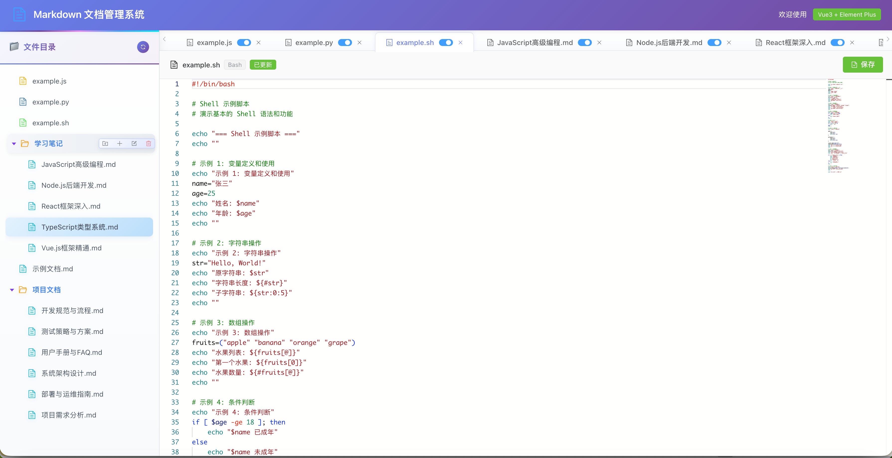

# Multi-Function File Editor

A local file management and editing system based on Vue3 + Element Plus + Monaco Editor

Supports online editing of 20+ file formats including Markdown and code files, with complete file management features (create, delete, rename) and intelligent auto-save.




## Features

### File Browsing & Editing

- 📁 Tree structure display of directories and files
- 📚 **Multi-tab support** - Open multiple files simultaneously and switch quickly
- ✏️ Real-time Markdown editing and preview
- 💻 Professional code editor (Monaco Editor) supporting 20+ programming languages
- 🎨 Syntax highlighting for code (Java, Vue, Bash, Python, JavaScript, TypeScript, C++, Go, Rust, Ruby, PHP, Shell, etc.)
- 👀 Three view modes (edit/preview/split) - Markdown files only

### Smart Saving

- 💾 Intelligent auto-save (detects changes every 5 seconds and saves automatically)
- 📝 File save status indicator (shows "Unsaved" and "Auto-saved" status)
- 🎛️ **Auto-save toggle** - Each tab independently controls auto-save functionality
- ⚡ **Performance optimization** - Debounce mechanism avoids frequent save operations

### File Management

- 📂 Create directory (right-click menu → Create directory)
- 📄 Create new file (right-click menu → New file, supports 20+ file formats)
- ✏️ Rename file/directory (right-click menu → Rename)
- 🗑️ Delete file/directory (right-click menu → Delete)
- 🔄 Real-time file tree refresh

### Enhanced Features

- ⬇️ **File download** - Support downloading source files with file size information
- ⌨️ **Keyboard shortcuts** - Ctrl+S to save, Ctrl+W to close current tab
- 🖱️ **Right-click menu** - Tab right-click menu supports close operations
- 💾 **Tab state persistence** - Automatically restores opened tabs after page refresh
- 🎛️ **Independent auto-save control** - Each tab can individually enable/disable auto-save

### Other Features

- 📱 Responsive layout
- 🔒 Path security protection (prevents path traversal attacks)
- ✅ Filename validation (supports letters, numbers, underscores, hyphens, and Chinese characters)

## Quick Start

### Method 1: One-Click Launch (Recommended)

```bash
# Add execute permission to the startup script
chmod +x start.sh

# Run the startup script (automatically installs dependencies and starts frontend/backend services)
./start.sh
```

### Method 2: Step-by-Step Launch

#### 1. Install Dependencies

**Frontend dependencies:**

```bash
npm install
```

**Backend dependencies:**

```bash
cd server
npm install
cd ..
```

#### 2. Start Services

**Start backend API service (port 30001):**

Run in a terminal window:

```bash
cd server
npm start
```

After service starts, it will display:

```
Server running at http://localhost:30001
Markdown files directory: /path/to/notes
```

**Start frontend development server (port 3001):**

Run in another terminal window:

```bash
npm run dev
```

After service starts, it will display:

```
➜  Local:   http://localhost:3001/
```

#### 3. Access Application

Open browser and visit: **http://localhost:3001**

## Port Configuration

- **Frontend service**: `http://localhost:3001`
- **Backend API**: `http://localhost:30001`
- **API proxy**: Frontend proxies to backend service via `/api` path

## Project Structure

```
docs/
├── src/                      # Frontend source code
│   ├── components/          # Vue components
│   │   ├── FileTree.vue     # File tree component
│   │   ├── MarkdownEditor.vue  # Markdown editor
│   │   └── CodeEditor.vue   # Code editor (supports multiple script files)
│   ├── api/                 # API interfaces
│   │   └── files.js         # File operations API
│   ├── styles/              # Style files
│   │   └── main.scss        # Global styles
│   ├── App.vue              # Main application component
│   └── main.js              # Entry file
├── server/                  # Backend service
│   ├── server.js            # Express server
│   └── package.json         # Backend dependencies configuration
├── notes/               # File storage directory (supports Markdown and script files)
│   ├── 示例文档.md
│   ├── example.py           # Python example
│   ├── example.js           # JavaScript example
│   ├── example.sh           # Shell example
│   ├── 学习笔记/
│   └── 项目文档/
├── package.json             # Frontend dependencies configuration
├── vite.config.js           # Vite configuration
├── index.html               # HTML template
├── start.sh                 # One-click startup script
└── README.md                # Project documentation
```

## Backend API Interfaces

### File Browsing & Read/Write

- **GET** `/api/files`

  - Function: Get file tree
  - Returns: Tree-structured list of files and directories
- **GET** `/api/file?path=<file_path>`

  - Function: Read file content
  - Parameter: `path` - File relative path
  - Returns: File content
- **POST** `/api/file`

  - Function: Save file content
  - Request body: `{ "path": "file_path", "content": "file_content" }`
  - Returns: Save result

### Directory Management

- **POST** `/api/directory`

  - Function: Create directory
  - Request body: `{ "path": "parent_directory_path", "name": "directory_name" }`
  - Returns: `{ "success": true, "path": "new_directory_path" }`
- **PUT** `/api/directory`

  - Function: Rename directory
  - Request body: `{ "path": "directory_path", "newName": "new_name" }`
  - Returns: `{ "success": true, "newPath": "new_path" }`
- **DELETE** `/api/directory`

  - Function: Delete directory (recursive deletion)
  - Request body: `{ "path": "directory_path" }`
  - Returns: `{ "success": true }`

### File Management

- **POST** `/api/create-file`

  - Function: Create new file
  - Request body: `{ "path": "parent_directory_path", "name": "file_name", "extension": "extension" }`
  - Returns: `{ "success": true, "path": "new_file_path" }`
- **PUT** `/api/file-rename`

  - Function: Rename file
  - Request body: `{ "path": "file_path", "newName": "new_file_name_with_extension" }`
  - Returns: `{ "success": true, "newPath": "new_path" }`
- **DELETE** `/api/file`

  - Function: Delete file
  - Request body: `{ "path": "file_path" }`
  - Returns: `{ "success": true }`

### Other

- **GET** `/api/supported-extensions`
  - Function: Get list of supported file extensions
  - Returns: `{ "extensions": [".md", ".txt", ...] }`

## Technology Stack

### Frontend

- **Vue 3** - Progressive JavaScript framework
- **Element Plus** - Vue 3 component library
- **Vite** - Next-generation frontend build tool
- **Monaco Editor** - Professional code editor (VS Code core)
- **@monaco-editor/loader** - Monaco Editor dynamic loader
- **@vueuse/core** - Vue composition API utilities
- **Markdown-it** - Markdown parser
- **Highlight.js** - Code syntax highlighting
- **Axios** - HTTP client
- **Sass** - CSS preprocessor (using modern compiler API)

### Backend

- **Node.js** - JavaScript runtime
- **Express** - Web application framework
- **CORS** - Cross-origin resource sharing

## Usage Instructions

### Basic Operations

1. **View files**: Click on file names in the left file tree
2. **Edit content**: Modify file content in the right editor
3. **Save files**: Click the "Save" button in the toolbar or wait for auto-save
4. **Refresh tree**: Click the refresh button in the top left to reload the file tree

### Multi-Tab Functionality

- 📚 **Open multiple files**: Click on file names in the left file tree to open new tabs
- ♻️ **Switch tabs**: Click on tabs to switch between files
- ❌ **Close tabs**: Click the × button on tabs to close files
- 🔄 **Smart switching**: Closing the current tab will automatically switch to the adjacent tab
- 🚫 **Prevent duplicates**: Opening a file that is already open will directly switch to it without reopening
- 🎨 **Icon distinction**: Markdown files and code files are displayed with different icons
- 💾 **Independent saving**: Each tab has independent auto-save control
- 🎛️ **Auto-save control**: Each tab has independent auto-save control
- 🖱️ **Right-click menu**: Right-click on tabs to display a menu with close options
- 💾 **State persistence**: Tab states are persisted after page refresh
- ⌨️ **Shortcut key support**: Ctrl+W closes the current tab

**Tab right-click menu options:**

- Close current tab
- Close other tabs
- Close all tabs
- Close left tabs
- Close right tabs

### File Management Operations

#### Create Directory

1. Right-click on the target directory in the file tree (or blank area to create in root directory)
2. Select "Create directory"
3. Enter directory name (supports letters, numbers, underscores, hyphens, and Chinese characters)
4. Click OK

#### Create New File

1. Right-click on the target directory in the file tree
2. Select "New file"
3. Enter file name (without extension)
4. Select file type (Markdown, Web Development, Programming Languages, Scripts, Data Formats, etc.)
5. Click OK

**Supported file format categories:**

- **Markdown & Text**: .md, .txt
- **Web Development**: .html, .css, .scss, .less, .js, .jsx, .ts, .tsx, .vue, .xml
- **Programming Languages**: .py, .java, .c, .cpp, .cc, .h, .go, .rs, .rb, .php
- **Script Languages**: .sh, .bash, .zsh, .fish
- **Data Formats**: .json, .yaml, .yml, .sql

#### Rename File/Directory

1. Right-click on the file or directory to rename in the file tree
2. Select "Rename"
3. Enter new name
   - Directory: Enter new directory name
   - File: Enter new file name (must include extension)
4. Click OK

#### Delete File/Directory

1. Right-click on the file or directory to delete in the file tree
2. Select "Delete"
3. Confirm delete operation
   - ⚠️ **Note**: Deleting a directory will recursively delete all its contents
   - ⚠️ **Note**: Delete operation cannot be undone, please proceed with caution

### Auto-Save Functionality

- ⏱️ **Auto-save interval**: Detects document changes every 5 seconds
- 📝 **Status indicator**: Toolbar shows save status
  - Yellow label "Unsaved" - Indicates there are unsaved changes
  - Green label "Auto-saved" - Indicates file has been auto-saved
- 🎛️ **Independent control**: Each tab has independent auto-save toggle
- ⚡ **Performance optimization**: Uses debounce mechanism to avoid frequent localStorage operations
- 💾 **State persistence**: Auto-save settings persist after page refresh
- 💡 **Smart workflow**: Edit → Change detection → Debounce delay → Auto-save → Status update

### Markdown Files

- Supports three view modes: edit, preview, split
- Use toolbar buttons to switch view modes
- Supports real-time preview and code highlighting
- Auto-save functionality also applies
- ⬇️ **File download**: Click "Download" button to download source file
- ⌨️ **Tab indentation**: Press Tab key in editor to insert 2-space indentation

### File Download Functionality

- 📥 **Download source file**: Click the "Download" button in the toolbar
- 📊 **File size display**: Shows file size information after successful download
- 🛡️ **Size limit**: Maximum 10MB download support for single files
- 🔒 **Security check**: Performs file validation and error handling before download
- 📝 **Smart naming**: Automatically uses original filename as download filename

### Keyboard Shortcuts

- **Ctrl+S / Cmd+S**: Save current file
- **Ctrl+W / Cmd+W**: Close current tab
- **Tab**: Insert 2-space indentation in Markdown editor
- **Esc**: Close right-click menu (can also close by clicking other areas)

### Code File Editing (Monaco Editor)

Use professional Monaco Editor (VS Code core editor) to edit code files, supporting the following languages:

**Programming Languages**

- **Java** (.java)
- **Python** (.py)
- **JavaScript/JSX** (.js, .jsx)
- **TypeScript/TSX** (.ts, .tsx)
- **C/C++** (.c, .cpp, .h, .cc)
- **Go** (.go)
- **Rust** (.rs)
- **Ruby** (.rb)
- **PHP** (.php)

**Script Languages**

- **Shell/Bash** (.sh, .bash, .zsh, .fish)

**Web Technologies**

- **Vue** (.vue)
- **HTML** (.html)
- **CSS/SCSS/LESS** (.css, .scss, .less)
- **XML** (.xml)

**Data Formats**

- **JSON** (.json)
- **YAML** (.yaml, .yml)
- **SQL** (.sql)
- **Markdown** (.md)
- **Text** (.txt)

**Editor Features**

- 🎨 Syntax highlighting
- 🔢 Line numbers
- 🗺️ Code minimap
- 📏 Word wrap
- 🔧 Code formatting
- ⌨️ Smart indentation
- 💾 Auto-save

## Development Guide

### Build Production Version

```bash
npm run build
```

Build output is located in the `dist/` directory.

### Preview Production Build

```bash
npm run preview
```

## Frequently Asked Questions

**Q: What should I do if I see Sass deprecation warnings on startup?**

A: This is normal. We have configured to use modern Sass compiler API in `vite.config.js`. If you still see warnings, please ensure Sass version is up to date.

**Q: Monaco Editor failed to load?**

A:

- Ensure you have run `npm install` to install dependencies
- Check browser console for network errors
- Try clearing browser cache and refresh the page
- Ensure network connection is normal (Monaco Editor needs to load resources from CDN)

**Q: Auto-save is not working?**

A:

- Check if backend service is running
- Check browser console for error messages
- Ensure `notes/` directory has write permissions
- Try manually clicking "Save" button to test

**Q: What to do if ports are occupied?**

A: Modify port configuration in the following files:

- Frontend port: `server.port` in `vite.config.js`
- Backend port: `PORT` constant in `server/server.js`
- Also update proxy target `server.proxy['/api'].target` in `vite.config.js`

**Q: Files cannot be saved?**

A: Ensure backend service is running and check read/write permissions for `notes/` directory.

**Q: Cannot see file tree?**

A: Check if backend service started properly and if there are error messages in browser console.

**Q: Cannot create directories or files?**

A:

- Ensure directory/filenames only contain letters, numbers, underscores, hyphens, and Chinese characters
- Check if parent directory exists
- Ensure `notes/` directory has write permissions
- Check browser console for error messages

**Q: What to do if deleted files/directories cannot be recovered?**

A: Delete operation is permanent and cannot be directly undone. Suggestions:

- Regularly backup important files
- Confirm carefully before deleting
- Consider using version control system (like Git) to manage documents

**Q: Right-click menu not appearing?**

A:

- Ensure right-click is in file tree area or tab area
- Refresh page and try again
- Check browser console for JavaScript errors

**Q: File download failed?**

A:

- Ensure file size does not exceed 10MB
- Check if browser allows downloads
- Check console for download-related error messages
- Try using a different browser

**Q: Keyboard shortcuts not working?**

A:

- Ensure editor is in focus state
- Check if other applications are using the same shortcuts
- Mac users should use Cmd key instead of Ctrl key
- Refresh page and try again

**Q: Auto-save toggle not working?**

A:

- Ensure you clicked the toggle icon on the tab
- Check if browser allows localStorage
- Check console for related error messages
- Settings will automatically restore after page refresh

**Q: Tab states not restored?**

A:

- Ensure browser allows localStorage storage
- Check if browser data has been cleared
- Reopening files will automatically save state

## License

MIT

---
