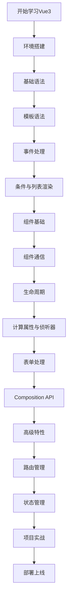
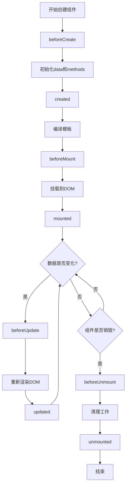

# Vue3 学习教程完整指南

## 学习大纲

### 第一阶段：基础入门（1-2周）
1. Vue3 简介与环境搭建
2. Vue3 基础语法
3. 模板语法与数据绑定
4. 事件处理
5. 条件渲染与列表渲染

### 第二阶段：核心概念（2-3周）
6. 组件基础
7. 组件通信
8. 生命周期
9. 计算属性与侦听器
10. 表单处理

### 第三阶段：进阶特性（2-3周）
11. Composition API
12. 自定义指令
13. 插槽（Slots）
14. 动态组件与异步组件
15. 过渡与动画

### 第四阶段：生态系统（2-3周）
16. Vue Router 路由
17. Pinia 状态管理
18. HTTP 请求处理
19. 项目构建与部署
20. 实战项目

---

## 第1章：Vue3 简介与环境搭建

### 1.1 什么是Vue3？

Vue3是一个用于构建用户界面的渐进式JavaScript框架。它易学易用，能够帮助你快速构建交互式的网页应用。

**Vue3的特点：**
- 响应式数据绑定
- 组件化开发
- 虚拟DOM
- 更好的性能
- TypeScript支持

### 1.2 环境搭建

#### 方式一：CDN引入（适合初学者）

```html
<!DOCTYPE html>
<html lang="zh-CN">
<head>
    <meta charset="UTF-8">
    <meta name="viewport" content="width=device-width, initial-scale=1.0">
    <title>Vue3 入门</title>
</head>
<body>
    <div id="app">
        <h1>{{ message }}</h1>
    </div>
    
    <!-- 引入Vue3 -->
    <script src="https://unpkg.com/vue@3/dist/vue.global.js"></script>
    <script>
        const { createApp } = Vue;
        
        createApp({
            data() {
                return {
                    message: '你好，Vue3！'
                }
            }
        }).mount('#app');
    </script>
</body>
</html>
```

#### 方式二：使用Vite创建项目

```bash
# 安装Node.js后执行
npm create vue@latest my-vue-project
cd my-vue-project
npm install
npm run dev
```

### 1.3 第一个Vue3应用

```html
<!DOCTYPE html>
<html>
<head>
    <title>我的第一个Vue3应用</title>
</head>
<body>
    <div id="app">
        <h1>{{ title }}</h1>
        <p>{{ description }}</p>
        <button @click="changeTitle">点击改变标题</button>
    </div>
    
    <script src="https://unpkg.com/vue@3/dist/vue.global.js"></script>
    <script>
        const { createApp } = Vue;
        
        createApp({
            data() {
                return {
                    title: '欢迎学习Vue3',
                    description: '这是一个简单的Vue3应用示例'
                }
            },
            methods: {
                changeTitle() {
                    this.title = '标题已改变！';
                }
            }
        }).mount('#app');
    </script>
</body>
</html>
```

---

## 第2章：Vue3 基础语法

### 2.1 创建Vue应用

```javascript
// 创建Vue应用的基本结构
const { createApp } = Vue;

const app = createApp({
    // 数据
    data() {
        return {
            // 在这里定义数据
        }
    },
    // 方法
    methods: {
        // 在这里定义方法
    },
    // 计算属性
    computed: {
        // 在这里定义计算属性
    }
});

// 挂载到DOM元素
app.mount('#app');
```

### 2.2 数据选项

```html
<div id="app">
    <h2>个人信息</h2>
    <p>姓名：{{ name }}</p>
    <p>年龄：{{ age }}</p>
    <p>爱好：{{ hobbies.join(', ') }}</p>
    <p>地址：{{ address.city }}</p>
</div>

<script>
const { createApp } = Vue;

createApp({
    data() {
        return {
            name: '张三',
            age: 25,
            hobbies: ['读书', '游泳', '编程'],
            address: {
                city: '北京',
                district: '朝阳区'
            }
        }
    }
}).mount('#app');
</script>
```

### 2.3 方法选项

```html
<div id="app">
    <h2>计数器应用</h2>
    <p>当前计数：{{ count }}</p>
    <button @click="increment">增加</button>
    <button @click="decrement">减少</button>
    <button @click="reset">重置</button>
    <p>{{ getMessage() }}</p>
</div>

<script>
const { createApp } = Vue;

createApp({
    data() {
        return {
            count: 0
        }
    },
    methods: {
        increment() {
            this.count++;
        },
        decrement() {
            this.count--;
        },
        reset() {
            this.count = 0;
        },
        getMessage() {
            if (this.count > 10) {
                return '计数很高了！';
            } else if (this.count < 0) {
                return '计数是负数';
            } else {
                return '计数正常';
            }
        }
    }
}).mount('#app');
</script>
```

---

## 第3章：模板语法与数据绑定

### 3.1 插值语法

```html
<div id="app">
    <!-- 文本插值 -->
    <p>{{ message }}</p>
    
    <!-- 表达式 -->
    <p>{{ number + 1 }}</p>
    <p>{{ ok ? 'YES' : 'NO' }}</p>
    <p>{{ message.split('').reverse().join('') }}</p>
    
    <!-- 一次性插值 -->
    <p v-once>这个值不会改变：{{ message }}</p>
    
    <!-- 原始HTML -->
    <p v-html="rawHtml"></p>
</div>

<script>
const { createApp } = Vue;

createApp({
    data() {
        return {
            message: 'Hello Vue3',
            number: 10,
            ok: true,
            rawHtml: '<span style="color: red">红色文字</span>'
        }
    }
}).mount('#app');
</script>
```

### 3.2 属性绑定

```html
<div id="app">
    <!-- 绑定属性 -->
    
    
    <!-- 简写形式 -->
    
    
    <!-- 绑定class -->
    <div :class="{ active: isActive, error: hasError }">动态class</div>
    <div :class="[activeClass, errorClass]">数组形式class</div>
    
    <!-- 绑定style -->
    <div :style="{ color: textColor, fontSize: fontSize + 'px' }">动态样式</div>
    <div :style="styleObject">对象形式样式</div>
    
    <!-- 绑定多个属性 -->
    <input v-bind="inputAttrs">
</div>

<script>
const { createApp } = Vue;

createApp({
    data() {
        return {
            imageSrc: 'https://via.placeholder.com/150',
            imageAlt: '示例图片',
            isActive: true,
            hasError: false,
            activeClass: 'active',
            errorClass: 'text-danger',
            textColor: 'blue',
            fontSize: 16,
            styleObject: {
                color: 'green',
                fontWeight: 'bold'
            },
            inputAttrs: {
                type: 'text',
                placeholder: '请输入内容',
                disabled: false
            }
        }
    }
}).mount('#app');
</script>
```

### 3.3 双向数据绑定

```html
<div id="app">
    <h3>表单双向绑定</h3>
    
    <!-- 文本输入 -->
    <p>
        <label>姓名：</label>
        <input v-model="name" type="text">
        <span>输入的内容：{{ name }}</span>
    </p>
    
    <!-- 多行文本 -->
    <p>
        <label>描述：</label>
        <textarea v-model="description"></textarea>
        <pre>{{ description }}</pre>
    </p>
    
    <!-- 复选框 -->
    <p>
        <input v-model="checked" type="checkbox" id="checkbox">
        <label for="checkbox">{{ checked ? '已选中' : '未选中' }}</label>
    </p>
    
    <!-- 多个复选框 -->
    <p>
        <input v-model="checkedNames" value="张三" type="checkbox" id="jack">
        <label for="jack">张三</label>
        <input v-model="checkedNames" value="李四" type="checkbox" id="john">
        <label for="john">李四</label>
        <input v-model="checkedNames" value="王五" type="checkbox" id="mike">
        <label for="mike">王五</label>
        <br>
        <span>选中的名字：{{ checkedNames }}</span>
    </p>
    
    <!-- 单选按钮 -->
    <p>
        <input v-model="picked" value="A" type="radio" id="one">
        <label for="one">A</label>
        <input v-model="picked" value="B" type="radio" id="two">
        <label for="two">B</label>
        <br>
        <span>选中：{{ picked }}</span>
    </p>
    
    <!-- 选择框 -->
    <p>
        <select v-model="selected">
            <option disabled value="">请选择</option>
            <option>A</option>
            <option>B</option>
            <option>C</option>
        </select>
        <span>选中：{{ selected }}</span>
    </p>
</div>

<script>
const { createApp } = Vue;

createApp({
    data() {
        return {
            name: '',
            description: '',
            checked: false,
            checkedNames: [],
            picked: '',
            selected: ''
        }
    }
}).mount('#app');
</script>
```

---

## 第4章：事件处理

### 4.1 监听事件

```html
<div id="app">
    <h3>事件处理示例</h3>
    
    <!-- 基本事件监听 -->
    <button @click="counter += 1">点击次数：{{ counter }}</button>
    
    <!-- 方法事件处理器 -->
    <button @click="greet">问候</button>
    
    <!-- 内联处理器中的方法 -->
    <button @click="say('hi')">说 hi</button>
    <button @click="say('what')">说 what</button>
    
    <!-- 访问原始DOM事件 -->
    <button @click="warn('表单还不能提交。', $event)">提交</button>
    
    <!-- 多个事件处理器 -->
    <button @click="one($event), two($event)">点击执行多个方法</button>
</div>

<script>
const { createApp } = Vue;

createApp({
    data() {
        return {
            counter: 0,
            name: 'Vue.js'
        }
    },
    methods: {
        greet(event) {
            alert('Hello ' + this.name + '!');
            if (event) {
                alert(event.target.tagName);
            }
        },
        say(message) {
            alert(message);
        },
        warn(message, event) {
            if (event) {
                event.preventDefault();
            }
            alert(message);
        },
        one(event) {
            console.log('第一个处理器');
        },
        two(event) {
            console.log('第二个处理器');
        }
    }
}).mount('#app');
</script>
```

### 4.2 事件修饰符

```html
<div id="app">
    <h3>事件修饰符</h3>
    
    <!-- 阻止单击事件继续传播 -->
    <a @click.stop="doThis" href="#">阻止冒泡</a>
    
    <!-- 提交事件不再重载页面 -->
    <form @submit.prevent="onSubmit">
        <input type="text" v-model="formData">
        <button type="submit">提交</button>
    </form>
    
    <!-- 修饰符可以串联 -->
    <a @click.stop.prevent="doThat" href="#">阻止冒泡和默认行为</a>
    
    <!-- 只有修饰符 -->
    <form @submit.prevent></form>
    
    <!-- 添加事件监听器时使用事件捕获模式 -->
    <div @click.capture="doThis">捕获模式</div>
    
    <!-- 只当在 event.target 是当前元素自身时触发处理函数 -->
    <div @click.self="doThat">只在自身触发</div>
    
    <!-- 点击事件将只会触发一次 -->
    <a @click.once="doThis" href="#">只触发一次</a>
    
    <!-- 滚动事件的默认行为 (即滚动行为) 将会立即触发 -->
    <div @scroll.passive="onScroll">滚动区域</div>
</div>

<script>
const { createApp } = Vue;

createApp({
    data() {
        return {
            formData: ''
        }
    },
    methods: {
        doThis() {
            console.log('doThis 被调用');
        },
        doThat() {
            console.log('doThat 被调用');
        },
        onSubmit() {
            console.log('表单提交：', this.formData);
        },
        onScroll() {
            console.log('滚动事件');
        }
    }
}).mount('#app');
</script>
```

### 4.3 按键修饰符

```html
<div id="app">
    <h3>按键修饰符</h3>
    
    <!-- 只有在 `key` 是 `Enter` 时调用 `vm.submit()` -->
    <input @keyup.enter="submit" v-model="inputValue" placeholder="按Enter提交">
    
    <!-- 按键别名 -->
    <input @keyup.tab="onTab" placeholder="按Tab键">
    <input @keyup.delete="onDelete" placeholder="按Delete键">
    <input @keyup.esc="onEsc" placeholder="按Esc键">
    <input @keyup.space="onSpace" placeholder="按空格键">
    <input @keyup.up="onUp" placeholder="按上箭头">
    <input @keyup.down="onDown" placeholder="按下箭头">
    <input @keyup.left="onLeft" placeholder="按左箭头">
    <input @keyup.right="onRight" placeholder="按右箭头">
    
    <!-- 系统修饰键 -->
    <input @keyup.ctrl.enter="onCtrlEnter" placeholder="按Ctrl+Enter">
    <input @keyup.alt.enter="onAltEnter" placeholder="按Alt+Enter">
    <input @keyup.shift.enter="onShiftEnter" placeholder="按Shift+Enter">
    
    <!-- 鼠标按钮修饰符 -->
    <button @click.left="onLeft">左键点击</button>
    <button @click.right="onRight">右键点击</button>
    <button @click.middle="onMiddle">中键点击</button>
    
    <p>输入内容：{{ inputValue }}</p>
    <p>操作记录：{{ actionLog }}</p>
</div>

<script>
const { createApp } = Vue;

createApp({
    data() {
        return {
            inputValue: '',
            actionLog: []
        }
    },
    methods: {
        submit() {
            this.actionLog.push('提交：' + this.inputValue);
            this.inputValue = '';
        },
        onTab() {
            this.actionLog.push('按下Tab键');
        },
        onDelete() {
            this.actionLog.push('按下Delete键');
        },
        onEsc() {
            this.actionLog.push('按下Esc键');
            this.inputValue = '';
        },
        onSpace() {
            this.actionLog.push('按下空格键');
        },
        onUp() {
            this.actionLog.push('按下上箭头');
        },
        onDown() {
            this.actionLog.push('按下下箭头');
        },
        onLeft() {
            this.actionLog.push('按下左箭头或左键点击');
        },
        onRight() {
            this.actionLog.push('按下右箭头或右键点击');
        },
        onMiddle() {
            this.actionLog.push('中键点击');
        },
        onCtrlEnter() {
            this.actionLog.push('按下Ctrl+Enter');
        },
        onAltEnter() {
            this.actionLog.push('按下Alt+Enter');
        },
        onShiftEnter() {
            this.actionLog.push('按下Shift+Enter');
        }
    }
}).mount('#app');
</script>
```

---

## 第5章：条件渲染与列表渲染

### 5.1 条件渲染

```html
<div id="app">
    <h3>条件渲染示例</h3>
    
    <!-- v-if -->
    <h4 v-if="awesome">Vue is awesome!</h4>
    <h4 v-else>Oh no 😢</h4>
    
    <!-- v-else-if -->
    <div v-if="type === 'A'">
        A
    </div>
    <div v-else-if="type === 'B'">
        B
    </div>
    <div v-else-if="type === 'C'">
        C
    </div>
    <div v-else>
        Not A/B/C
    </div>
    
    <!-- template上的v-if -->
    <template v-if="loginType === 'username'">
        <label>用户名</label>
        <input placeholder="输入用户名" key="username-input">
    </template>
    <template v-else>
        <label>邮箱</label>
        <input placeholder="输入邮箱" key="email-input">
    </template>
    
    <!-- v-show -->
    <h4 v-show="showMessage">这是一个v-show的消息</h4>
    
    <!-- 控制按钮 -->
    <div>
        <button @click="awesome = !awesome">切换awesome</button>
        <button @click="changeType">切换类型</button>
        <button @click="loginType = loginType === 'username' ? 'email' : 'username'">切换登录类型</button>
        <button @click="showMessage = !showMessage">切换显示</button>
    </div>
    
    <p>当前状态：awesome={{ awesome }}, type={{ type }}, loginType={{ loginType }}, showMessage={{ showMessage }}</p>
</div>

<script>
const { createApp } = Vue;

createApp({
    data() {
        return {
            awesome: true,
            type: 'A',
            loginType: 'username',
            showMessage: true,
            types: ['A', 'B', 'C', 'D']
        }
    },
    methods: {
        changeType() {
            const currentIndex = this.types.indexOf(this.type);
            this.type = this.types[(currentIndex + 1) % this.types.length];
        }
    }
}).mount('#app');
</script>
```

### 5.2 列表渲染

```html
<div id="app">
    <h3>列表渲染示例</h3>
    
    <!-- 基本列表渲染 -->
    <h4>水果列表：</h4>
    <ul>
        <li v-for="fruit in fruits" :key="fruit.id">
            {{ fruit.name }} - ¥{{ fruit.price }}
        </li>
    </ul>
    
    <!-- 带索引的列表渲染 -->
    <h4>带索引的列表：</h4>
    <ul>
        <li v-for="(fruit, index) in fruits" :key="fruit.id">
            {{ index + 1 }}. {{ fruit.name }} - ¥{{ fruit.price }}
        </li>
    </ul>
    
    <!-- 对象的v-for -->
    <h4>用户信息：</h4>
    <ul>
        <li v-for="(value, key) in user" :key="key">
            {{ key }}: {{ value }}
        </li>
    </ul>
    
    <!-- 带索引的对象遍历 -->
    <h4>带索引的对象遍历：</h4>
    <ul>
        <li v-for="(value, key, index) in user" :key="key">
            {{ index }}. {{ key }}: {{ value }}
        </li>
    </ul>
    
    <!-- 数字的v-for -->
    <h4>数字遍历：</h4>
    <span v-for="n in 10" :key="n">{{ n }} </span>
    
    <!-- template上的v-for -->
    <h4>模板上的v-for：</h4>
    <ul>
        <template v-for="fruit in fruits" :key="fruit.id">
            <li>{{ fruit.name }}</li>
            <li class="divider" role="presentation"></li>
        </template>
    </ul>
    
    <!-- 动态操作列表 -->
    <h4>动态操作：</h4>
    <div>
        <input v-model="newFruitName" placeholder="水果名称">
        <input v-model="newFruitPrice" placeholder="价格" type="number">
        <button @click="addFruit">添加水果</button>
    </div>
    
    <div>
        <button @click="removeFruit(fruit.id)" v-for="fruit in fruits" :key="'btn-' + fruit.id">
            删除{{ fruit.name }}
        </button>
    </div>
    
    <!-- 过滤和排序 -->
    <h4>过滤和排序：</h4>
    <input v-model="searchText" placeholder="搜索水果">
    <select v-model="sortBy">
        <option value="name">按名称排序</option>
        <option value="price">按价格排序</option>
    </select>
    
    <ul>
        <li v-for="fruit in filteredAndSortedFruits" :key="'filtered-' + fruit.id">
            {{ fruit.name }} - ¥{{ fruit.price }}
        </li>
    </ul>
</div>

<script>
const { createApp } = Vue;

createApp({
    data() {
        return {
            fruits: [
                { id: 1, name: '苹果', price: 5 },
                { id: 2, name: '香蕉', price: 3 },
                { id: 3, name: '橙子', price: 4 },
                { id: 4, name: '葡萄', price: 8 }
            ],
            user: {
                name: '张三',
                age: 25,
                email: 'zhangsan@example.com',
                city: '北京'
            },
            newFruitName: '',
            newFruitPrice: '',
            searchText: '',
            sortBy: 'name'
        }
    },
    computed: {
        filteredAndSortedFruits() {
            let filtered = this.fruits;
            
            // 过滤
            if (this.searchText) {
                filtered = filtered.filter(fruit => 
                    fruit.name.includes(this.searchText)
                );
            }
            
            // 排序
            return filtered.sort((a, b) => {
                if (this.sortBy === 'name') {
                    return a.name.localeCompare(b.name);
                } else {
                    return a.price - b.price;
                }
            });
        }
    },
    methods: {
        addFruit() {
            if (this.newFruitName && this.newFruitPrice) {
                const newId = Math.max(...this.fruits.map(f => f.id)) + 1;
                this.fruits.push({
                    id: newId,
                    name: this.newFruitName,
                    price: parseFloat(this.newFruitPrice)
                });
                this.newFruitName = '';
                this.newFruitPrice = '';
            }
        },
        removeFruit(id) {
            this.fruits = this.fruits.filter(fruit => fruit.id !== id);
        }
    }
}).mount('#app');
</script>
```

---

## 第6章：组件基础

### 6.1 组件定义与使用

```html
<div id="app">
    <h3>组件基础示例</h3>
    
    <!-- 使用组件 -->
    <button-counter></button-counter>
    <button-counter></button-counter>
    <button-counter></button-counter>
    
    <!-- 带属性的组件 -->
    <blog-post 
        v-for="post in posts" 
        :key="post.id"
        :title="post.title"
        :content="post.content"
        :author="post.author"
        @enlarge-text="onEnlargeText"
    ></blog-post>
    
    <p>当前字体大小：{{ fontSize }}px</p>
</div>

<script>
const { createApp } = Vue;

// 定义一个计数器组件
const ButtonCounter = {
    data() {
        return {
            count: 0
        }
    },
    template: `
        <button @click="count++">
            点击了 {{ count }} 次
        </button>
    `
};

// 定义一个博客文章组件
const BlogPost = {
    props: ['title', 'content', 'author'],
    emits: ['enlarge-text'],
    template: `
        <div class="blog-post">
            <h4>{{ title }}</h4>
            <p>作者：{{ author }}</p>
            <p>{{ content }}</p>
            <button @click="$emit('enlarge-text', 0.1)">
                放大文字
            </button>
        </div>
    `
};

const app = createApp({
    data() {
        return {
            fontSize: 14,
            posts: [
                {
                    id: 1,
                    title: 'Vue3 入门',
                    content: 'Vue3 是一个优秀的前端框架...',
                    author: '张三'
                },
                {
                    id: 2,
                    title: '组件化开发',
                    content: '组件化是现代前端开发的重要思想...',
                    author: '李四'
                }
            ]
        }
    },
    methods: {
        onEnlargeText(enlargeAmount) {
            this.fontSize += enlargeAmount;
        }
    }
});

// 注册组件
app.component('button-counter', ButtonCounter);
app.component('blog-post', BlogPost);

app.mount('#app');
</script>

<style>
.blog-post {
    border: 1px solid #ccc;
    padding: 10px;
    margin: 10px 0;
    border-radius: 5px;
}
</style>
```

---

## 第18章：HTTP 请求处理

### 18.1 Axios 基础使用

Axios 是一个基于 Promise 的 HTTP 库，用于浏览器和 Node.js。它是 Vue 项目中最常用的 HTTP 客户端。

#### 安装 Axios

```bash
# 使用 npm 安装
npm install axios

# 使用 yarn 安装
yarn add axios
```

#### 基本使用示例

```html
<div id="app">
    <h3>HTTP 请求处理示例</h3>
    
    <!-- 用户列表 -->
    <div class="users-section">
        <div class="section-header">
            <h4>用户列表</h4>
            <button @click="fetchUsers" :disabled="loading" class="refresh-btn">
                {{ loading ? '加载中...' : '刷新数据' }}
            </button>
        </div>
        
        <div v-if="loading" class="loading-spinner">
            <div class="spinner"></div>
            <p>正在加载数据...</p>
        </div>
        
        <div v-else-if="error" class="error-message">
            <p>❌ {{ error }}</p>
            <button @click="fetchUsers" class="retry-btn">重试</button>
        </div>
        
        <div v-else class="users-grid">
            <div v-for="user in users" :key="user.id" class="user-card">
                <div class="user-avatar">
                    
                </div>
                <div class="user-info">
                    <h5>{{ user.name }}</h5>
                    <p>{{ user.email }}</p>
                    <p class="user-phone">{{ user.phone }}</p>
                </div>
                <div class="user-actions">
                    <button @click="editUser(user)" class="edit-btn">编辑</button>
                    <button @click="deleteUser(user.id)" class="delete-btn">删除</button>
                </div>
            </div>
        </div>
    </div>
    
    <!-- 添加/编辑用户表单 -->
    <div class="form-section">
        <h4>{{ editingUser ? '编辑用户' : '添加新用户' }}</h4>
        <form @submit.prevent="submitUser" class="user-form">
            <div class="form-row">
                <div class="form-group">
                    <label>姓名：</label>
                    <input v-model="userForm.name" required class="form-input">
                </div>
                <div class="form-group">
                    <label>邮箱：</label>
                    <input v-model="userForm.email" type="email" required class="form-input">
                </div>
            </div>
            <div class="form-row">
                <div class="form-group">
                    <label>电话：</label>
                    <input v-model="userForm.phone" class="form-input">
                </div>
                <div class="form-group">
                    <label>网站：</label>
                    <input v-model="userForm.website" class="form-input">
                </div>
            </div>
            <div class="form-actions">
                <button type="submit" :disabled="submitting" class="submit-btn">
                    {{ submitting ? '提交中...' : (editingUser ? '更新用户' : '添加用户') }}
                </button>
                <button type="button" @click="resetForm" class="cancel-btn">取消</button>
            </div>
        </form>
    </div>
    
    <!-- 请求日志 -->
    <div class="logs-section">
        <h4>请求日志</h4>
        <div class="logs-container">
            <div v-for="(log, index) in requestLogs" :key="index" class="log-entry">
                <span :class="['log-method', log.method.toLowerCase()]">{{ log.method }}</span>
                <span class="log-url">{{ log.url }}</span>
                <span :class="['log-status', getStatusClass(log.status)]">{{ log.status }}</span>
                <span class="log-time">{{ formatTime(log.timestamp) }}</span>
            </div>
        </div>
    </div>
</div>

<script src="https://unpkg.com/axios/dist/axios.min.js"></script>
<script>
const { createApp } = Vue;

// 创建 Axios 实例
const api = axios.create({
    baseURL: 'https://jsonplaceholder.typicode.com',
    timeout: 10000,
    headers: {
        'Content-Type': 'application/json'
    }
});

createApp({
    data() {
        return {
            users: [],
            loading: false,
            error: null,
            submitting: false,
            editingUser: null,
            userForm: {
                name: '',
                email: '',
                phone: '',
                website: ''
            },
            requestLogs: []
        }
    },
    
    mounted() {
        this.setupInterceptors();
        this.fetchUsers();
    },
    
    methods: {
        // 设置请求拦截器
        setupInterceptors() {
            // 请求拦截器
            api.interceptors.request.use(
                (config) => {
                    console.log('发送请求:', config);
                    this.addLog(config.method.toUpperCase(), config.url, 'PENDING');
                    return config;
                },
                (error) => {
                    console.error('请求错误:', error);
                    return Promise.reject(error);
                }
            );
            
            // 响应拦截器
            api.interceptors.response.use(
                (response) => {
                    console.log('收到响应:', response);
                    this.updateLog(response.config.method.toUpperCase(), response.config.url, response.status);
                    return response;
                },
                (error) => {
                    console.error('响应错误:', error);
                    const status = error.response ? error.response.status : 'ERROR';
                    this.updateLog(error.config.method.toUpperCase(), error.config.url, status);
                    return Promise.reject(error);
                }
            );
        },
        
        // 获取用户列表
        async fetchUsers() {
            this.loading = true;
            this.error = null;
            
            try {
                const response = await api.get('/users');
                this.users = response.data.map(user => ({
                    ...user,
                    avatar: `https://api.dicebear.com/7.x/avataaars/svg?seed=${user.name}`
                }));
            } catch (error) {
                this.error = '获取用户列表失败: ' + (error.message || '未知错误');
                console.error('获取用户失败:', error);
            } finally {
                this.loading = false;
            }
        },
        
        // 添加用户
        async addUser(userData) {
            try {
                const response = await api.post('/users', userData);
                // 模拟添加到本地列表（因为 JSONPlaceholder 不会真正保存）
                const newUser = {
                    ...response.data,
                    id: Date.now(), // 使用时间戳作为临时ID
                    avatar: `https://api.dicebear.com/7.x/avataaars/svg?seed=${userData.name}`
                };
                this.users.unshift(newUser);
                return newUser;
            } catch (error) {
                throw new Error('添加用户失败: ' + (error.message || '未知错误'));
            }
        },
        
        // 更新用户
        async updateUser(id, userData) {
            try {
                const response = await api.put(`/users/${id}`, userData);
                // 更新本地列表
                const index = this.users.findIndex(user => user.id === id);
                if (index !== -1) {
                    this.users[index] = { ...this.users[index], ...userData };
                }
                return response.data;
            } catch (error) {
                throw new Error('更新用户失败: ' + (error.message || '未知错误'));
            }
        },
        
        // 删除用户
        async deleteUser(id) {
            if (!confirm('确定要删除这个用户吗？')) {
                return;
            }
            
            try {
                await api.delete(`/users/${id}`);
                // 从本地列表中移除
                this.users = this.users.filter(user => user.id !== id);
            } catch (error) {
                this.error = '删除用户失败: ' + (error.message || '未知错误');
                console.error('删除用户失败:', error);
            }
        },
        
        // 提交用户表单
        async submitUser() {
            this.submitting = true;
            this.error = null;
            
            try {
                if (this.editingUser) {
                    await this.updateUser(this.editingUser.id, this.userForm);
                } else {
                    await this.addUser(this.userForm);
                }
                this.resetForm();
            } catch (error) {
                this.error = error.message;
            } finally {
                this.submitting = false;
            }
        },
        
        // 编辑用户
        editUser(user) {
            this.editingUser = user;
            this.userForm = {
                name: user.name,
                email: user.email,
                phone: user.phone,
                website: user.website
            };
        },
        
        // 重置表单
        resetForm() {
            this.editingUser = null;
            this.userForm = {
                name: '',
                email: '',
                phone: '',
                website: ''
            };
        },
        
        // 处理图片加载错误
        handleImageError(event) {
            event.target.src = 'https://via.placeholder.com/60x60?text=User';
        },
        
        // 添加请求日志
        addLog(method, url, status) {
            this.requestLogs.unshift({
                method,
                url,
                status,
                timestamp: Date.now()
            });
            
            // 只保留最近20条日志
            if (this.requestLogs.length > 20) {
                this.requestLogs = this.requestLogs.slice(0, 20);
            }
        },
        
        // 更新请求日志
        updateLog(method, url, status) {
            const log = this.requestLogs.find(log => 
                log.method === method && log.url === url && log.status === 'PENDING'
            );
            if (log) {
                log.status = status;
            }
        },
        
        // 格式化时间
        formatTime(timestamp) {
            return new Date(timestamp).toLocaleTimeString();
        },
        
        // 获取状态样式类
        getStatusClass(status) {
            if (status >= 200 && status < 300) return 'success';
            if (status >= 400 && status < 500) return 'client-error';
            if (status >= 500) return 'server-error';
            if (status === 'PENDING') return 'pending';
            return 'error';
        }
    }
}).mount('#app');
</script>

<style>
/* HTTP 请求处理样式 */
.users-section, .form-section, .logs-section {
    margin-bottom: 30px;
    padding: 20px;
    background-color: white;
    border-radius: 8px;
    box-shadow: 0 2px 4px rgba(0,0,0,0.1);
}

.section-header {
    display: flex;
    justify-content: space-between;
    align-items: center;
    margin-bottom: 20px;
}

.refresh-btn {
    background-color: #42b883;
    color: white;
    padding: 8px 16px;
    border: none;
    border-radius: 4px;
    cursor: pointer;
}

.refresh-btn:disabled {
    background-color: #ccc;
    cursor: not-allowed;
}

/* 加载动画 */
.loading-spinner {
    text-align: center;
    padding: 40px;
}

.spinner {
    width: 40px;
    height: 40px;
    border: 4px solid #f3f3f3;
    border-top: 4px solid #42b883;
    border-radius: 50%;
    animation: spin 1s linear infinite;
    margin: 0 auto 10px;
}

@keyframes spin {
    0% { transform: rotate(0deg); }
    100% { transform: rotate(360deg); }
}

/* 错误消息 */
.error-message {
    text-align: center;
    padding: 20px;
    background-color: #f8d7da;
    color: #721c24;
    border-radius: 4px;
    margin-bottom: 20px;
}

.retry-btn {
    background-color: #dc3545;
    color: white;
    padding: 8px 16px;
    border: none;
    border-radius: 4px;
    cursor: pointer;
    margin-top: 10px;
}

/* 用户网格 */
.users-grid {
    display: grid;
    grid-template-columns: repeat(auto-fill, minmax(300px, 1fr));
    gap: 20px;
}

.user-card {
    display: flex;
    align-items: center;
    padding: 15px;
    border: 1px solid #e0e0e0;
    border-radius: 8px;
    transition: transform 0.2s;
}

.user-card:hover {
    transform: translateY(-2px);
    box-shadow: 0 4px 8px rgba(0,0,0,0.15);
}

.user-avatar {
    margin-right: 15px;
}

.user-avatar img {
    width: 60px;
    height: 60px;
    border-radius: 50%;
    object-fit: cover;
}

.user-info {
    flex-grow: 1;
}

.user-info h5 {
    margin: 0 0 5px 0;
    color: #2c3e50;
}

.user-info p {
    margin: 2px 0;
    color: #666;
    font-size: 14px;
}

.user-phone {
    font-family: monospace;
}

.user-actions {
    display: flex;
    flex-direction: column;
    gap: 5px;
}

.edit-btn, .delete-btn {
    padding: 4px 8px;
    border: none;
    border-radius: 4px;
    cursor: pointer;
    font-size: 12px;
}

.edit-btn {
    background-color: #ffc107;
    color: #212529;
}

.delete-btn {
    background-color: #dc3545;
    color: white;
}

/* 表单样式 */
.user-form {
    max-width: 600px;
}

.form-row {
    display: grid;
    grid-template-columns: 1fr 1fr;
    gap: 20px;
    margin-bottom: 15px;
}

.form-group {
    display: flex;
    flex-direction: column;
}

.form-group label {
    margin-bottom: 5px;
    font-weight: bold;
    color: #2c3e50;
}

.form-input {
    padding: 10px;
    border: 1px solid #ccc;
    border-radius: 4px;
    font-size: 14px;
}

.form-input:focus {
    outline: none;
    border-color: #42b883;
    box-shadow: 0 0 0 2px rgba(66, 184, 131, 0.2);
}

.form-actions {
    display: flex;
    gap: 10px;
    margin-top: 20px;
}

.submit-btn {
    background-color: #42b883;
    color: white;
    padding: 10px 20px;
    border: none;
    border-radius: 4px;
    cursor: pointer;
}

.submit-btn:disabled {
    background-color: #ccc;
    cursor: not-allowed;
}

.cancel-btn {
    background-color: #6c757d;
    color: white;
    padding: 10px 20px;
    border: none;
    border-radius: 4px;
    cursor: pointer;
}

/* 日志样式 */
.logs-container {
    max-height: 300px;
    overflow-y: auto;
    border: 1px solid #e0e0e0;
    border-radius: 4px;
}

.log-entry {
    display: grid;
    grid-template-columns: 80px 1fr 80px 100px;
    gap: 10px;
    padding: 8px 12px;
    border-bottom: 1px solid #f0f0f0;
    font-family: monospace;
    font-size: 12px;
    align-items: center;
}

.log-entry:last-child {
    border-bottom: none;
}

.log-method {
    font-weight: bold;
    padding: 2px 6px;
    border-radius: 3px;
    text-align: center;
}

.log-method.get {
    background-color: #d4edda;
    color: #155724;
}

.log-method.post {
    background-color: #cce5ff;
    color: #004085;
}

.log-method.put {
    background-color: #fff3cd;
    color: #856404;
}

.log-method.delete {
    background-color: #f8d7da;
    color: #721c24;
}

.log-url {
    color: #495057;
    overflow: hidden;
    text-overflow: ellipsis;
    white-space: nowrap;
}

.log-status {
    font-weight: bold;
    padding: 2px 6px;
    border-radius: 3px;
    text-align: center;
}

.log-status.success {
    background-color: #d4edda;
    color: #155724;
}

.log-status.client-error {
    background-color: #fff3cd;
    color: #856404;
}

.log-status.server-error {
    background-color: #f8d7da;
    color: #721c24;
}

.log-status.pending {
    background-color: #e2e3e5;
    color: #495057;
}

.log-status.error {
    background-color: #f8d7da;
    color: #721c24;
}

.log-time {
    color: #6c757d;
    text-align: right;
}

/* 响应式设计 */
@media (max-width: 768px) {
    .form-row {
        grid-template-columns: 1fr;
    }
    
    .users-grid {
        grid-template-columns: 1fr;
    }
    
    .user-card {
        flex-direction: column;
        text-align: center;
    }
    
    .user-avatar {
        margin-right: 0;
        margin-bottom: 10px;
    }
    
    .user-actions {
        flex-direction: row;
        justify-content: center;
        margin-top: 10px;
    }
    
    .log-entry {
        grid-template-columns: 1fr;
        gap: 5px;
    }
}
</style>
```

### 18.2 请求拦截器和响应拦截器

拦截器允许你在请求或响应被处理之前拦截它们。

```html
<div id="app">
    <h3>请求拦截器示例</h3>
    
    <!-- 认证状态 -->
    <div class="auth-section">
        <div v-if="isAuthenticated" class="auth-info">
            <span>🔐 已认证用户: {{ currentUser.name }}</span>
            <button @click="logout" class="logout-btn">退出登录</button>
        </div>
        <div v-else class="login-form">
            <input v-model="credentials.username" placeholder="用户名" class="auth-input">
            <input v-model="credentials.password" type="password" placeholder="密码" class="auth-input">
            <button @click="login" class="login-btn">登录</button>
        </div>
    </div>
    
    <!-- API 测试按钮 -->
    <div class="api-section">
        <h4>API 测试</h4>
        <div class="api-buttons">
            <button @click="testPublicAPI" class="api-btn public">公开 API</button>
            <button @click="testProtectedAPI" class="api-btn protected" :disabled="!isAuthenticated">
                受保护 API
            </button>
            <button @click="testErrorAPI" class="api-btn error">错误 API</button>
            <button @click="testTimeoutAPI" class="api-btn timeout">超时 API</button>
        </div>
    </div>
    
    <!-- 请求/响应日志 -->
    <div class="interceptor-logs">
        <h4>拦截器日志</h4>
        <div class="logs-tabs">
            <button 
                @click="activeTab = 'requests'" 
                :class="['tab-btn', { active: activeTab === 'requests' }]"
            >
                请求日志 ({{ requestLogs.length }})
            </button>
            <button 
                @click="activeTab = 'responses'" 
                :class="['tab-btn', { active: activeTab === 'responses' }]"
            >
                响应日志 ({{ responseLogs.length }})
            </button>
            <button 
                @click="activeTab = 'errors'" 
                :class="['tab-btn', { active: activeTab === 'errors' }]"
            >
                错误日志 ({{ errorLogs.length }})
            </button>
        </div>
        
        <div class="logs-content">
            <!-- 请求日志 -->
            <div v-if="activeTab === 'requests'" class="log-panel">
                <div v-for="(log, index) in requestLogs" :key="index" class="log-item">
                    <div class="log-header">
                        <span class="log-method">{{ log.method }}</span>
                        <span class="log-url">{{ log.url }}</span>
                        <span class="log-time">{{ formatTime(log.timestamp) }}</span>
                    </div>
                    <div class="log-details">
                        <div v-if="log.headers" class="log-section">
                            <strong>Headers:</strong>
                            <pre>{{ JSON.stringify(log.headers, null, 2) }}</pre>
                        </div>
                        <div v-if="log.data" class="log-section">
                            <strong>Data:</strong>
                            <pre>{{ JSON.stringify(log.data, null, 2) }}</pre>
                        </div>
                    </div>
                </div>
            </div>
            
            <!-- 响应日志 -->
            <div v-if="activeTab === 'responses'" class="log-panel">
                <div v-for="(log, index) in responseLogs" :key="index" class="log-item">
                    <div class="log-header">
                        <span :class="['log-status', getStatusClass(log.status)]">{{ log.status }}</span>
                        <span class="log-url">{{ log.url }}</span>
                        <span class="log-time">{{ formatTime(log.timestamp) }}</span>
                    </div>
                    <div class="log-details">
                        <div class="log-section">
                            <strong>Response Data:</strong>
                            <pre>{{ JSON.stringify(log.data, null, 2) }}</pre>
                        </div>
                    </div>
                </div>
            </div>
            
            <!-- 错误日志 -->
            <div v-if="activeTab === 'errors'" class="log-panel">
                <div v-for="(log, index) in errorLogs" :key="index" class="log-item error">
                    <div class="log-header">
                        <span class="log-error">ERROR</span>
                        <span class="log-url">{{ log.url }}</span>
                        <span class="log-time">{{ formatTime(log.timestamp) }}</span>
                    </div>
                    <div class="log-details">
                        <div class="log-section">
                            <strong>Error Message:</strong>
                            <p class="error-message">{{ log.message }}</p>
                        </div>
                        <div v-if="log.response" class="log-section">
                            <strong>Response:</strong>
                            <pre>{{ JSON.stringify(log.response, null, 2) }}</pre>
                        </div>
                    </div>
                </div>
            </div>
        </div>
        
        <div class="logs-actions">
            <button @click="clearLogs" class="clear-btn">清空日志</button>
        </div>
    </div>
</div>

<script src="https://unpkg.com/axios/dist/axios.min.js"></script>
<script>
const { createApp } = Vue;

// 模拟认证 token
let authToken = null;

// 创建 Axios 实例
const api = axios.create({
    baseURL: 'https://jsonplaceholder.typicode.com',
    timeout: 5000
});

createApp({
    data() {
        return {
            isAuthenticated: false,
            currentUser: null,
            credentials: {
                username: '',
                password: ''
            },
            activeTab: 'requests',
            requestLogs: [],
            responseLogs: [],
            errorLogs: []
        }
    },
    
    mounted() {
        this.setupInterceptors();
    },
    
    methods: {
        // 设置拦截器
        setupInterceptors() {
            // 请求拦截器
            api.interceptors.request.use(
                (config) => {
                    // 添加认证 token
                    if (authToken) {
                        config.headers.Authorization = `Bearer ${authToken}`;
                    }
                    
                    // 添加时间戳
                    config.metadata = { startTime: Date.now() };
                    
                    // 记录请求日志
                    this.requestLogs.unshift({
                        method: config.method.toUpperCase(),
                        url: config.url,
                        headers: config.headers,
                        data: config.data,
                        timestamp: Date.now()
                    });
                    
                    console.log('🚀 发送请求:', config);
                    return config;
                },
                (error) => {
                    console.error('❌ 请求拦截器错误:', error);
                    return Promise.reject(error);
                }
            );
            
            // 响应拦截器
            api.interceptors.response.use(
                (response) => {
                    // 计算请求耗时
                    const duration = Date.now() - response.config.metadata.startTime;
                    
                    // 记录响应日志
                    this.responseLogs.unshift({
                        status: response.status,
                        url: response.config.url,
                        data: response.data,
                        duration: duration,
                        timestamp: Date.now()
                    });
                    
                    console.log(`✅ 收到响应 (${duration}ms):`, response);
                    return response;
                },
                (error) => {
                    // 记录错误日志
                    this.errorLogs.unshift({
                        url: error.config?.url || 'Unknown',
                        message: error.message,
                        response: error.response?.data,
                        status: error.response?.status,
                        timestamp: Date.now()
                    });
                    
                    // 处理特定错误
                    if (error.response?.status === 401) {
                        this.handleUnauthorized();
                    }
                    
                    console.error('❌ 响应错误:', error);
                    return Promise.reject(error);
                }
            );
        },
        
        // 登录
        login() {
            // 模拟登录
            if (this.credentials.username && this.credentials.password) {
                authToken = 'mock-jwt-token-' + Date.now();
                this.isAuthenticated = true;
                this.currentUser = {
                    name: this.credentials.username,
                    id: Date.now()
                };
                this.credentials = { username: '', password: '' };
            }
        },
        
        // 退出登录
        logout() {
            authToken = null;
            this.isAuthenticated = false;
            this.currentUser = null;
        },
        
        // 处理未授权
        handleUnauthorized() {
            alert('认证已过期，请重新登录');
            this.logout();
        },
        
        // 测试公开 API
        async testPublicAPI() {
            try {
                const response = await api.get('/posts/1');
                alert('公开 API 调用成功！');
            } catch (error) {
                alert('公开 API 调用失败: ' + error.message);
            }
        },
        
        // 测试受保护 API
        async testProtectedAPI() {
            try {
                // 模拟受保护的 API 调用
                const response = await api.get('/users/me');
                alert('受保护 API 调用成功！');
            } catch (error) {
                alert('受保护 API 调用失败: ' + error.message);
            }
        },
        
        // 测试错误 API
        async testErrorAPI() {
            try {
                const response = await api.get('/nonexistent-endpoint');
            } catch (error) {
                alert('预期的错误: ' + error.message);
            }
        },
        
        // 测试超时 API
        async testTimeoutAPI() {
            try {
                // 创建一个会超时的请求
                const response = await api.get('/posts', { timeout: 1 });
            } catch (error) {
                alert('超时错误: ' + error.message);
            }
        },
        
        // 清空日志
        clearLogs() {
            this.requestLogs = [];
            this.responseLogs = [];
            this.errorLogs = [];
        },
        
        // 格式化时间
        formatTime(timestamp) {
            return new Date(timestamp).toLocaleTimeString();
        },
        
        // 获取状态样式类
        getStatusClass(status) {
            if (status >= 200 && status < 300) return 'success';
            if (status >= 400 && status < 500) return 'client-error';
            if (status >= 500) return 'server-error';
            return 'unknown';
        }
    }
}).mount('#app');
</script>

<style>
/* 拦截器示例样式 */
.auth-section {
    background-color: #f8f9fa;
    padding: 15px;
    border-radius: 8px;
    margin-bottom: 20px;
    display: flex;
    align-items: center;
    justify-content: center;
}

.auth-info {
    display: flex;
    align-items: center;
    gap: 15px;
}

.login-form {
    display: flex;
    gap: 10px;
    align-items: center;
}

.auth-input {
    padding: 8px 12px;
    border: 1px solid #ccc;
    border-radius: 4px;
}

.login-btn, .logout-btn {
    padding: 8px 16px;
    border: none;
    border-radius: 4px;
    cursor: pointer;
    color: white;
}

.login-btn {
    background-color: #007bff;
}

.logout-btn {
    background-color: #dc3545;
}

.api-section {
    background-color: white;
    padding: 20px;
    border-radius: 8px;
    box-shadow: 0 2px 4px rgba(0,0,0,0.1);
    margin-bottom: 20px;
}

.api-buttons {
    display: flex;
    gap: 10px;
    flex-wrap: wrap;
}

.api-btn {
    padding: 10px 20px;
    border: none;
    border-radius: 4px;
    cursor: pointer;
    color: white;
    font-weight: bold;
}

.api-btn:disabled {
    opacity: 0.5;
    cursor: not-allowed;
}

.api-btn.public {
    background-color: #28a745;
}

.api-btn.protected {
    background-color: #ffc107;
    color: #212529;
}

.api-btn.error {
    background-color: #dc3545;
}

.api-btn.timeout {
    background-color: #6c757d;
}

.interceptor-logs {
    background-color: white;
    border-radius: 8px;
    box-shadow: 0 2px 4px rgba(0,0,0,0.1);
    overflow: hidden;
}

.interceptor-logs h4 {
    margin: 0;
    padding: 20px 20px 0;
}

.logs-tabs {
    display: flex;
    border-bottom: 1px solid #e0e0e0;
}

.tab-btn {
    padding: 12px 20px;
    border: none;
    background-color: transparent;
    cursor: pointer;
    border-bottom: 3px solid transparent;
    transition: all 0.3s;
}

.tab-btn:hover {
    background-color: #f8f9fa;
}

.tab-btn.active {
    border-bottom-color: #42b883;
    color: #42b883;
    font-weight: bold;
}

.logs-content {
    max-height: 400px;
    overflow-y: auto;
}

.log-panel {
    padding: 0;
}

.log-item {
    border-bottom: 1px solid #f0f0f0;
    padding: 15px 20px;
}

.log-item:last-child {
    border-bottom: none;
}

.log-item.error {
    background-color: #fff5f5;
}

.log-header {
    display: flex;
    align-items: center;
    gap: 15px;
    margin-bottom: 10px;
}

.log-method {
    background-color: #42b883;
    color: white;
    padding: 4px 8px;
    border-radius: 4px;
    font-size: 12px;
    font-weight: bold;
    min-width: 60px;
    text-align: center;
}

.log-status {
    padding: 4px 8px;
    border-radius: 4px;
    font-size: 12px;
    font-weight: bold;
    min-width: 60px;
    text-align: center;
}

.log-status.success {
    background-color: #d4edda;
    color: #155724;
}

.log-status.client-error {
    background-color: #fff3cd;
    color: #856404;
}

.log-status.server-error {
    background-color: #f8d7da;
    color: #721c24;
}

.log-error {
    background-color: #dc3545;
    color: white;
    padding: 4px 8px;
    border-radius: 4px;
    font-size: 12px;
    font-weight: bold;
}

.log-url {
    flex-grow: 1;
    font-family: monospace;
    color: #495057;
    overflow: hidden;
    text-overflow: ellipsis;
    white-space: nowrap;
}

.log-time {
    color: #6c757d;
    font-size: 12px;
    font-family: monospace;
}

.log-details {
    margin-left: 20px;
}

.log-section {
    margin-bottom: 10px;
}

.log-section strong {
    color: #2c3e50;
    display: block;
    margin-bottom: 5px;
}

.log-section pre {
    background-color: #f8f9fa;
    padding: 10px;
    border-radius: 4px;
    font-size: 12px;
    overflow-x: auto;
    margin: 0;
    border-left: 3px solid #42b883;
}

.error-message {
    color: #dc3545;
    font-weight: bold;
    margin: 0;
    padding: 8px;
    background-color: #f8d7da;
    border-radius: 4px;
}

.logs-actions {
    padding: 15px 20px;
    border-top: 1px solid #e0e0e0;
    background-color: #f8f9fa;
}

.clear-btn {
    background-color: #6c757d;
    color: white;
    padding: 8px 16px;
    border: none;
    border-radius: 4px;
    cursor: pointer;
}

/* 响应式设计 */
@media (max-width: 768px) {
    .auth-section {
        flex-direction: column;
        gap: 15px;
    }
    
    .login-form {
        flex-direction: column;
        width: 100%;
    }
    
    .auth-input {
        width: 100%;
    }
    
    .api-buttons {
        flex-direction: column;
    }
    
    .api-btn {
        width: 100%;
    }
    
    .logs-tabs {
        flex-direction: column;
    }
    
    .log-header {
        flex-direction: column;
        align-items: flex-start;
        gap: 5px;
    }
}
</style>
```

---

## 第19章：项目构建与部署

### 19.1 Vite 项目配置和优化

Vite 是 Vue 3 推荐的构建工具，提供了快速的开发体验和优化的生产构建。

#### 基本配置文件

```javascript
// vite.config.js
import { defineConfig } from 'vite'
import vue from '@vitejs/plugin-vue'
import { resolve } from 'path'

export default defineConfig({
  plugins: [vue()],
  
  // 路径别名
  resolve: {
    alias: {
      '@': resolve(__dirname, 'src'),
      '@components': resolve(__dirname, 'src/components'),
      '@utils': resolve(__dirname, 'src/utils'),
      '@assets': resolve(__dirname, 'src/assets')
    }
  },
  
  // 开发服务器配置
  server: {
    port: 3000,
    open: true,
    cors: true,
    proxy: {
      '/api': {
        target: 'http://localhost:8080',
        changeOrigin: true,
        rewrite: (path) => path.replace(/^\/api/, '')
      }
    }
  },
  
  // 构建配置
  build: {
    outDir: 'dist',
    assetsDir: 'assets',
    sourcemap: false,
    minify: 'terser',
    
    // 代码分割
    rollupOptions: {
      output: {
        manualChunks: {
          vendor: ['vue', 'vue-router'],
          utils: ['axios', 'lodash']
        }
      }
    },
    
    // 压缩配置
    terserOptions: {
      compress: {
        drop_console: true,
        drop_debugger: true
      }
    }
  },
  
  // CSS 配置
  css: {
    preprocessorOptions: {
      scss: {
        additionalData: `@import "@/styles/variables.scss";`
      }
    }
  }
})
```

#### 环境变量配置

```bash
# .env.development
VITE_APP_TITLE=Vue3 学习项目 - 开发环境
VITE_API_BASE_URL=http://localhost:8080/api
VITE_APP_DEBUG=true
```

```bash
# .env.production
VITE_APP_TITLE=Vue3 学习项目
VITE_API_BASE_URL=https://api.example.com
VITE_APP_DEBUG=false
```

```bash
# .env.staging
VITE_APP_TITLE=Vue3 学习项目 - 测试环境
VITE_API_BASE_URL=https://staging-api.example.com
VITE_APP_DEBUG=true
```

#### 使用环境变量

```javascript
// src/config/index.js
export const config = {
  appTitle: import.meta.env.VITE_APP_TITLE,
  apiBaseUrl: import.meta.env.VITE_API_BASE_URL,
  isDebug: import.meta.env.VITE_APP_DEBUG === 'true',
  isDev: import.meta.env.DEV,
  isProd: import.meta.env.PROD
}

// 在组件中使用
export default {
  mounted() {
    console.log('应用标题:', config.appTitle)
    console.log('API 地址:', config.apiBaseUrl)
    
    if (config.isDebug) {
      console.log('调试模式已开启')
    }
  }
}
```

### 19.2 性能优化策略

#### 代码分割和懒加载

```javascript
// router/index.js
import { createRouter, createWebHistory } from 'vue-router'

const routes = [
  {
    path: '/',
    name: 'Home',
    component: () => import('@/views/Home.vue')
  },
  {
    path: '/about',
    name: 'About',
    // 路由级别的代码分割
    component: () => import(/* webpackChunkName: "about" */ '@/views/About.vue')
  },
  {
    path: '/dashboard',
    name: 'Dashboard',
    component: () => import('@/views/Dashboard.vue'),
    children: [
      {
        path: 'analytics',
        component: () => import('@/views/dashboard/Analytics.vue')
      },
      {
        path: 'reports',
        component: () => import('@/views/dashboard/Reports.vue')
      }
    ]
  }
]

export default createRouter({
  history: createWebHistory(),
  routes
})
```

#### 组件懒加载

```vue
<!-- 异步组件 -->
<template>
  <div>
    <h2>主页面</h2>
    
    <!-- 懒加载重型组件 -->
    <Suspense>
      <template #default>
        <HeavyChart v-if="showChart" />
      </template>
      <template #fallback>
        <div class="loading">图表加载中...</div>
      </template>
    </Suspense>
    
    <button @click="loadChart">加载图表</button>
  </div>
</template>

<script>
import { defineAsyncComponent, ref } from 'vue'

// 异步组件定义
const HeavyChart = defineAsyncComponent({
  loader: () => import('@/components/HeavyChart.vue'),
  loadingComponent: () => import('@/components/Loading.vue'),
  errorComponent: () => import('@/components/Error.vue'),
  delay: 200,
  timeout: 3000
})

export default {
  components: {
    HeavyChart
  },
  
  setup() {
    const showChart = ref(false)
    
    const loadChart = () => {
      showChart.value = true
    }
    
    return {
      showChart,
      loadChart
    }
  }
}
</script>
```

#### 图片优化

```vue
<template>
  <div class="image-gallery">
    <!-- 懒加载图片 -->
    
    
    <!-- 响应式图片 -->
    <picture>
      <source 
        media="(max-width: 768px)" 
        :srcset="image.mobile"
      >
      <source 
        media="(max-width: 1200px)" 
        :srcset="image.tablet"
      >
      
    </picture>
  </div>
</template>

<script>
import { onMounted } from 'vue'

export default {
  setup() {
    // 图片懒加载实现
    onMounted(() => {
      const imageObserver = new IntersectionObserver((entries) => {
        entries.forEach(entry => {
          if (entry.isIntersecting) {
            const img = entry.target
            img.src = img.dataset.src
            img.classList.remove('lazy-image')
            imageObserver.unobserve(img)
          }
        })
      })
      
      document.querySelectorAll('.lazy-image').forEach(img => {
        imageObserver.observe(img)
      })
    })
    
    return {
      images: [
        {
          id: 1,
          url: '/images/photo1.jpg',
          mobile: '/images/photo1-mobile.jpg',
          tablet: '/images/photo1-tablet.jpg',
          desktop: '/images/photo1-desktop.jpg',
          alt: '图片1'
        }
        // 更多图片...
      ]
    }
  }
}
</script>

<style>
.lazy-image {
  opacity: 0;
  transition: opacity 0.3s;
}

.lazy-image[src] {
  opacity: 1;
}

.responsive-image {
  width: 100%;
  height: auto;
}
</style>
```

### 19.3 部署到不同平台

#### 部署到 Netlify

```toml
# netlify.toml
[build]
  publish = "dist"
  command = "npm run build"

[build.environment]
  NODE_VERSION = "18"

[[redirects]]
  from = "/*"
  to = "/index.html"
  status = 200

[[headers]]
  for = "/assets/*"
  [headers.values]
    Cache-Control = "public, max-age=31536000, immutable"

[[headers]]
  for = "*.js"
  [headers.values]
    Cache-Control = "public, max-age=31536000, immutable"

[[headers]]
  for = "*.css"
  [headers.values]
    Cache-Control = "public, max-age=31536000, immutable"
```

#### 部署到 Vercel

```json
{
  "version": 2,
  "builds": [
    {
      "src": "package.json",
      "use": "@vercel/static-build",
      "config": {
        "distDir": "dist"
      }
    }
  ],
  "routes": [
    {
      "handle": "filesystem"
    },
    {
      "src": "/(.*)",
      "dest": "/index.html"
    }
  ],
  "headers": [
    {
      "source": "/assets/(.*)",
      "headers": [
        {
          "key": "Cache-Control",
          "value": "public, max-age=31536000, immutable"
        }
      ]
    }
  ]
}
```

#### 部署到 GitHub Pages

```yaml
# .github/workflows/deploy.yml
name: Deploy to GitHub Pages

on:
  push:
    branches: [ main ]

jobs:
  build-and-deploy:
    runs-on: ubuntu-latest
    
    steps:
    - name: Checkout
      uses: actions/checkout@v3
      
    - name: Setup Node.js
      uses: actions/setup-node@v3
      with:
        node-version: '18'
        cache: 'npm'
        
    - name: Install dependencies
      run: npm ci
      
    - name: Build
      run: npm run build
      
    - name: Deploy
      uses: peaceiris/actions-gh-pages@v3
      with:
        github_token: ${{ secrets.GITHUB_TOKEN }}
        publish_dir: ./dist
```

### 19.4 CI/CD 流程配置

#### GitHub Actions 完整配置

```yaml
# .github/workflows/ci-cd.yml
name: CI/CD Pipeline

on:
  push:
    branches: [ main, develop ]
  pull_request:
    branches: [ main ]

env:
  NODE_VERSION: '18'

jobs:
  test:
    runs-on: ubuntu-latest
    
    steps:
    - uses: actions/checkout@v3
    
    - name: Setup Node.js
      uses: actions/setup-node@v3
      with:
        node-version: ${{ env.NODE_VERSION }}
        cache: 'npm'
        
    - name: Install dependencies
      run: npm ci
      
    - name: Run linter
      run: npm run lint
      
    - name: Run type check
      run: npm run type-check
      
    - name: Run tests
      run: npm run test:unit
      
    - name: Run E2E tests
      run: npm run test:e2e
      
  build:
    needs: test
    runs-on: ubuntu-latest
    
    steps:
    - uses: actions/checkout@v3
    
    - name: Setup Node.js
      uses: actions/setup-node@v3
      with:
        node-version: ${{ env.NODE_VERSION }}
        cache: 'npm'
        
    - name: Install dependencies
      run: npm ci
      
    - name: Build application
      run: npm run build
      
    - name: Upload build artifacts
      uses: actions/upload-artifact@v3
      with:
        name: dist
        path: dist/
        
  deploy-staging:
    needs: build
    runs-on: ubuntu-latest
    if: github.ref == 'refs/heads/develop'
    
    steps:
    - name: Download build artifacts
      uses: actions/download-artifact@v3
      with:
        name: dist
        path: dist/
        
    - name: Deploy to staging
      run: |
        echo "部署到测试环境"
        # 这里添加具体的部署命令
        
  deploy-production:
    needs: build
    runs-on: ubuntu-latest
    if: github.ref == 'refs/heads/main'
    
    steps:
    - name: Download build artifacts
      uses: actions/download-artifact@v3
      with:
        name: dist
        path: dist/
        
    - name: Deploy to production
      run: |
        echo "部署到生产环境"
        # 这里添加具体的部署命令
```

#### Docker 部署配置

```dockerfile
# Dockerfile
# 构建阶段
FROM node:18-alpine as build-stage

WORKDIR /app

# 复制 package 文件
COPY package*.json ./

# 安装依赖
RUN npm ci --only=production

# 复制源代码
COPY . .

# 构建应用
RUN npm run build

# 生产阶段
FROM nginx:alpine as production-stage

# 复制构建结果
COPY --from=build-stage /app/dist /usr/share/nginx/html

# 复制 nginx 配置
COPY nginx.conf /etc/nginx/nginx.conf

EXPOSE 80

CMD ["nginx", "-g", "daemon off;"]
```

```nginx
# nginx.conf
events {
    worker_connections 1024;
}

http {
    include       /etc/nginx/mime.types;
    default_type  application/octet-stream;
    
    gzip on;
    gzip_vary on;
    gzip_min_length 1024;
    gzip_types text/plain text/css text/xml text/javascript application/javascript application/xml+rss application/json;
    
    server {
        listen 80;
        server_name localhost;
        
        root /usr/share/nginx/html;
        index index.html;
        
        # 处理 SPA 路由
        location / {
            try_files $uri $uri/ /index.html;
        }
        
        # 静态资源缓存
        location ~* \.(js|css|png|jpg|jpeg|gif|ico|svg)$ {
            expires 1y;
            add_header Cache-Control "public, immutable";
        }
        
        # 安全头
        add_header X-Frame-Options "SAMEORIGIN" always;
        add_header X-Content-Type-Options "nosniff" always;
        add_header X-XSS-Protection "1; mode=block" always;
    }
}
```

```yaml
# docker-compose.yml
version: '3.8'

services:
  vue-app:
    build: .
    ports:
      - "80:80"
    environment:
      - NODE_ENV=production
    restart: unless-stopped
    
  # 可选：添加反向代理
  nginx-proxy:
    image: nginx:alpine
    ports:
      - "443:443"
    volumes:
      - ./ssl:/etc/nginx/ssl
      - ./proxy.conf:/etc/nginx/nginx.conf
    depends_on:
      - vue-app
```

---

## 第20章：实战项目 - Todo 应用

### 20.1 项目架构设计

我们将构建一个功能完整的 Todo 应用，包含以下特性：
- 任务的增删改查
- 任务分类和标签
- 任务优先级和截止日期
- 数据持久化
- 响应式设计
- 暗黑模式

#### 项目结构

```
todo-app/
├── public/
│   └── index.html
├── src/
│   ├── components/
│   │   ├── common/
│   │   │   ├── BaseButton.vue
│   │   │   ├── BaseInput.vue
│   │   │   └── BaseModal.vue
│   │   ├── todo/
│   │   │   ├── TodoItem.vue
│   │   │   ├── TodoList.vue
│   │   │   ├── TodoForm.vue
│   │   │   └── TodoFilter.vue
│   │   └── layout/
│   │       ├── Header.vue
│   │       ├── Sidebar.vue
│   │       └── Footer.vue
│   ├── composables/
│   │   ├── useTodos.js
│   │   ├── useStorage.js
│   │   └── useTheme.js
│   ├── stores/
│   │   ├── todos.js
│   │   ├── categories.js
│   │   └── settings.js
│   ├── utils/
│   │   ├── date.js
│   │   ├── storage.js
│   │   └── validation.js
│   ├── styles/
│   │   ├── variables.css
│   │   ├── base.css
│   │   └── themes.css
│   ├── views/
│   │   ├── Home.vue
│   │   ├── Categories.vue
│   │   └── Settings.vue
│   ├── App.vue
│   └── main.js
├── package.json
└── vite.config.js
```

### 20.2 核心功能实现

#### 数据模型设计

```javascript
// stores/todos.js
import { defineStore } from 'pinia'
import { ref, computed } from 'vue'
import { useStorage } from '@/composables/useStorage'

export const useTodoStore = defineStore('todos', () => {
  // 状态
  const todos = ref([])
  const categories = ref([
    { id: 1, name: '工作', color: '#3b82f6' },
    { id: 2, name: '个人', color: '#10b981' },
    { id: 3, name: '学习', color: '#f59e0b' }
  ])
  const filter = ref('all')
  const searchQuery = ref('')
  
  // 计算属性
  const filteredTodos = computed(() => {
    let result = todos.value
    
    // 按状态过滤
    if (filter.value === 'active') {
      result = result.filter(todo => !todo.completed)
    } else if (filter.value === 'completed') {
      result = result.filter(todo => todo.completed)
    }
    
    // 按搜索关键词过滤
    if (searchQuery.value) {
      result = result.filter(todo => 
        todo.title.toLowerCase().includes(searchQuery.value.toLowerCase()) ||
        todo.description.toLowerCase().includes(searchQuery.value.toLowerCase())
      )
    }
    
    return result.sort((a, b) => {
      // 按优先级和创建时间排序
      if (a.priority !== b.priority) {
        const priorityOrder = { high: 3, medium: 2, low: 1 }
        return priorityOrder[b.priority] - priorityOrder[a.priority]
      }
      return new Date(b.createdAt) - new Date(a.createdAt)
    })
  })
  
  const completedCount = computed(() => 
    todos.value.filter(todo => todo.completed).length
  )
  
  const activeCount = computed(() => 
    todos.value.filter(todo => !todo.completed).length
  )
  
  const totalCount = computed(() => todos.value.length)
  
  // 操作方法
  const addTodo = (todoData) => {
    const newTodo = {
      id: Date.now(),
      title: todoData.title,
      description: todoData.description || '',
      completed: false,
      priority: todoData.priority || 'medium',
      categoryId: todoData.categoryId || null,
      tags: todoData.tags || [],
      dueDate: todoData.dueDate || null,
      createdAt: new Date().toISOString(),
      updatedAt: new Date().toISOString()
    }
    
    todos.value.push(newTodo)
    saveTodos()
    return newTodo
  }
  
  const updateTodo = (id, updates) => {
    const index = todos.value.findIndex(todo => todo.id === id)
    if (index !== -1) {
      todos.value[index] = {
        ...todos.value[index],
        ...updates,
        updatedAt: new Date().toISOString()
      }
      saveTodos()
    }
  }
  
  const deleteTodo = (id) => {
    const index = todos.value.findIndex(todo => todo.id === id)
    if (index !== -1) {
      todos.value.splice(index, 1)
      saveTodos()
    }
  }
  
  const toggleTodo = (id) => {
    const todo = todos.value.find(todo => todo.id === id)
    if (todo) {
      todo.completed = !todo.completed
      todo.updatedAt = new Date().toISOString()
      saveTodos()
    }
  }
  
  const clearCompleted = () => {
    todos.value = todos.value.filter(todo => !todo.completed)
    saveTodos()
  }
  
  const setFilter = (newFilter) => {
    filter.value = newFilter
  }
  
  const setSearchQuery = (query) => {
    searchQuery.value = query
  }
  
  // 数据持久化
  const { save: saveTodos, load: loadTodos } = useStorage('todos', todos)
  const { save: saveCategories, load: loadCategories } = useStorage('categories', categories)
  
  const initializeStore = () => {
    loadTodos()
    loadCategories()
  }
  
  return {
    // 状态
    todos,
    categories,
    filter,
    searchQuery,
    
    // 计算属性
    filteredTodos,
    completedCount,
    activeCount,
    totalCount,
    
    // 方法
    addTodo,
    updateTodo,
    deleteTodo,
    toggleTodo,
    clearCompleted,
    setFilter,
    setSearchQuery,
    initializeStore
  }
})
```

#### 主要组件实现

```vue
<!-- components/todo/TodoItem.vue -->
<template>
  <div 
    :class="[
      'todo-item',
      { 
        'completed': todo.completed,
        'high-priority': todo.priority === 'high',
        'overdue': isOverdue
      }
    ]"
  >
    <div class="todo-content">
      <!-- 完成状态复选框 -->
      <label class="checkbox-wrapper">
        <input 
          type="checkbox" 
          :checked="todo.completed"
          @change="$emit('toggle', todo.id)"
          class="todo-checkbox"
        >
        <span class="checkmark"></span>
      </label>
      
      <!-- 任务信息 -->
      <div class="todo-info">
        <h3 
          :class="['todo-title', { 'completed': todo.completed }]"
          @click="startEdit"
        >
          {{ todo.title }}
        </h3>
        
        <p v-if="todo.description" class="todo-description">
          {{ todo.description }}
        </p>
        
        <!-- 标签和元信息 -->
        <div class="todo-meta">
          <span 
            v-if="todo.categoryId"
            class="todo-category"
            :style="{ backgroundColor: getCategoryColor(todo.categoryId) }"
          >
            {{ getCategoryName(todo.categoryId) }}
          </span>
          
          <span 
            v-for="tag in todo.tags" 
            :key="tag"
            class="todo-tag"
          >
            #{{ tag }}
          </span>
          
          <span 
            :class="['todo-priority', `priority-${todo.priority}`]"
          >
            {{ getPriorityText(todo.priority) }}
          </span>
          
          <span v-if="todo.dueDate" class="todo-due-date">
            📅 {{ formatDate(todo.dueDate) }}
          </span>
        </div>
      </div>
    </div>
    
    <!-- 操作按钮 -->
    <div class="todo-actions">
      <button 
        @click="startEdit"
        class="action-btn edit-btn"
        title="编辑"
      >
        ✏️
      </button>
      
      <button 
        @click="$emit('delete', todo.id)"
        class="action-btn delete-btn"
        title="删除"
      >
        🗑️
      </button>
    </div>
    
    <!-- 编辑模式 -->
    <TodoForm 
      v-if="isEditing"
      :todo="todo"
      @save="handleSave"
      @cancel="cancelEdit"
      mode="edit"
    />
  </div>
</template>

<script>
import { computed, ref } from 'vue'
import { useTodoStore } from '@/stores/todos'
import TodoForm from './TodoForm.vue'
import { formatDate } from '@/utils/date'

export default {
  name: 'TodoItem',
  
  components: {
    TodoForm
  },
  
  props: {
    todo: {
      type: Object,
      required: true
    }
  },
  
  emits: ['toggle', 'delete', 'update'],
  
  setup(props, { emit }) {
    const todoStore = useTodoStore()
    const isEditing = ref(false)
    
    const isOverdue = computed(() => {
      if (!props.todo.dueDate || props.todo.completed) return false
      return new Date(props.todo.dueDate) < new Date()
    })
    
    const getCategoryName = (categoryId) => {
      const category = todoStore.categories.find(c => c.id === categoryId)
      return category ? category.name : ''
    }
    
    const getCategoryColor = (categoryId) => {
      const category = todoStore.categories.find(c => c.id === categoryId)
      return category ? category.color : '#6b7280'
    }
    
    const getPriorityText = (priority) => {
      const priorityMap = {
        high: '高',
        medium: '中',
        low: '低'
      }
      return priorityMap[priority] || '中'
    }
    
    const startEdit = () => {
      isEditing.value = true
    }
    
    const cancelEdit = () => {
      isEditing.value = false
    }
    
    const handleSave = (updatedTodo) => {
      emit('update', props.todo.id, updatedTodo)
      isEditing.value = false
    }
    
    return {
      isEditing,
      isOverdue,
      getCategoryName,
      getCategoryColor,
      getPriorityText,
      startEdit,
      cancelEdit,
      handleSave,
      formatDate
    }
  }
}
</script>

<style scoped>
.todo-item {
  background: white;
  border: 1px solid #e5e7eb;
  border-radius: 8px;
  padding: 16px;
  margin-bottom: 12px;
  transition: all 0.2s ease;
  position: relative;
}

.todo-item:hover {
  box-shadow: 0 4px 6px -1px rgba(0, 0, 0, 0.1);
  transform: translateY(-1px);
}

.todo-item.completed {
  opacity: 0.7;
  background-color: #f9fafb;
}

.todo-item.high-priority {
  border-left: 4px solid #ef4444;
}

.todo-item.overdue {
  border-left: 4px solid #f59e0b;
  background-color: #fffbeb;
}

.todo-content {
  display: flex;
  align-items: flex-start;
  gap: 12px;
}

.checkbox-wrapper {
  position: relative;
  cursor: pointer;
  flex-shrink: 0;
  margin-top: 2px;
}

.todo-checkbox {
  opacity: 0;
  position: absolute;
}

.checkmark {
  width: 20px;
  height: 20px;
  border: 2px solid #d1d5db;
  border-radius: 4px;
  display: inline-block;
  position: relative;
  transition: all 0.2s ease;
}

.todo-checkbox:checked + .checkmark {
  background-color: #10b981;
  border-color: #10b981;
}

.todo-checkbox:checked + .checkmark::after {
  content: '';
  position: absolute;
  left: 6px;
  top: 2px;
  width: 6px;
  height: 10px;
  border: solid white;
  border-width: 0 2px 2px 0;
  transform: rotate(45deg);
}

.todo-info {
  flex-grow: 1;
  min-width: 0;
}

.todo-title {
  margin: 0 0 8px 0;
  font-size: 16px;
  font-weight: 600;
  color: #1f2937;
  cursor: pointer;
  transition: color 0.2s ease;
}

.todo-title:hover {
  color: #3b82f6;
}

.todo-title.completed {
  text-decoration: line-through;
  color: #6b7280;
}

.todo-description {
  margin: 0 0 12px 0;
  color: #6b7280;
  font-size: 14px;
  line-height: 1.5;
}

.todo-meta {
  display: flex;
  flex-wrap: wrap;
  gap: 8px;
  align-items: center;
}

.todo-category {
  padding: 2px 8px;
  border-radius: 12px;
  color: white;
  font-size: 12px;
  font-weight: 500;
}

.todo-tag {
  padding: 2px 6px;
  background-color: #e5e7eb;
  color: #374151;
  border-radius: 4px;
  font-size: 12px;
}

.todo-priority {
  padding: 2px 6px;
  border-radius: 4px;
  font-size: 12px;
  font-weight: 500;
}

.priority-high {
  background-color: #fee2e2;
  color: #dc2626;
}

.priority-medium {
  background-color: #fef3c7;
  color: #d97706;
}

.priority-low {
  background-color: #d1fae5;
  color: #059669;
}

.todo-due-date {
  font-size: 12px;
  color: #6b7280;
}

.todo-actions {
  display: flex;
  gap: 8px;
  flex-shrink: 0;
}

.action-btn {
  background: none;
  border: none;
  cursor: pointer;
  padding: 4px;
  border-radius: 4px;
  transition: background-color 0.2s ease;
}

.action-btn:hover {
  background-color: #f3f4f6;
}

.delete-btn:hover {
  background-color: #fee2e2;
}

/* 响应式设计 */
@media (max-width: 640px) {
  .todo-content {
    flex-direction: column;
    gap: 8px;
  }
  
  .todo-actions {
    align-self: flex-end;
  }
  
  .todo-meta {
    flex-direction: column;
    align-items: flex-start;
  }
}
</style>
```

### 20.3 完整应用实现

#### 主应用组件

```vue
<!-- App.vue -->
<template>
  <div :class="['app', { 'dark-theme': isDarkMode }]">
    <!-- 头部导航 -->
    <header class="app-header">
      <div class="header-content">
        <h1 class="app-title">
          📝 Todo 应用
        </h1>
        
        <!-- 搜索框 -->
        <div class="search-section">
          <input 
            v-model="searchQuery"
            @input="handleSearch"
            placeholder="搜索任务..."
            class="search-input"
          >
        </div>
        
        <!-- 主题切换和统计 -->
        <div class="header-actions">
          <div class="stats">
            <span class="stat-item">
              📋 总计: {{ totalCount }}
            </span>
            <span class="stat-item">
              ✅ 已完成: {{ completedCount }}
            </span>
            <span class="stat-item">
              ⏳ 待办: {{ activeCount }}
            </span>
          </div>
          
          <button 
            @click="toggleTheme"
            class="theme-toggle"
            :title="isDarkMode ? '切换到亮色模式' : '切换到暗色模式'"
          >
            {{ isDarkMode ? '🌞' : '🌙' }}
          </button>
        </div>
      </div>
    </header>
    
    <!-- 主要内容区域 -->
    <main class="app-main">
      <div class="main-content">
        <!-- 侧边栏 -->
        <aside class="sidebar">
          <!-- 添加任务表单 -->
          <div class="add-todo-section">
            <h3>添加新任务</h3>
            <TodoForm 
              @save="handleAddTodo"
              mode="create"
            />
          </div>
          
          <!-- 过滤器 -->
          <div class="filters-section">
            <h3>过滤器</h3>
            <div class="filter-buttons">
              <button 
                v-for="filterOption in filterOptions"
                :key="filterOption.value"
                @click="setFilter(filterOption.value)"
                :class="['filter-btn', { active: filter === filterOption.value }]"
              >
                {{ filterOption.label }}
                <span class="filter-count">
                  ({{ getFilterCount(filterOption.value) }})
                </span>
              </button>
            </div>
          </div>
          
          <!-- 分类管理 -->
          <div class="categories-section">
            <h3>分类</h3>
            <div class="categories-list">
              <div 
                v-for="category in categories"
                :key="category.id"
                class="category-item"
              >
                <span 
                  class="category-color"
                  :style="{ backgroundColor: category.color }"
                ></span>
                <span class="category-name">{{ category.name }}</span>
                <span class="category-count">
                  ({{ getCategoryCount(category.id) }})
                </span>
              </div>
            </div>
          </div>
          
          <!-- 快捷操作 -->
          <div class="quick-actions">
            <h3>快捷操作</h3>
            <button 
              @click="clearCompleted"
              :disabled="completedCount === 0"
              class="action-btn clear-btn"
            >
              🗑️ 清除已完成 ({{ completedCount }})
            </button>
            
            <button 
              @click="exportTodos"
              class="action-btn export-btn"
            >
              📤 导出数据
            </button>
            
            <input 
              ref="importInput"
              type="file"
              accept=".json"
              @change="importTodos"
              style="display: none"
            >
            <button 
              @click="$refs.importInput.click()"
              class="action-btn import-btn"
            >
              📥 导入数据
            </button>
          </div>
        </aside>
        
        <!-- 任务列表 -->
        <section class="todos-section">
          <div class="todos-header">
            <h2>任务列表</h2>
            <div class="sort-options">
              <select v-model="sortBy" @change="handleSort" class="sort-select">
                <option value="priority">按优先级排序</option>
                <option value="dueDate">按截止日期排序</option>
                <option value="createdAt">按创建时间排序</option>
                <option value="title">按标题排序</option>
              </select>
            </div>
          </div>
          
          <!-- 任务列表 -->
          <div class="todos-container">
            <TransitionGroup name="todo" tag="div" class="todos-list">
              <TodoItem 
                v-for="todo in sortedTodos"
                :key="todo.id"
                :todo="todo"
                @toggle="handleToggleTodo"
                @delete="handleDeleteTodo"
                @update="handleUpdateTodo"
              />
            </TransitionGroup>
            
            <!-- 空状态 -->
            <div v-if="filteredTodos.length === 0" class="empty-state">
              <div class="empty-icon">📝</div>
              <h3>{{ getEmptyStateMessage() }}</h3>
              <p>{{ getEmptyStateDescription() }}</p>
            </div>
          </div>
        </section>
      </div>
    </main>
    
    <!-- 通知组件 -->
    <Notification 
      v-if="notification.show"
      :message="notification.message"
      :type="notification.type"
      @close="hideNotification"
    />
  </div>
</template>

<script>
import { computed, ref, onMounted, watch } from 'vue'
import { useTodoStore } from '@/stores/todos'
import { useTheme } from '@/composables/useTheme'
import TodoItem from '@/components/todo/TodoItem.vue'
import TodoForm from '@/components/todo/TodoForm.vue'
import Notification from '@/components/common/Notification.vue'

export default {
  name: 'App',
  
  components: {
    TodoItem,
    TodoForm,
    Notification
  },
  
  setup() {
    const todoStore = useTodoStore()
    const { isDarkMode, toggleTheme } = useTheme()
    
    // 响应式数据
    const searchQuery = ref('')
    const sortBy = ref('priority')
    const notification = ref({
      show: false,
      message: '',
      type: 'info'
    })
    
    // 过滤选项
    const filterOptions = [
      { value: 'all', label: '全部' },
      { value: 'active', label: '待办' },
      { value: 'completed', label: '已完成' }
    ]
    
    // 计算属性
    const { 
      filteredTodos, 
      completedCount, 
      activeCount, 
      totalCount,
      categories,
      filter
    } = todoStore
    
    const sortedTodos = computed(() => {
      const todos = [...filteredTodos.value]
      
      switch (sortBy.value) {
        case 'dueDate':
          return todos.sort((a, b) => {
            if (!a.dueDate && !b.dueDate) return 0
            if (!a.dueDate) return 1
            if (!b.dueDate) return -1
            return new Date(a.dueDate) - new Date(b.dueDate)
          })
        case 'createdAt':
          return todos.sort((a, b) => new Date(b.createdAt) - new Date(a.createdAt))
        case 'title':
          return todos.sort((a, b) => a.title.localeCompare(b.title))
        default:
          return todos // 默认已按优先级排序
      }
    })
    
    // 方法
    const handleSearch = (event) => {
      todoStore.setSearchQuery(event.target.value)
    }
    
    const setFilter = (filterValue) => {
      todoStore.setFilter(filterValue)
    }
    
    const getFilterCount = (filterValue) => {
      switch (filterValue) {
        case 'active': return activeCount.value
        case 'completed': return completedCount.value
        default: return totalCount.value
      }
    }
    
    const getCategoryCount = (categoryId) => {
      return todoStore.todos.filter(todo => todo.categoryId === categoryId).length
    }
    
    const handleAddTodo = (todoData) => {
      todoStore.addTodo(todoData)
      showNotification('任务添加成功！', 'success')
    }
    
    const handleToggleTodo = (id) => {
      todoStore.toggleTodo(id)
      const todo = todoStore.todos.find(t => t.id === id)
      const message = todo.completed ? '任务已完成！' : '任务已重新激活！'
      showNotification(message, 'info')
    }
    
    const handleDeleteTodo = (id) => {
      if (confirm('确定要删除这个任务吗？')) {
        todoStore.deleteTodo(id)
        showNotification('任务已删除！', 'warning')
      }
    }
    
    const handleUpdateTodo = (id, updates) => {
      todoStore.updateTodo(id, updates)
      showNotification('任务已更新！', 'success')
    }
    
    const clearCompleted = () => {
      if (confirm(`确定要清除所有 ${completedCount.value} 个已完成的任务吗？`)) {
        todoStore.clearCompleted()
        showNotification('已完成的任务已清除！', 'info')
      }
    }
    
    const exportTodos = () => {
      const data = {
        todos: todoStore.todos,
        categories: todoStore.categories,
        exportDate: new Date().toISOString()
      }
      
      const blob = new Blob([JSON.stringify(data, null, 2)], {
        type: 'application/json'
      })
      
      const url = URL.createObjectURL(blob)
      const a = document.createElement('a')
      a.href = url
      a.download = `todos-${new Date().toISOString().split('T')[0]}.json`
      document.body.appendChild(a)
      a.click()
      document.body.removeChild(a)
      URL.revokeObjectURL(url)
      
      showNotification('数据导出成功！', 'success')
    }
    
    const importTodos = (event) => {
      const file = event.target.files[0]
      if (!file) return
      
      const reader = new FileReader()
      reader.onload = (e) => {
        try {
          const data = JSON.parse(e.target.result)
          
          if (data.todos && Array.isArray(data.todos)) {
            // 合并导入的数据
            data.todos.forEach(todo => {
              if (!todoStore.todos.find(t => t.id === todo.id)) {
                todoStore.todos.push(todo)
              }
            })
            
            if (data.categories && Array.isArray(data.categories)) {
              data.categories.forEach(category => {
                if (!todoStore.categories.find(c => c.id === category.id)) {
                  todoStore.categories.push(category)
                }
              })
            }
            
            showNotification('数据导入成功！', 'success')
          } else {
            throw new Error('无效的数据格式')
          }
        } catch (error) {
          showNotification('数据导入失败：' + error.message, 'error')
        }
      }
      
      reader.readAsText(file)
      event.target.value = '' // 清空文件输入
    }
    
    const handleSort = () => {
      // 排序逻辑已在计算属性中处理
    }
    
    const getEmptyStateMessage = () => {
      switch (filter.value) {
        case 'active': return '没有待办任务'
        case 'completed': return '没有已完成的任务'
        default: return '还没有任务'
      }
    }
    
    const getEmptyStateDescription = () => {
      switch (filter.value) {
        case 'active': return '所有任务都已完成，干得好！'
        case 'completed': return '完成一些任务来查看它们'
        default: return '创建你的第一个任务开始使用'
      }
    }
    
    const showNotification = (message, type = 'info') => {
      notification.value = {
        show: true,
        message,
        type
      }
      
      setTimeout(() => {
        hideNotification()
      }, 3000)
    }
    
    const hideNotification = () => {
      notification.value.show = false
    }
    
    // 生命周期
    onMounted(() => {
      todoStore.initializeStore()
    })
    
    // 监听搜索查询变化
    watch(searchQuery, (newQuery) => {
      todoStore.setSearchQuery(newQuery)
    })
    
    return {
      // 响应式数据
      searchQuery,
      sortBy,
      notification,
      filterOptions,
      
      // 计算属性
      filteredTodos,
      sortedTodos,
      completedCount,
      activeCount,
      totalCount,
      categories,
      filter,
      isDarkMode,
      
      // 方法
      handleSearch,
      setFilter,
      getFilterCount,
      getCategoryCount,
      handleAddTodo,
      handleToggleTodo,
      handleDeleteTodo,
      handleUpdateTodo,
      clearCompleted,
      exportTodos,
      importTodos,
      handleSort,
      getEmptyStateMessage,
      getEmptyStateDescription,
      showNotification,
      hideNotification,
      toggleTheme
    }
  }
}
</script>

<style>
/* 全局样式变量 */
:root {
  --primary-color: #3b82f6;
  --success-color: #10b981;
  --warning-color: #f59e0b;
  --error-color: #ef4444;
  --text-primary: #1f2937;
  --text-secondary: #6b7280;
  --bg-primary: #ffffff;
  --bg-secondary: #f9fafb;
  --border-color: #e5e7eb;
  --shadow: 0 1px 3px 0 rgba(0, 0, 0, 0.1);
}

.dark-theme {
  --text-primary: #f9fafb;
  --text-secondary: #d1d5db;
  --bg-primary: #1f2937;
  --bg-secondary: #374151;
  --border-color: #4b5563;
  --shadow: 0 1px 3px 0 rgba(0, 0, 0, 0.3);
}

* {
  margin: 0;
  padding: 0;
  box-sizing: border-box;
}

body {
  font-family: -apple-system, BlinkMacSystemFont, 'Segoe UI', Roboto, sans-serif;
  line-height: 1.6;
  color: var(--text-primary);
  background-color: var(--bg-secondary);
}

.app {
  min-height: 100vh;
  display: flex;
  flex-direction: column;
}

/* 头部样式 */
.app-header {
  background-color: var(--bg-primary);
  border-bottom: 1px solid var(--border-color);
  box-shadow: var(--shadow);
  position: sticky;
  top: 0;
  z-index: 100;
}

.header-content {
  max-width: 1200px;
  margin: 0 auto;
  padding: 1rem 2rem;
  display: flex;
  align-items: center;
  gap: 2rem;
}

.app-title {
  font-size: 1.5rem;
  font-weight: 700;
  color: var(--primary-color);
  white-space: nowrap;
}

.search-section {
  flex-grow: 1;
  max-width: 400px;
}

.search-input {
  width: 100%;
  padding: 0.5rem 1rem;
  border: 1px solid var(--border-color);
  border-radius: 8px;
  background-color: var(--bg-secondary);
  color: var(--text-primary);
  font-size: 0.875rem;
}

.search-input:focus {
  outline: none;
  border-color: var(--primary-color);
  box-shadow: 0 0 0 3px rgba(59, 130, 246, 0.1);
}

.header-actions {
  display: flex;
  align-items: center;
  gap: 1rem;
}

.stats {
  display: flex;
  gap: 1rem;
}

.stat-item {
  font-size: 0.875rem;
  color: var(--text-secondary);
  white-space: nowrap;
}

.theme-toggle {
  background: none;
  border: 1px solid var(--border-color);
  border-radius: 8px;
  padding: 0.5rem;
  cursor: pointer;
  font-size: 1.25rem;
  transition: all 0.2s ease;
}

.theme-toggle:hover {
  background-color: var(--bg-secondary);
  transform: scale(1.05);
}

/* 主要内容区域 */
.app-main {
  flex-grow: 1;
  max-width: 1200px;
  margin: 0 auto;
  padding: 2rem;
  width: 100%;
}

.main-content {
  display: grid;
  grid-template-columns: 300px 1fr;
  gap: 2rem;
  height: 100%;
}

/* 侧边栏样式 */
.sidebar {
  display: flex;
  flex-direction: column;
  gap: 1.5rem;
}

.sidebar > div {
  background-color: var(--bg-primary);
  border-radius: 12px;
  padding: 1.5rem;
  box-shadow: var(--shadow);
}

.sidebar h3 {
  margin-bottom: 1rem;
  font-size: 1.125rem;
  font-weight: 600;
  color: var(--text-primary);
}

/* 过滤器样式 */
.filter-buttons {
  display: flex;
  flex-direction: column;
  gap: 0.5rem;
}

.filter-btn {
  display: flex;
  justify-content: space-between;
  align-items: center;
  padding: 0.75rem 1rem;
  border: 1px solid var(--border-color);
  border-radius: 8px;
  background-color: var(--bg-secondary);
  color: var(--text-primary);
  cursor: pointer;
  transition: all 0.2s ease;
  text-align: left;
}

.filter-btn:hover {
  border-color: var(--primary-color);
  background-color: rgba(59, 130, 246, 0.05);
}

.filter-btn.active {
  border-color: var(--primary-color);
  background-color: var(--primary-color);
  color: white;
}

.filter-count {
  font-size: 0.875rem;
  opacity: 0.8;
}

/* 分类样式 */
.categories-list {
  display: flex;
  flex-direction: column;
  gap: 0.5rem;
}

.category-item {
  display: flex;
  align-items: center;
  gap: 0.75rem;
  padding: 0.5rem;
  border-radius: 6px;
  transition: background-color 0.2s ease;
}

.category-item:hover {
  background-color: var(--bg-secondary);
}

.category-color {
  width: 12px;
  height: 12px;
  border-radius: 50%;
  flex-shrink: 0;
}

.category-name {
  flex-grow: 1;
  font-size: 0.875rem;
}

.category-count {
  font-size: 0.75rem;
  color: var(--text-secondary);
}

/* 快捷操作样式 */
.quick-actions {
  display: flex;
  flex-direction: column;
  gap: 0.75rem;
}

.action-btn {
  padding: 0.75rem 1rem;
  border: 1px solid var(--border-color);
  border-radius: 8px;
  background-color: var(--bg-secondary);
  color: var(--text-primary);
  cursor: pointer;
  transition: all 0.2s ease;
  font-size: 0.875rem;
  display: flex;
  align-items: center;
  gap: 0.5rem;
}

.action-btn:hover:not(:disabled) {
  border-color: var(--primary-color);
  background-color: rgba(59, 130, 246, 0.05);
}

.action-btn:disabled {
  opacity: 0.5;
  cursor: not-allowed;
}

.clear-btn:hover:not(:disabled) {
  border-color: var(--error-color);
  background-color: rgba(239, 68, 68, 0.05);
}

/* 任务列表样式 */
.todos-section {
  background-color: var(--bg-primary);
  border-radius: 12px;
  padding: 1.5rem;
  box-shadow: var(--shadow);
  display: flex;
  flex-direction: column;
  height: fit-content;
}

.todos-header {
  display: flex;
  justify-content: space-between;
  align-items: center;
  margin-bottom: 1.5rem;
  padding-bottom: 1rem;
  border-bottom: 1px solid var(--border-color);
}

.todos-header h2 {
  font-size: 1.25rem;
  font-weight: 600;
  color: var(--text-primary);
}

.sort-select {
  padding: 0.5rem;
  border: 1px solid var(--border-color);
  border-radius: 6px;
  background-color: var(--bg-secondary);
  color: var(--text-primary);
  font-size: 0.875rem;
}

.todos-container {
  flex-grow: 1;
}

.todos-list {
  display: flex;
  flex-direction: column;
}

/* 空状态样式 */
.empty-state {
  text-align: center;
  padding: 3rem 1rem;
  color: var(--text-secondary);
}

.empty-icon {
  font-size: 4rem;
  margin-bottom: 1rem;
  opacity: 0.5;
}

.empty-state h3 {
  font-size: 1.25rem;
  margin-bottom: 0.5rem;
  color: var(--text-primary);
}

.empty-state p {
  font-size: 0.875rem;
}

/* 过渡动画 */
.todo-enter-active,
.todo-leave-active {
  transition: all 0.3s ease;
}

.todo-enter-from {
  opacity: 0;
  transform: translateY(-20px);
}

.todo-leave-to {
  opacity: 0;
  transform: translateX(20px);
}

.todo-move {
  transition: transform 0.3s ease;
}

/* 响应式设计 */
@media (max-width: 1024px) {
  .main-content {
    grid-template-columns: 250px 1fr;
  }
  
  .header-content {
    padding: 1rem;
    gap: 1rem;
  }
  
  .stats {
    display: none;
  }
}

@media (max-width: 768px) {
  .main-content {
    grid-template-columns: 1fr;
    gap: 1rem;
  }
  
  .app-main {
    padding: 1rem;
  }
  
  .header-content {
    flex-direction: column;
    gap: 1rem;
    align-items: stretch;
  }
  
  .search-section {
    max-width: none;
  }
  
  .header-actions {
    justify-content: center;
  }
  
  .sidebar {
    order: 2;
  }
  
  .todos-section {
    order: 1;
  }
}

@media (max-width: 480px) {
  .app-main {
    padding: 0.5rem;
  }
  
  .sidebar > div,
  .todos-section {
    padding: 1rem;
  }
  
  .header-content {
    padding: 0.75rem;
  }
}
</style>
```

### 20.4 数据持久化和用户体验优化

#### 本地存储 Composable

```javascript
// composables/useStorage.js
import { watch } from 'vue'

export function useStorage(key, data, options = {}) {
  const {
    serializer = JSON,
    syncAcrossWindows = true
  } = options
  
  // 从本地存储加载数据
  const load = () => {
    try {
      const stored = localStorage.getItem(key)
      if (stored) {
        const parsed = serializer.parse(stored)
        if (Array.isArray(data.value)) {
          data.value.splice(0, data.value.length, ...parsed)
        } else {
          Object.assign(data.value, parsed)
        }
      }
    } catch (error) {
      console.error(`Failed to load ${key} from localStorage:`, error)
    }
  }
  
  // 保存数据到本地存储
  const save = () => {
    try {
      localStorage.setItem(key, serializer.stringify(data.value))
    } catch (error) {
      console.error(`Failed to save ${key} to localStorage:`, error)
    }
  }
  
  // 监听数据变化并自动保存
  watch(
    data,
    () => {
      save()
    },
    { deep: true }
  )
  
  // 跨窗口同步
  if (syncAcrossWindows) {
    window.addEventListener('storage', (e) => {
      if (e.key === key && e.newValue) {
        try {
          const parsed = serializer.parse(e.newValue)
          if (Array.isArray(data.value)) {
            data.value.splice(0, data.value.length, ...parsed)
          } else {
            Object.assign(data.value, parsed)
          }
        } catch (error) {
          console.error(`Failed to sync ${key} across windows:`, error)
        }
      }
    })
  }
  
  return {
    load,
    save
  }
}
```

#### 主题切换 Composable

```javascript
// composables/useTheme.js
import { ref, watch } from 'vue'

const isDarkMode = ref(false)

export function useTheme() {
  // 从本地存储加载主题设置
  const loadTheme = () => {
    const saved = localStorage.getItem('theme')
    if (saved) {
      isDarkMode.value = saved === 'dark'
    } else {
      // 检测系统主题偏好
      isDarkMode.value = window.matchMedia('(prefers-color-scheme: dark)').matches
    }
    applyTheme()
  }
  
  // 应用主题
  const applyTheme = () => {
    document.documentElement.classList.toggle('dark-theme', isDarkMode.value)
  }
  
  // 切换主题
  const toggleTheme = () => {
    isDarkMode.value = !isDarkMode.value
  }
  
  // 监听主题变化并保存
  watch(isDarkMode, (newValue) => {
    localStorage.setItem('theme', newValue ? 'dark' : 'light')
    applyTheme()
  })
  
  // 监听系统主题变化
  window.matchMedia('(prefers-color-scheme: dark)').addEventListener('change', (e) => {
    if (!localStorage.getItem('theme')) {
      isDarkMode.value = e.matches
    }
  })
  
  // 初始化
  loadTheme()
  
  return {
    isDarkMode,
    toggleTheme
  }
}
```

#### 通知组件

```vue
<!-- components/common/Notification.vue -->
<template>
  <Transition name="notification" appear>
    <div :class="['notification', `notification-${type}`]">
      <div class="notification-content">
        <span class="notification-icon">{{ getIcon() }}</span>
        <span class="notification-message">{{ message }}</span>
        <button @click="$emit('close')" class="notification-close">
          ✕
        </button>
      </div>
    </div>
  </Transition>
</template>

<script>
export default {
  name: 'Notification',
  
  props: {
    message: {
      type: String,
      required: true
    },
    type: {
      type: String,
      default: 'info',
      validator: (value) => ['info', 'success', 'warning', 'error'].includes(value)
    }
  },
  
  emits: ['close'],
  
  methods: {
    getIcon() {
      const icons = {
        info: 'ℹ️',
        success: '✅',
        warning: '⚠️',
        error: '❌'
      }
      return icons[this.type] || icons.info
    }
  }
}
</script>

<style scoped>
.notification {
  position: fixed;
  top: 20px;
  right: 20px;
  z-index: 1000;
  min-width: 300px;
  max-width: 500px;
}

.notification-content {
  display: flex;
  align-items: center;
  gap: 12px;
  padding: 16px;
  border-radius: 8px;
  box-shadow: 0 4px 12px rgba(0, 0, 0, 0.15);
  backdrop-filter: blur(10px);
}

.notification-info .notification-content {
  background-color: rgba(59, 130, 246, 0.9);
  color: white;
}

.notification-success .notification-content {
  background-color: rgba(16, 185, 129, 0.9);
  color: white;
}

.notification-warning .notification-content {
  background-color: rgba(245, 158, 11, 0.9);
  color: white;
}

.notification-error .notification-content {
  background-color: rgba(239, 68, 68, 0.9);
  color: white;
}

.notification-message {
  flex-grow: 1;
  font-weight: 500;
}

.notification-close {
  background: none;
  border: none;
  color: inherit;
  cursor: pointer;
  font-size: 18px;
  opacity: 0.8;
  transition: opacity 0.2s ease;
}

.notification-close:hover {
  opacity: 1;
}

/* 过渡动画 */
.notification-enter-active,
.notification-leave-active {
  transition: all 0.3s ease;
}

.notification-enter-from {
  opacity: 0;
  transform: translateX(100%);
}

.notification-leave-to {
  opacity: 0;
  transform: translateX(100%);
}
</style>
```

### 20.5 学习总结和最佳实践

通过这个完整的 Todo 应用项目，我们学习和实践了 Vue 3 的核心概念：

#### 🎯 核心技术栈
- **Vue 3 Composition API**: 更好的逻辑复用和类型推导
- **Pinia**: 现代化的状态管理
- **Vite**: 快速的开发和构建工具
- **响应式设计**: 适配各种设备
- **本地存储**: 数据持久化

#### 🏗️ 架构设计原则
1. **组件化**: 将 UI 拆分为可复用的组件
2. **状态管理**: 集中管理应用状态
3. **关注点分离**: 逻辑、样式、模板分离
4. **可维护性**: 清晰的代码结构和命名

#### 🚀 性能优化技巧
1. **懒加载**: 按需加载组件和路由
2. **虚拟滚动**: 处理大量数据
3. **防抖节流**: 优化用户交互
4. **缓存策略**: 合理使用缓存

#### 🎨 用户体验优化
1. **加载状态**: 提供视觉反馈
2. **错误处理**: 优雅的错误提示
3. **响应式设计**: 适配不同屏幕
4. **主题切换**: 支持暗黑模式
5. **动画过渡**: 流畅的交互体验

#### 📚 继续学习建议

1. **深入学习**:
   - Vue 3 高级特性（Teleport、Suspense）
   - TypeScript 集成
   - 测试（Unit Testing、E2E Testing）
   - 服务端渲染（SSR/SSG）

2. **生态系统**:
   - Nuxt.js（全栈框架）
   - Quasar（跨平台开发）
   - Element Plus / Ant Design Vue（UI 组件库）
   - VueUse（实用工具库）

3. **实战项目**:
   - 博客系统
   - 电商平台
   - 管理后台
   - 移动端应用

#### 🔧 开发工具推荐

1. **IDE/编辑器**:
   - VS Code + Vetur/Volar 插件
   - WebStorm

2. **调试工具**:
   - Vue DevTools
   - Chrome DevTools

3. **代码质量**:
   - ESLint + Prettier
   - Husky（Git hooks）
   - Commitizen（规范提交）

#### 🌟 最佳实践总结

1. **组件设计**:
   - 单一职责原则
   - Props 向下，Events 向上
   - 合理使用插槽（Slots）

2. **状态管理**:
   - 区分本地状态和全局状态
   - 使用 Pinia 管理复杂状态
   - 避免过度设计

3. **性能优化**:
   - 合理使用 v-memo 和 v-once
   - 避免不必要的响应式数据
   - 使用 shallowRef 和 shallowReactive

4. **代码组织**:
   - 按功能模块组织文件
   - 使用 Composables 复用逻辑
   - 保持组件简洁

恭喜你完成了 Vue 3 的学习之旅！这个 Todo 应用涵盖了 Vue 3 开发的方方面面，为你后续的项目开发打下了坚实的基础。记住，最好的学习方式就是不断实践和构建项目。继续探索 Vue 3 的无限可能吧！🎉

### 6.2 Props 详解

```html
<div id="app">
    <h3>Props 详解</h3>
    
    <!-- 基本用法 -->
    <user-card 
        :name="user.name"
        :age="user.age"
        :email="user.email"
        :is-vip="user.isVip"
        :hobbies="user.hobbies"
        :address="user.address"
    ></user-card>
    
    <!-- 使用v-bind传递整个对象 -->
    <user-card v-bind="user"></user-card>
</div>

<script>
const { createApp } = Vue;

// 用户卡片组件
const UserCard = {
    props: {
        // 基础类型检查
        name: String,
        age: Number,
        email: String,
        
        // 多个可能的类型
        isVip: [Boolean, String],
        
        // 必填的字符串
        // title: {
        //     type: String,
        //     required: true
        // },
        
        // 带有默认值的数字
        score: {
            type: Number,
            default: 0
        },
        
        // 带有默认值的对象
        address: {
            type: Object,
            default() {
                return { city: '未知', district: '未知' }
            }
        },
        
        // 数组
        hobbies: {
            type: Array,
            default() {
                return []
            }
        },
        
        // 自定义验证函数
        level: {
            validator(value) {
                return ['bronze', 'silver', 'gold'].includes(value)
            }
        }
    },
    template: `
        <div class="user-card">
            <h4>{{ name }}</h4>
            <p>年龄：{{ age }}</p>
            <p>邮箱：{{ email }}</p>
            <p>VIP状态：{{ isVip ? '是' : '否' }}</p>
            <p>积分：{{ score }}</p>
            <p>地址：{{ address.city }} {{ address.district }}</p>
            <p>爱好：{{ hobbies.join(', ') || '无' }}</p>
            <p v-if="level">等级：{{ level }}</p>
        </div>
    `
};

const app = createApp({
    data() {
        return {
            user: {
                name: '张三',
                age: 25,
                email: 'zhangsan@example.com',
                isVip: true,
                score: 1500,
                hobbies: ['读书', '游泳', '编程'],
                address: {
                    city: '北京',
                    district: '朝阳区'
                },
                level: 'gold'
            }
        }
    }
});

app.component('user-card', UserCard);
app.mount('#app');
</script>

<style>
.user-card {
    border: 2px solid #42b883;
    padding: 15px;
    margin: 10px 0;
    border-radius: 8px;
    background-color: #f9f9f9;
}
</style>
```

### 6.3 自定义事件

```html
<div id="app">
    <h3>自定义事件示例</h3>
    
    <p>总金额：¥{{ totalAmount }}</p>
    
    <!-- 购物车组件 -->
    <shopping-cart 
        :items="cartItems"
        @add-item="onAddItem"
        @remove-item="onRemoveItem"
        @clear-cart="onClearCart"
        @checkout="onCheckout"
    ></shopping-cart>
    
    <!-- 添加商品表单 -->
    <div class="add-item-form">
        <h4>添加商品</h4>
        <input v-model="newItem.name" placeholder="商品名称">
        <input v-model="newItem.price" placeholder="价格" type="number">
        <input v-model="newItem.quantity" placeholder="数量" type="number">
        <button @click="addNewItem">添加到购物车</button>
    </div>
</div>

<script>
const { createApp } = Vue;

// 购物车组件
const ShoppingCart = {
    props: ['items'],
    emits: {
        // 验证事件
        'add-item': (item) => {
            return item && item.name && item.price > 0;
        },
        'remove-item': (id) => {
            return typeof id === 'number';
        },
        'clear-cart': null,
        'checkout': (total) => {
            return total > 0;
        }
    },
    computed: {
        total() {
            return this.items.reduce((sum, item) => {
                return sum + (item.price * item.quantity);
            }, 0);
        }
    },
    methods: {
        addItem(item) {
            this.$emit('add-item', { ...item, quantity: item.quantity + 1 });
        },
        removeItem(id) {
            this.$emit('remove-item', id);
        },
        clearCart() {
            this.$emit('clear-cart');
        },
        checkout() {
            if (this.total > 0) {
                this.$emit('checkout', this.total);
            }
        }
    },
    template: `
        <div class="shopping-cart">
            <h4>购物车</h4>
            <div v-if="items.length === 0" class="empty-cart">
                购物车为空
            </div>
            <div v-else>
                <div v-for="item in items" :key="item.id" class="cart-item">
                    <span>{{ item.name }}</span>
                    <span>¥{{ item.price }} × {{ item.quantity }}</span>
                    <span>= ¥{{ item.price * item.quantity }}</span>
                    <button @click="addItem(item)">+</button>
                    <button @click="removeItem(item.id)">删除</button>
                </div>
                <div class="cart-total">
                    <strong>总计：¥{{ total }}</strong>
                </div>
                <div class="cart-actions">
                    <button @click="clearCart" class="clear-btn">清空购物车</button>
                    <button @click="checkout" class="checkout-btn">结算</button>
                </div>
            </div>
        </div>
    `
};

const app = createApp({
    data() {
        return {
            cartItems: [
                { id: 1, name: '苹果', price: 5, quantity: 2 },
                { id: 2, name: '香蕉', price: 3, quantity: 1 }
            ],
            newItem: {
                name: '',
                price: '',
                quantity: 1
            },
            totalAmount: 0
        }
    },
    computed: {
        totalAmount() {
            return this.cartItems.reduce((sum, item) => {
                return sum + (item.price * item.quantity);
            }, 0);
        }
    },
    methods: {
        onAddItem(item) {
            const existingItem = this.cartItems.find(i => i.id === item.id);
            if (existingItem) {
                existingItem.quantity = item.quantity;
            }
        },
        onRemoveItem(id) {
            this.cartItems = this.cartItems.filter(item => item.id !== id);
        },
        onClearCart() {
            this.cartItems = [];
        },
        onCheckout(total) {
            alert(`结算成功！总金额：¥${total}`);
            this.cartItems = [];
        },
        addNewItem() {
            if (this.newItem.name && this.newItem.price) {
                const newId = Math.max(...this.cartItems.map(i => i.id), 0) + 1;
                this.cartItems.push({
                    id: newId,
                    name: this.newItem.name,
                    price: parseFloat(this.newItem.price),
                    quantity: parseInt(this.newItem.quantity) || 1
                });
                this.newItem = { name: '', price: '', quantity: 1 };
            }
        }
    }
});

app.component('shopping-cart', ShoppingCart);
app.mount('#app');
</script>

<style>
.shopping-cart {
    border: 1px solid #ddd;
    padding: 15px;
    margin: 10px 0;
    border-radius: 5px;
}

.cart-item {
    display: flex;
    justify-content: space-between;
    align-items: center;
    padding: 5px 0;
    border-bottom: 1px solid #eee;
}

.cart-item button {
    margin-left: 5px;
    padding: 2px 8px;
}

.cart-total {
    text-align: right;
    margin: 10px 0;
    font-size: 18px;
}

.cart-actions {
    text-align: right;
}

.clear-btn {
    background-color: #f56565;
    color: white;
    border: none;
    padding: 8px 16px;
    margin-right: 10px;
    border-radius: 4px;
}

.checkout-btn {
    background-color: #48bb78;
    color: white;
    border: none;
    padding: 8px 16px;
    border-radius: 4px;
}

.add-item-form {
    border: 1px solid #ddd;
    padding: 15px;
    margin: 10px 0;
    border-radius: 5px;
    background-color: #f8f9fa;
}

.add-item-form input {
    margin-right: 10px;
    padding: 5px;
    border: 1px solid #ccc;
    border-radius: 3px;
}

.empty-cart {
    text-align: center;
    color: #666;
    font-style: italic;
}
</style>
```

---

## 学习流程图



这个学习教程为前端小白提供了一个完整的Vue3学习路径。每个章节都包含了详细的代码示例和实际应用场景，帮助你循序渐进地掌握Vue3的核心概念和实用技能。

建议学习方式：
1. 按章节顺序学习
2. 每个代码示例都要亲自运行和修改
3. 完成每章后的小练习
4. 遇到问题及时查阅官方文档
5. 多做实际项目练习

继续学习后续章节，你将掌握更多高级特性和实战技能！

---

## 第7章：组件通信

### 7.1 父子组件通信

```html
<div id="app">
    <h3>父子组件通信</h3>
    
    <!-- 父传子：通过props -->
    <child-component 
        :message="parentMessage"
        :user-info="userInfo"
        @child-event="handleChildEvent"
        @update-message="updateMessage"
    ></child-component>
    
    <p>父组件接收到的消息：{{ messageFromChild }}</p>
    
    <!-- 修改父组件数据 -->
    <div>
        <input v-model="parentMessage" placeholder="修改传递给子组件的消息">
        <button @click="changeUserInfo">修改用户信息</button>
    </div>
</div>

<script>
const { createApp } = Vue;

// 子组件
const ChildComponent = {
    props: {
        message: String,
        userInfo: Object
    },
    emits: ['child-event', 'update-message'],
    data() {
        return {
            childMessage: '来自子组件的消息',
            localMessage: this.message
        }
    },
    watch: {
        message(newVal) {
            this.localMessage = newVal;
        }
    },
    methods: {
        sendToParent() {
            // 子传父：通过事件
            this.$emit('child-event', this.childMessage);
        },
        updateParentMessage() {
            // 请求父组件更新数据
            this.$emit('update-message', '子组件请求更新的消息');
        }
    },
    template: `
        <div class="child-component">
            <h4>子组件</h4>
            <p>接收到父组件的消息：{{ message }}</p>
            <p>用户信息：{{ userInfo.name }} ({{ userInfo.age }}岁)</p>
            
            <div>
                <input v-model="childMessage" placeholder="子组件消息">
                <button @click="sendToParent">发送给父组件</button>
                <button @click="updateParentMessage">请求父组件更新</button>
            </div>
            
            <div>
                <input v-model="localMessage" placeholder="本地消息">
                <p>本地消息：{{ localMessage }}</p>
            </div>
        </div>
    `
};

const app = createApp({
    data() {
        return {
            parentMessage: '来自父组件的消息',
            messageFromChild: '',
            userInfo: {
                name: '张三',
                age: 25
            }
        }
    },
    methods: {
        handleChildEvent(message) {
            this.messageFromChild = message;
        },
        updateMessage(newMessage) {
            this.parentMessage = newMessage;
        },
        changeUserInfo() {
            this.userInfo.age++;
            this.userInfo.name = this.userInfo.name === '张三' ? '李四' : '张三';
        }
    }
});

app.component('child-component', ChildComponent);
app.mount('#app');
</script>

<style>
.child-component {
    border: 2px solid #42b883;
    padding: 15px;
    margin: 10px 0;
    border-radius: 8px;
    background-color: #f0f9ff;
}
</style>
```

### 7.2 兄弟组件通信

```html
<div id="app">
    <h3>兄弟组件通信</h3>
    
    <!-- 通过父组件中转 -->
    <component-a @send-to-b="handleAToB"></component-a>
    <component-b :message-from-a="messageFromA" @send-to-a="handleBToA"></component-b>
    <component-c :message-from-a="messageFromA"></component-c>
    
    <p>组件A发送的消息：{{ messageFromA }}</p>
    <p>组件B发送的消息：{{ messageFromB }}</p>
</div>

<script>
const { createApp } = Vue;

// 组件A
const ComponentA = {
    data() {
        return {
            inputMessage: ''
        }
    },
    emits: ['send-to-b'],
    methods: {
        sendMessage() {
            if (this.inputMessage.trim()) {
                this.$emit('send-to-b', this.inputMessage);
                this.inputMessage = '';
            }
        }
    },
    template: `
        <div class="component-box component-a">
            <h4>组件A</h4>
            <input v-model="inputMessage" placeholder="发送给组件B的消息">
            <button @click="sendMessage">发送给B</button>
        </div>
    `
};

// 组件B
const ComponentB = {
    props: ['messageFromA'],
    data() {
        return {
            inputMessage: '',
            receivedMessages: []
        }
    },
    emits: ['send-to-a'],
    watch: {
        messageFromA(newMessage) {
            if (newMessage) {
                this.receivedMessages.push(`来自A: ${newMessage}`);
            }
        }
    },
    methods: {
        sendMessage() {
            if (this.inputMessage.trim()) {
                this.$emit('send-to-a', this.inputMessage);
                this.inputMessage = '';
            }
        }
    },
    template: `
        <div class="component-box component-b">
            <h4>组件B</h4>
            <div v-if="receivedMessages.length">
                <p>接收到的消息：</p>
                <ul>
                    <li v-for="(msg, index) in receivedMessages" :key="index">{{ msg }}</li>
                </ul>
            </div>
            <input v-model="inputMessage" placeholder="发送给组件A的消息">
            <button @click="sendMessage">发送给A</button>
        </div>
    `
};

// 组件C（只接收A的消息）
const ComponentC = {
    props: ['messageFromA'],
    data() {
        return {
            messageHistory: []
        }
    },
    watch: {
        messageFromA(newMessage) {
            if (newMessage) {
                this.messageHistory.push({
                    message: newMessage,
                    timestamp: new Date().toLocaleTimeString()
                });
            }
        }
    },
    template: `
        <div class="component-box component-c">
            <h4>组件C（监听A的消息）</h4>
            <div v-if="messageHistory.length">
                <p>消息历史：</p>
                <ul>
                    <li v-for="(item, index) in messageHistory" :key="index">
                        {{ item.timestamp }}: {{ item.message }}
                    </li>
                </ul>
            </div>
            <p v-else>暂无消息</p>
        </div>
    `
};

const app = createApp({
    data() {
        return {
            messageFromA: '',
            messageFromB: ''
        }
    },
    methods: {
        handleAToB(message) {
            this.messageFromA = message;
        },
        handleBToA(message) {
            this.messageFromB = message;
        }
    }
});

app.component('component-a', ComponentA);
app.component('component-b', ComponentB);
app.component('component-c', ComponentC);
app.mount('#app');
</script>

<style>
.component-box {
    border: 2px solid #ddd;
    padding: 15px;
    margin: 10px 0;
    border-radius: 8px;
}

.component-a {
    border-color: #ff6b6b;
    background-color: #ffe0e0;
}

.component-b {
    border-color: #4ecdc4;
    background-color: #e0f7f7;
}

.component-c {
    border-color: #45b7d1;
    background-color: #e0f2ff;
}
</style>
```

---

## 第8章：生命周期

### 8.1 生命周期钩子

```html
<div id="app">
    <h3>Vue3 生命周期演示</h3>
    
    <button @click="showComponent = !showComponent">
        {{ showComponent ? '隐藏' : '显示' }}组件
    </button>
    
    <button @click="updateMessage">更新消息</button>
    
    <lifecycle-demo 
        v-if="showComponent" 
        :message="message"
        :count="count"
    ></lifecycle-demo>
    
    <div class="log-container">
        <h4>生命周期日志：</h4>
        <div class="log-item" v-for="(log, index) in logs" :key="index">
            <span class="timestamp">{{ log.timestamp }}</span>
            <span class="hook-name">{{ log.hook }}</span>
            <span class="description">{{ log.description }}</span>
        </div>
        <button @click="clearLogs">清空日志</button>
    </div>
</div>

<script>
const { createApp } = Vue;

// 全局日志数组
let globalLogs = [];

// 添加日志的辅助函数
function addLog(hook, description) {
    globalLogs.push({
        timestamp: new Date().toLocaleTimeString(),
        hook,
        description
    });
}

// 生命周期演示组件
const LifecycleDemo = {
    props: ['message', 'count'],
    data() {
        return {
            localData: '组件内部数据',
            timer: null
        }
    },
    // 创建前
    beforeCreate() {
        addLog('beforeCreate', '组件实例刚被创建，data和methods还未初始化');
        console.log('beforeCreate: this.localData =', this.localData); // undefined
    },
    
    // 创建后
    created() {
        addLog('created', '组件实例创建完成，data和methods已初始化，但DOM还未挂载');
        console.log('created: this.localData =', this.localData);
        
        // 可以在这里进行数据请求
        this.fetchData();
    },
    
    // 挂载前
    beforeMount() {
        addLog('beforeMount', '模板编译完成，即将挂载到DOM');
        console.log('beforeMount: DOM还未挂载');
    },
    
    // 挂载后
    mounted() {
        addLog('mounted', '组件已挂载到DOM，可以访问DOM元素');
        console.log('mounted: 可以访问DOM了');
        
        // 启动定时器
        this.startTimer();
        
        // 可以在这里进行DOM操作
        this.$refs.messageElement.style.color = 'blue';
    },
    
    // 更新前
    beforeUpdate() {
        addLog('beforeUpdate', 'data发生变化，DOM即将更新');
        console.log('beforeUpdate: 数据已变化，DOM即将更新');
    },
    
    // 更新后
    updated() {
        addLog('updated', 'DOM已更新完成');
        console.log('updated: DOM更新完成');
    },
    
    // 卸载前
    beforeUnmount() {
        addLog('beforeUnmount', '组件即将被卸载');
        console.log('beforeUnmount: 组件即将被卸载');
        
        // 清理定时器
        if (this.timer) {
            clearInterval(this.timer);
        }
    },
    
    // 卸载后
    unmounted() {
        addLog('unmounted', '组件已被卸载');
        console.log('unmounted: 组件已被卸载');
    },
    
    methods: {
        fetchData() {
            // 模拟数据请求
            setTimeout(() => {
                this.localData = '从服务器获取的数据';
                addLog('data fetched', '数据请求完成');
            }, 1000);
        },
        
        startTimer() {
            this.timer = setInterval(() => {
                console.log('定时器运行中...');
            }, 2000);
        }
    },
    
    template: `
        <div class="lifecycle-component">
            <h4>生命周期演示组件</h4>
            <p ref="messageElement">接收到的消息：{{ message }}</p>
            <p>计数：{{ count }}</p>
            <p>本地数据：{{ localData }}</p>
            <p>当前时间：{{ new Date().toLocaleTimeString() }}</p>
        </div>
    `
};

const app = createApp({
    data() {
        return {
            showComponent: true,
            message: '初始消息',
            count: 0,
            logs: globalLogs
        }
    },
    methods: {
        updateMessage() {
            this.message = `更新的消息 ${++this.count}`;
        },
        clearLogs() {
            globalLogs.length = 0;
        }
    }
});

app.component('lifecycle-demo', LifecycleDemo);
app.mount('#app');
</script>

<style>
.lifecycle-component {
    border: 2px solid #42b883;
    padding: 20px;
    margin: 15px 0;
    border-radius: 8px;
    background-color: #f0f9ff;
}

.log-container {
    border: 1px solid #ddd;
    padding: 15px;
    margin: 20px 0;
    border-radius: 5px;
    background-color: #f8f9fa;
    max-height: 300px;
    overflow-y: auto;
}

.log-item {
    padding: 5px 0;
    border-bottom: 1px solid #eee;
    font-family: monospace;
}

.timestamp {
    color: #666;
    margin-right: 10px;
}

.hook-name {
    color: #42b883;
    font-weight: bold;
    margin-right: 10px;
}

.description {
    color: #333;
}
</style>
```

### 8.2 生命周期流程图



---

## 第9章：计算属性与侦听器

### 9.1 计算属性

```html
<div id="app">
    <h3>计算属性示例</h3>
    
    <!-- 基础计算属性 -->
    <div class="section">
        <h4>购物车</h4>
        <div v-for="item in items" :key="item.id" class="item">
            <span>{{ item.name }}</span>
            <span>¥{{ item.price }}</span>
            <input v-model.number="item.quantity" type="number" min="0">
            <span>小计：¥{{ item.price * item.quantity }}</span>
        </div>
        
        <div class="summary">
            <p>商品总数：{{ totalQuantity }}</p>
            <p>总金额：¥{{ totalPrice }}</p>
            <p>平均价格：¥{{ averagePrice }}</p>
            <p>折扣后金额：¥{{ discountedPrice }}</p>
        </div>
    </div>
    
    <!-- 搜索过滤 -->
    <div class="section">
        <h4>用户搜索</h4>
        <input v-model="searchQuery" placeholder="搜索用户名或邮箱">
        <select v-model="sortBy">
            <option value="name">按姓名排序</option>
            <option value="age">按年龄排序</option>
            <option value="email">按邮箱排序</option>
        </select>
        
        <div class="user-list">
            <div v-for="user in filteredAndSortedUsers" :key="user.id" class="user-item">
                <span>{{ user.name }}</span>
                <span>{{ user.age }}岁</span>
                <span>{{ user.email }}</span>
            </div>
        </div>
        
        <p>找到 {{ filteredAndSortedUsers.length }} 个用户</p>
    </div>
    
    <!-- 表单验证 -->
    <div class="section">
        <h4>表单验证</h4>
        <form @submit.prevent="submitForm">
            <div>
                <label>用户名：</label>
                <input v-model="form.username" :class="{ error: !isUsernameValid }">
                <span v-if="!isUsernameValid" class="error-msg">{{ usernameError }}</span>
            </div>
            
            <div>
                <label>邮箱：</label>
                <input v-model="form.email" :class="{ error: !isEmailValid }">
                <span v-if="!isEmailValid" class="error-msg">{{ emailError }}</span>
            </div>
            
            <div>
                <label>密码：</label>
                <input v-model="form.password" type="password" :class="{ error: !isPasswordValid }">
                <span v-if="!isPasswordValid" class="error-msg">{{ passwordError }}</span>
            </div>
            
            <div>
                <label>确认密码：</label>
                <input v-model="form.confirmPassword" type="password" :class="{ error: !isConfirmPasswordValid }">
                <span v-if="!isConfirmPasswordValid" class="error-msg">{{ confirmPasswordError }}</span>
            </div>
            
            <button type="submit" :disabled="!isFormValid">提交</button>
        </form>
        
        <p>表单状态：{{ isFormValid ? '有效' : '无效' }}</p>
    </div>
</div>

<script>
const { createApp } = Vue;

const app = createApp({
    data() {
        return {
            // 购物车数据
            items: [
                { id: 1, name: '苹果', price: 5, quantity: 2 },
                { id: 2, name: '香蕉', price: 3, quantity: 1 },
                { id: 3, name: '橙子', price: 4, quantity: 3 }
            ],
            
            // 用户数据
            users: [
                { id: 1, name: '张三', age: 25, email: 'zhangsan@example.com' },
                { id: 2, name: '李四', age: 30, email: 'lisi@example.com' },
                { id: 3, name: '王五', age: 28, email: 'wangwu@example.com' },
                { id: 4, name: '赵六', age: 22, email: 'zhaoliu@example.com' }
            ],
            searchQuery: '',
            sortBy: 'name',
            
            // 表单数据
            form: {
                username: '',
                email: '',
                password: '',
                confirmPassword: ''
            }
        }
    },
    
    computed: {
        // 购物车计算属性
        totalQuantity() {
            return this.items.reduce((total, item) => total + item.quantity, 0);
        },
        
        totalPrice() {
            return this.items.reduce((total, item) => total + (item.price * item.quantity), 0);
        },
        
        averagePrice() {
            return this.totalQuantity > 0 ? (this.totalPrice / this.totalQuantity).toFixed(2) : 0;
        },
        
        discountedPrice() {
            // 满100打9折
            return this.totalPrice >= 100 ? (this.totalPrice * 0.9).toFixed(2) : this.totalPrice;
        },
        
        // 用户搜索计算属性
        filteredUsers() {
            if (!this.searchQuery) {
                return this.users;
            }
            
            const query = this.searchQuery.toLowerCase();
            return this.users.filter(user => 
                user.name.toLowerCase().includes(query) ||
                user.email.toLowerCase().includes(query)
            );
        },
        
        filteredAndSortedUsers() {
            const filtered = this.filteredUsers;
            
            return [...filtered].sort((a, b) => {
                if (this.sortBy === 'name') {
                    return a.name.localeCompare(b.name);
                } else if (this.sortBy === 'age') {
                    return a.age - b.age;
                } else {
                    return a.email.localeCompare(b.email);
                }
            });
        },
        
        // 表单验证计算属性
        isUsernameValid() {
            return this.form.username.length >= 3;
        },
        
        usernameError() {
            if (this.form.username.length === 0) {
                return '用户名不能为空';
            }
            if (this.form.username.length < 3) {
                return '用户名至少3个字符';
            }
            return '';
        },
        
        isEmailValid() {
            const emailRegex = /^[^\s@]+@[^\s@]+\.[^\s@]+$/;
            return emailRegex.test(this.form.email);
        },
        
        emailError() {
            if (this.form.email.length === 0) {
                return '邮箱不能为空';
            }
            if (!this.isEmailValid) {
                return '邮箱格式不正确';
            }
            return '';
        },
        
        isPasswordValid() {
            return this.form.password.length >= 6;
        },
        
        passwordError() {
            if (this.form.password.length === 0) {
                return '密码不能为空';
            }
            if (this.form.password.length < 6) {
                return '密码至少6个字符';
            }
            return '';
        },
        
        isConfirmPasswordValid() {
            return this.form.confirmPassword === this.form.password && this.form.confirmPassword.length > 0;
        },
        
        confirmPasswordError() {
            if (this.form.confirmPassword.length === 0) {
                return '请确认密码';
            }
            if (this.form.confirmPassword !== this.form.password) {
                return '两次密码不一致';
            }
            return '';
        },
        
        isFormValid() {
            return this.isUsernameValid && 
                   this.isEmailValid && 
                   this.isPasswordValid && 
                   this.isConfirmPasswordValid;
        }
    },
    
    methods: {
        submitForm() {
            if (this.isFormValid) {
                alert('表单提交成功！');
                console.log('提交的数据：', this.form);
            }
        }
    }
});

app.mount('#app');
</script>

<style>
.section {
    border: 1px solid #ddd;
    padding: 20px;
    margin: 20px 0;
    border-radius: 8px;
    background-color: #f9f9f9;
}

.item {
    display: flex;
    justify-content: space-between;
    align-items: center;
    padding: 10px 0;
    border-bottom: 1px solid #eee;
}

.item input {
    width: 60px;
    padding: 5px;
    text-align: center;
}

.summary {
    background-color: #e8f5e8;
    padding: 15px;
    margin-top: 15px;
    border-radius: 5px;
}

.user-list {
    margin: 15px 0;
}

.user-item {
    display: flex;
    justify-content: space-between;
    padding: 8px 0;
    border-bottom: 1px solid #eee;
}

form div {
    margin: 15px 0;
}

form label {
    display: inline-block;
    width: 100px;
    font-weight: bold;
}

form input {
    padding: 8px;
    border: 1px solid #ccc;
    border-radius: 4px;
    width: 200px;
}

form input.error {
    border-color: #ff6b6b;
    background-color: #ffe0e0;
}

.error-msg {
    color: #ff6b6b;
    font-size: 12px;
    margin-left: 10px;
}

form button {
    padding: 10px 20px;
    background-color: #42b883;
    color: white;
    border: none;
    border-radius: 4px;
    cursor: pointer;
}

form button:disabled {
     background-color: #ccc;
     cursor: not-allowed;
 }
 </style>
 ```

### 9.2 侦听器

```html
<div id="app">
    <h3>侦听器示例</h3>
    
    <!-- 基础侦听器 -->
    <div class="section">
        <h4>基础侦听器</h4>
        <input v-model="question" placeholder="输入一个问题">
        <p>{{ answer }}</p>
        
        <div class="watch-log">
            <h5>侦听日志：</h5>
            <div v-for="(log, index) in watchLogs" :key="index" class="log-item">
                {{ log }}
            </div>
        </div>
    </div>
    
    <!-- 深度侦听 -->
    <div class="section">
        <h4>深度侦听对象</h4>
        <div>
            <label>姓名：</label>
            <input v-model="user.name">
        </div>
        <div>
            <label>年龄：</label>
            <input v-model.number="user.age" type="number">
        </div>
        <div>
            <label>城市：</label>
            <input v-model="user.address.city">
        </div>
        
        <p>用户信息：{{ JSON.stringify(user) }}</p>
        
        <div class="watch-log">
            <h5>对象变化日志：</h5>
            <div v-for="(log, index) in userLogs" :key="index" class="log-item">
                {{ log }}
            </div>
        </div>
    </div>
    
    <!-- 数组侦听 -->
    <div class="section">
        <h4>数组侦听</h4>
        <input v-model="newTodo" @keyup.enter="addTodo" placeholder="添加待办事项">
        <button @click="addTodo">添加</button>
        <button @click="removeTodo">删除最后一个</button>
        
        <ul>
            <li v-for="(todo, index) in todos" :key="index">
                {{ todo }}
                <button @click="updateTodo(index)">修改</button>
            </li>
        </ul>
        
        <div class="watch-log">
            <h5>数组变化日志：</h5>
            <div v-for="(log, index) in todoLogs" :key="index" class="log-item">
                {{ log }}
            </div>
        </div>
    </div>
    
    <!-- 计算属性 vs 侦听器 -->
    <div class="section">
        <h4>计算属性 vs 侦听器对比</h4>
        <input v-model="firstName" placeholder="名">
        <input v-model="lastName" placeholder="姓">
        
        <p>计算属性全名：{{ computedFullName }}</p>
        <p>侦听器全名：{{ watchedFullName }}</p>
        
        <div class="comparison">
            <div>
                <h5>计算属性特点：</h5>
                <ul>
                    <li>基于依赖缓存</li>
                    <li>只有依赖变化才重新计算</li>
                    <li>适合复杂计算</li>
                    <li>声明式，更简洁</li>
                </ul>
            </div>
            <div>
                <h5>侦听器特点：</h5>
                <ul>
                    <li>观察数据变化</li>
                    <li>执行异步操作</li>
                    <li>适合数据变化时的副作用</li>
                    <li>命令式，更灵活</li>
                </ul>
            </div>
        </div>
    </div>
</div>

<script>
const { createApp } = Vue;

const app = createApp({
    data() {
        return {
            // 基础侦听器
            question: '',
            answer: '问题通常以问号结尾。;-)',
            watchLogs: [],
            
            // 深度侦听
            user: {
                name: '张三',
                age: 25,
                address: {
                    city: '北京',
                    district: '朝阳区'
                }
            },
            userLogs: [],
            
            // 数组侦听
            todos: ['学习Vue3', '写代码', '看书'],
            newTodo: '',
            todoLogs: [],
            
            // 计算属性 vs 侦听器
            firstName: '三',
            lastName: '张',
            watchedFullName: '张三'
        }
    },
    
    computed: {
        computedFullName() {
            return this.lastName + this.firstName;
        }
    },
    
    watch: {
        // 基础侦听器
        question(newQuestion, oldQuestion) {
            this.watchLogs.push(`问题从 "${oldQuestion}" 变为 "${newQuestion}"`);
            
            if (newQuestion.includes('?')) {
                this.getAnswer();
            } else {
                this.answer = '问题通常以问号结尾。;-)';
            }
        },
        
        // 深度侦听对象
        user: {
            handler(newUser, oldUser) {
                this.userLogs.push(`用户信息变化：${new Date().toLocaleTimeString()}`);
                console.log('用户对象发生变化：', newUser);
            },
            deep: true // 深度侦听
        },
        
        // 侦听对象的特定属性
        'user.name'(newName, oldName) {
            this.userLogs.push(`姓名从 "${oldName}" 变为 "${newName}"`);
        },
        
        // 数组侦听
        todos: {
            handler(newTodos, oldTodos) {
                this.todoLogs.push(`待办事项数量：${newTodos.length}，时间：${new Date().toLocaleTimeString()}`);
                
                // 检查是添加还是删除
                if (newTodos.length > oldTodos.length) {
                    const newItem = newTodos[newTodos.length - 1];
                    this.todoLogs.push(`添加了新项目："${newItem}"`);
                } else if (newTodos.length < oldTodos.length) {
                    this.todoLogs.push('删除了一个项目');
                }
            },
            deep: true
        },
        
        // 使用侦听器实现全名
        firstName(newVal) {
            this.watchedFullName = this.lastName + newVal;
        },
        lastName(newVal) {
            this.watchedFullName = newVal + this.firstName;
        }
    },
    
    methods: {
        getAnswer() {
            this.answer = '思考中...';
            
            // 模拟异步操作
            setTimeout(() => {
                this.answer = '这是一个很好的问题！';
            }, 1000);
        },
        
        addTodo() {
            if (this.newTodo.trim()) {
                this.todos.push(this.newTodo.trim());
                this.newTodo = '';
            }
        },
        
        removeTodo() {
            if (this.todos.length > 0) {
                this.todos.pop();
            }
        },
        
        updateTodo(index) {
            const newValue = prompt('修改待办事项：', this.todos[index]);
            if (newValue !== null && newValue.trim()) {
                this.todos[index] = newValue.trim();
            }
        }
    }
});

app.mount('#app');
</script>

<style>
.section {
    border: 1px solid #ddd;
    padding: 20px;
    margin: 20px 0;
    border-radius: 8px;
    background-color: #f9f9f9;
}

.watch-log {
    background-color: #f0f0f0;
    padding: 10px;
    margin: 10px 0;
    border-radius: 5px;
    max-height: 200px;
    overflow-y: auto;
}

.log-item {
    padding: 2px 0;
    font-family: monospace;
    font-size: 12px;
    color: #666;
}

.comparison {
    display: flex;
    gap: 20px;
    margin-top: 15px;
}

.comparison > div {
    flex: 1;
    background-color: #f8f9fa;
    padding: 15px;
    border-radius: 5px;
}

.comparison ul {
    margin: 10px 0;
    padding-left: 20px;
}

.comparison li {
    margin: 5px 0;
}
</style>
```

---

## 第10章：表单处理

### 10.1 表单输入绑定

```html
<div id="app">
    <h3>表单处理完整示例</h3>
    
    <form @submit.prevent="submitForm" class="form-container">
        <!-- 基本输入 -->
        <div class="form-section">
            <h4>基本信息</h4>
            
            <div class="form-group">
                <label>姓名：</label>
                <input v-model="form.name" type="text" placeholder="请输入姓名">
            </div>
            
            <div class="form-group">
                <label>邮箱：</label>
                <input v-model="form.email" type="email" placeholder="请输入邮箱">
            </div>
            
            <div class="form-group">
                <label>年龄：</label>
                <input v-model.number="form.age" type="number" min="1" max="120">
            </div>
            
            <div class="form-group">
                <label>个人简介：</label>
                <textarea v-model="form.bio" placeholder="请输入个人简介" rows="3"></textarea>
            </div>
        </div>
        
        <!-- 选择类输入 -->
        <div class="form-section">
            <h4>选择信息</h4>
            
            <!-- 单选框 -->
            <div class="form-group">
                <label>性别：</label>
                <div class="radio-group">
                    <label class="radio-label">
                        <input v-model="form.gender" type="radio" value="male">
                        男
                    </label>
                    <label class="radio-label">
                        <input v-model="form.gender" type="radio" value="female">
                        女
                    </label>
                    <label class="radio-label">
                        <input v-model="form.gender" type="radio" value="other">
                        其他
                    </label>
                </div>
            </div>
            
            <!-- 复选框 -->
            <div class="form-group">
                <label>兴趣爱好：</label>
                <div class="checkbox-group">
                    <label class="checkbox-label">
                        <input v-model="form.hobbies" type="checkbox" value="reading">
                        阅读
                    </label>
                    <label class="checkbox-label">
                        <input v-model="form.hobbies" type="checkbox" value="music">
                        音乐
                    </label>
                    <label class="checkbox-label">
                        <input v-model="form.hobbies" type="checkbox" value="sports">
                        运动
                    </label>
                    <label class="checkbox-label">
                        <input v-model="form.hobbies" type="checkbox" value="travel">
                        旅行
                    </label>
                    <label class="checkbox-label">
                        <input v-model="form.hobbies" type="checkbox" value="coding">
                        编程
                    </label>
                </div>
            </div>
            
            <!-- 下拉选择 -->
            <div class="form-group">
                <label>所在城市：</label>
                <select v-model="form.city">
                    <option value="">请选择城市</option>
                    <option value="beijing">北京</option>
                    <option value="shanghai">上海</option>
                    <option value="guangzhou">广州</option>
                    <option value="shenzhen">深圳</option>
                    <option value="hangzhou">杭州</option>
                </select>
            </div>
            
            <!-- 多选下拉 -->
            <div class="form-group">
                <label>掌握技能：</label>
                <select v-model="form.skills" multiple>
                    <option value="html">HTML</option>
                    <option value="css">CSS</option>
                    <option value="javascript">JavaScript</option>
                    <option value="vue">Vue.js</option>
                    <option value="react">React</option>
                    <option value="node">Node.js</option>
                    <option value="python">Python</option>
                </select>
                <small>按住Ctrl键可多选</small>
            </div>
        </div>
        
        <!-- 高级输入 -->
        <div class="form-section">
            <h4>高级选项</h4>
            
            <div class="form-group">
                <label>出生日期：</label>
                <input v-model="form.birthDate" type="date">
            </div>
            
            <div class="form-group">
                <label>个人网站：</label>
                <input v-model="form.website" type="url" placeholder="https://example.com">
            </div>
            
            <div class="form-group">
                <label>联系电话：</label>
                <input v-model="form.phone" type="tel" placeholder="请输入手机号">
            </div>
            
            <div class="form-group">
                <label>薪资期望：</label>
                <input v-model.number="form.salary" type="range" min="5000" max="50000" step="1000">
                <span>{{ form.salary }}元</span>
            </div>
            
            <div class="form-group">
                <label class="checkbox-label">
                    <input v-model="form.newsletter" type="checkbox">
                    订阅邮件通知
                </label>
            </div>
            
            <div class="form-group">
                <label class="checkbox-label">
                    <input v-model="form.terms" type="checkbox">
                    同意用户协议
                </label>
            </div>
        </div>
        
        <!-- 表单修饰符示例 -->
        <div class="form-section">
            <h4>修饰符示例</h4>
            
            <div class="form-group">
                <label>懒更新（.lazy）：</label>
                <input v-model.lazy="form.lazyValue" placeholder="失去焦点时更新">
                <span>值：{{ form.lazyValue }}</span>
            </div>
            
            <div class="form-group">
                <label>数字类型（.number）：</label>
                <input v-model.number="form.numberValue" type="text" placeholder="自动转换为数字">
                <span>值：{{ form.numberValue }}（类型：{{ typeof form.numberValue }}）</span>
            </div>
            
            <div class="form-group">
                <label>去除空格（.trim）：</label>
                <input v-model.trim="form.trimValue" placeholder="自动去除首尾空格">
                <span>值："{{ form.trimValue }}"</span>
            </div>
        </div>
        
        <!-- 提交按钮 -->
        <div class="form-actions">
            <button type="submit" :disabled="!isFormValid">提交表单</button>
            <button type="button" @click="resetForm">重置表单</button>
            <button type="button" @click="fillSampleData">填充示例数据</button>
        </div>
    </form>
    
    <!-- 表单数据预览 -->
    <div class="form-preview">
        <h4>表单数据预览：</h4>
        <pre>{{ JSON.stringify(form, null, 2) }}</pre>
    </div>
    
    <!-- 表单验证状态 -->
    <div class="validation-status">
        <h4>验证状态：</h4>
        <p>表单有效性：{{ isFormValid ? '✅ 有效' : '❌ 无效' }}</p>
        <ul>
            <li>姓名：{{ form.name ? '✅' : '❌' }} {{ form.name || '未填写' }}</li>
            <li>邮箱：{{ isValidEmail ? '✅' : '❌' }} {{ form.email || '未填写' }}</li>
            <li>年龄：{{ form.age > 0 ? '✅' : '❌' }} {{ form.age || '未填写' }}</li>
            <li>性别：{{ form.gender ? '✅' : '❌' }} {{ form.gender || '未选择' }}</li>
            <li>城市：{{ form.city ? '✅' : '❌' }} {{ form.city || '未选择' }}</li>
            <li>同意协议：{{ form.terms ? '✅' : '❌' }}</li>
        </ul>
    </div>
</div>

<script>
const { createApp } = Vue;

const app = createApp({
    data() {
        return {
            form: {
                // 基本信息
                name: '',
                email: '',
                age: '',
                bio: '',
                
                // 选择信息
                gender: '',
                hobbies: [],
                city: '',
                skills: [],
                
                // 高级选项
                birthDate: '',
                website: '',
                phone: '',
                salary: 15000,
                newsletter: false,
                terms: false,
                
                // 修饰符示例
                lazyValue: '',
                numberValue: '',
                trimValue: ''
            }
        }
    },
    
    computed: {
        isValidEmail() {
            const emailRegex = /^[^\s@]+@[^\s@]+\.[^\s@]+$/;
            return emailRegex.test(this.form.email);
        },
        
        isFormValid() {
            return this.form.name.trim() !== '' &&
                   this.isValidEmail &&
                   this.form.age > 0 &&
                   this.form.gender !== '' &&
                   this.form.city !== '' &&
                   this.form.terms;
        }
    },
    
    methods: {
        submitForm() {
            if (this.isFormValid) {
                alert('表单提交成功！');
                console.log('提交的表单数据：', this.form);
                
                // 这里可以发送数据到服务器
                // this.sendToServer(this.form);
            } else {
                alert('请完善表单信息！');
            }
        },
        
        resetForm() {
            this.form = {
                name: '',
                email: '',
                age: '',
                bio: '',
                gender: '',
                hobbies: [],
                city: '',
                skills: [],
                birthDate: '',
                website: '',
                phone: '',
                salary: 15000,
                newsletter: false,
                terms: false,
                lazyValue: '',
                numberValue: '',
                trimValue: ''
            };
        },
        
        fillSampleData() {
            this.form = {
                name: '张三',
                email: 'zhangsan@example.com',
                age: 25,
                bio: '我是一名前端开发工程师，热爱编程和学习新技术。',
                gender: 'male',
                hobbies: ['reading', 'coding', 'music'],
                city: 'beijing',
                skills: ['html', 'css', 'javascript', 'vue'],
                birthDate: '1998-01-01',
                website: 'https://zhangsan.dev',
                phone: '13800138000',
                salary: 20000,
                newsletter: true,
                terms: true,
                lazyValue: '懒更新示例',
                numberValue: 123,
                trimValue: '去空格示例'
            };
        }
    }
});

app.mount('#app');
</script>

<style>
.form-container {
    max-width: 800px;
    margin: 0 auto;
    padding: 20px;
    background-color: #f9f9f9;
    border-radius: 8px;
}

.form-section {
    margin-bottom: 30px;
    padding: 20px;
    background-color: white;
    border-radius: 6px;
    box-shadow: 0 2px 4px rgba(0,0,0,0.1);
}

.form-section h4 {
    margin-top: 0;
    color: #333;
    border-bottom: 2px solid #42b883;
    padding-bottom: 10px;
}

.form-group {
    margin-bottom: 15px;
}

.form-group label {
    display: block;
    margin-bottom: 5px;
    font-weight: bold;
    color: #555;
}

.form-group input,
.form-group textarea,
.form-group select {
    width: 100%;
    padding: 8px 12px;
    border: 1px solid #ddd;
    border-radius: 4px;
    font-size: 14px;
    box-sizing: border-box;
}

.form-group input:focus,
.form-group textarea:focus,
.form-group select:focus {
    outline: none;
    border-color: #42b883;
    box-shadow: 0 0 0 2px rgba(66, 184, 131, 0.2);
}

.radio-group,
.checkbox-group {
    display: flex;
    flex-wrap: wrap;
    gap: 15px;
}

.radio-label,
.checkbox-label {
    display: flex;
    align-items: center;
    font-weight: normal;
    cursor: pointer;
}

.radio-label input,
.checkbox-label input {
    width: auto;
    margin-right: 5px;
}

.form-group select[multiple] {
    height: 120px;
}

.form-group small {
    color: #666;
    font-size: 12px;
}

.form-actions {
    text-align: center;
    padding: 20px 0;
    border-top: 1px solid #eee;
}

.form-actions button {
    padding: 10px 20px;
    margin: 0 10px;
    border: none;
    border-radius: 4px;
    cursor: pointer;
    font-size: 14px;
    transition: background-color 0.3s;
}

.form-actions button[type="submit"] {
    background-color: #42b883;
    color: white;
}

.form-actions button[type="submit"]:hover:not(:disabled) {
    background-color: #369870;
}

.form-actions button[type="submit"]:disabled {
    background-color: #ccc;
    cursor: not-allowed;
}

.form-actions button[type="button"] {
    background-color: #6c757d;
    color: white;
}

.form-actions button[type="button"]:hover {
    background-color: #5a6268;
}

.form-preview {
    margin-top: 30px;
    padding: 20px;
    background-color: #f8f9fa;
    border-radius: 6px;
    border: 1px solid #dee2e6;
}

.form-preview pre {
    background-color: #e9ecef;
    padding: 15px;
    border-radius: 4px;
    overflow-x: auto;
    font-size: 12px;
}

.validation-status {
    margin-top: 20px;
    padding: 20px;
    background-color: #fff3cd;
    border: 1px solid #ffeaa7;
    border-radius: 6px;
}

.validation-status ul {
    margin: 10px 0;
    padding-left: 20px;
}

.validation-status li {
    margin: 5px 0;
}
</style>
```

---

## 第11章：Composition API

### 11.1 什么是Composition API？

Composition API是Vue3引入的新特性，它提供了一种更灵活的方式来组织组件逻辑。相比于Options API，Composition API能够更好地复用逻辑，提高代码的可维护性。

**Composition API的优势：**
- 更好的逻辑复用
- 更好的TypeScript支持
- 更灵活的代码组织
- 更小的打包体积

### 11.2 setup函数

```html
<div id="app">
    <h3>Composition API 基础示例</h3>
    
    <div class="counter-section">
        <h4>计数器</h4>
        <p>当前计数：{{ count }}</p>
        <button @click="increment">增加</button>
        <button @click="decrement">减少</button>
        <button @click="reset">重置</button>
    </div>
    
    <div class="user-section">
        <h4>用户信息</h4>
        <p>姓名：{{ user.name }}</p>
        <p>年龄：{{ user.age }}</p>
        <button @click="updateUser">更新用户信息</button>
    </div>
    
    <div class="computed-section">
        <h4>计算属性</h4>
        <p>双倍计数：{{ doubleCount }}</p>
        <p>用户描述：{{ userDescription }}</p>
    </div>
</div>

<script>
const { createApp, ref, reactive, computed } = Vue;

const app = createApp({
    setup() {
        // 响应式数据
        const count = ref(0);
        const user = reactive({
            name: '张三',
            age: 25
        });
        
        // 计算属性
        const doubleCount = computed(() => count.value * 2);
        const userDescription = computed(() => {
            return `${user.name}今年${user.age}岁`;
        });
        
        // 方法
        const increment = () => {
            count.value++;
        };
        
        const decrement = () => {
            count.value--;
        };
        
        const reset = () => {
            count.value = 0;
        };
        
        const updateUser = () => {
            user.age++;
            user.name = user.name === '张三' ? '李四' : '张三';
        };
        
        // 返回模板需要的数据和方法
        return {
            count,
            user,
            doubleCount,
            userDescription,
            increment,
            decrement,
            reset,
            updateUser
        };
    }
});

app.mount('#app');
</script>

<style>
.counter-section,
.user-section,
.computed-section {
    border: 1px solid #ddd;
    padding: 15px;
    margin: 15px 0;
    border-radius: 8px;
    background-color: #f9f9f9;
}

.counter-section h4,
.user-section h4,
.computed-section h4 {
    margin-top: 0;
    color: #42b883;
}

button {
    padding: 8px 16px;
    margin: 5px;
    border: none;
    border-radius: 4px;
    background-color: #42b883;
    color: white;
    cursor: pointer;
}

button:hover {
    background-color: #369870;
}
</style>
```

### 11.3 ref 和 reactive

```html
<div id="app">
    <h3>ref 和 reactive 对比</h3>
    
    <div class="ref-section">
        <h4>ref 示例（基本类型）</h4>
        <p>字符串：{{ message }}</p>
        <p>数字：{{ number }}</p>
        <p>布尔值：{{ isVisible }}</p>
        <input v-model="message" placeholder="修改字符串">
        <input v-model.number="number" type="number" placeholder="修改数字">
        <label>
            <input v-model="isVisible" type="checkbox">
            显示/隐藏
        </label>
    </div>
    
    <div class="reactive-section">
        <h4>reactive 示例（对象类型）</h4>
        <p>用户：{{ state.user.name }} - {{ state.user.email }}</p>
        <p>设置：主题 {{ state.settings.theme }}，语言 {{ state.settings.language }}</p>
        <div>
            <input v-model="state.user.name" placeholder="用户名">
            <input v-model="state.user.email" placeholder="邮箱">
            <select v-model="state.settings.theme">
                <option value="light">浅色</option>
                <option value="dark">深色</option>
            </select>
            <select v-model="state.settings.language">
                <option value="zh">中文</option>
                <option value="en">English</option>
            </select>
        </div>
    </div>
    
    <div class="array-section">
        <h4>数组操作</h4>
        <ul>
            <li v-for="(item, index) in items" :key="index">
                {{ item }}
                <button @click="removeItem(index)">删除</button>
            </li>
        </ul>
        <div>
            <input v-model="newItem" @keyup.enter="addItem" placeholder="添加新项目">
            <button @click="addItem">添加</button>
        </div>
    </div>
    
    <div class="comparison">
        <h4>ref vs reactive 总结</h4>
        <div class="comparison-grid">
            <div class="ref-info">
                <h5>ref</h5>
                <ul>
                    <li>适用于基本类型</li>
                    <li>需要 .value 访问</li>
                    <li>可以重新赋值整个对象</li>
                    <li>模板中自动解包</li>
                </ul>
            </div>
            <div class="reactive-info">
                <h5>reactive</h5>
                <ul>
                    <li>适用于对象类型</li>
                    <li>直接访问属性</li>
                    <li>不能重新赋值整个对象</li>
                    <li>深度响应式</li>
                </ul>
            </div>
        </div>
    </div>
</div>

<script>
const { createApp, ref, reactive } = Vue;

const app = createApp({
    setup() {
        // ref 示例
        const message = ref('Hello Vue3');
        const number = ref(42);
        const isVisible = ref(true);
        
        // reactive 示例
        const state = reactive({
            user: {
                name: '张三',
                email: 'zhangsan@example.com'
            },
            settings: {
                theme: 'light',
                language: 'zh'
            }
        });
        
        // 数组操作
        const items = ref(['苹果', '香蕉', '橙子']);
        const newItem = ref('');
        
        const addItem = () => {
            if (newItem.value.trim()) {
                items.value.push(newItem.value.trim());
                newItem.value = '';
            }
        };
        
        const removeItem = (index) => {
            items.value.splice(index, 1);
        };
        
        return {
            message,
            number,
            isVisible,
            state,
            items,
            newItem,
            addItem,
            removeItem
        };
    }
});

app.mount('#app');
</script>

<style>
.ref-section,
.reactive-section,
.array-section,
.comparison {
    border: 1px solid #ddd;
    padding: 15px;
    margin: 15px 0;
    border-radius: 8px;
    background-color: #f9f9f9;
}

.comparison-grid {
    display: grid;
    grid-template-columns: 1fr 1fr;
    gap: 20px;
    margin-top: 15px;
}

.ref-info,
.reactive-info {
    background-color: white;
    padding: 15px;
    border-radius: 6px;
    border: 2px solid #42b883;
}

.ref-info h5,
.reactive-info h5 {
    margin-top: 0;
    color: #42b883;
}

input,
select {
    padding: 8px;
    margin: 5px;
    border: 1px solid #ccc;
    border-radius: 4px;
}

ul {
    list-style-type: disc;
    padding-left: 20px;
}

li {
    margin: 5px 0;
}
</style>
```

### 11.4 computed 和 watch

```html
<div id="app">
    <h3>computed 和 watch 示例</h3>
    
    <div class="input-section">
        <h4>输入数据</h4>
        <div>
            <label>名字：</label>
            <input v-model="firstName" placeholder="名">
        </div>
        <div>
            <label>姓氏：</label>
            <input v-model="lastName" placeholder="姓">
        </div>
        <div>
            <label>年龄：</label>
            <input v-model.number="age" type="number" placeholder="年龄">
        </div>
        <div>
            <label>搜索关键词：</label>
            <input v-model="searchQuery" placeholder="搜索用户">
        </div>
    </div>
    
    <div class="computed-section">
        <h4>计算属性结果</h4>
        <p>全名：{{ fullName }}</p>
        <p>年龄分组：{{ ageGroup }}</p>
        <p>搜索结果数量：{{ filteredUsersCount }}</p>
        <div class="user-list">
            <h5>搜索结果：</h5>
            <ul>
                <li v-for="user in filteredUsers" :key="user.id">
                    {{ user.name }} - {{ user.age }}岁
                </li>
            </ul>
        </div>
    </div>
    
    <div class="watch-section">
        <h4>监听器日志</h4>
        <div class="log-container">
            <div v-for="(log, index) in watchLogs" :key="index" class="log-item">
                <span class="timestamp">{{ log.timestamp }}</span>
                <span class="message">{{ log.message }}</span>
            </div>
        </div>
        <button @click="clearLogs">清空日志</button>
    </div>
    
    <div class="api-section">
        <h4>模拟API调用</h4>
        <p>当前用户ID：{{ currentUserId }}</p>
        <p>用户详情：{{ userDetail ? userDetail.name + ' - ' + userDetail.email : '加载中...' }}</p>
        <button @click="changeUserId">切换用户</button>
    </div>
</div>

<script>
const { createApp, ref, reactive, computed, watch, watchEffect } = Vue;

const app = createApp({
    setup() {
        // 响应式数据
        const firstName = ref('三');
        const lastName = ref('张');
        const age = ref(25);
        const searchQuery = ref('');
        const watchLogs = ref([]);
        const currentUserId = ref(1);
        const userDetail = ref(null);
        
        // 模拟用户数据
        const users = ref([
            { id: 1, name: '张三', age: 25 },
            { id: 2, name: '李四', age: 30 },
            { id: 3, name: '王五', age: 28 },
            { id: 4, name: '赵六', age: 22 },
            { id: 5, name: '钱七', age: 35 }
        ]);
        
        // 计算属性
        const fullName = computed(() => {
            return lastName.value + firstName.value;
        });
        
        const ageGroup = computed(() => {
            if (age.value < 18) return '未成年';
            if (age.value < 30) return '青年';
            if (age.value < 60) return '中年';
            return '老年';
        });
        
        const filteredUsers = computed(() => {
            if (!searchQuery.value) return users.value;
            return users.value.filter(user => 
                user.name.includes(searchQuery.value)
            );
        });
        
        const filteredUsersCount = computed(() => {
            return filteredUsers.value.length;
        });
        
        // 添加日志的辅助函数
        const addLog = (message) => {
            watchLogs.value.push({
                timestamp: new Date().toLocaleTimeString(),
                message
            });
        };
        
        // 监听器
        watch(firstName, (newVal, oldVal) => {
            addLog(`名字从 "${oldVal}" 变为 "${newVal}"`);
        });
        
        watch(lastName, (newVal, oldVal) => {
            addLog(`姓氏从 "${oldVal}" 变为 "${newVal}"`);
        });
        
        watch(age, (newVal, oldVal) => {
            addLog(`年龄从 ${oldVal} 变为 ${newVal}`);
        });
        
        // 监听多个值
        watch([firstName, lastName], ([newFirst, newLast], [oldFirst, oldLast]) => {
            addLog(`全名从 "${oldLast}${oldFirst}" 变为 "${newLast}${newFirst}"`);
        });
        
        // 深度监听
        watch(searchQuery, (newVal, oldVal) => {
            addLog(`搜索关键词从 "${oldVal}" 变为 "${newVal}"`);
        });
        
        // 模拟异步API调用
        const fetchUserDetail = async (userId) => {
            userDetail.value = null;
            // 模拟网络延迟
            await new Promise(resolve => setTimeout(resolve, 1000));
            
            const mockUserDetails = {
                1: { name: '张三', email: 'zhangsan@example.com' },
                2: { name: '李四', email: 'lisi@example.com' },
                3: { name: '王五', email: 'wangwu@example.com' }
            };
            
            userDetail.value = mockUserDetails[userId] || { name: '未知用户', email: 'unknown@example.com' };
        };
        
        // 监听用户ID变化，自动获取用户详情
        watch(currentUserId, (newUserId) => {
            addLog(`开始获取用户 ${newUserId} 的详情`);
            fetchUserDetail(newUserId);
        }, { immediate: true }); // immediate: true 表示立即执行一次
        
        // watchEffect - 自动追踪依赖
        watchEffect(() => {
            // 这个函数会在 fullName 或 ageGroup 变化时自动执行
            console.log(`当前用户：${fullName.value}，年龄分组：${ageGroup.value}`);
        });
        
        // 方法
        const clearLogs = () => {
            watchLogs.value = [];
        };
        
        const changeUserId = () => {
            const ids = [1, 2, 3];
            const currentIndex = ids.indexOf(currentUserId.value);
            currentUserId.value = ids[(currentIndex + 1) % ids.length];
        };
        
        return {
            firstName,
            lastName,
            age,
            searchQuery,
            fullName,
            ageGroup,
            filteredUsers,
            filteredUsersCount,
            watchLogs,
            currentUserId,
            userDetail,
            clearLogs,
            changeUserId
        };
    }
});

app.mount('#app');
</script>

<style>
.input-section,
.computed-section,
.watch-section,
.api-section {
    border: 1px solid #ddd;
    padding: 15px;
    margin: 15px 0;
    border-radius: 8px;
    background-color: #f9f9f9;
}

.input-section div {
    margin: 10px 0;
}

.input-section label {
    display: inline-block;
    width: 100px;
    font-weight: bold;
}

.log-container {
    background-color: #f0f0f0;
    padding: 10px;
    border-radius: 5px;
    max-height: 200px;
    overflow-y: auto;
    margin: 10px 0;
}

.log-item {
    padding: 2px 0;
    font-family: monospace;
    font-size: 12px;
}

.timestamp {
    color: #666;
    margin-right: 10px;
}

.message {
    color: #333;
}

.user-list {
    background-color: white;
    padding: 10px;
    border-radius: 5px;
    margin-top: 10px;
}

.user-list ul {
     margin: 5px 0;
     padding-left: 20px;
 }
 </style>
 ```

---

## 第12章：自定义指令

### 12.1 什么是自定义指令？

自定义指令是Vue提供的一种扩展机制，允许你封装对DOM元素的底层操作。当你需要直接操作DOM时，自定义指令是一个很好的选择。

**自定义指令的应用场景：**
- 输入框自动聚焦
- 元素拖拽
- 图片懒加载
- 权限控制
- 数字动画

### 12.2 指令基础

```html
<div id="app">
    <h3>自定义指令基础示例</h3>
    
    <div class="directive-section">
        <h4>自动聚焦指令</h4>
        <input v-focus placeholder="页面加载时自动聚焦">
        <input placeholder="普通输入框">
    </div>
    
    <div class="directive-section">
        <h4>颜色指令</h4>
        <p v-color="'red'">红色文字</p>
        <p v-color="'blue'">蓝色文字</p>
        <p v-color="dynamicColor">动态颜色文字</p>
        <button @click="changeColor">改变颜色</button>
    </div>
    
    <div class="directive-section">
        <h4>字体大小指令</h4>
        <p v-font-size="16">16px 文字</p>
        <p v-font-size="20">20px 文字</p>
        <p v-font-size="fontSize">动态大小文字</p>
        <input v-model.number="fontSize" type="range" min="12" max="36">
        <span>{{ fontSize }}px</span>
    </div>
</div>

<script>
const { createApp } = Vue;

const app = createApp({
    data() {
        return {
            dynamicColor: 'green',
            fontSize: 18,
            colors: ['green', 'purple', 'orange', 'brown']
        }
    },
    methods: {
        changeColor() {
            const currentIndex = this.colors.indexOf(this.dynamicColor);
            this.dynamicColor = this.colors[(currentIndex + 1) % this.colors.length];
        }
    }
});

// 全局自定义指令：自动聚焦
app.directive('focus', {
    // 当绑定元素插入到 DOM 中时
    mounted(el) {
        el.focus();
    }
});

// 全局自定义指令：设置文字颜色
app.directive('color', {
    // 绑定时调用
    mounted(el, binding) {
        el.style.color = binding.value;
    },
    // 更新时调用
    updated(el, binding) {
        el.style.color = binding.value;
    }
});

// 全局自定义指令：设置字体大小
app.directive('font-size', {
    mounted(el, binding) {
        el.style.fontSize = binding.value + 'px';
    },
    updated(el, binding) {
        el.style.fontSize = binding.value + 'px';
    }
});

app.mount('#app');
</script>

<style>
.directive-section {
    border: 1px solid #ddd;
    padding: 15px;
    margin: 15px 0;
    border-radius: 8px;
    background-color: #f9f9f9;
}

.directive-section h4 {
    margin-top: 0;
    color: #42b883;
}

input {
    padding: 8px;
    margin: 5px;
    border: 1px solid #ccc;
    border-radius: 4px;
}

button {
    padding: 8px 16px;
    margin: 5px;
    border: none;
    border-radius: 4px;
    background-color: #42b883;
    color: white;
    cursor: pointer;
}

button:hover {
    background-color: #369870;
}
</style>
```

### 12.3 指令钩子函数

```html
<div id="app">
    <h3>指令钩子函数示例</h3>
    
    <div class="hooks-section">
        <h4>生命周期钩子演示</h4>
        <div v-if="showElement" v-lifecycle-demo="'测试数据'" class="demo-element">
            这是一个演示元素
        </div>
        <button @click="toggleElement">{{ showElement ? '隐藏' : '显示' }}元素</button>
        <button @click="updateData">更新数据</button>
        
        <div class="log-container">
            <h5>钩子函数调用日志：</h5>
            <div v-for="(log, index) in logs" :key="index" class="log-item">
                <span class="timestamp">{{ log.timestamp }}</span>
                <span class="hook-name">{{ log.hook }}</span>
                <span class="message">{{ log.message }}</span>
            </div>
            <button @click="clearLogs">清空日志</button>
        </div>
    </div>
    
    <div class="practical-section">
        <h4>实用指令示例</h4>
        
        <!-- 点击外部关闭指令 -->
        <div class="dropdown-container">
            <button @click="showDropdown = !showDropdown">下拉菜单</button>
            <div v-if="showDropdown" v-click-outside="closeDropdown" class="dropdown">
                <div class="dropdown-item">选项1</div>
                <div class="dropdown-item">选项2</div>
                <div class="dropdown-item">选项3</div>
            </div>
        </div>
        
        <!-- 长按指令 -->
        <div class="longpress-container">
            <button v-longpress="onLongPress" class="longpress-btn">
                长按我（1秒）
            </button>
            <p>长按次数：{{ longPressCount }}</p>
        </div>
        
        <!-- 复制到剪贴板指令 -->
        <div class="copy-container">
            <input v-model="textToCopy" placeholder="要复制的文本">
            <button v-copy="textToCopy">复制文本</button>
            <p v-if="copyMessage" class="copy-message">{{ copyMessage }}</p>
        </div>
    </div>
</div>

<script>
const { createApp } = Vue;

const app = createApp({
    data() {
        return {
            showElement: true,
            demoData: '测试数据',
            logs: [],
            showDropdown: false,
            longPressCount: 0,
            textToCopy: 'Hello Vue3!',
            copyMessage: ''
        }
    },
    methods: {
        toggleElement() {
            this.showElement = !this.showElement;
        },
        updateData() {
            this.demoData = '更新的数据 ' + Date.now();
        },
        addLog(hook, message) {
            this.logs.push({
                timestamp: new Date().toLocaleTimeString(),
                hook,
                message
            });
        },
        clearLogs() {
            this.logs = [];
        },
        closeDropdown() {
            this.showDropdown = false;
        },
        onLongPress() {
            this.longPressCount++;
            alert('长按触发！');
        }
    }
});

// 生命周期演示指令
app.directive('lifecycle-demo', {
    // 在绑定元素的 attribute 前或事件监听器应用前调用
    created(el, binding, vnode, prevVnode) {
        app._instance.ctx.addLog('created', '指令被创建');
    },
    
    // 在元素被插入到 DOM 前调用
    beforeMount(el, binding, vnode, prevVnode) {
        app._instance.ctx.addLog('beforeMount', '即将挂载到DOM');
    },
    
    // 在绑定元素的父组件及他自己的所有子节点都挂载完成后调用
    mounted(el, binding, vnode, prevVnode) {
        app._instance.ctx.addLog('mounted', '已挂载到DOM');
        el.style.border = '2px solid #42b883';
        el.style.padding = '10px';
    },
    
    // 绑定元素的父组件更新前调用
    beforeUpdate(el, binding, vnode, prevVnode) {
        app._instance.ctx.addLog('beforeUpdate', '即将更新');
    },
    
    // 在绑定元素的父组件及他自己的所有子节点都更新后调用
    updated(el, binding, vnode, prevVnode) {
        app._instance.ctx.addLog('updated', '已更新');
    },
    
    // 绑定元素的父组件卸载前调用
    beforeUnmount(el, binding, vnode, prevVnode) {
        app._instance.ctx.addLog('beforeUnmount', '即将卸载');
    },
    
    // 绑定元素的父组件卸载后调用
    unmounted(el, binding, vnode, prevVnode) {
        app._instance.ctx.addLog('unmounted', '已卸载');
    }
});

// 点击外部关闭指令
app.directive('click-outside', {
    mounted(el, binding) {
        el.clickOutsideEvent = function(event) {
            // 检查点击是否在元素外部
            if (!(el === event.target || el.contains(event.target))) {
                binding.value();
            }
        };
        document.addEventListener('click', el.clickOutsideEvent);
    },
    unmounted(el) {
        document.removeEventListener('click', el.clickOutsideEvent);
    }
});

// 长按指令
app.directive('longpress', {
    mounted(el, binding) {
        if (typeof binding.value !== 'function') {
            console.warn('v-longpress expects a function');
            return;
        }
        
        let pressTimer = null;
        
        const start = (e) => {
            if (e.type === 'click' && e.button !== 0) {
                return;
            }
            
            if (pressTimer === null) {
                pressTimer = setTimeout(() => {
                    binding.value();
                }, 1000);
            }
        };
        
        const cancel = () => {
            if (pressTimer !== null) {
                clearTimeout(pressTimer);
                pressTimer = null;
            }
        };
        
        el.addEventListener('mousedown', start);
        el.addEventListener('touchstart', start);
        el.addEventListener('click', cancel);
        el.addEventListener('mouseout', cancel);
        el.addEventListener('touchend', cancel);
        el.addEventListener('touchcancel', cancel);
        
        // 保存事件处理器以便清理
        el._longpress = { start, cancel };
    },
    
    unmounted(el) {
        const { start, cancel } = el._longpress;
        el.removeEventListener('mousedown', start);
        el.removeEventListener('touchstart', start);
        el.removeEventListener('click', cancel);
        el.removeEventListener('mouseout', cancel);
        el.removeEventListener('touchend', cancel);
        el.removeEventListener('touchcancel', cancel);
    }
});

// 复制到剪贴板指令
app.directive('copy', {
    mounted(el, binding) {
        el.copyHandler = async () => {
            try {
                await navigator.clipboard.writeText(binding.value);
                // 显示成功消息
                const app = el._vueApp;
                if (app && app._instance) {
                    app._instance.ctx.copyMessage = '复制成功！';
                    setTimeout(() => {
                        app._instance.ctx.copyMessage = '';
                    }, 2000);
                }
            } catch (err) {
                console.error('复制失败:', err);
                // 降级方案
                const textArea = document.createElement('textarea');
                textArea.value = binding.value;
                document.body.appendChild(textArea);
                textArea.select();
                document.execCommand('copy');
                document.body.removeChild(textArea);
            }
        };
        
        el.addEventListener('click', el.copyHandler);
        el._vueApp = app;
    },
    
    updated(el, binding) {
        // 更新要复制的文本
        el._copyText = binding.value;
    },
    
    unmounted(el) {
        el.removeEventListener('click', el.copyHandler);
    }
});

app.mount('#app');
</script>

<style>
.hooks-section,
.practical-section {
    border: 1px solid #ddd;
    padding: 15px;
    margin: 15px 0;
    border-radius: 8px;
    background-color: #f9f9f9;
}

.demo-element {
    background-color: #e8f5e8;
    padding: 20px;
    margin: 10px 0;
    border-radius: 5px;
    text-align: center;
}

.log-container {
    background-color: #f0f0f0;
    padding: 10px;
    border-radius: 5px;
    max-height: 200px;
    overflow-y: auto;
    margin: 15px 0;
}

.log-item {
    padding: 2px 0;
    font-family: monospace;
    font-size: 12px;
}

.timestamp {
    color: #666;
    margin-right: 10px;
}

.hook-name {
    color: #42b883;
    font-weight: bold;
    margin-right: 10px;
}

.message {
    color: #333;
}

.dropdown-container {
    position: relative;
    display: inline-block;
    margin: 10px 0;
}

.dropdown {
    position: absolute;
    top: 100%;
    left: 0;
    background-color: white;
    border: 1px solid #ccc;
    border-radius: 4px;
    box-shadow: 0 2px 8px rgba(0,0,0,0.1);
    z-index: 1000;
}

.dropdown-item {
    padding: 10px 15px;
    cursor: pointer;
    border-bottom: 1px solid #eee;
}

.dropdown-item:hover {
    background-color: #f5f5f5;
}

.dropdown-item:last-child {
    border-bottom: none;
}

.longpress-container {
    margin: 15px 0;
}

.longpress-btn {
    background-color: #ff6b6b;
    padding: 15px 30px;
    font-size: 16px;
}

.longpress-btn:hover {
    background-color: #ff5252;
}

.copy-container {
    margin: 15px 0;
}

.copy-message {
     color: #42b883;
     font-weight: bold;
     margin-top: 5px;
 }
 </style>
 ```

---

## 第13章：插槽（Slots）

### 13.1 什么是插槽？

插槽（Slots）是Vue提供的内容分发机制，允许你在组件中定义可替换的内容区域。插槽使组件更加灵活和可复用。

**插槽的类型：**
- 默认插槽
- 具名插槽
- 作用域插槽

### 13.2 默认插槽

```html
<div id="app">
    <h3>默认插槽示例</h3>
    
    <div class="slot-section">
        <h4>基础卡片组件</h4>
        
        <!-- 使用插槽的组件 -->
        <base-card>
            <h5>卡片标题</h5>
            <p>这是卡片的内容，通过插槽传入。</p>
            <button>操作按钮</button>
        </base-card>
        
        <base-card>
            <div class="custom-content">
                
                <div>
                    <h6>图片卡片</h6>
                    <p>这是一个包含图片的卡片。</p>
                </div>
            </div>
        </base-card>
        
        <!-- 空插槽会显示默认内容 -->
        <base-card></base-card>
    </div>
    
    <div class="slot-section">
        <h4>按钮组件</h4>
        
        <custom-button>
            保存
        </custom-button>
        
        <custom-button>
            <span style="color: red;">删除</span>
        </custom-button>
        
        <custom-button>
            <i>📁</i> 打开文件
        </custom-button>
    </div>
</div>

<script>
const { createApp } = Vue;

// 基础卡片组件
const BaseCard = {
    template: `
        <div class="card">
            <div class="card-header">
                <slot name="header">
                    <!-- 默认头部内容 -->
                </slot>
            </div>
            <div class="card-body">
                <slot>
                    <!-- 默认内容 -->
                    <p>这是默认的卡片内容</p>
                </slot>
            </div>
            <div class="card-footer">
                <slot name="footer">
                    <!-- 默认底部内容 -->
                </slot>
            </div>
        </div>
    `
};

// 自定义按钮组件
const CustomButton = {
    template: `
        <button class="custom-btn">
            <slot>默认按钮文字</slot>
        </button>
    `
};

const app = createApp({});

app.component('base-card', BaseCard);
app.component('custom-button', CustomButton);

app.mount('#app');
</script>

<style>
.slot-section {
    border: 1px solid #ddd;
    padding: 15px;
    margin: 15px 0;
    border-radius: 8px;
    background-color: #f9f9f9;
}

.card {
    border: 1px solid #e0e0e0;
    border-radius: 8px;
    margin: 10px 0;
    background-color: white;
    box-shadow: 0 2px 4px rgba(0,0,0,0.1);
}

.card-header {
    padding: 15px;
    border-bottom: 1px solid #e0e0e0;
    background-color: #f8f9fa;
    border-radius: 8px 8px 0 0;
}

.card-body {
    padding: 15px;
}

.card-footer {
    padding: 15px;
    border-top: 1px solid #e0e0e0;
    background-color: #f8f9fa;
    border-radius: 0 0 8px 8px;
}

.custom-content {
    display: flex;
    align-items: center;
    gap: 15px;
}

.custom-content img {
    border-radius: 8px;
}

.custom-btn {
    padding: 10px 20px;
    margin: 5px;
    border: none;
    border-radius: 4px;
    background-color: #42b883;
    color: white;
    cursor: pointer;
    font-size: 14px;
}

.custom-btn:hover {
    background-color: #369870;
}
</style>
```

### 13.3 具名插槽

```html
<div id="app">
    <h3>具名插槽示例</h3>
    
    <div class="named-slots-section">
        <h4>页面布局组件</h4>
        
        <page-layout>
            <template #header>
                <div class="header-content">
                    <h2>网站标题</h2>
                    <nav>
                        <a href="#">首页</a>
                        <a href="#">关于</a>
                        <a href="#">联系</a>
                    </nav>
                </div>
            </template>
            
            <template #sidebar>
                <div class="sidebar-content">
                    <h4>侧边栏</h4>
                    <ul>
                        <li>菜单项1</li>
                        <li>菜单项2</li>
                        <li>菜单项3</li>
                    </ul>
                </div>
            </template>
            
            <!-- 默认插槽内容 -->
            <div class="main-content">
                <h3>主要内容区域</h3>
                <p>这里是页面的主要内容，使用默认插槽。</p>
                <p>可以包含任意的HTML内容。</p>
            </div>
            
            <template #footer>
                <div class="footer-content">
                    <p>&copy; 2024 我的网站. 保留所有权利.</p>
                </div>
            </template>
        </page-layout>
    </div>
    
    <div class="named-slots-section">
        <h4>对话框组件</h4>
        
        <button @click="showDialog = true">打开对话框</button>
        
        <modal-dialog v-if="showDialog" @close="showDialog = false">
            <template #title>
                确认操作
            </template>
            
            <template #body>
                <p>您确定要执行此操作吗？</p>
                <p>此操作不可撤销。</p>
            </template>
            
            <template #footer>
                <button @click="showDialog = false" class="cancel-btn">取消</button>
                <button @click="confirmAction" class="confirm-btn">确认</button>
            </template>
        </modal-dialog>
    </div>
</div>

<script>
const { createApp } = Vue;

// 页面布局组件
const PageLayout = {
    template: `
        <div class="page-layout">
            <header class="page-header">
                <slot name="header"></slot>
            </header>
            
            <div class="page-content">
                <aside class="page-sidebar">
                    <slot name="sidebar"></slot>
                </aside>
                
                <main class="page-main">
                    <slot></slot>
                </main>
            </div>
            
            <footer class="page-footer">
                <slot name="footer"></slot>
            </footer>
        </div>
    `
};

// 模态对话框组件
const ModalDialog = {
    emits: ['close'],
    template: `
        <div class="modal-overlay" @click="$emit('close')">
            <div class="modal-dialog" @click.stop>
                <div class="modal-header">
                    <h4><slot name="title">默认标题</slot></h4>
                    <button class="close-btn" @click="$emit('close')">&times;</button>
                </div>
                
                <div class="modal-body">
                    <slot name="body">默认内容</slot>
                </div>
                
                <div class="modal-footer">
                    <slot name="footer">
                        <button @click="$emit('close')">关闭</button>
                    </slot>
                </div>
            </div>
        </div>
    `
};

const app = createApp({
    data() {
        return {
            showDialog: false
        }
    },
    methods: {
        confirmAction() {
            alert('操作已确认！');
            this.showDialog = false;
        }
    }
});

app.component('page-layout', PageLayout);
app.component('modal-dialog', ModalDialog);

app.mount('#app');
</script>

<style>
.named-slots-section {
    border: 1px solid #ddd;
    padding: 15px;
    margin: 15px 0;
    border-radius: 8px;
    background-color: #f9f9f9;
}

/* 页面布局样式 */
.page-layout {
    border: 1px solid #ccc;
    border-radius: 8px;
    overflow: hidden;
    margin: 10px 0;
}

.page-header {
    background-color: #42b883;
    color: white;
    padding: 15px;
}

.header-content {
    display: flex;
    justify-content: space-between;
    align-items: center;
}

.header-content h2 {
    margin: 0;
}

.header-content nav a {
    color: white;
    text-decoration: none;
    margin-left: 20px;
}

.header-content nav a:hover {
    text-decoration: underline;
}

.page-content {
    display: flex;
    min-height: 300px;
}

.page-sidebar {
    width: 200px;
    background-color: #f8f9fa;
    padding: 15px;
    border-right: 1px solid #e0e0e0;
}

.sidebar-content ul {
    list-style: none;
    padding: 0;
}

.sidebar-content li {
    padding: 8px 0;
    border-bottom: 1px solid #e0e0e0;
}

.page-main {
    flex: 1;
    padding: 15px;
    background-color: white;
}

.page-footer {
    background-color: #6c757d;
    color: white;
    padding: 15px;
    text-align: center;
}

/* 模态对话框样式 */
.modal-overlay {
    position: fixed;
    top: 0;
    left: 0;
    width: 100%;
    height: 100%;
    background-color: rgba(0, 0, 0, 0.5);
    display: flex;
    justify-content: center;
    align-items: center;
    z-index: 1000;
}

.modal-dialog {
    background-color: white;
    border-radius: 8px;
    width: 400px;
    max-width: 90%;
    box-shadow: 0 4px 12px rgba(0, 0, 0, 0.3);
}

.modal-header {
    display: flex;
    justify-content: space-between;
    align-items: center;
    padding: 15px;
    border-bottom: 1px solid #e0e0e0;
}

.modal-header h4 {
    margin: 0;
}

.close-btn {
    background: none;
    border: none;
    font-size: 24px;
    cursor: pointer;
    color: #666;
}

.close-btn:hover {
    color: #000;
}

.modal-body {
    padding: 15px;
}

.modal-footer {
    padding: 15px;
    border-top: 1px solid #e0e0e0;
    text-align: right;
}

.cancel-btn {
    background-color: #6c757d;
    color: white;
    border: none;
    padding: 8px 16px;
    border-radius: 4px;
    margin-right: 10px;
    cursor: pointer;
}

.confirm-btn {
    background-color: #dc3545;
    color: white;
    border: none;
    padding: 8px 16px;
    border-radius: 4px;
    cursor: pointer;
}

.cancel-btn:hover {
    background-color: #5a6268;
}

.confirm-btn:hover {
    background-color: #c82333;
}
</style>
```

### 13.4 作用域插槽

```html
<div id="app">
    <h3>作用域插槽示例</h3>
    
    <div class="scoped-slots-section">
        <h4>数据列表组件</h4>
        
        <!-- 用户列表 -->
        <data-list :items="users" title="用户列表">
            <template #item="{ item, index }">
                <div class="user-item">
                    <div class="user-avatar">{{ item.name.charAt(0) }}</div>
                    <div class="user-info">
                        <h5>{{ item.name }}</h5>
                        <p>{{ item.email }}</p>
                        <small>年龄: {{ item.age }}</small>
                    </div>
                    <div class="user-actions">
                        <button @click="editUser(item)">编辑</button>
                        <button @click="deleteUser(item.id)">删除</button>
                    </div>
                </div>
            </template>
        </data-list>
        
        <!-- 产品列表 -->
        <data-list :items="products" title="产品列表">
            <template #item="{ item, index }">
                <div class="product-item">
                    
                    <div class="product-info">
                        <h5>{{ item.name }}</h5>
                        <p class="product-price">¥{{ item.price }}</p>
                        <p class="product-description">{{ item.description }}</p>
                    </div>
                    <div class="product-actions">
                        <button @click="addToCart(item)">加入购物车</button>
                    </div>
                </div>
            </template>
        </data-list>
    </div>
    
    <div class="scoped-slots-section">
        <h4>表格组件</h4>
        
        <data-table :columns="tableColumns" :data="tableData">
            <!-- 自定义姓名列 -->
            <template #name="{ row, value }">
                <div class="name-cell">
                    <strong>{{ value }}</strong>
                    <small>(ID: {{ row.id }})</small>
                </div>
            </template>
            
            <!-- 自定义状态列 -->
            <template #status="{ value }">
                <span :class="['status-badge', value.toLowerCase()]">
                    {{ value }}
                </span>
            </template>
            
            <!-- 自定义操作列 -->
            <template #actions="{ row }">
                <button @click="viewDetails(row)" class="action-btn view">查看</button>
                <button @click="editRow(row)" class="action-btn edit">编辑</button>
                <button @click="deleteRow(row.id)" class="action-btn delete">删除</button>
            </template>
        </data-table>
    </div>
</div>

<script>
const { createApp } = Vue;

// 数据列表组件
const DataList = {
    props: {
        items: Array,
        title: String
    },
    template: `
        <div class="data-list">
            <h4>{{ title }}</h4>
            <div class="list-container">
                <div v-for="(item, index) in items" :key="item.id || index" class="list-item">
                    <slot name="item" :item="item" :index="index">
                        <!-- 默认渲染 -->
                        <div>{{ item }}</div>
                    </slot>
                </div>
            </div>
            <div v-if="!items.length" class="empty-state">
                暂无数据
            </div>
        </div>
    `
};

// 表格组件
const DataTable = {
    props: {
        columns: Array,
        data: Array
    },
    template: `
        <div class="data-table">
            <table>
                <thead>
                    <tr>
                        <th v-for="column in columns" :key="column.key">
                            {{ column.title }}
                        </th>
                    </tr>
                </thead>
                <tbody>
                    <tr v-for="(row, rowIndex) in data" :key="row.id || rowIndex">
                        <td v-for="column in columns" :key="column.key">
                            <slot 
                                :name="column.key" 
                                :row="row" 
                                :value="row[column.key]"
                                :column="column"
                                :index="rowIndex"
                            >
                                {{ row[column.key] }}
                            </slot>
                        </td>
                    </tr>
                </tbody>
            </table>
        </div>
    `
};

const app = createApp({
    data() {
        return {
            users: [
                { id: 1, name: '张三', email: 'zhangsan@example.com', age: 25 },
                { id: 2, name: '李四', email: 'lisi@example.com', age: 30 },
                { id: 3, name: '王五', email: 'wangwu@example.com', age: 28 }
            ],
            products: [
                {
                    id: 1,
                    name: 'iPhone 15',
                    price: 5999,
                    description: '最新款iPhone',
                    image: 'https://via.placeholder.com/80'
                },
                {
                    id: 2,
                    name: 'MacBook Pro',
                    price: 12999,
                    description: '专业级笔记本电脑',
                    image: 'https://via.placeholder.com/80'
                }
            ],
            tableColumns: [
                { key: 'name', title: '姓名' },
                { key: 'email', title: '邮箱' },
                { key: 'status', title: '状态' },
                { key: 'actions', title: '操作' }
            ],
            tableData: [
                { id: 1, name: '张三', email: 'zhangsan@example.com', status: 'Active' },
                { id: 2, name: '李四', email: 'lisi@example.com', status: 'Inactive' },
                { id: 3, name: '王五', email: 'wangwu@example.com', status: 'Pending' }
            ]
        }
    },
    methods: {
        editUser(user) {
            alert(`编辑用户: ${user.name}`);
        },
        deleteUser(id) {
            this.users = this.users.filter(user => user.id !== id);
        },
        addToCart(product) {
            alert(`已将 ${product.name} 加入购物车`);
        },
        viewDetails(row) {
            alert(`查看详情: ${row.name}`);
        },
        editRow(row) {
            alert(`编辑: ${row.name}`);
        },
        deleteRow(id) {
            this.tableData = this.tableData.filter(row => row.id !== id);
        }
    }
});

app.component('data-list', DataList);
app.component('data-table', DataTable);

app.mount('#app');
</script>

<style>
.scoped-slots-section {
    border: 1px solid #ddd;
    padding: 15px;
    margin: 15px 0;
    border-radius: 8px;
    background-color: #f9f9f9;
}

/* 数据列表样式 */
.data-list {
    margin: 15px 0;
}

.list-container {
    border: 1px solid #e0e0e0;
    border-radius: 8px;
    overflow: hidden;
}

.list-item {
    border-bottom: 1px solid #e0e0e0;
}

.list-item:last-child {
    border-bottom: none;
}

.user-item {
    display: flex;
    align-items: center;
    padding: 15px;
    background-color: white;
}

.user-avatar {
    width: 50px;
    height: 50px;
    border-radius: 50%;
    background-color: #42b883;
    color: white;
    display: flex;
    align-items: center;
    justify-content: center;
    font-weight: bold;
    font-size: 18px;
    margin-right: 15px;
}

.user-info {
    flex: 1;
}

.user-info h5 {
    margin: 0 0 5px 0;
}

.user-info p {
    margin: 0 0 5px 0;
    color: #666;
}

.user-info small {
    color: #999;
}

.user-actions button {
    padding: 6px 12px;
    margin-left: 5px;
    border: none;
    border-radius: 4px;
    cursor: pointer;
}

.user-actions button:first-child {
    background-color: #42b883;
    color: white;
}

.user-actions button:last-child {
    background-color: #dc3545;
    color: white;
}

.product-item {
    display: flex;
    align-items: center;
    padding: 15px;
    background-color: white;
}

.product-image {
    width: 80px;
    height: 80px;
    object-fit: cover;
    border-radius: 8px;
    margin-right: 15px;
}

.product-info {
    flex: 1;
}

.product-info h5 {
    margin: 0 0 5px 0;
}

.product-price {
    color: #e74c3c;
    font-weight: bold;
    font-size: 18px;
    margin: 5px 0;
}

.product-description {
    color: #666;
    margin: 5px 0;
}

.product-actions button {
    background-color: #42b883;
    color: white;
    border: none;
    padding: 10px 20px;
    border-radius: 4px;
    cursor: pointer;
}

.empty-state {
    text-align: center;
    padding: 40px;
    color: #999;
    font-style: italic;
}

/* 表格样式 */
.data-table {
    margin: 15px 0;
}

.data-table table {
    width: 100%;
    border-collapse: collapse;
    background-color: white;
    border-radius: 8px;
    overflow: hidden;
    box-shadow: 0 2px 4px rgba(0,0,0,0.1);
}

.data-table th,
.data-table td {
    padding: 12px;
    text-align: left;
    border-bottom: 1px solid #e0e0e0;
}

.data-table th {
    background-color: #f8f9fa;
    font-weight: bold;
    color: #333;
}

.name-cell strong {
    display: block;
}

.name-cell small {
    color: #666;
}

.status-badge {
    padding: 4px 8px;
    border-radius: 12px;
    font-size: 12px;
    font-weight: bold;
    text-transform: uppercase;
}

.status-badge.active {
    background-color: #d4edda;
    color: #155724;
}

.status-badge.inactive {
    background-color: #f8d7da;
    color: #721c24;
}

.status-badge.pending {
    background-color: #fff3cd;
    color: #856404;
}

.action-btn {
    padding: 4px 8px;
    margin: 0 2px;
    border: none;
    border-radius: 4px;
    cursor: pointer;
    font-size: 12px;
}

.action-btn.view {
    background-color: #17a2b8;
    color: white;
}

.action-btn.edit {
    background-color: #ffc107;
    color: #212529;
}

.action-btn.delete {
     background-color: #dc3545;
     color: white;
 }
 </style>
 ```

---

## 第14章：动态组件与异步组件

### 14.1 动态组件

动态组件允许你在同一个挂载点动态切换不同的组件。这在创建标签页、向导步骤或根据条件显示不同内容时非常有用。

```html
<div id="app">
    <h3>动态组件示例</h3>
    
    <div class="dynamic-component-section">
        <h4>标签页切换</h4>
        
        <!-- 标签导航 -->
        <div class="tab-nav">
            <button 
                v-for="tab in tabs" 
                :key="tab.name"
                :class="['tab-button', { active: currentTab === tab.name }]"
                @click="currentTab = tab.name"
            >
                {{ tab.label }}
            </button>
        </div>
        
        <!-- 动态组件 -->
        <div class="tab-content">
            <component :is="currentTab" :data="tabData[currentTab]"></component>
        </div>
    </div>
    
    <div class="dynamic-component-section">
        <h4>表单步骤向导</h4>
        
        <!-- 步骤指示器 -->
        <div class="step-indicator">
            <div 
                v-for="(step, index) in steps" 
                :key="step.name"
                :class="['step', { 
                    active: currentStep === index,
                    completed: currentStep > index 
                }]"
            >
                <span class="step-number">{{ index + 1 }}</span>
                <span class="step-label">{{ step.label }}</span>
            </div>
        </div>
        
        <!-- 步骤内容 -->
        <div class="step-content">
            <component 
                :is="steps[currentStep].component" 
                :form-data="formData"
                @update="updateFormData"
                @next="nextStep"
                @prev="prevStep"
            ></component>
        </div>
        
        <!-- 导航按钮 -->
        <div class="step-navigation">
            <button 
                @click="prevStep" 
                :disabled="currentStep === 0"
                class="nav-btn prev"
            >
                上一步
            </button>
            <button 
                @click="nextStep" 
                :disabled="currentStep === steps.length - 1"
                class="nav-btn next"
            >
                下一步
            </button>
            <button 
                v-if="currentStep === steps.length - 1"
                @click="submitForm"
                class="nav-btn submit"
            >
                提交
            </button>
        </div>
    </div>
</div>

<script>
const { createApp } = Vue;

// 标签页组件
const HomeTab = {
    props: ['data'],
    template: `
        <div class="tab-panel">
            <h5>首页内容</h5>
            <p>欢迎来到我们的网站！</p>
            <div class="stats">
                <div class="stat-item">
                    <h6>用户数量</h6>
                    <p>{{ data.users }}</p>
                </div>
                <div class="stat-item">
                    <h6>文章数量</h6>
                    <p>{{ data.posts }}</p>
                </div>
                <div class="stat-item">
                    <h6>评论数量</h6>
                    <p>{{ data.comments }}</p>
                </div>
            </div>
        </div>
    `
};

const AboutTab = {
    props: ['data'],
    template: `
        <div class="tab-panel">
            <h5>关于我们</h5>
            <p>{{ data.description }}</p>
            <div class="team">
                <h6>团队成员</h6>
                <div class="team-members">
                    <div v-for="member in data.team" :key="member.id" class="member">
                        <div class="member-avatar">{{ member.name.charAt(0) }}</div>
                        <div class="member-info">
                            <h6>{{ member.name }}</h6>
                            <p>{{ member.role }}</p>
                        </div>
                    </div>
                </div>
            </div>
        </div>
    `
};

const ContactTab = {
    props: ['data'],
    template: `
        <div class="tab-panel">
            <h5>联系我们</h5>
            <div class="contact-info">
                <div class="contact-item">
                    <strong>地址：</strong>{{ data.address }}
                </div>
                <div class="contact-item">
                    <strong>电话：</strong>{{ data.phone }}
                </div>
                <div class="contact-item">
                    <strong>邮箱：</strong>{{ data.email }}
                </div>
            </div>
            <div class="contact-form">
                <h6>发送消息</h6>
                <form @submit.prevent="sendMessage">
                    <input type="text" placeholder="您的姓名" required>
                    <input type="email" placeholder="您的邮箱" required>
                    <textarea placeholder="消息内容" rows="4" required></textarea>
                    <button type="submit">发送</button>
                </form>
            </div>
        </div>
    `,
    methods: {
        sendMessage() {
            alert('消息已发送！');
        }
    }
};

// 表单步骤组件
const Step1Personal = {
    props: ['formData'],
    emits: ['update'],
    template: `
        <div class="step-panel">
            <h5>个人信息</h5>
            <div class="form-group">
                <label>姓名：</label>
                <input 
                    :value="formData.name" 
                    @input="updateField('name', $event.target.value)"
                    placeholder="请输入姓名"
                >
            </div>
            <div class="form-group">
                <label>邮箱：</label>
                <input 
                    type="email"
                    :value="formData.email" 
                    @input="updateField('email', $event.target.value)"
                    placeholder="请输入邮箱"
                >
            </div>
            <div class="form-group">
                <label>电话：</label>
                <input 
                    :value="formData.phone" 
                    @input="updateField('phone', $event.target.value)"
                    placeholder="请输入电话号码"
                >
            </div>
        </div>
    `,
    methods: {
        updateField(field, value) {
            this.$emit('update', { field, value });
        }
    }
};

const Step2Address = {
    props: ['formData'],
    emits: ['update'],
    template: `
        <div class="step-panel">
            <h5>地址信息</h5>
            <div class="form-group">
                <label>国家：</label>
                <select 
                    :value="formData.country" 
                    @change="updateField('country', $event.target.value)"
                >
                    <option value="">请选择国家</option>
                    <option value="china">中国</option>
                    <option value="usa">美国</option>
                    <option value="japan">日本</option>
                </select>
            </div>
            <div class="form-group">
                <label>城市：</label>
                <input 
                    :value="formData.city" 
                    @input="updateField('city', $event.target.value)"
                    placeholder="请输入城市"
                >
            </div>
            <div class="form-group">
                <label>详细地址：</label>
                <textarea 
                    :value="formData.address" 
                    @input="updateField('address', $event.target.value)"
                    placeholder="请输入详细地址"
                    rows="3"
                ></textarea>
            </div>
        </div>
    `,
    methods: {
        updateField(field, value) {
            this.$emit('update', { field, value });
        }
    }
};

const Step3Confirm = {
    props: ['formData'],
    template: `
        <div class="step-panel">
            <h5>确认信息</h5>
            <div class="confirm-section">
                <h6>个人信息</h6>
                <div class="confirm-item">
                    <span class="label">姓名：</span>
                    <span class="value">{{ formData.name || '未填写' }}</span>
                </div>
                <div class="confirm-item">
                    <span class="label">邮箱：</span>
                    <span class="value">{{ formData.email || '未填写' }}</span>
                </div>
                <div class="confirm-item">
                    <span class="label">电话：</span>
                    <span class="value">{{ formData.phone || '未填写' }}</span>
                </div>
            </div>
            <div class="confirm-section">
                <h6>地址信息</h6>
                <div class="confirm-item">
                    <span class="label">国家：</span>
                    <span class="value">{{ formData.country || '未选择' }}</span>
                </div>
                <div class="confirm-item">
                    <span class="label">城市：</span>
                    <span class="value">{{ formData.city || '未填写' }}</span>
                </div>
                <div class="confirm-item">
                    <span class="label">地址：</span>
                    <span class="value">{{ formData.address || '未填写' }}</span>
                </div>
            </div>
        </div>
    `
};

const app = createApp({
    data() {
        return {
            // 标签页相关
            currentTab: 'home-tab',
            tabs: [
                { name: 'home-tab', label: '首页' },
                { name: 'about-tab', label: '关于' },
                { name: 'contact-tab', label: '联系' }
            ],
            tabData: {
                'home-tab': {
                    users: 1234,
                    posts: 567,
                    comments: 890
                },
                'about-tab': {
                    description: '我们是一家专注于技术创新的公司，致力于为用户提供最好的产品和服务。',
                    team: [
                        { id: 1, name: '张三', role: 'CEO' },
                        { id: 2, name: '李四', role: 'CTO' },
                        { id: 3, name: '王五', role: '产品经理' }
                    ]
                },
                'contact-tab': {
                    address: '北京市朝阳区xxx街道xxx号',
                    phone: '+86 138-0013-8000',
                    email: 'contact@example.com'
                }
            },
            
            // 表单步骤相关
            currentStep: 0,
            steps: [
                { name: 'personal', label: '个人信息', component: 'step1-personal' },
                { name: 'address', label: '地址信息', component: 'step2-address' },
                { name: 'confirm', label: '确认信息', component: 'step3-confirm' }
            ],
            formData: {
                name: '',
                email: '',
                phone: '',
                country: '',
                city: '',
                address: ''
            }
        }
    },
    methods: {
        updateFormData({ field, value }) {
            this.formData[field] = value;
        },
        nextStep() {
            if (this.currentStep < this.steps.length - 1) {
                this.currentStep++;
            }
        },
        prevStep() {
            if (this.currentStep > 0) {
                this.currentStep--;
            }
        },
        submitForm() {
            alert('表单提交成功！\n' + JSON.stringify(this.formData, null, 2));
        }
    }
});

// 注册组件
app.component('home-tab', HomeTab);
app.component('about-tab', AboutTab);
app.component('contact-tab', ContactTab);
app.component('step1-personal', Step1Personal);
app.component('step2-address', Step2Address);
app.component('step3-confirm', Step3Confirm);

app.mount('#app');
</script>

<style>
.dynamic-component-section {
    border: 1px solid #ddd;
    padding: 20px;
    margin: 20px 0;
    border-radius: 8px;
    background-color: #f9f9f9;
}

/* 标签页样式 */
.tab-nav {
    display: flex;
    border-bottom: 2px solid #e0e0e0;
    margin-bottom: 20px;
}

.tab-button {
    padding: 12px 24px;
    border: none;
    background-color: transparent;
    cursor: pointer;
    border-bottom: 3px solid transparent;
    transition: all 0.3s;
}

.tab-button:hover {
    background-color: #f5f5f5;
}

.tab-button.active {
    color: #42b883;
    border-bottom-color: #42b883;
    background-color: #f0f9ff;
}

.tab-content {
    min-height: 300px;
}

.tab-panel {
    background-color: white;
    padding: 20px;
    border-radius: 8px;
    box-shadow: 0 2px 4px rgba(0,0,0,0.1);
}

.stats {
    display: grid;
    grid-template-columns: repeat(auto-fit, minmax(150px, 1fr));
    gap: 20px;
    margin-top: 20px;
}

.stat-item {
    text-align: center;
    padding: 20px;
    background-color: #f8f9fa;
    border-radius: 8px;
}

.stat-item h6 {
    margin: 0 0 10px 0;
    color: #666;
}

.stat-item p {
    margin: 0;
    font-size: 24px;
    font-weight: bold;
    color: #42b883;
}

.team-members {
    display: grid;
    grid-template-columns: repeat(auto-fit, minmax(200px, 1fr));
    gap: 15px;
    margin-top: 15px;
}

.member {
    display: flex;
    align-items: center;
    padding: 15px;
    background-color: #f8f9fa;
    border-radius: 8px;
}

.member-avatar {
    width: 50px;
    height: 50px;
    border-radius: 50%;
    background-color: #42b883;
    color: white;
    display: flex;
    align-items: center;
    justify-content: center;
    font-weight: bold;
    margin-right: 15px;
}

.member-info h6 {
    margin: 0 0 5px 0;
}

.member-info p {
    margin: 0;
    color: #666;
    font-size: 14px;
}

.contact-info {
    margin-bottom: 20px;
}

.contact-item {
    margin: 10px 0;
    padding: 10px;
    background-color: #f8f9fa;
    border-radius: 4px;
}

.contact-form {
    background-color: #f8f9fa;
    padding: 20px;
    border-radius: 8px;
}

.contact-form input,
.contact-form textarea {
    width: 100%;
    padding: 10px;
    margin: 5px 0;
    border: 1px solid #ccc;
    border-radius: 4px;
    box-sizing: border-box;
}

.contact-form button {
    background-color: #42b883;
    color: white;
    padding: 10px 20px;
    border: none;
    border-radius: 4px;
    cursor: pointer;
}

/* 步骤向导样式 */
.step-indicator {
    display: flex;
    justify-content: space-between;
    margin-bottom: 30px;
    position: relative;
}

.step-indicator::before {
    content: '';
    position: absolute;
    top: 20px;
    left: 0;
    right: 0;
    height: 2px;
    background-color: #e0e0e0;
    z-index: 1;
}

.step {
    display: flex;
    flex-direction: column;
    align-items: center;
    position: relative;
    z-index: 2;
}

.step-number {
    width: 40px;
    height: 40px;
    border-radius: 50%;
    background-color: #e0e0e0;
    color: #666;
    display: flex;
    align-items: center;
    justify-content: center;
    font-weight: bold;
    margin-bottom: 8px;
}

.step.active .step-number {
    background-color: #42b883;
    color: white;
}

.step.completed .step-number {
    background-color: #28a745;
    color: white;
}

.step-label {
    font-size: 14px;
    color: #666;
    text-align: center;
}

.step.active .step-label {
    color: #42b883;
    font-weight: bold;
}

.step-content {
    min-height: 300px;
    margin-bottom: 20px;
}

.step-panel {
    background-color: white;
    padding: 30px;
    border-radius: 8px;
    box-shadow: 0 2px 4px rgba(0,0,0,0.1);
}

.form-group {
    margin-bottom: 20px;
}

.form-group label {
    display: block;
    margin-bottom: 5px;
    font-weight: bold;
    color: #333;
}

.form-group input,
.form-group select,
.form-group textarea {
    width: 100%;
    padding: 10px;
    border: 1px solid #ccc;
    border-radius: 4px;
    box-sizing: border-box;
    font-size: 14px;
}

.form-group input:focus,
.form-group select:focus,
.form-group textarea:focus {
    outline: none;
    border-color: #42b883;
    box-shadow: 0 0 0 2px rgba(66, 184, 131, 0.2);
}

.confirm-section {
    margin-bottom: 25px;
    padding: 20px;
    background-color: #f8f9fa;
    border-radius: 8px;
}

.confirm-section h6 {
    margin: 0 0 15px 0;
    color: #42b883;
    border-bottom: 1px solid #e0e0e0;
    padding-bottom: 8px;
}

.confirm-item {
    display: flex;
    justify-content: space-between;
    padding: 8px 0;
    border-bottom: 1px solid #e0e0e0;
}

.confirm-item:last-child {
    border-bottom: none;
}

.confirm-item .label {
    font-weight: bold;
    color: #666;
}

.confirm-item .value {
    color: #333;
}

.step-navigation {
    display: flex;
    justify-content: space-between;
    align-items: center;
}

.nav-btn {
    padding: 12px 24px;
    border: none;
    border-radius: 4px;
    cursor: pointer;
    font-size: 14px;
    transition: background-color 0.3s;
}

.nav-btn.prev {
    background-color: #6c757d;
    color: white;
}

.nav-btn.next {
    background-color: #42b883;
    color: white;
}

.nav-btn.submit {
    background-color: #28a745;
    color: white;
}

.nav-btn:hover:not(:disabled) {
    opacity: 0.9;
}

.nav-btn:disabled {
    background-color: #e0e0e0;
    color: #999;
    cursor: not-allowed;
}
</style>
```

### 14.2 keep-alive 组件缓存

`keep-alive` 是Vue的内置组件，用于缓存动态组件，避免重复创建和销毁，提高性能。

```html
<div id="app">
    <h3>keep-alive 组件缓存示例</h3>
    
    <div class="keep-alive-section">
        <h4>缓存标签页（保持状态）</h4>
        
        <!-- 标签导航 -->
        <div class="tab-nav">
            <button 
                v-for="tab in cacheTabs" 
                :key="tab.name"
                :class="['tab-button', { active: currentCacheTab === tab.name }]"
                @click="currentCacheTab = tab.name"
            >
                {{ tab.label }}
            </button>
        </div>
        
        <!-- 使用 keep-alive 缓存组件 -->
        <div class="tab-content">
            <keep-alive :include="['counter-tab', 'form-tab']">
                <component :is="currentCacheTab"></component>
            </keep-alive>
        </div>
        
        <div class="cache-info">
            <p><strong>说明：</strong>切换标签页时，计数器和表单的状态会被保持，不会重置。</p>
        </div>
    </div>
    
    <div class="keep-alive-section">
        <h4>条件缓存（动态 include/exclude）</h4>
        
        <div class="cache-controls">
            <label>
                <input type="checkbox" v-model="cacheCounter"> 缓存计数器组件
            </label>
            <label>
                <input type="checkbox" v-model="cacheTimer"> 缓存计时器组件
            </label>
        </div>
        
        <div class="tab-nav">
            <button 
                v-for="tab in conditionalTabs" 
                :key="tab.name"
                :class="['tab-button', { active: currentConditionalTab === tab.name }]"
                @click="currentConditionalTab = tab.name"
            >
                {{ tab.label }}
            </button>
        </div>
        
        <div class="tab-content">
            <keep-alive :include="cacheInclude">
                <component :is="currentConditionalTab"></component>
            </keep-alive>
        </div>
    </div>
</div>

<script>
const { createApp } = Vue;

// 计数器组件
const CounterTab = {
    data() {
        return {
            count: 0,
            message: ''
        }
    },
    template: `
        <div class="cache-panel">
            <h5>计数器组件</h5>
            <div class="counter-section">
                <p>当前计数：<span class="count-display">{{ count }}</span></p>
                <div class="counter-controls">
                    <button @click="count--" class="counter-btn">-</button>
                    <button @click="count++" class="counter-btn">+</button>
                    <button @click="reset" class="counter-btn reset">重置</button>
                </div>
            </div>
            <div class="message-section">
                <input 
                    v-model="message" 
                    placeholder="输入一些文字测试状态保持"
                    class="message-input"
                >
                <p v-if="message">您输入的内容：{{ message }}</p>
            </div>
            <div class="lifecycle-info">
                <p><small>组件创建时间：{{ createdTime }}</small></p>
            </div>
        </div>
    `,
    created() {
        this.createdTime = new Date().toLocaleTimeString();
        console.log('CounterTab created at:', this.createdTime);
    },
    activated() {
        console.log('CounterTab activated');
    },
    deactivated() {
        console.log('CounterTab deactivated');
    },
    methods: {
        reset() {
            this.count = 0;
            this.message = '';
        }
    }
};

// 表单组件
const FormTab = {
    data() {
        return {
            formData: {
                name: '',
                email: '',
                message: ''
            },
            submitCount: 0
        }
    },
    template: `
        <div class="cache-panel">
            <h5>表单组件</h5>
            <form @submit.prevent="submitForm" class="cache-form">
                <div class="form-group">
                    <label>姓名：</label>
                    <input v-model="formData.name" placeholder="请输入姓名">
                </div>
                <div class="form-group">
                    <label>邮箱：</label>
                    <input v-model="formData.email" type="email" placeholder="请输入邮箱">
                </div>
                <div class="form-group">
                    <label>留言：</label>
                    <textarea v-model="formData.message" placeholder="请输入留言" rows="3"></textarea>
                </div>
                <button type="submit" class="submit-btn">提交表单</button>
            </form>
            <div class="form-info">
                <p>提交次数：{{ submitCount }}</p>
                <p><small>组件创建时间：{{ createdTime }}</small></p>
            </div>
        </div>
    `,
    created() {
        this.createdTime = new Date().toLocaleTimeString();
        console.log('FormTab created at:', this.createdTime);
    },
    activated() {
        console.log('FormTab activated');
    },
    deactivated() {
        console.log('FormTab deactivated');
    },
    methods: {
        submitForm() {
            this.submitCount++;
            alert(`表单提交成功！\n姓名：${this.formData.name}\n邮箱：${this.formData.email}`);
        }
    }
};

// 计时器组件
const TimerTab = {
    data() {
        return {
            seconds: 0,
            isRunning: false,
            timer: null
        }
    },
    template: `
        <div class="cache-panel">
            <h5>计时器组件</h5>
            <div class="timer-section">
                <div class="timer-display">{{ formatTime(seconds) }}</div>
                <div class="timer-controls">
                    <button @click="start" :disabled="isRunning" class="timer-btn start">开始</button>
                    <button @click="pause" :disabled="!isRunning" class="timer-btn pause">暂停</button>
                    <button @click="reset" class="timer-btn reset">重置</button>
                </div>
            </div>
            <div class="lifecycle-info">
                <p><small>组件创建时间：{{ createdTime }}</small></p>
            </div>
        </div>
    `,
    created() {
        this.createdTime = new Date().toLocaleTimeString();
        console.log('TimerTab created at:', this.createdTime);
    },
    activated() {
        console.log('TimerTab activated');
    },
    deactivated() {
        console.log('TimerTab deactivated');
    },
    beforeUnmount() {
        if (this.timer) {
            clearInterval(this.timer);
        }
    },
    methods: {
        start() {
            this.isRunning = true;
            this.timer = setInterval(() => {
                this.seconds++;
            }, 1000);
        },
        pause() {
            this.isRunning = false;
            if (this.timer) {
                clearInterval(this.timer);
                this.timer = null;
            }
        },
        reset() {
            this.pause();
            this.seconds = 0;
        },
        formatTime(seconds) {
            const mins = Math.floor(seconds / 60);
            const secs = seconds % 60;
            return `${mins.toString().padStart(2, '0')}:${secs.toString().padStart(2, '0')}`;
        }
    }
};

const app = createApp({
    data() {
        return {
            // 缓存标签页
            currentCacheTab: 'counter-tab',
            cacheTabs: [
                { name: 'counter-tab', label: '计数器' },
                { name: 'form-tab', label: '表单' }
            ],
            
            // 条件缓存
            currentConditionalTab: 'counter-tab',
            conditionalTabs: [
                { name: 'counter-tab', label: '计数器' },
                { name: 'timer-tab', label: '计时器' }
            ],
            cacheCounter: true,
            cacheTimer: false
        }
    },
    computed: {
        cacheInclude() {
            const include = [];
            if (this.cacheCounter) include.push('counter-tab');
            if (this.cacheTimer) include.push('timer-tab');
            return include;
        }
    }
});

// 注册组件
app.component('counter-tab', CounterTab);
app.component('form-tab', FormTab);
app.component('timer-tab', TimerTab);

app.mount('#app');
</script>

<style>
.keep-alive-section {
    border: 1px solid #ddd;
    padding: 20px;
    margin: 20px 0;
    border-radius: 8px;
    background-color: #f9f9f9;
}

.cache-panel {
    background-color: white;
    padding: 20px;
    border-radius: 8px;
    box-shadow: 0 2px 4px rgba(0,0,0,0.1);
    min-height: 300px;
}

.cache-info {
    margin-top: 15px;
    padding: 10px;
    background-color: #e8f5e8;
    border-radius: 4px;
    border-left: 4px solid #42b883;
}

.cache-controls {
    margin-bottom: 15px;
    padding: 10px;
    background-color: #f8f9fa;
    border-radius: 4px;
}

.cache-controls label {
    display: inline-block;
    margin-right: 20px;
    cursor: pointer;
}

.cache-controls input[type="checkbox"] {
    margin-right: 5px;
}

/* 计数器样式 */
.counter-section {
    text-align: center;
    margin-bottom: 20px;
}

.count-display {
    font-size: 48px;
    font-weight: bold;
    color: #42b883;
    display: inline-block;
    min-width: 100px;
}

.counter-controls {
    margin-top: 15px;
}

.counter-btn {
    padding: 10px 20px;
    margin: 0 5px;
    border: none;
    border-radius: 4px;
    cursor: pointer;
    font-size: 18px;
    font-weight: bold;
    transition: background-color 0.3s;
}

.counter-btn:not(.reset) {
    background-color: #42b883;
    color: white;
}

.counter-btn.reset {
    background-color: #dc3545;
    color: white;
}

.counter-btn:hover {
    opacity: 0.9;
}

.message-section {
    margin-top: 20px;
}

.message-input {
    width: 100%;
    padding: 10px;
    border: 1px solid #ccc;
    border-radius: 4px;
    box-sizing: border-box;
}

/* 表单样式 */
.cache-form .form-group {
    margin-bottom: 15px;
}

.cache-form label {
    display: block;
    margin-bottom: 5px;
    font-weight: bold;
}

.cache-form input,
.cache-form textarea {
    width: 100%;
    padding: 10px;
    border: 1px solid #ccc;
    border-radius: 4px;
    box-sizing: border-box;
}

.submit-btn {
    background-color: #42b883;
    color: white;
    padding: 12px 24px;
    border: none;
    border-radius: 4px;
    cursor: pointer;
    font-size: 16px;
}

.submit-btn:hover {
    background-color: #369870;
}

.form-info {
    margin-top: 20px;
    padding: 10px;
    background-color: #f8f9fa;
    border-radius: 4px;
}

/* 计时器样式 */
.timer-section {
    text-align: center;
}

.timer-display {
    font-size: 48px;
    font-weight: bold;
    color: #42b883;
    margin-bottom: 20px;
    font-family: 'Courier New', monospace;
}

.timer-controls {
    margin-top: 15px;
}

.timer-btn {
    padding: 10px 20px;
    margin: 0 5px;
    border: none;
    border-radius: 4px;
    cursor: pointer;
    font-size: 14px;
    transition: background-color 0.3s;
}

.timer-btn.start {
    background-color: #28a745;
    color: white;
}

.timer-btn.pause {
    background-color: #ffc107;
    color: #212529;
}

.timer-btn.reset {
    background-color: #dc3545;
    color: white;
}

.timer-btn:disabled {
    background-color: #e0e0e0;
    color: #999;
    cursor: not-allowed;
}

.timer-btn:hover:not(:disabled) {
    opacity: 0.9;
}

.lifecycle-info {
    margin-top: 20px;
    padding: 10px;
    background-color: #f8f9fa;
    border-radius: 4px;
    text-align: left;
}
</style>
```

### 14.3 异步组件

异步组件允许你按需加载组件，这对于代码分割和性能优化非常有用。

```html
<div id="app">
    <h3>异步组件示例</h3>
    
    <div class="async-section">
        <h4>基础异步组件</h4>
        
        <div class="async-controls">
            <button @click="loadHeavyComponent" :disabled="isLoading" class="load-btn">
                {{ isLoading ? '加载中...' : '加载重型组件' }}
            </button>
            <button @click="unloadComponent" :disabled="!componentLoaded" class="unload-btn">
                卸载组件
            </button>
        </div>
        
        <div class="async-content">
            <div v-if="isLoading" class="loading-spinner">
                <div class="spinner"></div>
                <p>正在加载组件...</p>
            </div>
            
            <div v-else-if="loadError" class="error-message">
                <p>❌ 组件加载失败：{{ loadError }}</p>
                <button @click="retryLoad" class="retry-btn">重试</button>
            </div>
            
            <component v-else-if="currentAsyncComponent" :is="currentAsyncComponent"></component>
            
            <div v-else class="placeholder">
                <p>点击上方按钮加载异步组件</p>
            </div>
        </div>
    </div>
    
    <div class="async-section">
        <h4>带超时和错误处理的异步组件</h4>
        
        <div class="async-controls">
            <button @click="loadComponentWithTimeout" class="load-btn">
                加载组件（3秒超时）
            </button>
            <button @click="loadComponentWithError" class="load-btn error">
                模拟加载错误
            </button>
        </div>
        
        <div class="async-content">
            <Suspense>
                <template #default>
                    <component v-if="advancedAsyncComponent" :is="advancedAsyncComponent"></component>
                    <div v-else class="placeholder">
                        <p>选择一个加载选项</p>
                    </div>
                </template>
                <template #fallback>
                    <div class="loading-spinner">
                        <div class="spinner"></div>
                        <p>加载中...</p>
                    </div>
                </template>
            </Suspense>
        </div>
    </div>
</div>

<script>
const { createApp, defineAsyncComponent } = Vue;

// 模拟重型组件
const HeavyComponent = {
    data() {
        return {
            items: [],
            processingTime: 0
        }
    },
    template: `
        <div class="heavy-component">
            <h5>🚀 重型组件已加载</h5>
            <p>模拟处理时间：{{ processingTime }}ms</p>
            <div class="component-content">
                <h6>数据列表（{{ items.length }} 项）</h6>
                <div class="data-grid">
                    <div v-for="item in items.slice(0, 20)" :key="item.id" class="data-item">
                        <span class="item-id">#{{ item.id }}</span>
                        <span class="item-name">{{ item.name }}</span>
                        <span class="item-value">{{ item.value }}</span>
                    </div>
                </div>
                <p v-if="items.length > 20">...还有 {{ items.length - 20 }} 项数据</p>
            </div>
            <div class="component-actions">
                <button @click="generateMoreData" class="action-btn">生成更多数据</button>
                <button @click="clearData" class="action-btn clear">清空数据</button>
            </div>
        </div>
    `,
    async created() {
        const startTime = Date.now();
        
        // 模拟重型计算
        await this.simulateHeavyWork();
        
        this.processingTime = Date.now() - startTime;
        console.log('HeavyComponent loaded in', this.processingTime, 'ms');
    },
    methods: {
        async simulateHeavyWork() {
            // 模拟异步数据加载和处理
            return new Promise(resolve => {
                setTimeout(() => {
                    this.items = Array.from({ length: 100 }, (_, i) => ({
                        id: i + 1,
                        name: `Item ${i + 1}`,
                        value: Math.floor(Math.random() * 1000)
                    }));
                    resolve();
                }, 1000); // 模拟1秒加载时间
            });
        },
        generateMoreData() {
            const currentLength = this.items.length;
            const newItems = Array.from({ length: 50 }, (_, i) => ({
                id: currentLength + i + 1,
                name: `Item ${currentLength + i + 1}`,
                value: Math.floor(Math.random() * 1000)
            }));
            this.items.push(...newItems);
        },
        clearData() {
            this.items = [];
        }
    }
};

// 模拟网络延迟的组件
const NetworkComponent = {
    data() {
        return {
            data: null,
            loadTime: 0
        }
    },
    template: `
        <div class="network-component">
            <h5>🌐 网络组件</h5>
            <p>加载时间：{{ loadTime }}ms</p>
            <div v-if="data" class="network-data">
                <h6>模拟API数据</h6>
                <div class="api-response">
                    <pre>{{ JSON.stringify(data, null, 2) }}</pre>
                </div>
            </div>
        </div>
    `,
    async created() {
        const startTime = Date.now();
        
        // 模拟网络请求
        this.data = await this.fetchData();
        
        this.loadTime = Date.now() - startTime;
    },
    methods: {
        fetchData() {
            return new Promise(resolve => {
                setTimeout(() => {
                    resolve({
                        id: Math.floor(Math.random() * 1000),
                        title: 'Async Component Data',
                        description: 'This data was loaded asynchronously',
                        timestamp: new Date().toISOString(),
                        items: Array.from({ length: 5 }, (_, i) => `Item ${i + 1}`)
                    });
                }, 2000); // 模拟2秒网络延迟
            });
        }
    }
};

const app = createApp({
    data() {
        return {
            currentAsyncComponent: null,
            advancedAsyncComponent: null,
            isLoading: false,
            componentLoaded: false,
            loadError: null
        }
    },
    methods: {
        async loadHeavyComponent() {
            this.isLoading = true;
            this.loadError = null;
            
            try {
                // 模拟异步组件加载
                await new Promise(resolve => setTimeout(resolve, 500));
                
                this.currentAsyncComponent = HeavyComponent;
                this.componentLoaded = true;
            } catch (error) {
                this.loadError = error.message;
            } finally {
                this.isLoading = false;
            }
        },
        
        unloadComponent() {
            this.currentAsyncComponent = null;
            this.componentLoaded = false;
        },
        
        async retryLoad() {
            await this.loadHeavyComponent();
        },
        
        loadComponentWithTimeout() {
            // 使用 defineAsyncComponent 定义异步组件
            this.advancedAsyncComponent = defineAsyncComponent({
                loader: () => {
                    return new Promise((resolve) => {
                        setTimeout(() => {
                            resolve(NetworkComponent);
                        }, 2000);
                    });
                },
                timeout: 3000,
                errorComponent: {
                    template: `
                        <div class="error-component">
                            <h5>❌ 加载超时</h5>
                            <p>组件加载时间超过3秒</p>
                        </div>
                    `
                },
                loadingComponent: {
                    template: `
                        <div class="loading-component">
                            <div class="spinner"></div>
                            <p>正在加载网络组件...</p>
                        </div>
                    `
                }
            });
        },
        
        loadComponentWithError() {
            this.advancedAsyncComponent = defineAsyncComponent({
                loader: () => {
                    return new Promise((resolve, reject) => {
                        setTimeout(() => {
                            reject(new Error('模拟网络错误'));
                        }, 1000);
                    });
                },
                errorComponent: {
                    template: `
                        <div class="error-component">
                            <h5>❌ 加载失败</h5>
                            <p>网络连接错误，请检查网络设置</p>
                            <button @click="$parent.loadComponentWithTimeout()" class="retry-btn">
                                重试
                            </button>
                        </div>
                    `
                }
            });
        }
    }
});

app.mount('#app');
</script>

<style>
.async-section {
    border: 1px solid #ddd;
    padding: 20px;
    margin: 20px 0;
    border-radius: 8px;
    background-color: #f9f9f9;
}

.async-controls {
    margin-bottom: 20px;
    text-align: center;
}

.load-btn, .unload-btn, .retry-btn {
    padding: 10px 20px;
    margin: 0 10px;
    border: none;
    border-radius: 4px;
    cursor: pointer;
    font-size: 14px;
    transition: background-color 0.3s;
}

.load-btn {
    background-color: #42b883;
    color: white;
}

.load-btn.error {
    background-color: #dc3545;
}

.unload-btn {
    background-color: #6c757d;
    color: white;
}

.retry-btn {
    background-color: #ffc107;
    color: #212529;
}

.load-btn:disabled {
    background-color: #e0e0e0;
    color: #999;
    cursor: not-allowed;
}

.async-content {
    min-height: 300px;
    background-color: white;
    border-radius: 8px;
    padding: 20px;
    box-shadow: 0 2px 4px rgba(0,0,0,0.1);
}

.placeholder {
    text-align: center;
    color: #666;
    padding: 50px 0;
}

.loading-spinner {
    text-align: center;
    padding: 50px 0;
}

.spinner {
    width: 40px;
    height: 40px;
    border: 4px solid #f3f3f3;
    border-top: 4px solid #42b883;
    border-radius: 50%;
    animation: spin 1s linear infinite;
    margin: 0 auto 20px;
}

@keyframes spin {
    0% { transform: rotate(0deg); }
    100% { transform: rotate(360deg); }
}

.error-message, .error-component {
    text-align: center;
    padding: 30px;
    background-color: #f8d7da;
    border: 1px solid #f5c6cb;
    border-radius: 4px;
    color: #721c24;
}

/* 重型组件样式 */
.heavy-component {
    border: 2px solid #42b883;
    border-radius: 8px;
    padding: 20px;
    background-color: #f0f9ff;
}

.component-content {
    margin: 20px 0;
}

.data-grid {
    display: grid;
    grid-template-columns: repeat(auto-fill, minmax(200px, 1fr));
    gap: 10px;
    margin: 15px 0;
    max-height: 300px;
    overflow-y: auto;
}

.data-item {
    display: flex;
    justify-content: space-between;
    padding: 8px 12px;
    background-color: white;
    border: 1px solid #e0e0e0;
    border-radius: 4px;
    font-size: 12px;
}

.item-id {
    color: #666;
    font-weight: bold;
}

.item-value {
    color: #42b883;
    font-weight: bold;
}

.component-actions {
    margin-top: 20px;
    text-align: center;
}

.action-btn {
    padding: 8px 16px;
    margin: 0 5px;
    border: none;
    border-radius: 4px;
    cursor: pointer;
    background-color: #42b883;
    color: white;
}

.action-btn.clear {
    background-color: #dc3545;
}

/* 网络组件样式 */
.network-component {
    border: 2px solid #17a2b8;
    border-radius: 8px;
    padding: 20px;
    background-color: #e8f4f8;
}

.network-data {
    margin-top: 15px;
}

.api-response {
    background-color: #f8f9fa;
    border: 1px solid #e0e0e0;
    border-radius: 4px;
    padding: 15px;
    max-height: 200px;
    overflow-y: auto;
}

.api-response pre {
    margin: 0;
    font-size: 12px;
    line-height: 1.4;
}
</style>
```

---

## 第15章：过渡与动画

### 15.1 基础过渡效果

Vue提供了`<transition>`组件来为元素的进入/离开添加过渡效果。

```html
<div id="app">
    <h3>Vue过渡与动画示例</h3>
    
    <div class="transition-section">
        <h4>基础过渡效果</h4>
        
        <div class="demo-controls">
            <button @click="show = !show" class="toggle-btn">
                {{ show ? '隐藏' : '显示' }}元素
            </button>
        </div>
        
        <div class="demo-area">
            <transition name="fade">
                <div v-if="show" class="demo-box fade-box">
                    <h5>淡入淡出效果</h5>
                    <p>这是一个使用CSS过渡的示例</p>
                </div>
            </transition>
        </div>
    </div>
    
    <div class="transition-section">
        <h4>滑动过渡效果</h4>
        
        <div class="demo-controls">
            <button @click="showSlide = !showSlide" class="toggle-btn">
                {{ showSlide ? '收起' : '展开' }}内容
            </button>
        </div>
        
        <div class="demo-area">
            <transition name="slide">
                <div v-if="showSlide" class="demo-box slide-box">
                    <h5>滑动展开效果</h5>
                    <p>内容从上方滑入，向上方滑出</p>
                    <ul>
                        <li>支持自定义动画时长</li>
                        <li>可以配置缓动函数</li>
                        <li>兼容性良好</li>
                    </ul>
                </div>
            </transition>
        </div>
    </div>
    
    <div class="transition-section">
        <h4>缩放旋转效果</h4>
        
        <div class="demo-controls">
            <button @click="showScale = !showScale" class="toggle-btn">
                {{ showScale ? '隐藏' : '显示' }}卡片
            </button>
        </div>
        
        <div class="demo-area">
            <transition name="scale-rotate">
                <div v-if="showScale" class="demo-box scale-box">
                    <h5>🎯 缩放旋转</h5>
                    <p>从中心点缩放并旋转进入</p>
                    <div class="scale-content">
                        <div class="icon">🚀</div>
                        <p>动画效果组合</p>
                    </div>
                </div>
            </transition>
        </div>
    </div>
</div>

<script>
const { createApp } = Vue;

const app = createApp({
    data() {
        return {
            show: false,
            showSlide: false,
            showScale: false
        }
    }
});

app.mount('#app');
</script>

<style>
.transition-section {
    border: 1px solid #ddd;
    padding: 20px;
    margin: 20px 0;
    border-radius: 8px;
    background-color: #f9f9f9;
}

.demo-controls {
    text-align: center;
    margin-bottom: 20px;
}

.toggle-btn {
    padding: 10px 20px;
    border: none;
    border-radius: 4px;
    background-color: #42b883;
    color: white;
    cursor: pointer;
    font-size: 14px;
    transition: background-color 0.3s;
}

.toggle-btn:hover {
    background-color: #369870;
}

.demo-area {
    min-height: 200px;
    display: flex;
    justify-content: center;
    align-items: center;
    background-color: #f8f9fa;
    border-radius: 8px;
    padding: 20px;
}

.demo-box {
    background-color: white;
    padding: 20px;
    border-radius: 8px;
    box-shadow: 0 4px 6px rgba(0, 0, 0, 0.1);
    text-align: center;
    max-width: 300px;
}

/* 淡入淡出过渡 */
.fade-enter-active, .fade-leave-active {
    transition: opacity 0.5s ease;
}

.fade-enter-from, .fade-leave-to {
    opacity: 0;
}

.fade-box {
    background: linear-gradient(135deg, #667eea 0%, #764ba2 100%);
    color: white;
}

/* 滑动过渡 */
.slide-enter-active {
    transition: all 0.4s ease-out;
}

.slide-leave-active {
    transition: all 0.4s ease-in;
}

.slide-enter-from {
    transform: translateY(-30px);
    opacity: 0;
}

.slide-leave-to {
    transform: translateY(-30px);
    opacity: 0;
}

.slide-box {
    background: linear-gradient(135deg, #f093fb 0%, #f5576c 100%);
    color: white;
}

.slide-box ul {
    text-align: left;
    margin: 15px 0;
}

.slide-box li {
    margin: 5px 0;
}

/* 缩放旋转过渡 */
.scale-rotate-enter-active {
    transition: all 0.6s cubic-bezier(0.175, 0.885, 0.32, 1.275);
}

.scale-rotate-leave-active {
    transition: all 0.4s ease-in;
}

.scale-rotate-enter-from {
    transform: scale(0) rotate(-180deg);
    opacity: 0;
}

.scale-rotate-leave-to {
    transform: scale(0) rotate(180deg);
    opacity: 0;
}

.scale-box {
    background: linear-gradient(135deg, #a8edea 0%, #fed6e3 100%);
    color: #333;
}

.scale-content {
    margin-top: 15px;
}

.scale-content .icon {
    font-size: 48px;
    margin-bottom: 10px;
}
</style>
```

### 15.2 列表过渡

使用`<transition-group>`为列表项添加过渡效果。

```html
<div id="app">
    <h3>列表过渡动画</h3>
    
    <div class="list-section">
        <h4>动态列表管理</h4>
        
        <div class="list-controls">
            <div class="input-group">
                <input 
                    v-model="newItem" 
                    @keyup.enter="addItem"
                    placeholder="输入新项目"
                    class="item-input"
                >
                <button @click="addItem" class="add-btn">添加</button>
            </div>
            
            <div class="action-buttons">
                <button @click="shuffle" class="action-btn">🔀 随机排序</button>
                <button @click="sort" class="action-btn">📊 字母排序</button>
                <button @click="clear" class="action-btn clear">🗑️ 清空列表</button>
            </div>
        </div>
        
        <div class="list-container">
            <transition-group name="list" tag="div" class="item-list">
                <div 
                    v-for="item in items" 
                    :key="item.id"
                    class="list-item"
                    @click="removeItem(item.id)"
                >
                    <span class="item-text">{{ item.text }}</span>
                    <span class="item-id">#{{ item.id }}</span>
                    <span class="remove-hint">点击删除</span>
                </div>
            </transition-group>
            
            <div v-if="items.length === 0" class="empty-state">
                <p>列表为空，添加一些项目试试！</p>
            </div>
        </div>
    </div>
    
    <div class="list-section">
        <h4>数字计数器动画</h4>
        
        <div class="counter-controls">
            <button @click="increment" class="counter-btn">+1</button>
            <button @click="decrement" class="counter-btn">-1</button>
            <button @click="reset" class="counter-btn reset">重置</button>
        </div>
        
        <div class="counter-display">
            <transition-group name="flip" tag="div" class="number-container">
                <span 
                    v-for="(digit, index) in displayNumber" 
                    :key="`${index}-${digit}`"
                    class="digit"
                >
                    {{ digit }}
                </span>
            </transition-group>
        </div>
    </div>
</div>

<script>
const { createApp } = Vue;

const app = createApp({
    data() {
        return {
            newItem: '',
            items: [
                { id: 1, text: 'Apple' },
                { id: 2, text: 'Banana' },
                { id: 3, text: 'Cherry' },
                { id: 4, text: 'Date' }
            ],
            nextId: 5,
            counter: 0
        }
    },
    computed: {
        displayNumber() {
            return Math.abs(this.counter).toString().padStart(3, '0').split('');
        }
    },
    methods: {
        addItem() {
            if (this.newItem.trim()) {
                this.items.push({
                    id: this.nextId++,
                    text: this.newItem.trim()
                });
                this.newItem = '';
            }
        },
        removeItem(id) {
            const index = this.items.findIndex(item => item.id === id);
            if (index > -1) {
                this.items.splice(index, 1);
            }
        },
        shuffle() {
            this.items = [...this.items].sort(() => Math.random() - 0.5);
        },
        sort() {
            this.items = [...this.items].sort((a, b) => a.text.localeCompare(b.text));
        },
        clear() {
            this.items = [];
        },
        increment() {
            this.counter++;
        },
        decrement() {
            this.counter--;
        },
        reset() {
            this.counter = 0;
        }
    }
});

app.mount('#app');
</script>

<style>
.list-section {
    border: 1px solid #ddd;
    padding: 20px;
    margin: 20px 0;
    border-radius: 8px;
    background-color: #f9f9f9;
}

.list-controls {
    margin-bottom: 20px;
}

.input-group {
    display: flex;
    gap: 10px;
    margin-bottom: 15px;
    justify-content: center;
}

.item-input {
    padding: 10px;
    border: 1px solid #ccc;
    border-radius: 4px;
    font-size: 14px;
    min-width: 200px;
}

.add-btn {
    padding: 10px 20px;
    border: none;
    border-radius: 4px;
    background-color: #42b883;
    color: white;
    cursor: pointer;
}

.action-buttons {
    display: flex;
    gap: 10px;
    justify-content: center;
    flex-wrap: wrap;
}

.action-btn {
    padding: 8px 16px;
    border: none;
    border-radius: 4px;
    background-color: #6c757d;
    color: white;
    cursor: pointer;
    font-size: 12px;
}

.action-btn.clear {
    background-color: #dc3545;
}

.list-container {
    background-color: white;
    border-radius: 8px;
    padding: 20px;
    min-height: 200px;
}

.item-list {
    display: flex;
    flex-direction: column;
    gap: 10px;
}

.list-item {
    display: flex;
    justify-content: space-between;
    align-items: center;
    padding: 12px 16px;
    background-color: #f8f9fa;
    border: 1px solid #e0e0e0;
    border-radius: 6px;
    cursor: pointer;
    transition: background-color 0.2s;
}

.list-item:hover {
    background-color: #e9ecef;
}

.item-text {
    font-weight: 500;
    flex-grow: 1;
}

.item-id {
    color: #666;
    font-size: 12px;
    margin-right: 10px;
}

.remove-hint {
    color: #dc3545;
    font-size: 11px;
    opacity: 0.7;
}

.empty-state {
    text-align: center;
    color: #666;
    padding: 40px 0;
}

/* 列表过渡动画 */
.list-enter-active {
    transition: all 0.4s ease-out;
}

.list-leave-active {
    transition: all 0.4s ease-in;
}

.list-enter-from {
    transform: translateX(-30px);
    opacity: 0;
}

.list-leave-to {
    transform: translateX(30px);
    opacity: 0;
}

.list-move {
    transition: transform 0.4s ease;
}

/* 计数器样式 */
.counter-controls {
    text-align: center;
    margin-bottom: 20px;
}

.counter-btn {
    padding: 10px 20px;
    margin: 0 5px;
    border: none;
    border-radius: 4px;
    background-color: #42b883;
    color: white;
    cursor: pointer;
    font-size: 16px;
    font-weight: bold;
}

.counter-btn.reset {
    background-color: #dc3545;
}

.counter-display {
    text-align: center;
    background-color: white;
    border-radius: 8px;
    padding: 30px;
}

.number-container {
    display: inline-flex;
    gap: 5px;
    font-size: 48px;
    font-weight: bold;
    font-family: 'Courier New', monospace;
}

.digit {
    display: inline-block;
    width: 60px;
    height: 80px;
    line-height: 80px;
    background-color: #42b883;
    color: white;
    border-radius: 8px;
    text-align: center;
}

/* 数字翻转动画 */
.flip-enter-active {
    transition: all 0.4s ease-out;
}

.flip-leave-active {
    transition: all 0.4s ease-in;
}

.flip-enter-from {
    transform: rotateY(90deg) scale(0.8);
    opacity: 0;
}

.flip-leave-to {
    transform: rotateY(-90deg) scale(0.8);
    opacity: 0;
}
</style>
```

### 15.3 JavaScript钩子动画

使用JavaScript钩子函数创建更复杂的动画效果。

```html
<div id="app">
    <h3>JavaScript钩子动画</h3>
    
    <div class="hook-section">
        <h4>弹性动画效果</h4>
        
        <div class="demo-controls">
            <button @click="showBounce = !showBounce" class="toggle-btn">
                {{ showBounce ? '隐藏' : '显示' }}弹性球
            </button>
        </div>
        
        <div class="demo-area">
            <transition 
                name="bounce"
                @before-enter="beforeEnter"
                @enter="enter"
                @leave="leave"
                :css="false"
            >
                <div v-if="showBounce" class="bounce-ball">
                    🏀
                </div>
            </transition>
        </div>
    </div>
    
    <div class="hook-section">
        <h4>进度条动画</h4>
        
        <div class="demo-controls">
            <button @click="startProgress" class="toggle-btn">开始加载</button>
            <button @click="resetProgress" class="toggle-btn reset">重置</button>
        </div>
        
        <div class="progress-container">
            <transition 
                name="progress"
                @before-enter="progressBeforeEnter"
                @enter="progressEnter"
                @leave="progressLeave"
                :css="false"
            >
                <div v-if="showProgress" class="progress-bar">
                    <div class="progress-fill" :style="{ width: progressWidth + '%' }">
                        <span class="progress-text">{{ Math.round(progressWidth) }}%</span>
                    </div>
                </div>
            </transition>
        </div>
    </div>
    
    <div class="hook-section">
        <h4>粒子爆炸效果</h4>
        
        <div class="demo-controls">
            <button @click="triggerExplosion" class="toggle-btn explosion">💥 触发爆炸</button>
        </div>
        
        <div class="explosion-area" ref="explosionArea">
            <transition-group 
                name="particle"
                @before-enter="particleBeforeEnter"
                @enter="particleEnter"
                @leave="particleLeave"
                :css="false"
            >
                <div 
                    v-for="particle in particles" 
                    :key="particle.id"
                    class="particle"
                    :style="{
                        left: particle.x + 'px',
                        top: particle.y + 'px',
                        backgroundColor: particle.color
                    }"
                >
                </div>
            </transition-group>
            
            <div class="explosion-center">
                点击上方按钮触发粒子效果
            </div>
        </div>
    </div>
</div>

<script>
const { createApp } = Vue;

const app = createApp({
    data() {
        return {
            showBounce: false,
            showProgress: false,
            progressWidth: 0,
            particles: [],
            nextParticleId: 1
        }
    },
    methods: {
        // 弹性球动画钩子
        beforeEnter(el) {
            el.style.transform = 'scale(0) translateY(-100px)';
            el.style.opacity = '0';
        },
        enter(el, done) {
            // 强制重排
            el.offsetHeight;
            
            // 使用Web Animations API
            el.animate([
                { 
                    transform: 'scale(0) translateY(-100px)', 
                    opacity: 0 
                },
                { 
                    transform: 'scale(1.2) translateY(10px)', 
                    opacity: 1,
                    offset: 0.6
                },
                { 
                    transform: 'scale(0.9) translateY(-5px)', 
                    opacity: 1,
                    offset: 0.8
                },
                { 
                    transform: 'scale(1) translateY(0)', 
                    opacity: 1 
                }
            ], {
                duration: 800,
                easing: 'cubic-bezier(0.68, -0.55, 0.265, 1.55)'
            }).addEventListener('finish', done);
        },
        leave(el, done) {
            el.animate([
                { 
                    transform: 'scale(1) translateY(0)', 
                    opacity: 1 
                },
                { 
                    transform: 'scale(0) translateY(-100px)', 
                    opacity: 0 
                }
            ], {
                duration: 400,
                easing: 'ease-in'
            }).addEventListener('finish', done);
        },
        
        // 进度条动画
        startProgress() {
            this.showProgress = true;
            this.progressWidth = 0;
        },
        resetProgress() {
            this.showProgress = false;
            this.progressWidth = 0;
        },
        progressBeforeEnter(el) {
            this.progressWidth = 0;
        },
        progressEnter(el, done) {
            const animate = () => {
                if (this.progressWidth < 100) {
                    this.progressWidth += Math.random() * 3 + 1;
                    if (this.progressWidth > 100) this.progressWidth = 100;
                    requestAnimationFrame(animate);
                } else {
                    setTimeout(() => {
                        this.showProgress = false;
                        done();
                    }, 500);
                }
            };
            requestAnimationFrame(animate);
        },
        progressLeave(el, done) {
            el.animate([
                { opacity: 1 },
                { opacity: 0 }
            ], {
                duration: 300
            }).addEventListener('finish', done);
        },
        
        // 粒子爆炸效果
        triggerExplosion() {
            const colors = ['#ff6b6b', '#4ecdc4', '#45b7d1', '#96ceb4', '#feca57', '#ff9ff3'];
            const centerX = 200;
            const centerY = 150;
            
            // 创建粒子
            for (let i = 0; i < 20; i++) {
                const angle = (Math.PI * 2 * i) / 20;
                const velocity = Math.random() * 100 + 50;
                
                this.particles.push({
                    id: this.nextParticleId++,
                    x: centerX,
                    y: centerY,
                    targetX: centerX + Math.cos(angle) * velocity,
                    targetY: centerY + Math.sin(angle) * velocity,
                    color: colors[Math.floor(Math.random() * colors.length)]
                });
            }
            
            // 2秒后清除粒子
            setTimeout(() => {
                this.particles = [];
            }, 2000);
        },
        particleBeforeEnter(el) {
            el.style.transform = 'scale(0)';
            el.style.opacity = '1';
        },
        particleEnter(el, done) {
            const particle = this.particles.find(p => 
                p.x + 'px' === el.style.left && p.y + 'px' === el.style.top
            );
            
            if (particle) {
                el.animate([
                    { 
                        transform: 'scale(0) translate(0, 0)', 
                        opacity: 1 
                    },
                    { 
                        transform: `scale(1) translate(${particle.targetX - particle.x}px, ${particle.targetY - particle.y}px)`, 
                        opacity: 1,
                        offset: 0.7
                    },
                    { 
                        transform: `scale(0) translate(${particle.targetX - particle.x}px, ${particle.targetY - particle.y}px)`, 
                        opacity: 0 
                    }
                ], {
                    duration: 2000,
                    easing: 'cubic-bezier(0.25, 0.46, 0.45, 0.94)'
                }).addEventListener('finish', done);
            }
        },
        particleLeave(el, done) {
            done();
        }
    }
});

app.mount('#app');
</script>

<style>
.hook-section {
    border: 1px solid #ddd;
    padding: 20px;
    margin: 20px 0;
    border-radius: 8px;
    background-color: #f9f9f9;
}

.demo-controls {
    text-align: center;
    margin-bottom: 20px;
}

.toggle-btn {
    padding: 10px 20px;
    border: none;
    border-radius: 4px;
    background-color: #42b883;
    color: white;
    cursor: pointer;
    font-size: 14px;
    margin: 0 5px;
}

.toggle-btn.reset {
    background-color: #6c757d;
}

.toggle-btn.explosion {
    background-color: #ff6b6b;
    font-size: 16px;
}

.demo-area {
    height: 200px;
    background-color: white;
    border-radius: 8px;
    display: flex;
    justify-content: center;
    align-items: center;
    position: relative;
    overflow: hidden;
}

.bounce-ball {
    font-size: 48px;
    user-select: none;
}

/* 进度条样式 */
.progress-container {
    background-color: white;
    border-radius: 8px;
    padding: 30px;
    display: flex;
    justify-content: center;
    align-items: center;
}

.progress-bar {
    width: 300px;
    height: 30px;
    background-color: #e0e0e0;
    border-radius: 15px;
    overflow: hidden;
    position: relative;
}

.progress-fill {
    height: 100%;
    background: linear-gradient(90deg, #42b883, #369870);
    border-radius: 15px;
    transition: width 0.1s ease;
    display: flex;
    align-items: center;
    justify-content: center;
    position: relative;
}

.progress-text {
    color: white;
    font-weight: bold;
    font-size: 12px;
    position: absolute;
    left: 50%;
    transform: translateX(-50%);
}

/* 粒子爆炸样式 */
.explosion-area {
    height: 300px;
    background-color: white;
    border-radius: 8px;
    position: relative;
    overflow: hidden;
}

.explosion-center {
    position: absolute;
    top: 50%;
    left: 50%;
    transform: translate(-50%, -50%);
    color: #666;
    text-align: center;
    pointer-events: none;
}

.particle {
    position: absolute;
    width: 8px;
    height: 8px;
    border-radius: 50%;
    pointer-events: none;
}
</style>
```

---

# 第四阶段：生态系统（2-3周）

## 第16章：Vue Router 路由

### 16.1 路由基础配置

Vue Router是Vue.js的官方路由管理器，用于构建单页面应用程序。

```html
<div id="app">
    <h3>Vue Router 路由示例</h3>
    
    <!-- 导航菜单 -->
    <nav class="main-nav">
        <div class="nav-brand">
            <h4>🚀 Vue Router Demo</h4>
        </div>
        <div class="nav-links">
            <router-link to="/" class="nav-link">首页</router-link>
            <router-link to="/about" class="nav-link">关于</router-link>
            <router-link to="/products" class="nav-link">产品</router-link>
            <router-link to="/contact" class="nav-link">联系</router-link>
            <router-link to="/user/123" class="nav-link">用户资料</router-link>
        </div>
    </nav>
    
    <!-- 路由视图 -->
    <main class="main-content">
        <router-view></router-view>
    </main>
    
    <!-- 面包屑导航 -->
    <div class="breadcrumb">
        <span>当前路径：{{ $route.path }}</span>
        <span v-if="$route.params.id">| 参数：{{ $route.params.id }}</span>
        <span v-if="$route.query.tab">| 查询：tab={{ $route.query.tab }}</span>
    </div>
</div>

<script>
const { createApp } = Vue;
const { createRouter, createWebHashHistory } = VueRouter;

// 路由组件
const Home = {
    template: `
        <div class="page-container">
            <div class="hero-section">
                <h2>🏠 欢迎来到首页</h2>
                <p>这是一个Vue Router的演示应用</p>
                <div class="feature-cards">
                    <div class="feature-card">
                        <h4>🎯 路由导航</h4>
                        <p>支持声明式和编程式导航</p>
                    </div>
                    <div class="feature-card">
                        <h4>📱 动态路由</h4>
                        <p>支持参数和查询字符串</p>
                    </div>
                    <div class="feature-card">
                        <h4>🔒 路由守卫</h4>
                        <p>提供导航守卫功能</p>
                    </div>
                </div>
                <div class="action-buttons">
                    <button @click="goToProducts" class="action-btn">查看产品</button>
                    <button @click="goToAbout" class="action-btn secondary">了解更多</button>
                </div>
            </div>
        </div>
    `,
    methods: {
        goToProducts() {
            this.$router.push('/products');
        },
        goToAbout() {
            this.$router.push({ path: '/about', query: { from: 'home' } });
        }
    }
};

const About = {
    template: `
        <div class="page-container">
            <h2>📖 关于我们</h2>
            <div class="about-content">
                <div class="about-text">
                    <p>我们是一家专注于前端技术的团队，致力于为开发者提供最好的学习资源。</p>
                    <p v-if="fromHome">感谢您从首页访问我们！</p>
                    
                    <h3>我们的使命</h3>
                    <ul>
                        <li>提供高质量的技术教程</li>
                        <li>帮助开发者快速成长</li>
                        <li>构建活跃的技术社区</li>
                    </ul>
                    
                    <h3>技术栈</h3>
                    <div class="tech-stack">
                        <span class="tech-tag">Vue.js</span>
                        <span class="tech-tag">React</span>
                        <span class="tech-tag">TypeScript</span>
                        <span class="tech-tag">Node.js</span>
                    </div>
                </div>
                <div class="about-stats">
                    <div class="stat-item">
                        <h4>1000+</h4>
                        <p>学员</p>
                    </div>
                    <div class="stat-item">
                        <h4>50+</h4>
                        <p>课程</p>
                    </div>
                    <div class="stat-item">
                        <h4>5年</h4>
                        <p>经验</p>
                    </div>
                </div>
            </div>
        </div>
    `,
    computed: {
        fromHome() {
            return this.$route.query.from === 'home';
        }
    }
};

const Products = {
    data() {
        return {
            products: [
                { id: 1, name: 'Vue.js 完整教程', price: 199, category: 'frontend' },
                { id: 2, name: 'React 实战指南', price: 299, category: 'frontend' },
                { id: 3, name: 'Node.js 后端开发', price: 399, category: 'backend' },
                { id: 4, name: 'TypeScript 进阶', price: 249, category: 'language' }
            ],
            selectedCategory: 'all'
        }
    },
    template: `
        <div class="page-container">
            <h2>🛍️ 产品列表</h2>
            
            <div class="product-filters">
                <button 
                    @click="selectedCategory = 'all'"
                    :class="['filter-btn', { active: selectedCategory === 'all' }]"
                >
                    全部
                </button>
                <button 
                    @click="selectedCategory = 'frontend'"
                    :class="['filter-btn', { active: selectedCategory === 'frontend' }]"
                >
                    前端
                </button>
                <button 
                    @click="selectedCategory = 'backend'"
                    :class="['filter-btn', { active: selectedCategory === 'backend' }]"
                >
                    后端
                </button>
                <button 
                    @click="selectedCategory = 'language'"
                    :class="['filter-btn', { active: selectedCategory === 'language' }]"
                >
                    语言
                </button>
            </div>
            
            <div class="product-grid">
                <div 
                    v-for="product in filteredProducts" 
                    :key="product.id"
                    class="product-card"
                    @click="viewProduct(product.id)"
                >
                    <h4>{{ product.name }}</h4>
                    <p class="product-price">¥{{ product.price }}</p>
                    <p class="product-category">{{ getCategoryName(product.category) }}</p>
                    <button class="product-btn">查看详情</button>
                </div>
            </div>
        </div>
    `,
    computed: {
        filteredProducts() {
            if (this.selectedCategory === 'all') {
                return this.products;
            }
            return this.products.filter(p => p.category === this.selectedCategory);
        }
    },
    methods: {
        viewProduct(id) {
            this.$router.push(`/product/${id}`);
        },
        getCategoryName(category) {
            const names = {
                frontend: '前端开发',
                backend: '后端开发',
                language: '编程语言'
            };
            return names[category] || category;
        }
    }
};

const Contact = {
    data() {
        return {
            form: {
                name: '',
                email: '',
                message: ''
            },
            submitted: false
        }
    },
    template: `
        <div class="page-container">
            <h2>📞 联系我们</h2>
            
            <div class="contact-content">
                <div class="contact-info">
                    <h3>联系方式</h3>
                    <div class="contact-item">
                        <strong>📧 邮箱：</strong>
                        <span>contact@example.com</span>
                    </div>
                    <div class="contact-item">
                        <strong>📱 电话：</strong>
                        <span>+86 138-0013-8000</span>
                    </div>
                    <div class="contact-item">
                        <strong>📍 地址：</strong>
                        <span>北京市朝阳区xxx街道xxx号</span>
                    </div>
                    <div class="contact-item">
                        <strong>🕒 工作时间：</strong>
                        <span>周一至周五 9:00-18:00</span>
                    </div>
                </div>
                
                <div class="contact-form">
                    <h3>发送消息</h3>
                    <form @submit.prevent="submitForm" v-if="!submitted">
                        <div class="form-group">
                            <label>姓名：</label>
                            <input v-model="form.name" required>
                        </div>
                        <div class="form-group">
                            <label>邮箱：</label>
                            <input v-model="form.email" type="email" required>
                        </div>
                        <div class="form-group">
                            <label>消息：</label>
                            <textarea v-model="form.message" rows="4" required></textarea>
                        </div>
                        <button type="submit" class="submit-btn">发送消息</button>
                    </form>
                    
                    <div v-else class="success-message">
                        <h4>✅ 消息发送成功！</h4>
                        <p>我们会尽快回复您。</p>
                        <button @click="resetForm" class="reset-btn">发送新消息</button>
                    </div>
                </div>
            </div>
        </div>
    `,
    methods: {
        submitForm() {
            // 模拟提交
            setTimeout(() => {
                this.submitted = true;
            }, 500);
        },
        resetForm() {
            this.submitted = false;
            this.form = { name: '', email: '', message: '' };
        }
    }
};

const User = {
    template: `
        <div class="page-container">
            <h2>👤 用户资料</h2>
            
            <div class="user-profile">
                <div class="user-avatar">
                    <div class="avatar-circle">{{ userInitial }}</div>
                </div>
                
                <div class="user-info">
                    <h3>用户 #{{ $route.params.id }}</h3>
                    <div class="user-details">
                        <div class="detail-item">
                            <strong>用户ID：</strong>
                            <span>{{ $route.params.id }}</span>
                        </div>
                        <div class="detail-item">
                            <strong>注册时间：</strong>
                            <span>{{ registrationDate }}</span>
                        </div>
                        <div class="detail-item">
                            <strong>最后登录：</strong>
                            <span>{{ lastLogin }}</span>
                        </div>
                        <div class="detail-item">
                            <strong>用户状态：</strong>
                            <span class="status-active">活跃</span>
                        </div>
                    </div>
                    
                    <div class="user-actions">
                        <button @click="editProfile" class="action-btn">编辑资料</button>
                        <button @click="viewSettings" class="action-btn secondary">设置</button>
                        <button @click="goBack" class="action-btn outline">返回</button>
                    </div>
                </div>
            </div>
        </div>
    `,
    computed: {
        userInitial() {
            return `U${this.$route.params.id}`;
        },
        registrationDate() {
            return new Date(Date.now() - Math.random() * 365 * 24 * 60 * 60 * 1000).toLocaleDateString();
        },
        lastLogin() {
            return new Date(Date.now() - Math.random() * 7 * 24 * 60 * 60 * 1000).toLocaleString();
        }
    },
    methods: {
        editProfile() {
            alert('编辑资料功能');
        },
        viewSettings() {
            this.$router.push({ path: '/settings', query: { userId: this.$route.params.id } });
        },
        goBack() {
            this.$router.go(-1);
        }
    }
};

// 404页面
const NotFound = {
    template: `
        <div class="page-container">
            <div class="not-found">
                <h1>404</h1>
                <h2>页面未找到</h2>
                <p>抱歉，您访问的页面不存在。</p>
                <button @click="goHome" class="action-btn">返回首页</button>
            </div>
        </div>
    `,
    methods: {
        goHome() {
            this.$router.push('/');
        }
    }
};

// 路由配置
const routes = [
    { path: '/', component: Home },
    { path: '/about', component: About },
    { path: '/products', component: Products },
    { path: '/contact', component: Contact },
    { path: '/user/:id', component: User },
    { path: '/:pathMatch(.*)*', component: NotFound }
];

const router = createRouter({
    history: createWebHashHistory(),
    routes
});

const app = createApp({});
app.use(router);
app.mount('#app');
</script>

<style>
/* 导航样式 */
.main-nav {
    display: flex;
    justify-content: space-between;
    align-items: center;
    padding: 15px 20px;
    background-color: #2c3e50;
    color: white;
    margin-bottom: 20px;
}

.nav-brand h4 {
    margin: 0;
    color: #42b883;
}

.nav-links {
    display: flex;
    gap: 20px;
}

.nav-link {
    color: white;
    text-decoration: none;
    padding: 8px 16px;
    border-radius: 4px;
    transition: background-color 0.3s;
}

.nav-link:hover {
    background-color: rgba(255, 255, 255, 0.1);
}

.nav-link.router-link-active {
    background-color: #42b883;
    color: white;
}

/* 主要内容样式 */
.main-content {
    min-height: 500px;
    padding: 0 20px;
}

.page-container {
    max-width: 1200px;
    margin: 0 auto;
    padding: 20px;
}

/* 面包屑样式 */
.breadcrumb {
    padding: 10px 20px;
    background-color: #f8f9fa;
    border-top: 1px solid #e0e0e0;
    font-size: 14px;
    color: #666;
}

/* 首页样式 */
.hero-section {
    text-align: center;
    padding: 40px 0;
}

.hero-section h2 {
    color: #2c3e50;
    margin-bottom: 10px;
}

.feature-cards {
    display: grid;
    grid-template-columns: repeat(auto-fit, minmax(250px, 1fr));
    gap: 20px;
    margin: 30px 0;
}

.feature-card {
    background-color: white;
    padding: 20px;
    border-radius: 8px;
    box-shadow: 0 2px 4px rgba(0,0,0,0.1);
    border: 1px solid #e0e0e0;
}

.feature-card h4 {
    color: #42b883;
    margin-bottom: 10px;
}

.action-buttons {
    margin-top: 30px;
}

.action-btn {
    padding: 12px 24px;
    border: none;
    border-radius: 4px;
    background-color: #42b883;
    color: white;
    cursor: pointer;
    font-size: 14px;
    margin: 0 10px;
    transition: background-color 0.3s;
}

.action-btn:hover {
    background-color: #369870;
}

.action-btn.secondary {
    background-color: #6c757d;
}

.action-btn.outline {
    background-color: transparent;
    border: 1px solid #42b883;
    color: #42b883;
}

/* 关于页面样式 */
.about-content {
    display: grid;
    grid-template-columns: 2fr 1fr;
    gap: 40px;
    margin-top: 20px;
}

.about-text ul {
    padding-left: 20px;
}

.tech-stack {
    display: flex;
    flex-wrap: wrap;
    gap: 10px;
    margin-top: 10px;
}

.tech-tag {
    background-color: #42b883;
    color: white;
    padding: 4px 12px;
    border-radius: 20px;
    font-size: 12px;
}

.about-stats {
    display: flex;
    flex-direction: column;
    gap: 20px;
}

.stat-item {
    text-align: center;
    padding: 20px;
    background-color: #f8f9fa;
    border-radius: 8px;
}

.stat-item h4 {
    font-size: 32px;
    color: #42b883;
    margin: 0 0 5px 0;
}

.stat-item p {
    margin: 0;
    color: #666;
}

/* 产品页面样式 */
.product-filters {
    display: flex;
    gap: 10px;
    margin-bottom: 20px;
    justify-content: center;
}

.filter-btn {
    padding: 8px 16px;
    border: 1px solid #e0e0e0;
    background-color: white;
    cursor: pointer;
    border-radius: 4px;
    transition: all 0.3s;
}

.filter-btn:hover {
    border-color: #42b883;
}

.filter-btn.active {
    background-color: #42b883;
    color: white;
    border-color: #42b883;
}

.product-grid {
    display: grid;
    grid-template-columns: repeat(auto-fill, minmax(250px, 1fr));
    gap: 20px;
}

.product-card {
    background-color: white;
    padding: 20px;
    border-radius: 8px;
    box-shadow: 0 2px 4px rgba(0,0,0,0.1);
    border: 1px solid #e0e0e0;
    cursor: pointer;
    transition: transform 0.3s;
}

.product-card:hover {
    transform: translateY(-2px);
    box-shadow: 0 4px 8px rgba(0,0,0,0.15);
}

.product-price {
    font-size: 18px;
    font-weight: bold;
    color: #42b883;
    margin: 10px 0;
}

.product-category {
    color: #666;
    font-size: 12px;
    margin-bottom: 15px;
}

.product-btn {
    width: 100%;
    padding: 8px;
    border: none;
    background-color: #42b883;
    color: white;
    border-radius: 4px;
    cursor: pointer;
}

/* 联系页面样式 */
.contact-content {
    display: grid;
    grid-template-columns: 1fr 1fr;
    gap: 40px;
    margin-top: 20px;
}

.contact-item {
    margin: 15px 0;
    padding: 10px;
    background-color: #f8f9fa;
    border-radius: 4px;
}

.contact-form {
    background-color: white;
    padding: 20px;
    border-radius: 8px;
    box-shadow: 0 2px 4px rgba(0,0,0,0.1);
}

.form-group {
    margin-bottom: 15px;
}

.form-group label {
    display: block;
    margin-bottom: 5px;
    font-weight: bold;
}

.form-group input,
.form-group textarea {
    width: 100%;
    padding: 10px;
    border: 1px solid #ccc;
    border-radius: 4px;
    box-sizing: border-box;
}

.submit-btn {
    background-color: #42b883;
    color: white;
    padding: 12px 24px;
    border: none;
    border-radius: 4px;
    cursor: pointer;
    width: 100%;
}

.success-message {
    text-align: center;
    padding: 20px;
}

.reset-btn {
    background-color: #6c757d;
    color: white;
    padding: 10px 20px;
    border: none;
    border-radius: 4px;
    cursor: pointer;
}

/* 用户页面样式 */
.user-profile {
    display: flex;
    gap: 30px;
    align-items: flex-start;
    margin-top: 20px;
}

.user-avatar {
    flex-shrink: 0;
}

.avatar-circle {
    width: 120px;
    height: 120px;
    border-radius: 50%;
    background-color: #42b883;
    color: white;
    display: flex;
    align-items: center;
    justify-content: center;
    font-size: 24px;
    font-weight: bold;
}

.user-info {
    flex-grow: 1;
}

.user-details {
    margin: 20px 0;
}

.detail-item {
    margin: 10px 0;
    padding: 10px;
    background-color: #f8f9fa;
    border-radius: 4px;
}

.status-active {
    color: #28a745;
    font-weight: bold;
}

.user-actions {
    margin-top: 20px;
}

/* 404页面样式 */
.not-found {
    text-align: center;
    padding: 60px 20px;
}

.not-found h1 {
    font-size: 72px;
    color: #42b883;
    margin: 0;
}

.not-found h2 {
    color: #2c3e50;
    margin: 10px 0;
}

/* 响应式设计 */
@media (max-width: 768px) {
    .main-nav {
        flex-direction: column;
        gap: 15px;
    }
    
    .nav-links {
        flex-wrap: wrap;
        justify-content: center;
    }
    
    .about-content,
    .contact-content {
        grid-template-columns: 1fr;
    }
    
    .user-profile {
        flex-direction: column;
        text-align: center;
    }
}
</style>
```

### 16.2 导航守卫

导航守卫用于控制路由的访问权限和执行导航前后的逻辑。

```html
<div id="app">
    <h3>导航守卫示例</h3>
    
    <!-- 用户状态显示 -->
    <div class="user-status">
        <div v-if="isLoggedIn" class="logged-in">
            <span>👤 欢迎，{{ currentUser.name }}！</span>
            <button @click="logout" class="logout-btn">退出登录</button>
        </div>
        <div v-else class="logged-out">
            <span>🔒 未登录</span>
            <button @click="showLogin = true" class="login-btn">登录</button>
        </div>
    </div>
    
    <!-- 登录模态框 -->
    <div v-if="showLogin" class="modal-overlay" @click="showLogin = false">
        <div class="modal-content" @click.stop>
            <h4>用户登录</h4>
            <form @submit.prevent="login">
                <div class="form-group">
                    <label>用户名：</label>
                    <input v-model="loginForm.username" required>
                </div>
                <div class="form-group">
                    <label>密码：</label>
                    <input v-model="loginForm.password" type="password" required>
                </div>
                <div class="form-actions">
                    <button type="submit" class="submit-btn">登录</button>
                    <button type="button" @click="showLogin = false" class="cancel-btn">取消</button>
                </div>
            </form>
        </div>
    </div>
    
    <!-- 导航菜单 -->
    <nav class="guard-nav">
        <router-link to="/public" class="nav-link">公开页面</router-link>
        <router-link to="/protected" class="nav-link">受保护页面</router-link>
        <router-link to="/admin" class="nav-link">管理员页面</router-link>
        <router-link to="/profile" class="nav-link">个人资料</router-link>
    </nav>
    
    <!-- 路由视图 -->
    <main class="guard-content">
        <router-view></router-view>
    </main>
    
    <!-- 导航日志 -->
    <div class="navigation-log">
        <h4>导航日志</h4>
        <div class="log-entries">
            <div v-for="(log, index) in navigationLogs" :key="index" class="log-entry">
                <span class="log-time">{{ log.time }}</span>
                <span class="log-action">{{ log.action }}</span>
                <span class="log-route">{{ log.route }}</span>
            </div>
        </div>
    </div>
</div>

<script>
const { createApp } = Vue;
const { createRouter, createWebHashHistory } = VueRouter;

// 模拟用户状态
let userStore = {
    isLoggedIn: false,
    currentUser: null,
    login(username, password) {
        // 模拟登录验证
        if (username === 'admin' && password === 'admin') {
            this.isLoggedIn = true;
            this.currentUser = { name: 'Admin', role: 'admin' };
            return true;
        } else if (username === 'user' && password === 'user') {
            this.isLoggedIn = true;
            this.currentUser = { name: 'User', role: 'user' };
            return true;
        }
        return false;
    },
    logout() {
        this.isLoggedIn = false;
        this.currentUser = null;
    }
};

// 路由组件
const PublicPage = {
    template: `
        <div class="page-content">
            <h2>🌍 公开页面</h2>
            <p>这是一个公开页面，任何人都可以访问。</p>
            <div class="page-info">
                <h3>页面特点：</h3>
                <ul>
                    <li>无需登录即可访问</li>
                    <li>不受导航守卫限制</li>
                    <li>适合展示公共信息</li>
                </ul>
            </div>
        </div>
    `
};

const ProtectedPage = {
    template: `
        <div class="page-content">
            <h2>🔒 受保护页面</h2>
            <p>这是一个受保护的页面，需要登录才能访问。</p>
            <div class="user-info">
                <h3>当前用户信息：</h3>
                <p><strong>姓名：</strong>{{ $root.currentUser?.name }}</p>
                <p><strong>角色：</strong>{{ $root.currentUser?.role }}</p>
                <p><strong>访问时间：</strong>{{ accessTime }}</p>
            </div>
        </div>
    `,
    data() {
        return {
            accessTime: new Date().toLocaleString()
        }
    }
};

const AdminPage = {
    template: `
        <div class="page-content">
            <h2>⚙️ 管理员页面</h2>
            <p>这是管理员专用页面，只有管理员可以访问。</p>
            <div class="admin-panel">
                <h3>管理功能：</h3>
                <div class="admin-actions">
                    <button class="admin-btn">用户管理</button>
                    <button class="admin-btn">系统设置</button>
                    <button class="admin-btn">数据统计</button>
                    <button class="admin-btn">日志查看</button>
                </div>
            </div>
            <div class="warning-box">
                <p>⚠️ 请谨慎操作管理功能</p>
            </div>
        </div>
    `
};

const ProfilePage = {
    template: `
        <div class="page-content">
            <h2>👤 个人资料</h2>
            <div class="profile-card">
                <div class="profile-avatar">
                    {{ $root.currentUser?.name?.charAt(0) }}
                </div>
                <div class="profile-info">
                    <h3>{{ $root.currentUser?.name }}</h3>
                    <p class="profile-role">{{ getRoleName($root.currentUser?.role) }}</p>
                    <div class="profile-details">
                        <div class="detail-row">
                            <span class="detail-label">用户ID：</span>
                            <span class="detail-value">{{ generateUserId() }}</span>
                        </div>
                        <div class="detail-row">
                            <span class="detail-label">注册时间：</span>
                            <span class="detail-value">{{ registrationDate }}</span>
                        </div>
                        <div class="detail-row">
                            <span class="detail-label">最后登录：</span>
                            <span class="detail-value">{{ new Date().toLocaleString() }}</span>
                        </div>
                    </div>
                </div>
            </div>
        </div>
    `,
    data() {
        return {
            registrationDate: new Date(Date.now() - Math.random() * 365 * 24 * 60 * 60 * 1000).toLocaleDateString()
        }
    },
    methods: {
        getRoleName(role) {
            const roleNames = {
                admin: '管理员',
                user: '普通用户'
            };
            return roleNames[role] || role;
        },
        generateUserId() {
            return Math.floor(Math.random() * 10000).toString().padStart(4, '0');
        }
    }
};

const LoginRequired = {
    template: `
        <div class="page-content">
            <div class="access-denied">
                <h2>🔐 需要登录</h2>
                <p>访问此页面需要先登录。</p>
                <button @click="$root.showLogin = true" class="login-btn">立即登录</button>
            </div>
        </div>
    `
};

const AccessDenied = {
    template: `
        <div class="page-content">
            <div class="access-denied">
                <h2>🚫 访问被拒绝</h2>
                <p>您没有权限访问此页面。</p>
                <p>当前角色：{{ $root.currentUser?.role }}</p>
                <p>需要角色：管理员</p>
                <button @click="$router.go(-1)" class="back-btn">返回上一页</button>
            </div>
        </div>
    `
};

// 路由配置
const routes = [
    { path: '/', redirect: '/public' },
    { path: '/public', component: PublicPage },
    { 
        path: '/protected', 
        component: ProtectedPage,
        meta: { requiresAuth: true }
    },
    { 
        path: '/admin', 
        component: AdminPage,
        meta: { requiresAuth: true, requiresAdmin: true }
    },
    { 
        path: '/profile', 
        component: ProfilePage,
        meta: { requiresAuth: true }
    },
    { path: '/login-required', component: LoginRequired },
    { path: '/access-denied', component: AccessDenied }
];

const router = createRouter({
    history: createWebHashHistory(),
    routes
});

const app = createApp({
    data() {
        return {
            showLogin: false,
            loginForm: {
                username: '',
                password: ''
            },
            navigationLogs: []
        }
    },
    computed: {
        isLoggedIn() {
            return userStore.isLoggedIn;
        },
        currentUser() {
            return userStore.currentUser;
        }
    },
    methods: {
        login() {
            if (userStore.login(this.loginForm.username, this.loginForm.password)) {
                this.showLogin = false;
                this.loginForm = { username: '', password: '' };
                this.addLog('登录成功', this.$route.path);
                
                // 如果有重定向目标，跳转到目标页面
                const redirect = this.$route.query.redirect;
                if (redirect) {
                    this.$router.push(redirect);
                }
            } else {
                alert('用户名或密码错误！\n提示：admin/admin 或 user/user');
            }
        },
        logout() {
            userStore.logout();
            this.addLog('退出登录', this.$route.path);
            this.$router.push('/public');
        },
        addLog(action, route) {
            this.navigationLogs.unshift({
                time: new Date().toLocaleTimeString(),
                action,
                route
            });
            // 只保留最近10条记录
            if (this.navigationLogs.length > 10) {
                this.navigationLogs.pop();
            }
        }
    }
});

// 全局前置守卫
router.beforeEach((to, from, next) => {
    app.config.globalProperties.$root.addLog(`导航到 ${to.path}`, to.path);
    
    // 检查是否需要登录
    if (to.meta.requiresAuth && !userStore.isLoggedIn) {
        app.config.globalProperties.$root.addLog('需要登录，重定向到登录页', to.path);
        next({ path: '/login-required', query: { redirect: to.fullPath } });
        return;
    }
    
    // 检查是否需要管理员权限
    if (to.meta.requiresAdmin && userStore.currentUser?.role !== 'admin') {
        app.config.globalProperties.$root.addLog('权限不足，访问被拒绝', to.path);
        next('/access-denied');
        return;
    }
    
    next();
});

// 全局后置钩子
router.afterEach((to, from) => {
    app.config.globalProperties.$root.addLog(`导航完成：${to.path}`, to.path);
});

app.use(router);
app.mount('#app');
</script>

<style>
.user-status {
    padding: 15px;
    margin-bottom: 20px;
    border-radius: 8px;
    display: flex;
    justify-content: space-between;
    align-items: center;
}

.logged-in {
    background-color: #d4edda;
    color: #155724;
    padding: 10px 15px;
    border-radius: 4px;
    display: flex;
    align-items: center;
    gap: 15px;
    flex-grow: 1;
}

.logged-out {
    background-color: #f8d7da;
    color: #721c24;
    padding: 10px 15px;
    border-radius: 4px;
    display: flex;
    align-items: center;
    gap: 15px;
    flex-grow: 1;
}

.login-btn, .logout-btn {
    padding: 6px 12px;
    border: none;
    border-radius: 4px;
    cursor: pointer;
    font-size: 12px;
}

.login-btn {
    background-color: #42b883;
    color: white;
}

.logout-btn {
    background-color: #dc3545;
    color: white;
}

/* 模态框样式 */
.modal-overlay {
    position: fixed;
    top: 0;
    left: 0;
    right: 0;
    bottom: 0;
    background-color: rgba(0, 0, 0, 0.5);
    display: flex;
    justify-content: center;
    align-items: center;
    z-index: 1000;
}

.modal-content {
    background-color: white;
    padding: 30px;
    border-radius: 8px;
    box-shadow: 0 4px 6px rgba(0, 0, 0, 0.1);
    min-width: 300px;
}

.modal-content h4 {
    margin-top: 0;
    margin-bottom: 20px;
    text-align: center;
}

.form-group {
    margin-bottom: 15px;
}

.form-group label {
    display: block;
    margin-bottom: 5px;
    font-weight: bold;
}

.form-group input {
    width: 100%;
    padding: 8px;
    border: 1px solid #ccc;
    border-radius: 4px;
    box-sizing: border-box;
}

.form-actions {
    display: flex;
    gap: 10px;
    justify-content: flex-end;
    margin-top: 20px;
}

.submit-btn {
    background-color: #42b883;
    color: white;
    padding: 8px 16px;
    border: none;
    border-radius: 4px;
    cursor: pointer;
}

.cancel-btn {
    background-color: #6c757d;
    color: white;
    padding: 8px 16px;
    border: none;
    border-radius: 4px;
    cursor: pointer;
}

/* 导航样式 */
.guard-nav {
    display: flex;
    gap: 15px;
    padding: 15px;
    background-color: #f8f9fa;
    border-radius: 8px;
    margin-bottom: 20px;
}

.guard-nav .nav-link {
    padding: 8px 16px;
    text-decoration: none;
    color: #495057;
    border-radius: 4px;
    transition: background-color 0.3s;
}

.guard-nav .nav-link:hover {
    background-color: #e9ecef;
}

.guard-nav .nav-link.router-link-active {
    background-color: #42b883;
    color: white;
}

/* 页面内容样式 */
.guard-content {
    min-height: 300px;
    margin-bottom: 20px;
}

.page-content {
    background-color: white;
    padding: 30px;
    border-radius: 8px;
    box-shadow: 0 2px 4px rgba(0, 0, 0, 0.1);
}

.page-info, .user-info {
    margin-top: 20px;
    padding: 20px;
    background-color: #f8f9fa;
    border-radius: 8px;
}

.admin-panel {
    margin-top: 20px;
}

.admin-actions {
    display: grid;
    grid-template-columns: repeat(auto-fit, minmax(150px, 1fr));
    gap: 10px;
    margin-top: 15px;
}

.admin-btn {
    padding: 10px 15px;
    border: none;
    background-color: #42b883;
    color: white;
    border-radius: 4px;
    cursor: pointer;
    transition: background-color 0.3s;
}

.admin-btn:hover {
    background-color: #369870;
}

.warning-box {
    margin-top: 20px;
    padding: 15px;
    background-color: #fff3cd;
    border: 1px solid #ffeaa7;
    border-radius: 4px;
    color: #856404;
}

/* 个人资料样式 */
.profile-card {
    display: flex;
    gap: 20px;
    margin-top: 20px;
    padding: 20px;
    background-color: #f8f9fa;
    border-radius: 8px;
}

.profile-avatar {
    width: 80px;
    height: 80px;
    border-radius: 50%;
    background-color: #42b883;
    color: white;
    display: flex;
    align-items: center;
    justify-content: center;
    font-size: 32px;
    font-weight: bold;
    flex-shrink: 0;
}

.profile-info {
    flex-grow: 1;
}

.profile-role {
    color: #666;
    margin-bottom: 15px;
}

.detail-row {
    display: flex;
    margin-bottom: 8px;
}

.detail-label {
    font-weight: bold;
    min-width: 100px;
}

.detail-value {
    color: #666;
}

/* 访问拒绝样式 */
.access-denied {
    text-align: center;
    padding: 40px 20px;
}

.access-denied h2 {
    color: #dc3545;
    margin-bottom: 15px;
}

.back-btn {
    background-color: #6c757d;
    color: white;
    padding: 10px 20px;
    border: none;
    border-radius: 4px;
    cursor: pointer;
    margin-top: 15px;
}

/* 导航日志样式 */
.navigation-log {
    background-color: #f8f9fa;
    padding: 20px;
    border-radius: 8px;
    margin-top: 20px;
}

.navigation-log h4 {
    margin-top: 0;
    margin-bottom: 15px;
    color: #495057;
}

.log-entries {
    max-height: 200px;
    overflow-y: auto;
}

.log-entry {
    display: flex;
    gap: 15px;
    padding: 8px 0;
    border-bottom: 1px solid #e9ecef;
    font-size: 12px;
}

.log-entry:last-child {
    border-bottom: none;
}

.log-time {
    color: #6c757d;
    min-width: 80px;
}

.log-action {
    color: #42b883;
    min-width: 100px;
    font-weight: bold;
}

.log-route {
    color: #495057;
}
</style>
```

---

## 第17章：Pinia 状态管理

### 17.1 Pinia 基础使用

Pinia是Vue的官方状态管理库，提供了简洁的API和优秀的TypeScript支持。

```html
<div id="app">
    <h3>Pinia 状态管理示例</h3>
    
    <!-- 用户信息显示 -->
    <div class="user-section">
        <h4>用户信息</h4>
        <div class="user-card">
            <div v-if="userStore.isLoggedIn" class="logged-in-user">
                <div class="user-avatar">
                    {{ userStore.user.name.charAt(0) }}
                </div>
                <div class="user-details">
                    <h5>{{ userStore.user.name }}</h5>
                    <p>{{ userStore.user.email }}</p>
                    <p>积分：{{ userStore.user.points }}</p>
                    <p>等级：{{ userStore.userLevel }}</p>
                </div>
                <div class="user-actions">
                    <button @click="userStore.addPoints(10)" class="action-btn">+10 积分</button>
                    <button @click="userStore.logout()" class="action-btn logout">退出登录</button>
                </div>
            </div>
            <div v-else class="login-form">
                <h5>请登录</h5>
                <input v-model="loginName" placeholder="用户名" class="login-input">
                <input v-model="loginEmail" placeholder="邮箱" class="login-input">
                <button @click="handleLogin" class="login-btn">登录</button>
            </div>
        </div>
    </div>
    
    <!-- 购物车功能 -->
    <div class="cart-section">
        <h4>购物车 ({{ cartStore.itemCount }} 件商品)</h4>
        
        <!-- 商品列表 -->
        <div class="products-grid">
            <div v-for="product in products" :key="product.id" class="product-item">
                <h5>{{ product.name }}</h5>
                <p class="product-price">¥{{ product.price }}</p>
                <p class="product-desc">{{ product.description }}</p>
                <button 
                    @click="cartStore.addItem(product)" 
                    class="add-to-cart-btn"
                    :disabled="!userStore.isLoggedIn"
                >
                    {{ userStore.isLoggedIn ? '加入购物车' : '请先登录' }}
                </button>
            </div>
        </div>
        
        <!-- 购物车内容 -->
        <div v-if="cartStore.items.length > 0" class="cart-content">
            <h5>购物车内容</h5>
            <div class="cart-items">
                <div v-for="item in cartStore.items" :key="item.id" class="cart-item">
                    <span class="item-name">{{ item.name }}</span>
                    <span class="item-quantity">
                        <button @click="cartStore.decreaseQuantity(item.id)" class="qty-btn">-</button>
                        {{ item.quantity }}
                        <button @click="cartStore.increaseQuantity(item.id)" class="qty-btn">+</button>
                    </span>
                    <span class="item-price">¥{{ item.price * item.quantity }}</span>
                    <button @click="cartStore.removeItem(item.id)" class="remove-btn">删除</button>
                </div>
            </div>
            <div class="cart-summary">
                <div class="total-info">
                    <span>总计：¥{{ cartStore.totalPrice }}</span>
                    <span>商品数量：{{ cartStore.itemCount }}</span>
                </div>
                <div class="cart-actions">
                    <button @click="cartStore.clearCart()" class="clear-btn">清空购物车</button>
                    <button @click="checkout" class="checkout-btn">结算</button>
                </div>
            </div>
        </div>
        <div v-else class="empty-cart">
            <p>购物车为空</p>
        </div>
    </div>
    
    <!-- 订单历史 -->
    <div class="orders-section">
        <h4>订单历史</h4>
        <div v-if="orderStore.orders.length > 0" class="orders-list">
            <div v-for="order in orderStore.orders" :key="order.id" class="order-item">
                <div class="order-header">
                    <span class="order-id">订单 #{{ order.id }}</span>
                    <span class="order-date">{{ formatDate(order.date) }}</span>
                    <span :class="['order-status', order.status]">{{ getStatusText(order.status) }}</span>
                </div>
                <div class="order-details">
                    <div class="order-items">
                        <span v-for="item in order.items" :key="item.id" class="order-product">
                            {{ item.name }} x{{ item.quantity }}
                        </span>
                    </div>
                    <div class="order-total">总计：¥{{ order.total }}</div>
                </div>
            </div>
        </div>
        <div v-else class="no-orders">
            <p>暂无订单记录</p>
        </div>
    </div>
    
    <!-- 状态调试面板 -->
    <div class="debug-panel">
        <h4>状态调试面板</h4>
        <div class="debug-content">
            <div class="debug-section">
                <h5>用户状态</h5>
                <pre>{{ JSON.stringify(userStore.$state, null, 2) }}</pre>
            </div>
            <div class="debug-section">
                <h5>购物车状态</h5>
                <pre>{{ JSON.stringify(cartStore.$state, null, 2) }}</pre>
            </div>
            <div class="debug-section">
                <h5>订单状态</h5>
                <pre>{{ JSON.stringify(orderStore.$state, null, 2) }}</pre>
            </div>
        </div>
    </div>
</div>

<script>
const { createApp } = Vue;
const { createPinia, defineStore } = Pinia;

// 用户 Store
const useUserStore = defineStore('user', {
    state: () => ({
        isLoggedIn: false,
        user: {
            id: null,
            name: '',
            email: '',
            points: 0
        }
    }),
    
    getters: {
        userLevel: (state) => {
            if (state.user.points >= 1000) return 'VIP';
            if (state.user.points >= 500) return '金牌会员';
            if (state.user.points >= 100) return '银牌会员';
            return '普通会员';
        }
    },
    
    actions: {
        login(name, email) {
            this.isLoggedIn = true;
            this.user = {
                id: Date.now(),
                name,
                email,
                points: Math.floor(Math.random() * 500)
            };
        },
        
        logout() {
            this.isLoggedIn = false;
            this.user = {
                id: null,
                name: '',
                email: '',
                points: 0
            };
            // 清空购物车
            const cartStore = useCartStore();
            cartStore.clearCart();
        },
        
        addPoints(points) {
            this.user.points += points;
        }
    }
});

// 购物车 Store
const useCartStore = defineStore('cart', {
    state: () => ({
        items: []
    }),
    
    getters: {
        itemCount: (state) => {
            return state.items.reduce((total, item) => total + item.quantity, 0);
        },
        
        totalPrice: (state) => {
            return state.items.reduce((total, item) => total + (item.price * item.quantity), 0);
        }
    },
    
    actions: {
        addItem(product) {
            const existingItem = this.items.find(item => item.id === product.id);
            
            if (existingItem) {
                existingItem.quantity++;
            } else {
                this.items.push({
                    ...product,
                    quantity: 1
                });
            }
        },
        
        removeItem(productId) {
            const index = this.items.findIndex(item => item.id === productId);
            if (index > -1) {
                this.items.splice(index, 1);
            }
        },
        
        increaseQuantity(productId) {
            const item = this.items.find(item => item.id === productId);
            if (item) {
                item.quantity++;
            }
        },
        
        decreaseQuantity(productId) {
            const item = this.items.find(item => item.id === productId);
            if (item && item.quantity > 1) {
                item.quantity--;
            } else if (item && item.quantity === 1) {
                this.removeItem(productId);
            }
        },
        
        clearCart() {
            this.items = [];
        }
    }
});

// 订单 Store
const useOrderStore = defineStore('order', {
    state: () => ({
        orders: []
    }),
    
    actions: {
        createOrder(items, total) {
            const order = {
                id: Date.now(),
                items: [...items],
                total,
                date: new Date(),
                status: 'pending'
            };
            
            this.orders.unshift(order);
            
            // 模拟订单状态变化
            setTimeout(() => {
                order.status = 'processing';
            }, 2000);
            
            setTimeout(() => {
                order.status = 'shipped';
            }, 5000);
            
            setTimeout(() => {
                order.status = 'delivered';
            }, 8000);
            
            return order;
        }
    }
});

const app = createApp({
    data() {
        return {
            loginName: '',
            loginEmail: '',
            products: [
                {
                    id: 1,
                    name: 'Vue.js 教程',
                    price: 199,
                    description: '从零开始学习Vue.js'
                },
                {
                    id: 2,
                    name: 'React 实战',
                    price: 299,
                    description: 'React开发实战指南'
                },
                {
                    id: 3,
                    name: 'TypeScript 进阶',
                    price: 249,
                    description: 'TypeScript高级特性'
                },
                {
                    id: 4,
                    name: 'Node.js 后端',
                    price: 399,
                    description: 'Node.js后端开发'
                }
            ]
        }
    },
    
    setup() {
        const userStore = useUserStore();
        const cartStore = useCartStore();
        const orderStore = useOrderStore();
        
        return {
            userStore,
            cartStore,
            orderStore
        }
    },
    
    methods: {
        handleLogin() {
            if (this.loginName && this.loginEmail) {
                this.userStore.login(this.loginName, this.loginEmail);
                this.loginName = '';
                this.loginEmail = '';
            }
        },
        
        checkout() {
            if (this.cartStore.items.length === 0) {
                alert('购物车为空！');
                return;
            }
            
            const order = this.orderStore.createOrder(
                this.cartStore.items,
                this.cartStore.totalPrice
            );
            
            // 给用户增加积分
            this.userStore.addPoints(Math.floor(this.cartStore.totalPrice / 10));
            
            // 清空购物车
            this.cartStore.clearCart();
            
            alert(`订单创建成功！订单号：${order.id}`);
        },
        
        formatDate(date) {
            return new Date(date).toLocaleString();
        },
        
        getStatusText(status) {
            const statusMap = {
                pending: '待处理',
                processing: '处理中',
                shipped: '已发货',
                delivered: '已送达'
            };
            return statusMap[status] || status;
        }
    }
});

const pinia = createPinia();
app.use(pinia);
app.mount('#app');
</script>

<style>
/* 用户信息样式 */
.user-section {
    margin-bottom: 30px;
}

.user-card {
    background-color: white;
    border-radius: 8px;
    padding: 20px;
    box-shadow: 0 2px 4px rgba(0,0,0,0.1);
}

.logged-in-user {
    display: flex;
    gap: 20px;
    align-items: center;
}

.user-avatar {
    width: 60px;
    height: 60px;
    border-radius: 50%;
    background-color: #42b883;
    color: white;
    display: flex;
    align-items: center;
    justify-content: center;
    font-size: 24px;
    font-weight: bold;
}

.user-details {
    flex-grow: 1;
}

.user-details h5 {
    margin: 0 0 5px 0;
    color: #2c3e50;
}

.user-details p {
    margin: 2px 0;
    color: #666;
    font-size: 14px;
}

.user-actions {
    display: flex;
    flex-direction: column;
    gap: 10px;
}

.action-btn {
    padding: 8px 16px;
    border: none;
    border-radius: 4px;
    cursor: pointer;
    font-size: 12px;
    transition: background-color 0.3s;
}

.action-btn {
    background-color: #42b883;
    color: white;
}

.action-btn.logout {
    background-color: #dc3545;
}

.action-btn:hover {
    opacity: 0.9;
}

.login-form {
    text-align: center;
}

.login-input {
    display: block;
    width: 200px;
    margin: 10px auto;
    padding: 8px;
    border: 1px solid #ccc;
    border-radius: 4px;
}

.login-btn {
    background-color: #42b883;
    color: white;
    padding: 10px 20px;
    border: none;
    border-radius: 4px;
    cursor: pointer;
}

/* 购物车样式 */
.cart-section {
    margin-bottom: 30px;
}

.products-grid {
    display: grid;
    grid-template-columns: repeat(auto-fit, minmax(250px, 1fr));
    gap: 20px;
    margin-bottom: 20px;
}

.product-item {
    background-color: white;
    padding: 15px;
    border-radius: 8px;
    box-shadow: 0 2px 4px rgba(0,0,0,0.1);
    text-align: center;
}

.product-price {
    font-size: 18px;
    font-weight: bold;
    color: #42b883;
    margin: 10px 0;
}

.product-desc {
    color: #666;
    font-size: 14px;
    margin-bottom: 15px;
}

.add-to-cart-btn {
    background-color: #42b883;
    color: white;
    padding: 8px 16px;
    border: none;
    border-radius: 4px;
    cursor: pointer;
    width: 100%;
}

.add-to-cart-btn:disabled {
    background-color: #ccc;
    cursor: not-allowed;
}

.cart-content {
    background-color: white;
    padding: 20px;
    border-radius: 8px;
    box-shadow: 0 2px 4px rgba(0,0,0,0.1);
    margin-top: 20px;
}

.cart-items {
    margin-bottom: 20px;
}

.cart-item {
    display: flex;
    justify-content: space-between;
    align-items: center;
    padding: 10px 0;
    border-bottom: 1px solid #eee;
}

.cart-item:last-child {
    border-bottom: none;
}

.item-name {
    flex-grow: 1;
    font-weight: bold;
}

.item-quantity {
    display: flex;
    align-items: center;
    gap: 10px;
}

.qty-btn {
    width: 30px;
    height: 30px;
    border: 1px solid #ccc;
    background-color: white;
    cursor: pointer;
    border-radius: 4px;
}

.item-price {
    font-weight: bold;
    color: #42b883;
    min-width: 80px;
    text-align: right;
}

.remove-btn {
    background-color: #dc3545;
    color: white;
    padding: 4px 8px;
    border: none;
    border-radius: 4px;
    cursor: pointer;
    font-size: 12px;
}

.cart-summary {
    border-top: 2px solid #eee;
    padding-top: 15px;
    display: flex;
    justify-content: space-between;
    align-items: center;
}

.total-info {
    display: flex;
    flex-direction: column;
    gap: 5px;
}

.cart-actions {
    display: flex;
    gap: 10px;
}

.clear-btn {
    background-color: #6c757d;
    color: white;
    padding: 8px 16px;
    border: none;
    border-radius: 4px;
    cursor: pointer;
}

.checkout-btn {
    background-color: #28a745;
    color: white;
    padding: 8px 16px;
    border: none;
    border-radius: 4px;
    cursor: pointer;
}

.empty-cart {
    text-align: center;
    color: #666;
    padding: 40px;
    background-color: white;
    border-radius: 8px;
    box-shadow: 0 2px 4px rgba(0,0,0,0.1);
}

/* 订单样式 */
.orders-section {
    margin-bottom: 30px;
}

.orders-list {
    display: flex;
    flex-direction: column;
    gap: 15px;
}

.order-item {
    background-color: white;
    padding: 20px;
    border-radius: 8px;
    box-shadow: 0 2px 4px rgba(0,0,0,0.1);
}

.order-header {
    display: flex;
    justify-content: space-between;
    align-items: center;
    margin-bottom: 10px;
    padding-bottom: 10px;
    border-bottom: 1px solid #eee;
}

.order-id {
    font-weight: bold;
    color: #2c3e50;
}

.order-date {
    color: #666;
    font-size: 14px;
}

.order-status {
    padding: 4px 8px;
    border-radius: 4px;
    font-size: 12px;
    font-weight: bold;
}

.order-status.pending {
    background-color: #ffc107;
    color: #856404;
}

.order-status.processing {
    background-color: #17a2b8;
    color: white;
}

.order-status.shipped {
    background-color: #fd7e14;
    color: white;
}

.order-status.delivered {
    background-color: #28a745;
    color: white;
}

.order-details {
    display: flex;
    justify-content: space-between;
    align-items: center;
}

.order-items {
    display: flex;
    flex-wrap: wrap;
    gap: 10px;
}

.order-product {
    background-color: #f8f9fa;
    padding: 4px 8px;
    border-radius: 4px;
    font-size: 12px;
}

.order-total {
    font-weight: bold;
    color: #42b883;
}

.no-orders {
    text-align: center;
    color: #666;
    padding: 40px;
    background-color: white;
    border-radius: 8px;
    box-shadow: 0 2px 4px rgba(0,0,0,0.1);
}

/* 调试面板样式 */
.debug-panel {
    background-color: #f8f9fa;
    padding: 20px;
    border-radius: 8px;
    margin-top: 20px;
}

.debug-content {
    display: grid;
    grid-template-columns: repeat(auto-fit, minmax(300px, 1fr));
    gap: 20px;
}

.debug-section {
    background-color: white;
    padding: 15px;
    border-radius: 8px;
    box-shadow: 0 2px 4px rgba(0,0,0,0.1);
}

.debug-section h5 {
    margin-top: 0;
    margin-bottom: 10px;
    color: #2c3e50;
}

.debug-section pre {
    background-color: #f8f9fa;
    padding: 10px;
    border-radius: 4px;
    font-size: 12px;
    overflow-x: auto;
    margin: 0;
}
</style>
```