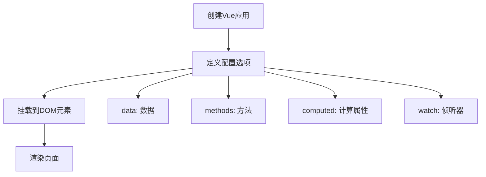
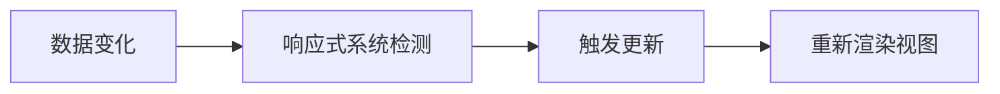

# Vue3 从零开始学习指南

## 学习大纲

### 第一章：Vue3 基础入门
- 1.1 什么是Vue3
- 1.2 开发环境搭建
- 1.3 第一个Vue应用
- 1.4 Vue实例和模板语法

### 第二章：响应式数据与计算属性
- 2.1 响应式数据基础
- 2.2 ref和reactive
- 2.3 计算属性computed
- 2.4 侦听器watch

### 第三章：模板语法与指令
- 3.1 插值表达式
- 3.2 常用指令详解
- 3.3 条件渲染
- 3.4 列表渲染

### 第四章：事件处理与表单
- 4.1 事件监听
- 4.2 事件修饰符
- 4.3 表单输入绑定
- 4.4 表单验证基础

### 第五章：组件化开发
- 5.1 组件基础
- 5.2 组件通信
- 5.3 插槽系统
- 5.4 动态组件

### 第六章：Composition API
- 6.1 setup函数
- 6.2 生命周期钩子
- 6.3 组合式函数
- 6.4 与Options API对比

### 第七章：路由与状态管理
- 7.1 Vue Router基础
- 7.2 路由导航
- 7.3 Pinia状态管理
- 7.4 项目实战准备

---
## 第一章：Vue3 基础入门

### 1.1 什么是Vue3

Vue3是一个用于构建用户界面的渐进式JavaScript框架。它具有以下特点：
- **渐进式**：可以逐步采用，不需要重写整个应用
- **响应式**：数据变化时，界面自动更新
- **组件化**：将界面拆分成可复用的组件
- **性能优秀**：比Vue2更快，体积更小

### 1.2 开发环境搭建

#### 方式一：CDN引入（适合初学者）
```html
<!DOCTYPE html>
<html lang="zh-CN">
<head>
    <meta charset="UTF-8">
    <meta name="viewport" content="width=device-width, initial-scale=1.0">
    <title>Vue3 学习</title>
</head>
<body>
    <div id="app">{{ message }}</div>
    
    <!-- 引入Vue3 -->
    <script src="https://unpkg.com/vue@3/dist/vue.global.js"></script>
    <script>
        const { createApp } = Vue
        
        createApp({
            data() {
                return {
                    message: 'Hello Vue3!'
                }
            }
        }).mount('#app')
    </script>
</body>
</html>
```

#### 方式二：使用Vite创建项目（推荐）
```bash
# 安装Node.js后执行
npm create vue@latest my-vue-project
cd my-vue-project
npm install
npm run dev
```

### 1.3 第一个Vue应用

让我们创建一个简单的计数器应用：

```html
<!DOCTYPE html>
<html lang="zh-CN">
<head>
    <meta charset="UTF-8">
    <title>我的第一个Vue应用</title>
</head>
<body>
    <div id="app">
        <h1>{{ title }}</h1>
        <p>当前计数：{{ count }}</p>
        <button @click="increment">点击+1</button>
        <button @click="decrement">点击-1</button>
    </div>

    <script src="https://unpkg.com/vue@3/dist/vue.global.js"></script>
    <script>
        const { createApp } = Vue
        
        createApp({
            data() {
                return {
                    title: '我的计数器',
                    count: 0
                }
            },
            methods: {
                increment() {
                    this.count++
                },
                decrement() {
                    this.count--
                }
            }
        }).mount('#app')
    </script>
</body>
</html>
```

### 1.4 Vue实例和模板语法

#### Vue应用实例创建流程



#### 基本模板语法示例

```html
<div id="app">
    <!-- 文本插值 -->
    <p>{{ message }}</p>
    
    <!-- HTML插值 -->
    <p v-html="htmlContent"></p>
    
    <!-- 属性绑定 -->
    
    
    <!-- 简写形式 -->
    
    
    <!-- 事件监听 -->
    <button v-on:click="handleClick">点击我</button>
    
    <!-- 简写形式 -->
    <button @click="handleClick">点击我</button>
</div>

<script>
const { createApp } = Vue

createApp({
    data() {
        return {
            message: '这是文本插值',
            htmlContent: '<strong>这是HTML内容</strong>',
            imageSrc: 'https://via.placeholder.com/150',
            imageAlt: '示例图片'
        }
    },
    methods: {
        handleClick() {
            alert('按钮被点击了！')
        }
    }
}).mount('#app')
</script>
```

---## 第二章：
响应式数据与计算属性

### 2.1 响应式数据基础

Vue3的响应式系统是其核心特性，当数据发生变化时，视图会自动更新。

#### 响应式原理简图



#### 基础示例

```html
<div id="app">
    <h2>用户信息</h2>
    <p>姓名：{{ user.name }}</p>
    <p>年龄：{{ user.age }}</p>
    <p>邮箱：{{ user.email }}</p>
    
    <button @click="updateUser">更新信息</button>
</div>

<script>
const { createApp } = Vue

createApp({
    data() {
        return {
            user: {
                name: '张三',
                age: 25,
                email: 'zhangsan@example.com'
            }
        }
    },
    methods: {
        updateUser() {
            // 直接修改数据，视图会自动更新
            this.user.name = '李四'
            this.user.age = 30
            this.user.email = 'lisi@example.com'
        }
    }
}).mount('#app')
</script>
```

### 2.2 ref和reactive

在Composition API中，我们使用`ref`和`reactive`来创建响应式数据。

#### ref - 用于基本类型数据

```html
<div id="app">
    <p>计数：{{ count }}</p>
    <p>消息：{{ message }}</p>
    <button @click="increment">增加</button>
    <button @click="changeMessage">改变消息</button>
</div>

<script>
const { createApp, ref } = Vue

createApp({
    setup() {
        // 使用ref创建响应式数据
        const count = ref(0)
        const message = ref('Hello Vue3')
        
        // 定义方法
        const increment = () => {
            count.value++ // 注意：需要使用.value
        }
        
        const changeMessage = () => {
            message.value = '消息已更新！'
        }
        
        // 返回数据和方法供模板使用
        return {
            count,
            message,
            increment,
            changeMessage
        }
    }
}).mount('#app')
</script>
```

#### reactive - 用于对象类型数据

```html
<div id="app">
    <h2>学生信息</h2>
    <p>姓名：{{ student.name }}</p>
    <p>年龄：{{ student.age }}</p>
    <p>成绩：{{ student.scores.join(', ') }}</p>
    
    <button @click="addScore">添加成绩</button>
    <button @click="updateInfo">更新信息</button>
</div>

<script>
const { createApp, reactive } = Vue

createApp({
    setup() {
        // 使用reactive创建响应式对象
        const student = reactive({
            name: '小明',
            age: 18,
            scores: [85, 92, 78]
        })
        
        const addScore = () => {
            const newScore = Math.floor(Math.random() * 100)
            student.scores.push(newScore)
        }
        
        const updateInfo = () => {
            student.name = '小红'
            student.age = 19
        }
        
        return {
            student,
            addScore,
            updateInfo
        }
    }
}).mount('#app')
</script>
```

### 2.3 计算属性computed

计算属性是基于响应式依赖进行缓存的，只有依赖发生变化时才会重新计算。

```html
<div id="app">
    <h2>购物车</h2>
    <div v-for="item in items" :key="item.id">
        <span>{{ item.name }} - ¥{{ item.price }} x {{ item.quantity }}</span>
        <button @click="item.quantity++">+</button>
        <button @click="item.quantity > 0 && item.quantity--">-</button>
    </div>
    
    <hr>
    <p>商品总数：{{ totalQuantity }}</p>
    <p>总价格：¥{{ totalPrice }}</p>
    <p>平均价格：¥{{ averagePrice }}</p>
</div>

<script>
const { createApp, reactive, computed } = Vue

createApp({
    setup() {
        const items = reactive([
            { id: 1, name: '苹果', price: 5, quantity: 2 },
            { id: 2, name: '香蕉', price: 3, quantity: 3 },
            { id: 3, name: '橙子', price: 4, quantity: 1 }
        ])
        
        // 计算属性：总数量
        const totalQuantity = computed(() => {
            return items.reduce((total, item) => total + item.quantity, 0)
        })
        
        // 计算属性：总价格
        const totalPrice = computed(() => {
            return items.reduce((total, item) => total + item.price * item.quantity, 0)
        })
        
        // 计算属性：平均价格
        const averagePrice = computed(() => {
            return totalQuantity.value > 0 ? (totalPrice.value / totalQuantity.value).toFixed(2) : 0
        })
        
        return {
            items,
            totalQuantity,
            totalPrice,
            averagePrice
        }
    }
}).mount('#app')
</script>
```

### 2.4 侦听器watch

侦听器用于观察数据变化并执行相应的操作。

```html
<div id="app">
    <h2>搜索示例</h2>
    <input v-model="searchTerm" placeholder="输入搜索关键词">
    <p>搜索词：{{ searchTerm }}</p>
    <p>搜索历史：</p>
    <ul>
        <li v-for="term in searchHistory" :key="term">{{ term }}</li>
    </ul>
    
    <hr>
    <h3>用户设置</h3>
    <label>
        <input type="checkbox" v-model="settings.notifications"> 
        接收通知
    </label>
    <br>
    <label>
        <input type="checkbox" v-model="settings.darkMode"> 
        深色模式
    </label>
    <p>设置状态：{{ settingsStatus }}</p>
</div>

<script>
const { createApp, ref, reactive, watch } = Vue

createApp({
    setup() {
        const searchTerm = ref('')
        const searchHistory = ref([])
        const settingsStatus = ref('未保存')
        
        const settings = reactive({
            notifications: false,
            darkMode: false
        })
        
        // 侦听搜索词变化
        watch(searchTerm, (newValue, oldValue) => {
            if (newValue && newValue !== oldValue) {
                // 避免重复添加
                if (!searchHistory.value.includes(newValue)) {
                    searchHistory.value.push(newValue)
                }
            }
        })
        
        // 侦听设置对象的变化
        watch(settings, () => {
            settingsStatus.value = '设置已更新，正在保存...'
            
            // 模拟保存过程
            setTimeout(() => {
                settingsStatus.value = '设置已保存'
            }, 1000)
        }, { deep: true }) // deep: true 用于深度侦听对象内部变化
        
        return {
            searchTerm,
            searchHistory,
            settings,
            settingsStatus
        }
    }
}).mount('#app')
</script>
```

---## 第三章：模
板语法与指令

### 3.1 插值表达式

插值表达式是Vue中最基本的数据绑定方式。

```html
<div id="app">
    <h2>插值表达式示例</h2>
    
    <!-- 基本文本插值 -->
    <p>用户名：{{ username }}</p>
    
    <!-- 表达式计算 -->
    <p>年龄：{{ age }}，明年：{{ age + 1 }}</p>
    
    <!-- 三元运算符 -->
    <p>状态：{{ isActive ? '在线' : '离线' }}</p>
    
    <!-- 方法调用 -->
    <p>格式化时间：{{ formatDate(currentDate) }}</p>
    
    <!-- 对象属性访问 -->
    <p>地址：{{ user.address.city }}</p>
    
    <!-- 数组访问 -->
    <p>第一个爱好：{{ hobbies[0] }}</p>
</div>

<script>
const { createApp } = Vue

createApp({
    data() {
        return {
            username: '张三',
            age: 25,
            isActive: true,
            currentDate: new Date(),
            user: {
                address: {
                    city: '北京'
                }
            },
            hobbies: ['读书', '游泳', '编程']
        }
    },
    methods: {
        formatDate(date) {
            return date.toLocaleDateString('zh-CN')
        }
    }
}).mount('#app')
</script>
```

### 3.2 常用指令详解

#### v-bind - 属性绑定

```html
<div id="app">
    <h2>v-bind 属性绑定</h2>
    
    <!-- 绑定src属性 -->
    
    
    <!-- 简写形式 -->
    
    
    <!-- 绑定class -->
    <div :class="{ active: isActive, disabled: isDisabled }">
        动态class示例
    </div>
    
    <!-- 绑定style -->
    <div :style="{ color: textColor, fontSize: fontSize + 'px' }">
        动态样式文本
    </div>
    
    <!-- 绑定多个属性 -->
    <input :type="inputType" :placeholder="placeholder" :disabled="isInputDisabled">
    
    <br><br>
    <button @click="toggleActive">切换激活状态</button>
    <button @click="changeStyle">改变样式</button>
</div>

<style>
.active {
    background-color: #4CAF50;
    color: white;
    padding: 10px;
}
.disabled {
    opacity: 0.5;
}
</style>

<script>
const { createApp } = Vue

createApp({
    data() {
        return {
            imageUrl: 'https://via.placeholder.com/200x150',
            imageAlt: '示例图片',
            isActive: false,
            isDisabled: false,
            textColor: 'blue',
            fontSize: 16,
            inputType: 'text',
            placeholder: '请输入内容',
            isInputDisabled: false
        }
    },
    methods: {
        toggleActive() {
            this.isActive = !this.isActive
        },
        changeStyle() {
            this.textColor = this.textColor === 'blue' ? 'red' : 'blue'
            this.fontSize = this.fontSize === 16 ? 20 : 16
        }
    }
}).mount('#app')
</script>
```

#### v-model - 双向数据绑定

```html
<div id="app">
    <h2>v-model 双向数据绑定</h2>
    
    <!-- 文本输入 -->
    <div>
        <label>姓名：</label>
        <input v-model="form.name" placeholder="请输入姓名">
        <p>输入的姓名：{{ form.name }}</p>
    </div>
    
    <!-- 多行文本 -->
    <div>
        <label>自我介绍：</label><br>
        <textarea v-model="form.description" rows="3" cols="30"></textarea>
        <p>介绍内容：{{ form.description }}</p>
    </div>
    
    <!-- 单选框 -->
    <div>
        <label>性别：</label>
        <input type="radio" v-model="form.gender" value="male" id="male">
        <label for="male">男</label>
        <input type="radio" v-model="form.gender" value="female" id="female">
        <label for="female">女</label>
        <p>选择的性别：{{ form.gender }}</p>
    </div>
    
    <!-- 复选框 -->
    <div>
        <label>爱好：</label>
        <input type="checkbox" v-model="form.hobbies" value="reading" id="reading">
        <label for="reading">读书</label>
        <input type="checkbox" v-model="form.hobbies" value="sports" id="sports">
        <label for="sports">运动</label>
        <input type="checkbox" v-model="form.hobbies" value="music" id="music">
        <label for="music">音乐</label>
        <p>选择的爱好：{{ form.hobbies.join(', ') }}</p>
    </div>
    
    <!-- 下拉选择 -->
    <div>
        <label>城市：</label>
        <select v-model="form.city">
            <option value="">请选择城市</option>
            <option value="beijing">北京</option>
            <option value="shanghai">上海</option>
            <option value="guangzhou">广州</option>
        </select>
        <p>选择的城市：{{ form.city }}</p>
    </div>
    
    <hr>
    <h3>表单数据：</h3>
    <pre>{{ JSON.stringify(form, null, 2) }}</pre>
</div>

<script>
const { createApp } = Vue

createApp({
    data() {
        return {
            form: {
                name: '',
                description: '',
                gender: '',
                hobbies: [],
                city: ''
            }
        }
    }
}).mount('#app')
</script>
```

### 3.3 条件渲染

#### v-if、v-else-if、v-else

```html
<div id="app">
    <h2>条件渲染示例</h2>
    
    <div>
        <label>选择天气：</label>
        <select v-model="weather">
            <option value="sunny">晴天</option>
            <option value="rainy">雨天</option>
            <option value="cloudy">阴天</option>
            <option value="snowy">雪天</option>
        </select>
    </div>
    
    <div style="margin: 20px 0;">
        <div v-if="weather === 'sunny'" style="color: orange;">
            ☀️ 今天是晴天，适合出门游玩！
        </div>
        <div v-else-if="weather === 'rainy'" style="color: blue;">
            🌧️ 今天下雨，记得带伞！
        </div>
        <div v-else-if="weather === 'cloudy'" style="color: gray;">
            ☁️ 今天阴天，天气凉爽。
        </div>
        <div v-else-if="weather === 'snowy'" style="color: lightblue;">
            ❄️ 今天下雪，注意保暖！
        </div>
        <div v-else>
            请选择天气状况
        </div>
    </div>
    
    <!-- v-show 示例 -->
    <div>
        <button @click="showDetails = !showDetails">
            {{ showDetails ? '隐藏' : '显示' }}详情
        </button>
        <div v-show="showDetails" style="border: 1px solid #ccc; padding: 10px; margin-top: 10px;">
            这是详细信息内容，使用v-show控制显示/隐藏
        </div>
    </div>
    
    <!-- template 条件渲染 -->
    <template v-if="weather === 'rainy'">
        <h3>雨天建议：</h3>
        <ul>
            <li>带雨伞</li>
            <li>穿雨鞋</li>
            <li>避免户外活动</li>
        </ul>
    </template>
</div>

<script>
const { createApp } = Vue

createApp({
    data() {
        return {
            weather: '',
            showDetails: false
        }
    }
}).mount('#app')
</script>
```

### 3.4 列表渲染

#### v-for 指令详解

```html
<div id="app">
    <h2>列表渲染示例</h2>
    
    <!-- 渲染数组 -->
    <h3>学生列表：</h3>
    <ul>
        <li v-for="(student, index) in students" :key="student.id">
            {{ index + 1 }}. {{ student.name }} - {{ student.age }}岁 - {{ student.grade }}
            <button @click="removeStudent(index)">删除</button>
        </li>
    </ul>
    
    <!-- 渲染对象 -->
    <h3>用户信息：</h3>
    <ul>
        <li v-for="(value, key) in userInfo" :key="key">
            {{ key }}: {{ value }}
        </li>
    </ul>
    
    <!-- 渲染数字 -->
    <h3>数字列表：</h3>
    <span v-for="n in 10" :key="n" style="margin-right: 10px;">
        {{ n }}
    </span>
    
    <!-- 嵌套循环 -->
    <h3>班级学生：</h3>
    <div v-for="class_ in classes" :key="class_.id" style="margin-bottom: 20px;">
        <h4>{{ class_.name }}</h4>
        <ul>
            <li v-for="student in class_.students" :key="student.id">
                {{ student.name }} - {{ student.subject }}
            </li>
        </ul>
    </div>
    
    <!-- 添加新学生 -->
    <div style="margin-top: 20px;">
        <h3>添加学生：</h3>
        <input v-model="newStudent.name" placeholder="姓名">
        <input v-model.number="newStudent.age" placeholder="年龄" type="number">
        <input v-model="newStudent.grade" placeholder="年级">
        <button @click="addStudent">添加</button>
    </div>
</div>

<script>
const { createApp } = Vue

createApp({
    data() {
        return {
            students: [
                { id: 1, name: '张三', age: 18, grade: '高三' },
                { id: 2, name: '李四', age: 17, grade: '高二' },
                { id: 3, name: '王五', age: 16, grade: '高一' }
            ],
            userInfo: {
                name: '管理员',
                email: 'admin@example.com',
                role: '超级管理员',
                lastLogin: '2024-01-15'
            },
            classes: [
                {
                    id: 1,
                    name: '数学班',
                    students: [
                        { id: 1, name: '小明', subject: '高等数学' },
                        { id: 2, name: '小红', subject: '线性代数' }
                    ]
                },
                {
                    id: 2,
                    name: '英语班',
                    students: [
                        { id: 3, name: '小刚', subject: '英语口语' },
                        { id: 4, name: '小丽', subject: '英语写作' }
                    ]
                }
            ],
            newStudent: {
                name: '',
                age: '',
                grade: ''
            }
        }
    },
    methods: {
        removeStudent(index) {
            this.students.splice(index, 1)
        },
        addStudent() {
            if (this.newStudent.name && this.newStudent.age && this.newStudent.grade) {
                this.students.push({
                    id: Date.now(), // 简单的ID生成
                    name: this.newStudent.name,
                    age: this.newStudent.age,
                    grade: this.newStudent.grade
                })
                // 清空表单
                this.newStudent = { name: '', age: '', grade: '' }
            }
        }
    }
}).mount('#app')
</script>
```

---## 第
四章：事件处理与表单

### 4.1 事件监听

Vue使用`v-on`指令（简写为`@`）来监听DOM事件。

```html
<div id="app">
    <h2>事件处理示例</h2>
    
    <!-- 基本事件监听 -->
    <div>
        <button @click="count++">点击次数：{{ count }}</button>
    </div>
    
    <!-- 方法事件处理器 -->
    <div style="margin: 20px 0;">
        <button @click="greet">打招呼</button>
        <button @click="greetWithName('张三')">向张三打招呼</button>
    </div>
    
    <!-- 访问事件对象 -->
    <div>
        <button @click="showEvent">显示事件信息</button>
        <button @click="showEventWithParam('参数', $event)">带参数的事件</button>
    </div>
    
    <!-- 鼠标事件 -->
    <div style="margin: 20px 0;">
        <div 
            @mouseenter="mouseStatus = '鼠标进入'"
            @mouseleave="mouseStatus = '鼠标离开'"
            @mousemove="updateMousePosition"
            style="width: 200px; height: 100px; border: 1px solid #ccc; padding: 10px;"
        >
            <p>{{ mouseStatus }}</p>
            <p>鼠标位置：({{ mouseX }}, {{ mouseY }})</p>
        </div>
    </div>
    
    <!-- 键盘事件 -->
    <div>
        <input 
            @keyup="lastKey = $event.key"
            @keyup.enter="handleEnter"
            placeholder="按键测试，按回车触发特殊事件"
        >
        <p>最后按下的键：{{ lastKey }}</p>
        <p>{{ enterMessage }}</p>
    </div>
    
    <!-- 表单事件 -->
    <div style="margin: 20px 0;">
        <form @submit.prevent="handleSubmit">
            <input v-model="formData.username" placeholder="用户名" required>
            <input v-model="formData.email" type="email" placeholder="邮箱" required>
            <button type="submit">提交</button>
        </form>
        <p v-if="submitMessage">{{ submitMessage }}</p>
    </div>
</div>

<script>
const { createApp } = Vue

createApp({
    data() {
        return {
            count: 0,
            mouseStatus: '等待鼠标事件',
            mouseX: 0,
            mouseY: 0,
            lastKey: '',
            enterMessage: '',
            formData: {
                username: '',
                email: ''
            },
            submitMessage: ''
        }
    },
    methods: {
        greet() {
            alert('你好！')
        },
        greetWithName(name) {
            alert(`你好，${name}！`)
        },
        showEvent(event) {
            console.log('事件对象：', event)
            alert(`点击位置：(${event.clientX}, ${event.clientY})`)
        },
        showEventWithParam(param, event) {
            alert(`参数：${param}，点击位置：(${event.clientX}, ${event.clientY})`)
        },
        updateMousePosition(event) {
            this.mouseX = event.offsetX
            this.mouseY = event.offsetY
        },
        handleEnter() {
            this.enterMessage = '检测到回车键！'
            setTimeout(() => {
                this.enterMessage = ''
            }, 2000)
        },
        handleSubmit() {
            this.submitMessage = `提交成功！用户名：${this.formData.username}，邮箱：${this.formData.email}`
            setTimeout(() => {
                this.submitMessage = ''
            }, 3000)
        }
    }
}).mount('#app')
</script>
```

### 4.2 事件修饰符

事件修饰符用于处理常见的事件处理需求。

```html
<div id="app">
    <h2>事件修饰符示例</h2>
    
    <!-- .prevent - 阻止默认行为 -->
    <div>
        <h3>.prevent 修饰符</h3>
        <a href="https://www.baidu.com" @click.prevent="handleLinkClick">
            点击这个链接（阻止跳转）
        </a>
        <p>{{ linkMessage }}</p>
    </div>
    
    <!-- .stop - 阻止事件冒泡 -->
    <div style="margin: 20px 0;">
        <h3>.stop 修饰符</h3>
        <div @click="outerClick" style="padding: 20px; background-color: #f0f0f0;">
            外层div
            <button @click.stop="innerClick" style="margin: 10px;">
                内层按钮（阻止冒泡）
            </button>
            <button @click="innerClick" style="margin: 10px;">
                内层按钮（不阻止冒泡）
            </button>
        </div>
        <p>{{ bubbleMessage }}</p>
    </div>
    
    <!-- .once - 只触发一次 -->
    <div>
        <h3>.once 修饰符</h3>
        <button @click.once="onceClick">只能点击一次的按钮</button>
        <p>{{ onceMessage }}</p>
    </div>
    
    <!-- 按键修饰符 -->
    <div style="margin: 20px 0;">
        <h3>按键修饰符</h3>
        <input @keyup.enter="handleEnter" placeholder="按回车键" style="margin: 5px;">
        <input @keyup.esc="handleEsc" placeholder="按ESC键" style="margin: 5px;">
        <input @keyup.space="handleSpace" placeholder="按空格键" style="margin: 5px;">
        <input @keyup.ctrl.enter="handleCtrlEnter" placeholder="按Ctrl+Enter" style="margin: 5px;">
        <p>{{ keyMessage }}</p>
    </div>
    
    <!-- 鼠标按钮修饰符 -->
    <div>
        <h3>鼠标按钮修饰符</h3>
        <div 
            @click.left="handleLeftClick"
            @click.right.prevent="handleRightClick"
            @click.middle="handleMiddleClick"
            style="width: 200px; height: 100px; border: 1px solid #ccc; padding: 10px; user-select: none;"
        >
            点击测试区域（左键、右键、中键）
        </div>
        <p>{{ mouseClickMessage }}</p>
    </div>
    
    <!-- .self - 只在事件目标是元素本身时触发 -->
    <div style="margin: 20px 0;">
        <h3>.self 修饰符</h3>
        <div @click.self="handleSelfClick" style="padding: 20px; background-color: #e0e0e0;">
            只有点击灰色区域才会触发事件
            <button style="margin: 10px;">点击按钮不会触发外层事件</button>
        </div>
        <p>{{ selfMessage }}</p>
    </div>
</div>

<script>
const { createApp } = Vue

createApp({
    data() {
        return {
            linkMessage: '',
            bubbleMessage: '',
            onceMessage: '',
            keyMessage: '',
            mouseClickMessage: '',
            selfMessage: ''
        }
    },
    methods: {
        handleLinkClick() {
            this.linkMessage = '链接点击被阻止，没有跳转'
        },
        outerClick() {
            this.bubbleMessage = '外层div被点击'
        },
        innerClick() {
            this.bubbleMessage = '内层按钮被点击'
        },
        onceClick() {
            this.onceMessage = '按钮被点击了，现在已经失效'
        },
        handleEnter() {
            this.keyMessage = '检测到回车键'
        },
        handleEsc() {
            this.keyMessage = '检测到ESC键'
        },
        handleSpace() {
            this.keyMessage = '检测到空格键'
        },
        handleCtrlEnter() {
            this.keyMessage = '检测到Ctrl+Enter组合键'
        },
        handleLeftClick() {
            this.mouseClickMessage = '左键点击'
        },
        handleRightClick() {
            this.mouseClickMessage = '右键点击（阻止了右键菜单）'
        },
        handleMiddleClick() {
            this.mouseClickMessage = '中键点击'
        },
        handleSelfClick() {
            this.selfMessage = '点击了元素本身（不是子元素）'
        }
    }
}).mount('#app')
</script>
```

### 4.3 表单输入绑定

深入了解v-model在不同表单元素中的使用。

```html
<div id="app">
    <h2>表单输入绑定详解</h2>
    
    <form @submit.prevent="submitForm">
        <!-- 文本输入 -->
        <div class="form-group">
            <label>用户名：</label>
            <input v-model="form.username" type="text" placeholder="请输入用户名">
            <small>当前值：{{ form.username }}</small>
        </div>
        
        <!-- 密码输入 -->
        <div class="form-group">
            <label>密码：</label>
            <input v-model="form.password" type="password" placeholder="请输入密码">
            <small>密码长度：{{ form.password.length }}</small>
        </div>
        
        <!-- 数字输入 -->
        <div class="form-group">
            <label>年龄：</label>
            <input v-model.number="form.age" type="number" min="1" max="120">
            <small>类型：{{ typeof form.age }}</small>
        </div>
        
        <!-- 邮箱输入 -->
        <div class="form-group">
            <label>邮箱：</label>
            <input v-model.trim="form.email" type="email" placeholder="请输入邮箱">
            <small>去除空格后：'{{ form.email }}'</small>
        </div>
        
        <!-- 多行文本 -->
        <div class="form-group">
            <label>个人简介：</label>
            <textarea v-model="form.bio" rows="3" placeholder="请输入个人简介"></textarea>
            <small>字符数：{{ form.bio.length }}</small>
        </div>
        
        <!-- 单选按钮 -->
        <div class="form-group">
            <label>性别：</label>
            <label><input type="radio" v-model="form.gender" value="male"> 男</label>
            <label><input type="radio" v-model="form.gender" value="female"> 女</label>
            <label><input type="radio" v-model="form.gender" value="other"> 其他</label>
            <small>选择：{{ form.gender }}</small>
        </div>
        
        <!-- 复选框（单个） -->
        <div class="form-group">
            <label>
                <input type="checkbox" v-model="form.agree">
                我同意用户协议
            </label>
            <small>状态：{{ form.agree }}</small>
        </div>
        
        <!-- 复选框（多个） -->
        <div class="form-group">
            <label>兴趣爱好：</label>
            <label><input type="checkbox" v-model="form.hobbies" value="reading"> 阅读</label>
            <label><input type="checkbox" v-model="form.hobbies" value="sports"> 运动</label>
            <label><input type="checkbox" v-model="form.hobbies" value="music"> 音乐</label>
            <label><input type="checkbox" v-model="form.hobbies" value="travel"> 旅行</label>
            <small>选择：{{ form.hobbies.join(', ') }}</small>
        </div>
        
        <!-- 下拉选择（单选） -->
        <div class="form-group">
            <label>居住城市：</label>
            <select v-model="form.city">
                <option value="">请选择城市</option>
                <option value="beijing">北京</option>
                <option value="shanghai">上海</option>
                <option value="guangzhou">广州</option>
                <option value="shenzhen">深圳</option>
            </select>
            <small>选择：{{ form.city }}</small>
        </div>
        
        <!-- 下拉选择（多选） -->
        <div class="form-group">
            <label>掌握技能：</label>
            <select v-model="form.skills" multiple>
                <option value="html">HTML</option>
                <option value="css">CSS</option>
                <option value="javascript">JavaScript</option>
                <option value="vue">Vue.js</option>
                <option value="react">React</option>
                <option value="node">Node.js</option>
            </select>
            <small>选择：{{ form.skills.join(', ') }}</small>
        </div>
        
        <!-- 文件上传 -->
        <div class="form-group">
            <label>头像上传：</label>
            <input type="file" @change="handleFileChange" accept="image/*">
            <small v-if="form.avatar">文件：{{ form.avatar.name }}</small>
        </div>
        
        <!-- 提交按钮 -->
        <div class="form-group">
            <button type="submit" :disabled="!form.agree">提交表单</button>
            <button type="button" @click="resetForm">重置表单</button>
        </div>
    </form>
    
    <!-- 表单数据预览 -->
    <div style="margin-top: 30px;">
        <h3>表单数据预览：</h3>
        <pre>{{ JSON.stringify(form, null, 2) }}</pre>
    </div>
</div>

<style>
.form-group {
    margin-bottom: 15px;
}
.form-group label {
    display: inline-block;
    width: 100px;
    margin-right: 10px;
}
.form-group input, .form-group textarea, .form-group select {
    margin-right: 10px;
}
.form-group small {
    color: #666;
    font-size: 12px;
}
</style>

<script>
const { createApp } = Vue

createApp({
    data() {
        return {
            form: {
                username: '',
                password: '',
                age: null,
                email: '',
                bio: '',
                gender: '',
                agree: false,
                hobbies: [],
                city: '',
                skills: [],
                avatar: null
            }
        }
    },
    methods: {
        handleFileChange(event) {
            const file = event.target.files[0]
            this.form.avatar = file
        },
        submitForm() {
            if (this.validateForm()) {
                alert('表单提交成功！')
                console.log('提交的数据：', this.form)
            }
        },
        resetForm() {
            this.form = {
                username: '',
                password: '',
                age: null,
                email: '',
                bio: '',
                gender: '',
                agree: false,
                hobbies: [],
                city: '',
                skills: [],
                avatar: null
            }
        },
        validateForm() {
            if (!this.form.username) {
                alert('请输入用户名')
                return false
            }
            if (!this.form.password) {
                alert('请输入密码')
                return false
            }
            if (!this.form.agree) {
                alert('请同意用户协议')
                return false
            }
            return true
        }
    }
}).mount('#app')
</script>
```

### 4.4 表单验证基础

实现简单的表单验证功能。

```html
<div id="app">
    <h2>表单验证示例</h2>
    
    <form @submit.prevent="submitForm" novalidate>
        <!-- 用户名验证 -->
        <div class="form-group">
            <label>用户名：</label>
            <input 
                v-model="form.username" 
                :class="{ error: errors.username }"
                @blur="validateUsername"
                placeholder="3-20个字符"
            >
            <span v-if="errors.username" class="error-message">{{ errors.username }}</span>
        </div>
        
        <!-- 邮箱验证 -->
        <div class="form-group">
            <label>邮箱：</label>
            <input 
                v-model="form.email" 
                :class="{ error: errors.email }"
                @blur="validateEmail"
                type="email"
                placeholder="请输入有效邮箱"
            >
            <span v-if="errors.email" class="error-message">{{ errors.email }}</span>
        </div>
        
        <!-- 密码验证 -->
        <div class="form-group">
            <label>密码：</label>
            <input 
                v-model="form.password" 
                :class="{ error: errors.password }"
                @blur="validatePassword"
                type="password"
                placeholder="至少6位，包含字母和数字"
            >
            <span v-if="errors.password" class="error-message">{{ errors.password }}</span>
        </div>
        
        <!-- 确认密码验证 -->
        <div class="form-group">
            <label>确认密码：</label>
            <input 
                v-model="form.confirmPassword" 
                :class="{ error: errors.confirmPassword }"
                @blur="validateConfirmPassword"
                type="password"
                placeholder="请再次输入密码"
            >
            <span v-if="errors.confirmPassword" class="error-message">{{ errors.confirmPassword }}</span>
        </div>
        
        <!-- 年龄验证 -->
        <div class="form-group">
            <label>年龄：</label>
            <input 
                v-model.number="form.age" 
                :class="{ error: errors.age }"
                @blur="validateAge"
                type="number"
                placeholder="18-100岁"
            >
            <span v-if="errors.age" class="error-message">{{ errors.age }}</span>
        </div>
        
        <!-- 手机号验证 -->
        <div class="form-group">
            <label>手机号：</label>
            <input 
                v-model="form.phone" 
                :class="{ error: errors.phone }"
                @blur="validatePhone"
                placeholder="请输入11位手机号"
            >
            <span v-if="errors.phone" class="error-message">{{ errors.phone }}</span>
        </div>
        
        <!-- 提交按钮 -->
        <div class="form-group">
            <button type="submit" :disabled="!isFormValid">
                {{ isFormValid ? '提交' : '请完善表单' }}
            </button>
            <button type="button" @click="resetForm">重置</button>
        </div>
    </form>
    
    <!-- 验证状态显示 -->
    <div style="margin-top: 20px;">
        <h3>验证状态：</h3>
        <p>表单是否有效：{{ isFormValid ? '✅ 有效' : '❌ 无效' }}</p>
        <p>错误数量：{{ errorCount }}</p>
    </div>
</div>

<style>
.form-group {
    margin-bottom: 15px;
}
.form-group label {
    display: inline-block;
    width: 100px;
    margin-right: 10px;
}
.form-group input {
    padding: 8px;
    border: 1px solid #ddd;
    border-radius: 4px;
    width: 200px;
}
.form-group input.error {
    border-color: #ff4444;
    background-color: #fff5f5;
}
.error-message {
    color: #ff4444;
    font-size: 12px;
    margin-left: 10px;
}
button {
    padding: 8px 16px;
    margin-right: 10px;
    border: none;
    border-radius: 4px;
    cursor: pointer;
}
button[type="submit"] {
    background-color: #4CAF50;
    color: white;
}
button[type="submit"]:disabled {
    background-color: #cccccc;
    cursor: not-allowed;
}
button[type="button"] {
    background-color: #f44336;
    color: white;
}
</style>

<script>
const { createApp } = Vue

createApp({
    data() {
        return {
            form: {
                username: '',
                email: '',
                password: '',
                confirmPassword: '',
                age: null,
                phone: ''
            },
            errors: {
                username: '',
                email: '',
                password: '',
                confirmPassword: '',
                age: '',
                phone: ''
            }
        }
    },
    computed: {
        isFormValid() {
            return Object.values(this.errors).every(error => !error) &&
                   Object.values(this.form).every(value => value !== '' && value !== null)
        },
        errorCount() {
            return Object.values(this.errors).filter(error => error).length
        }
    },
    methods: {
        validateUsername() {
            const username = this.form.username
            if (!username) {
                this.errors.username = '用户名不能为空'
            } else if (username.length < 3 || username.length > 20) {
                this.errors.username = '用户名长度应在3-20个字符之间'
            } else if (!/^[a-zA-Z0-9_]+$/.test(username)) {
                this.errors.username = '用户名只能包含字母、数字和下划线'
            } else {
                this.errors.username = ''
            }
        },
        validateEmail() {
            const email = this.form.email
            const emailRegex = /^[^\s@]+@[^\s@]+\.[^\s@]+$/
            if (!email) {
                this.errors.email = '邮箱不能为空'
            } else if (!emailRegex.test(email)) {
                this.errors.email = '请输入有效的邮箱地址'
            } else {
                this.errors.email = ''
            }
        },
        validatePassword() {
            const password = this.form.password
            if (!password) {
                this.errors.password = '密码不能为空'
            } else if (password.length < 6) {
                this.errors.password = '密码长度至少6位'
            } else if (!/(?=.*[a-zA-Z])(?=.*\d)/.test(password)) {
                this.errors.password = '密码必须包含字母和数字'
            } else {
                this.errors.password = ''
            }
            // 密码改变时重新验证确认密码
            if (this.form.confirmPassword) {
                this.validateConfirmPassword()
            }
        },
        validateConfirmPassword() {
            const confirmPassword = this.form.confirmPassword
            if (!confirmPassword) {
                this.errors.confirmPassword = '请确认密码'
            } else if (confirmPassword !== this.form.password) {
                this.errors.confirmPassword = '两次输入的密码不一致'
            } else {
                this.errors.confirmPassword = ''
            }
        },
        validateAge() {
            const age = this.form.age
            if (!age) {
                this.errors.age = '年龄不能为空'
            } else if (age < 18 || age > 100) {
                this.errors.age = '年龄应在18-100岁之间'
            } else {
                this.errors.age = ''
            }
        },
        validatePhone() {
            const phone = this.form.phone
            const phoneRegex = /^1[3-9]\d{9}$/
            if (!phone) {
                this.errors.phone = '手机号不能为空'
            } else if (!phoneRegex.test(phone)) {
                this.errors.phone = '请输入有效的11位手机号'
            } else {
                this.errors.phone = ''
            }
        },
        validateAll() {
            this.validateUsername()
            this.validateEmail()
            this.validatePassword()
            this.validateConfirmPassword()
            this.validateAge()
            this.validatePhone()
        },
        submitForm() {
            this.validateAll()
            if (this.isFormValid) {
                alert('表单验证通过，提交成功！')
                console.log('提交的数据：', this.form)
            } else {
                alert('表单验证失败，请检查输入')
            }
        },
        resetForm() {
            this.form = {
                username: '',
                email: '',
                password: '',
                confirmPassword: '',
                age: null,
                phone: ''
            }
            this.errors = {
                username: '',
                email: '',
                password: '',
                confirmPassword: '',
                age: '',
                phone: ''
            }
        }
    }
}).mount('#app')
</script>
```

---## 第五章：
组件化开发

### 5.1 组件基础

组件是Vue最强大的功能之一，它允许我们将UI拆分成独立、可复用的部分。

#### 全局组件注册

```html
<div id="app">
    <h2>全局组件示例</h2>
    
    <!-- 使用全局组件 -->
    <user-card 
        name="张三" 
        email="zhangsan@example.com" 
        avatar="https://via.placeholder.com/60"
    ></user-card>
    
    <user-card 
        name="李四" 
        email="lisi@example.com" 
        avatar="https://via.placeholder.com/60"
    ></user-card>
    
    <counter-button></counter-button>
    <counter-button></counter-button>
</div>

<script>
const { createApp } = Vue

const app = createApp({
    data() {
        return {
            message: '组件化开发示例'
        }
    }
})

// 注册全局组件 - 用户卡片
app.component('user-card', {
    props: ['name', 'email', 'avatar'],
    template: `
        <div class="user-card">
            
            <div class="user-info">
                <h3>{{ name }}</h3>
                <p>{{ email }}</p>
                <button @click="sendMessage">发送消息</button>
            </div>
        </div>
    `,
    methods: {
        sendMessage() {
            alert(`向 ${this.name} 发送消息`)
        }
    }
})

// 注册全局组件 - 计数器按钮
app.component('counter-button', {
    data() {
        return {
            count: 0
        }
    },
    template: `
        <button @click="count++" class="counter-btn">
            点击了 {{ count }} 次
        </button>
    `
})

app.mount('#app')
</script>

<style>
.user-card {
    display: flex;
    align-items: center;
    padding: 15px;
    margin: 10px 0;
    border: 1px solid #ddd;
    border-radius: 8px;
    background-color: #f9f9f9;
}
.avatar {
    width: 60px;
    height: 60px;
    border-radius: 50%;
    margin-right: 15px;
}
.user-info h3 {
    margin: 0 0 5px 0;
}
.user-info p {
    margin: 0 0 10px 0;
    color: #666;
}
.counter-btn {
    margin: 10px;
    padding: 10px 15px;
    background-color: #4CAF50;
    color: white;
    border: none;
    border-radius: 4px;
    cursor: pointer;
}
</style>
```

#### 局部组件注册

```html
<div id="app">
    <h2>局部组件示例</h2>
    
    <product-list :products="products"></product-list>
    
    <div style="margin-top: 20px;">
        <button @click="addProduct">添加商品</button>
    </div>
</div>

<script>
const { createApp } = Vue

// 定义局部组件
const ProductItem = {
    props: ['product'],
    emits: ['remove'],
    template: `
        <div class="product-item">
            
            <div class="product-info">
                <h3>{{ product.name }}</h3>
                <p class="price">¥{{ product.price }}</p>
                <p class="description">{{ product.description }}</p>
                <div class="actions">
                    <button @click="$emit('remove', product.id)" class="remove-btn">
                        删除
                    </button>
                </div>
            </div>
        </div>
    `
}

const ProductList = {
    props: ['products'],
    emits: ['product-removed'],
    components: {
        ProductItem
    },
    template: `
        <div class="product-list">
            <h3>商品列表 ({{ products.length }} 件商品)</h3>
            <product-item 
                v-for="product in products" 
                :key="product.id"
                :product="product"
                @remove="handleRemove"
            ></product-item>
            <p v-if="products.length === 0">暂无商品</p>
        </div>
    `,
    methods: {
        handleRemove(productId) {
            this.$emit('product-removed', productId)
        }
    }
}

createApp({
    components: {
        ProductList
    },
    data() {
        return {
            products: [
                {
                    id: 1,
                    name: 'iPhone 15',
                    price: 5999,
                    description: '最新款iPhone，性能强劲',
                    image: 'https://via.placeholder.com/100x100'
                },
                {
                    id: 2,
                    name: 'MacBook Pro',
                    price: 12999,
                    description: '专业级笔记本电脑',
                    image: 'https://via.placeholder.com/100x100'
                }
            ]
        }
    },
    methods: {
        addProduct() {
            const newProduct = {
                id: Date.now(),
                name: `新商品 ${this.products.length + 1}`,
                price: Math.floor(Math.random() * 10000) + 1000,
                description: '这是一个新添加的商品',
                image: 'https://via.placeholder.com/100x100'
            }
            this.products.push(newProduct)
        }
    },
    // 监听子组件事件
    template: `
        <div>
            <product-list 
                :products="products" 
                @product-removed="removeProduct"
            ></product-list>
        </div>
    `,
    methods: {
        ...this.methods,
        removeProduct(productId) {
            this.products = this.products.filter(p => p.id !== productId)
        }
    }
}).mount('#app')
</script>

<style>
.product-list {
    max-width: 600px;
}
.product-item {
    display: flex;
    padding: 15px;
    margin: 10px 0;
    border: 1px solid #ddd;
    border-radius: 8px;
    background-color: white;
}
.product-image {
    width: 100px;
    height: 100px;
    object-fit: cover;
    margin-right: 15px;
    border-radius: 4px;
}
.product-info {
    flex: 1;
}
.product-info h3 {
    margin: 0 0 10px 0;
    color: #333;
}
.price {
    font-size: 18px;
    font-weight: bold;
    color: #e74c3c;
    margin: 5px 0;
}
.description {
    color: #666;
    margin: 10px 0;
}
.remove-btn {
    background-color: #e74c3c;
    color: white;
    border: none;
    padding: 5px 10px;
    border-radius: 4px;
    cursor: pointer;
}
</style>
```

### 5.2 组件通信

#### Props 父传子

```html
<div id="app">
    <h2>Props 父传子通信</h2>
    
    <div class="controls">
        <button @click="changeTheme">切换主题</button>
        <button @click="toggleLoading">切换加载状态</button>
        <input v-model="newMessage" placeholder="输入消息">
        <button @click="addMessage">添加消息</button>
    </div>
    
    <message-board 
        :theme="currentTheme"
        :loading="isLoading"
        :messages="messages"
        :max-messages="5"
    ></message-board>
</div>

<script>
const { createApp } = Vue

const MessageBoard = {
    props: {
        // 字符串类型
        theme: {
            type: String,
            default: 'light',
            validator(value) {
                return ['light', 'dark'].includes(value)
            }
        },
        // 布尔类型
        loading: {
            type: Boolean,
            default: false
        },
        // 数组类型
        messages: {
            type: Array,
            default: () => []
        },
        // 数字类型
        maxMessages: {
            type: Number,
            default: 10
        }
    },
    computed: {
        displayMessages() {
            return this.messages.slice(-this.maxMessages)
        },
        boardClass() {
            return {
                'message-board': true,
                'dark-theme': this.theme === 'dark',
                'loading': this.loading
            }
        }
    },
    template: `
        <div :class="boardClass">
            <h3>消息板 ({{ theme }} 主题)</h3>
            
            <div v-if="loading" class="loading-indicator">
                加载中...
            </div>
            
            <div v-else>
                <p v-if="displayMessages.length === 0">暂无消息</p>
                <div v-else>
                    <div 
                        v-for="(message, index) in displayMessages" 
                        :key="index"
                        class="message-item"
                    >
                        <span class="timestamp">{{ message.time }}</span>
                        <span class="content">{{ message.text }}</span>
                    </div>
                </div>
                <p class="info">
                    显示最近 {{ maxMessages }} 条消息，当前 {{ displayMessages.length }} 条
                </p>
            </div>
        </div>
    `
}

createApp({
    components: {
        MessageBoard
    },
    data() {
        return {
            currentTheme: 'light',
            isLoading: false,
            newMessage: '',
            messages: [
                { text: '欢迎使用消息板', time: '10:00' },
                { text: '这是第二条消息', time: '10:01' }
            ]
        }
    },
    methods: {
        changeTheme() {
            this.currentTheme = this.currentTheme === 'light' ? 'dark' : 'light'
        },
        toggleLoading() {
            this.isLoading = !this.isLoading
        },
        addMessage() {
            if (this.newMessage.trim()) {
                const now = new Date()
                this.messages.push({
                    text: this.newMessage,
                    time: now.toLocaleTimeString('zh-CN', { 
                        hour: '2-digit', 
                        minute: '2-digit' 
                    })
                })
                this.newMessage = ''
            }
        }
    }
}).mount('#app')
</script>

<style>
.controls {
    margin-bottom: 20px;
}
.controls button, .controls input {
    margin-right: 10px;
    padding: 8px 12px;
}
.message-board {
    max-width: 500px;
    padding: 20px;
    border: 1px solid #ddd;
    border-radius: 8px;
    background-color: white;
    transition: all 0.3s ease;
}
.message-board.dark-theme {
    background-color: #333;
    color: white;
    border-color: #555;
}
.message-board.loading {
    opacity: 0.7;
}
.loading-indicator {
    text-align: center;
    padding: 20px;
    font-style: italic;
}
.message-item {
    padding: 8px 0;
    border-bottom: 1px solid #eee;
}
.dark-theme .message-item {
    border-bottom-color: #555;
}
.timestamp {
    color: #666;
    font-size: 12px;
    margin-right: 10px;
}
.dark-theme .timestamp {
    color: #aaa;
}
.content {
    font-size: 14px;
}
.info {
    font-size: 12px;
    color: #666;
    margin-top: 10px;
}
.dark-theme .info {
    color: #aaa;
}
</style>
```

#### Emit 子传父

```html
<div id="app">
    <h2>Emit 子传父通信</h2>
    
    <div class="shopping-cart">
        <h3>购物车 ({{ cartItems.length }} 件商品)</h3>
        <p>总价：¥{{ totalPrice }}</p>
        
        <cart-item 
            v-for="item in cartItems" 
            :key="item.id"
            :item="item"
            @update-quantity="handleUpdateQuantity"
            @remove-item="handleRemoveItem"
            @item-selected="handleItemSelected"
        ></cart-item>
        
        <div v-if="cartItems.length === 0" class="empty-cart">
            购物车为空
        </div>
        
        <div v-if="cartItems.length > 0" class="cart-actions">
            <button @click="clearCart" class="clear-btn">清空购物车</button>
            <button @click="checkout" class="checkout-btn">结算</button>
        </div>
    </div>
    
    <div class="add-product">
        <h3>添加商品</h3>
        <button @click="addRandomProduct">添加随机商品</button>
    </div>
</div>

<script>
const { createApp } = Vue

const CartItem = {
    props: {
        item: {
            type: Object,
            required: true
        }
    },
    emits: {
        // 定义事件及其验证
        'update-quantity': (id, quantity) => {
            return typeof id === 'number' && typeof quantity === 'number' && quantity >= 0
        },
        'remove-item': (id) => {
            return typeof id === 'number'
        },
        'item-selected': (id, selected) => {
            return typeof id === 'number' && typeof selected === 'boolean'
        }
    },
    methods: {
        increaseQuantity() {
            this.$emit('update-quantity', this.item.id, this.item.quantity + 1)
        },
        decreaseQuantity() {
            if (this.item.quantity > 1) {
                this.$emit('update-quantity', this.item.id, this.item.quantity - 1)
            }
        },
        removeItem() {
            this.$emit('remove-item', this.item.id)
        },
        toggleSelection() {
            this.$emit('item-selected', this.item.id, !this.item.selected)
        }
    },
    computed: {
        itemTotal() {
            return this.item.price * this.item.quantity
        }
    },
    template: `
        <div class="cart-item" :class="{ selected: item.selected }">
            <input 
                type="checkbox" 
                :checked="item.selected"
                @change="toggleSelection"
                class="item-checkbox"
            >
            
            <div class="item-info">
                <h4>{{ item.name }}</h4>
                <p class="item-price">¥{{ item.price }}</p>
            </div>
            <div class="quantity-controls">
                <button @click="decreaseQuantity" :disabled="item.quantity <= 1">-</button>
                <span class="quantity">{{ item.quantity }}</span>
                <button @click="increaseQuantity">+</button>
            </div>
            <div class="item-total">
                ¥{{ itemTotal }}
            </div>
            <button @click="removeItem" class="remove-btn">删除</button>
        </div>
    `
}

createApp({
    components: {
        CartItem
    },
    data() {
        return {
            cartItems: [
                {
                    id: 1,
                    name: '苹果',
                    price: 5,
                    quantity: 2,
                    selected: true,
                    image: 'https://via.placeholder.com/60x60'
                },
                {
                    id: 2,
                    name: '香蕉',
                    price: 3,
                    quantity: 3,
                    selected: false,
                    image: 'https://via.placeholder.com/60x60'
                }
            ]
        }
    },
    computed: {
        totalPrice() {
            return this.cartItems
                .filter(item => item.selected)
                .reduce((total, item) => total + item.price * item.quantity, 0)
        }
    },
    methods: {
        handleUpdateQuantity(id, quantity) {
            const item = this.cartItems.find(item => item.id === id)
            if (item) {
                item.quantity = quantity
            }
        },
        handleRemoveItem(id) {
            this.cartItems = this.cartItems.filter(item => item.id !== id)
        },
        handleItemSelected(id, selected) {
            const item = this.cartItems.find(item => item.id === id)
            if (item) {
                item.selected = selected
            }
        },
        clearCart() {
            this.cartItems = []
        },
        checkout() {
            const selectedItems = this.cartItems.filter(item => item.selected)
            if (selectedItems.length === 0) {
                alert('请选择要结算的商品')
                return
            }
            alert(`结算成功！总价：¥${this.totalPrice}`)
        },
        addRandomProduct() {
            const products = ['橙子', '葡萄', '西瓜', '草莓', '芒果']
            const randomProduct = products[Math.floor(Math.random() * products.length)]
            const newItem = {
                id: Date.now(),
                name: randomProduct,
                price: Math.floor(Math.random() * 20) + 1,
                quantity: 1,
                selected: false,
                image: 'https://via.placeholder.com/60x60'
            }
            this.cartItems.push(newItem)
        }
    }
}).mount('#app')
</script>

<style>
.shopping-cart {
    max-width: 600px;
    margin-bottom: 20px;
}
.cart-item {
    display: flex;
    align-items: center;
    padding: 15px;
    margin: 10px 0;
    border: 1px solid #ddd;
    border-radius: 8px;
    background-color: white;
}
.cart-item.selected {
    background-color: #f0f8ff;
    border-color: #4CAF50;
}
.item-checkbox {
    margin-right: 10px;
}
.item-image {
    width: 60px;
    height: 60px;
    object-fit: cover;
    margin-right: 15px;
    border-radius: 4px;
}
.item-info {
    flex: 1;
    margin-right: 15px;
}
.item-info h4 {
    margin: 0 0 5px 0;
}
.item-price {
    color: #666;
    margin: 0;
}
.quantity-controls {
    display: flex;
    align-items: center;
    margin-right: 15px;
}
.quantity-controls button {
    width: 30px;
    height: 30px;
    border: 1px solid #ddd;
    background-color: white;
    cursor: pointer;
}
.quantity {
    margin: 0 10px;
    min-width: 20px;
    text-align: center;
}
.item-total {
    font-weight: bold;
    margin-right: 15px;
    min-width: 60px;
}
.remove-btn {
    background-color: #e74c3c;
    color: white;
    border: none;
    padding: 5px 10px;
    border-radius: 4px;
    cursor: pointer;
}
.empty-cart {
    text-align: center;
    padding: 40px;
    color: #666;
}
.cart-actions {
    margin-top: 20px;
    text-align: right;
}
.clear-btn {
    background-color: #f44336;
    color: white;
    border: none;
    padding: 10px 15px;
    margin-right: 10px;
    border-radius: 4px;
    cursor: pointer;
}
.checkout-btn {
    background-color: #4CAF50;
    color: white;
    border: none;
    padding: 10px 15px;
    border-radius: 4px;
    cursor: pointer;
}
.add-product {
    margin-top: 20px;
}
</style>
```

### 5.3 插槽系统

插槽允许我们向组件传递模板内容。

#### 基础插槽和具名插槽

```html
<div id="app">
    <h2>插槽系统示例</h2>
    
    <!-- 基础插槽 -->
    <card-component>
        <h3>这是卡片标题</h3>
        <p>这是卡片内容，通过默认插槽传入。</p>
        <button>操作按钮</button>
    </card-component>
    
    <!-- 具名插槽 -->
    <modal-component :visible="showModal" @close="showModal = false">
        <template #header>
            <h2>确认删除</h2>
        </template>
        
        <template #default>
            <p>您确定要删除这个项目吗？此操作不可撤销。</p>
        </template>
        
        <template #footer>
            <button @click="showModal = false" class="cancel-btn">取消</button>
            <button @click="confirmDelete" class="confirm-btn">确认删除</button>
        </template>
    </modal-component>
    
    <!-- 作用域插槽 -->
    <user-list :users="users">
        <template #user="{ user, index }">
            <div class="custom-user-item">
                <span class="user-number">{{ index + 1 }}.</span>
                <strong>{{ user.name }}</strong>
                <span class="user-role">({{ user.role }})</span>
                <span class="user-status" :class="user.active ? 'active' : 'inactive'">
                    {{ user.active ? '在线' : '离线' }}
                </span>
            </div>
        </template>
    </user-list>
    
    <div class="controls">
        <button @click="showModal = true">打开模态框</button>
        <button @click="toggleUserStatus">切换用户状态</button>
    </div>
</div>

<script>
const { createApp } = Vue

// 基础卡片组件
const CardComponent = {
    template: `
        <div class="card">
            <slot></slot>
        </div>
    `
}

// 模态框组件（具名插槽）
const ModalComponent = {
    props: {
        visible: {
            type: Boolean,
            default: false
        }
    },
    emits: ['close'],
    template: `
        <div v-if="visible" class="modal-overlay" @click="$emit('close')">
            <div class="modal-content" @click.stop>
                <div class="modal-header">
                    <slot name="header"></slot>
                    <button @click="$emit('close')" class="close-btn">×</button>
                </div>
                <div class="modal-body">
                    <slot></slot>
                </div>
                <div class="modal-footer">
                    <slot name="footer"></slot>
                </div>
            </div>
        </div>
    `
}

// 用户列表组件（作用域插槽）
const UserList = {
    props: {
        users: {
            type: Array,
            default: () => []
        }
    },
    template: `
        <div class="user-list">
            <h3>用户列表</h3>
            <div 
                v-for="(user, index) in users" 
                :key="user.id"
                class="user-item-wrapper"
            >
                <slot name="user" :user="user" :index="index">
                    <!-- 默认内容 -->
                    <div class="default-user-item">
                        {{ user.name }} - {{ user.role }}
                    </div>
                </slot>
            </div>
        </div>
    `
}

createApp({
    components: {
        CardComponent,
        ModalComponent,
        UserList
    },
    data() {
        return {
            showModal: false,
            users: [
                { id: 1, name: '张三', role: '管理员', active: true },
                { id: 2, name: '李四', role: '用户', active: false },
                { id: 3, name: '王五', role: '编辑', active: true }
            ]
        }
    },
    methods: {
        confirmDelete() {
            alert('删除成功！')
            this.showModal = false
        },
        toggleUserStatus() {
            this.users.forEach(user => {
                user.active = !user.active
            })
        }
    }
}).mount('#app')
</script>

<style>
.card {
    border: 1px solid #ddd;
    border-radius: 8px;
    padding: 20px;
    margin: 20px 0;
    background-color: white;
    box-shadow: 0 2px 4px rgba(0,0,0,0.1);
}

.modal-overlay {
    position: fixed;
    top: 0;
    left: 0;
    width: 100%;
    height: 100%;
    background-color: rgba(0,0,0,0.5);
    display: flex;
    justify-content: center;
    align-items: center;
    z-index: 1000;
}

.modal-content {
    background-color: white;
    border-radius: 8px;
    min-width: 400px;
    max-width: 90%;
}

.modal-header {
    display: flex;
    justify-content: space-between;
    align-items: center;
    padding: 20px;
    border-bottom: 1px solid #eee;
}

.modal-header h2 {
    margin: 0;
}

.close-btn {
    background: none;
    border: none;
    font-size: 24px;
    cursor: pointer;
    color: #666;
}

.modal-body {
    padding: 20px;
}

.modal-footer {
    padding: 20px;
    border-top: 1px solid #eee;
    text-align: right;
}

.cancel-btn {
    background-color: #6c757d;
    color: white;
    border: none;
    padding: 8px 16px;
    margin-right: 10px;
    border-radius: 4px;
    cursor: pointer;
}

.confirm-btn {
    background-color: #dc3545;
    color: white;
    border: none;
    padding: 8px 16px;
    border-radius: 4px;
    cursor: pointer;
}

.user-list {
    margin: 20px 0;
}

.user-item-wrapper {
    margin: 10px 0;
}

.custom-user-item {
    display: flex;
    align-items: center;
    padding: 10px;
    border: 1px solid #ddd;
    border-radius: 4px;
    background-color: #f8f9fa;
}

.user-number {
    margin-right: 10px;
    color: #666;
}

.user-role {
    margin-left: 10px;
    color: #666;
    font-style: italic;
}

.user-status {
    margin-left: auto;
    padding: 2px 8px;
    border-radius: 12px;
    font-size: 12px;
}

.user-status.active {
    background-color: #d4edda;
    color: #155724;
}

.user-status.inactive {
    background-color: #f8d7da;
    color: #721c24;
}

.default-user-item {
    padding: 10px;
    border: 1px solid #ddd;
    border-radius: 4px;
}

.controls {
    margin: 20px 0;
}

.controls button {
    margin-right: 10px;
    padding: 8px 16px;
    background-color: #007bff;
    color: white;
    border: none;
    border-radius: 4px;
    cursor: pointer;
}
</style>
```

### 5.4 动态组件

使用`<component>`元素和`is`属性来动态切换组件。

```html
<div id="app">
    <h2>动态组件示例</h2>
    
    <!-- 标签页导航 -->
    <div class="tab-navigation">
        <button 
            v-for="tab in tabs" 
            :key="tab.name"
            @click="currentTab = tab.name"
            :class="{ active: currentTab === tab.name }"
            class="tab-button"
        >
            {{ tab.label }}
        </button>
    </div>
    
    <!-- 动态组件容器 -->
    <div class="tab-content">
        <keep-alive>
            <component 
                :is="currentTab" 
                :data="componentData[currentTab]"
                @update-data="updateComponentData"
            ></component>
        </keep-alive>
    </div>
    
    <!-- 组件状态显示 -->
    <div class="component-status">
        <h3>组件状态：</h3>
        <pre>{{ JSON.stringify(componentData, null, 2) }}</pre>
    </div>
</div>

<script>
const { createApp } = Vue

// 用户信息组件
const UserProfile = {
    props: ['data'],
    emits: ['update-data'],
    data() {
        return {
            localData: { ...this.data }
        }
    },
    watch: {
        data: {
            handler(newData) {
                this.localData = { ...newData }
            },
            deep: true
        }
    },
    methods: {
        updateProfile() {
            this.$emit('update-data', 'user-profile', this.localData)
            alert('用户信息已更新')
        }
    },
    template: `
        <div class="component-content">
            <h3>用户信息</h3>
            <div class="form-group">
                <label>姓名：</label>
                <input v-model="localData.name" placeholder="请输入姓名">
            </div>
            <div class="form-group">
                <label>邮箱：</label>
                <input v-model="localData.email" type="email" placeholder="请输入邮箱">
            </div>
            <div class="form-group">
                <label>年龄：</label>
                <input v-model.number="localData.age" type="number" placeholder="请输入年龄">
            </div>
            <button @click="updateProfile" class="update-btn">更新信息</button>
        </div>
    `
}

// 设置组件
const Settings = {
    props: ['data'],
    emits: ['update-data'],
    data() {
        return {
            localData: { ...this.data }
        }
    },
    watch: {
        data: {
            handler(newData) {
                this.localData = { ...newData }
            },
            deep: true
        }
    },
    methods: {
        saveSettings() {
            this.$emit('update-data', 'settings', this.localData)
            alert('设置已保存')
        }
    },
    template: `
        <div class="component-content">
            <h3>系统设置</h3>
            <div class="form-group">
                <label>
                    <input type="checkbox" v-model="localData.notifications">
                    接收通知
                </label>
            </div>
            <div class="form-group">
                <label>
                    <input type="checkbox" v-model="localData.darkMode">
                    深色模式
                </label>
            </div>
            <div class="form-group">
                <label>语言：</label>
                <select v-model="localData.language">
                    <option value="zh">中文</option>
                    <option value="en">English</option>
                    <option value="ja">日本語</option>
                </select>
            </div>
            <div class="form-group">
                <label>主题色：</label>
                <input type="color" v-model="localData.themeColor">
            </div>
            <button @click="saveSettings" class="update-btn">保存设置</button>
        </div>
    `
}

// 统计信息组件
const Statistics = {
    props: ['data'],
    emits: ['update-data'],
    data() {
        return {
            refreshCount: 0
        }
    },
    methods: {
        refreshStats() {
            this.refreshCount++
            const newStats = {
                ...this.data,
                lastRefresh: new Date().toLocaleString(),
                refreshCount: this.refreshCount,
                randomValue: Math.floor(Math.random() * 1000)
            }
            this.$emit('update-data', 'statistics', newStats)
        }
    },
    mounted() {
        console.log('Statistics 组件已挂载')
    },
    unmounted() {
        console.log('Statistics 组件已卸载')
    },
    template: `
        <div class="component-content">
            <h3>统计信息</h3>
            <div class="stats-grid">
                <div class="stat-item">
                    <div class="stat-label">访问次数</div>
                    <div class="stat-value">{{ data.visits }}</div>
                </div>
                <div class="stat-item">
                    <div class="stat-label">用户数量</div>
                    <div class="stat-value">{{ data.users }}</div>
                </div>
                <div class="stat-item">
                    <div class="stat-label">最后刷新</div>
                    <div class="stat-value">{{ data.lastRefresh || '未刷新' }}</div>
                </div>
                <div class="stat-item">
                    <div class="stat-label">随机值</div>
                    <div class="stat-value">{{ data.randomValue || 0 }}</div>
                </div>
            </div>
            <button @click="refreshStats" class="update-btn">刷新统计</button>
            <p>组件刷新次数：{{ refreshCount }}</p>
        </div>
    `
}

createApp({
    components: {
        'user-profile': UserProfile,
        'settings': Settings,
        'statistics': Statistics
    },
    data() {
        return {
            currentTab: 'user-profile',
            tabs: [
                { name: 'user-profile', label: '用户信息' },
                { name: 'settings', label: '设置' },
                { name: 'statistics', label: '统计' }
            ],
            componentData: {
                'user-profile': {
                    name: '张三',
                    email: 'zhangsan@example.com',
                    age: 25
                },
                'settings': {
                    notifications: true,
                    darkMode: false,
                    language: 'zh',
                    themeColor: '#007bff'
                },
                'statistics': {
                    visits: 1234,
                    users: 56,
                    lastRefresh: null,
                    randomValue: 0
                }
            }
        }
    },
    methods: {
        updateComponentData(componentName, newData) {
            this.componentData[componentName] = { ...newData }
        }
    }
}).mount('#app')
</script>

<style>
.tab-navigation {
    display: flex;
    border-bottom: 1px solid #ddd;
    margin-bottom: 20px;
}

.tab-button {
    padding: 10px 20px;
    border: none;
    background-color: transparent;
    cursor: pointer;
    border-bottom: 2px solid transparent;
    transition: all 0.3s ease;
}

.tab-button:hover {
    background-color: #f5f5f5;
}

.tab-button.active {
    border-bottom-color: #007bff;
    color: #007bff;
    font-weight: bold;
}

.tab-content {
    min-height: 300px;
    padding: 20px;
    border: 1px solid #ddd;
    border-radius: 4px;
    background-color: white;
}

.component-content {
    max-width: 500px;
}

.form-group {
    margin-bottom: 15px;
}

.form-group label {
    display: inline-block;
    width: 80px;
    margin-right: 10px;
}

.form-group input, .form-group select {
    padding: 8px;
    border: 1px solid #ddd;
    border-radius: 4px;
    width: 200px;
}

.form-group input[type="checkbox"] {
    width: auto;
    margin-right: 5px;
}

.form-group input[type="color"] {
    width: 50px;
    height: 35px;
    padding: 0;
}

.update-btn {
    background-color: #28a745;
    color: white;
    border: none;
    padding: 10px 15px;
    border-radius: 4px;
    cursor: pointer;
    margin-top: 10px;
}

.stats-grid {
    display: grid;
    grid-template-columns: repeat(2, 1fr);
    gap: 15px;
    margin-bottom: 20px;
}

.stat-item {
    padding: 15px;
    border: 1px solid #ddd;
    border-radius: 4px;
    text-align: center;
    background-color: #f8f9fa;
}

.stat-label {
    font-size: 12px;
    color: #666;
    margin-bottom: 5px;
}

.stat-value {
    font-size: 18px;
    font-weight: bold;
    color: #333;
}

.component-status {
    margin-top: 30px;
    padding: 15px;
    background-color: #f8f9fa;
    border-radius: 4px;
}

.component-status pre {
    background-color: white;
    padding: 10px;
    border-radius: 4px;
    overflow-x: auto;
}
</style>
```

---## 
第六章：Composition API

### 6.1 setup函数

Composition API是Vue3的新特性，提供了更灵活的组件逻辑组织方式。

```html
<div id="app">
    <h2>Composition API - setup函数</h2>
    
    <counter-component></counter-component>
    <todo-component></todo-component>
</div>

<script>
const { createApp, ref, reactive, computed, watch, onMounted, onUnmounted } = Vue

// 计数器组件
const CounterComponent = {
    setup() {
        // 响应式数据
        const count = ref(0)
        const step = ref(1)
        
        // 计算属性
        const doubleCount = computed(() => count.value * 2)
        const isEven = computed(() => count.value % 2 === 0)
        
        // 方法
        const increment = () => {
            count.value += step.value
        }
        
        const decrement = () => {
            count.value -= step.value
        }
        
        const reset = () => {
            count.value = 0
        }
        
        // 侦听器
        watch(count, (newValue, oldValue) => {
            console.log(`计数从 ${oldValue} 变为 ${newValue}`)
        })
        
        // 生命周期
        onMounted(() => {
            console.log('计数器组件已挂载')
        })
        
        // 返回模板需要的数据和方法
        return {
            count,
            step,
            doubleCount,
            isEven,
            increment,
            decrement,
            reset
        }
    },
    template: `
        <div class="counter-component">
            <h3>计数器组件</h3>
            <div class="counter-display">
                <p>当前计数：{{ count }}</p>
                <p>双倍计数：{{ doubleCount }}</p>
                <p>是否为偶数：{{ isEven ? '是' : '否' }}</p>
            </div>
            <div class="counter-controls">
                <label>步长：</label>
                <input v-model.number="step" type="number" min="1" max="10">
            </div>
            <div class="counter-buttons">
                <button @click="decrement">-{{ step }}</button>
                <button @click="increment">+{{ step }}</button>
                <button @click="reset">重置</button>
            </div>
        </div>
    `
}

// 待办事项组件
const TodoComponent = {
    setup() {
        // 响应式数据
        const todos = ref([
            { id: 1, text: '学习Vue3基础', completed: true },
            { id: 2, text: '掌握Composition API', completed: false },
            { id: 3, text: '构建实际项目', completed: false }
        ])
        
        const newTodo = ref('')
        const filter = ref('all') // all, active, completed
        
        // 计算属性
        const filteredTodos = computed(() => {
            switch (filter.value) {
                case 'active':
                    return todos.value.filter(todo => !todo.completed)
                case 'completed':
                    return todos.value.filter(todo => todo.completed)
                default:
                    return todos.value
            }
        })
        
        const todoStats = computed(() => {
            const total = todos.value.length
            const completed = todos.value.filter(todo => todo.completed).length
            const active = total - completed
            return { total, completed, active }
        })
        
        // 方法
        const addTodo = () => {
            if (newTodo.value.trim()) {
                todos.value.push({
                    id: Date.now(),
                    text: newTodo.value.trim(),
                    completed: false
                })
                newTodo.value = ''
            }
        }
        
        const removeTodo = (id) => {
            todos.value = todos.value.filter(todo => todo.id !== id)
        }
        
        const toggleTodo = (id) => {
            const todo = todos.value.find(todo => todo.id === id)
            if (todo) {
                todo.completed = !todo.completed
            }
        }
        
        const clearCompleted = () => {
            todos.value = todos.value.filter(todo => !todo.completed)
        }
        
        return {
            todos,
            newTodo,
            filter,
            filteredTodos,
            todoStats,
            addTodo,
            removeTodo,
            toggleTodo,
            clearCompleted
        }
    },
    template: `
        <div class="todo-component">
            <h3>待办事项组件</h3>
            
            <!-- 添加新待办 -->
            <div class="todo-input">
                <input 
                    v-model="newTodo" 
                    @keyup.enter="addTodo"
                    placeholder="添加新的待办事项"
                    class="todo-input-field"
                >
                <button @click="addTodo" class="add-btn">添加</button>
            </div>
            
            <!-- 过滤器 -->
            <div class="todo-filters">
                <button 
                    @click="filter = 'all'" 
                    :class="{ active: filter === 'all' }"
                >
                    全部 ({{ todoStats.total }})
                </button>
                <button 
                    @click="filter = 'active'" 
                    :class="{ active: filter === 'active' }"
                >
                    未完成 ({{ todoStats.active }})
                </button>
                <button 
                    @click="filter = 'completed'" 
                    :class="{ active: filter === 'completed' }"
                >
                    已完成 ({{ todoStats.completed }})
                </button>
            </div>
            
            <!-- 待办列表 -->
            <div class="todo-list">
                <div 
                    v-for="todo in filteredTodos" 
                    :key="todo.id"
                    class="todo-item"
                    :class="{ completed: todo.completed }"
                >
                    <input 
                        type="checkbox" 
                        :checked="todo.completed"
                        @change="toggleTodo(todo.id)"
                    >
                    <span class="todo-text">{{ todo.text }}</span>
                    <button @click="removeTodo(todo.id)" class="remove-btn">删除</button>
                </div>
                <p v-if="filteredTodos.length === 0" class="empty-message">
                    暂无待办事项
                </p>
            </div>
            
            <!-- 操作按钮 -->
            <div class="todo-actions" v-if="todoStats.completed > 0">
                <button @click="clearCompleted" class="clear-btn">
                    清除已完成 ({{ todoStats.completed }})
                </button>
            </div>
        </div>
    `
}

createApp({
    components: {
        CounterComponent,
        TodoComponent
    }
}).mount('#app')
</script>

<style>
.counter-component, .todo-component {
    margin: 20px 0;
    padding: 20px;
    border: 1px solid #ddd;
    border-radius: 8px;
    background-color: white;
}

.counter-display p {
    margin: 5px 0;
    font-size: 16px;
}

.counter-controls {
    margin: 15px 0;
}

.counter-controls input {
    width: 60px;
    padding: 5px;
    margin-left: 10px;
}

.counter-buttons button {
    margin-right: 10px;
    padding: 8px 12px;
    border: none;
    border-radius: 4px;
    cursor: pointer;
    background-color: #007bff;
    color: white;
}

.todo-input {
    display: flex;
    margin-bottom: 15px;
}

.todo-input-field {
    flex: 1;
    padding: 10px;
    border: 1px solid #ddd;
    border-radius: 4px 0 0 4px;
}

.add-btn {
    padding: 10px 15px;
    border: 1px solid #28a745;
    border-left: none;
    border-radius: 0 4px 4px 0;
    background-color: #28a745;
    color: white;
    cursor: pointer;
}

.todo-filters {
    margin-bottom: 15px;
}

.todo-filters button {
    margin-right: 10px;
    padding: 5px 10px;
    border: 1px solid #ddd;
    background-color: white;
    cursor: pointer;
    border-radius: 4px;
}

.todo-filters button.active {
    background-color: #007bff;
    color: white;
    border-color: #007bff;
}

.todo-item {
    display: flex;
    align-items: center;
    padding: 10px;
    margin: 5px 0;
    border: 1px solid #eee;
    border-radius: 4px;
}

.todo-item.completed {
    background-color: #f8f9fa;
    opacity: 0.7;
}

.todo-item.completed .todo-text {
    text-decoration: line-through;
}

.todo-text {
    flex: 1;
    margin: 0 10px;
}

.remove-btn {
    background-color: #dc3545;
    color: white;
    border: none;
    padding: 5px 8px;
    border-radius: 4px;
    cursor: pointer;
    font-size: 12px;
}

.empty-message {
    text-align: center;
    color: #666;
    font-style: italic;
    padding: 20px;
}

.clear-btn {
    background-color: #ffc107;
    color: #212529;
    border: none;
    padding: 8px 12px;
    border-radius: 4px;
    cursor: pointer;
}
</style>
```

### 6.2 生命周期钩子

Composition API中的生命周期钩子。

```html
<div id="app">
    <h2>生命周期钩子示例</h2>
    
    <div class="controls">
        <button @click="showComponent = !showComponent">
            {{ showComponent ? '隐藏' : '显示' }}组件
        </button>
        <button @click="updateData">更新数据</button>
    </div>
    
    <lifecycle-demo 
        v-if="showComponent" 
        :external-data="externalData"
    ></lifecycle-demo>
</div>

<script>
const { createApp, ref, reactive, onBeforeMount, onMounted, onBeforeUpdate, onUpdated, onBeforeUnmount, onUnmounted, watch } = Vue

const LifecycleDemo = {
    props: {
        externalData: {
            type: String,
            default: ''
        }
    },
    setup(props) {
        console.log('🔧 setup() - 组件设置阶段')
        
        // 响应式数据
        const internalData = ref('初始数据')
        const updateCount = ref(0)
        const logs = ref([])
        
        // 添加日志的辅助函数
        const addLog = (message) => {
            const timestamp = new Date().toLocaleTimeString()
            logs.value.push(`[${timestamp}] ${message}`)
            console.log(`📝 ${message}`)
        }
        
        // 生命周期钩子
        onBeforeMount(() => {
            addLog('⏳ onBeforeMount - 组件挂载前')
        })
        
        onMounted(() => {
            addLog('✅ onMounted - 组件已挂载到DOM')
            
            // 模拟异步数据加载
            setTimeout(() => {
                internalData.value = '异步加载的数据'
                addLog('📡 异步数据加载完成')
            }, 1000)
        })
        
        onBeforeUpdate(() => {
            addLog('🔄 onBeforeUpdate - 组件更新前')
        })
        
        onUpdated(() => {
            updateCount.value++
            addLog(`✨ onUpdated - 组件已更新 (第${updateCount.value}次)`)
        })
        
        onBeforeUnmount(() => {
            addLog('⚠️ onBeforeUnmount - 组件卸载前')
        })
        
        onUnmounted(() => {
            console.log('🗑️ onUnmounted - 组件已卸载')
        })
        
        // 侦听外部数据变化
        watch(() => props.externalData, (newValue, oldValue) => {
            addLog(`👀 外部数据变化: "${oldValue}" → "${newValue}"`)
        })
        
        // 侦听内部数据变化
        watch(internalData, (newValue, oldValue) => {
            addLog(`🔍 内部数据变化: "${oldValue}" → "${newValue}"`)
        })
        
        // 方法
        const updateInternalData = () => {
            internalData.value = `更新时间: ${new Date().toLocaleTimeString()}`
        }
        
        const clearLogs = () => {
            logs.value = []
        }
        
        return {
            internalData,
            updateCount,
            logs,
            updateInternalData,
            clearLogs
        }
    },
    template: `
        <div class="lifecycle-demo">
            <h3>生命周期演示组件</h3>
            
            <div class="data-section">
                <h4>数据状态：</h4>
                <p>内部数据：{{ internalData }}</p>
                <p>外部数据：{{ externalData || '无' }}</p>
                <p>更新次数：{{ updateCount }}</p>
                
                <button @click="updateInternalData" class="update-btn">
                    更新内部数据
                </button>
            </div>
            
            <div class="logs-section">
                <div class="logs-header">
                    <h4>生命周期日志：</h4>
                    <button @click="clearLogs" class="clear-logs-btn">清空日志</button>
                </div>
                <div class="logs-container">
                    <div v-if="logs.length === 0" class="no-logs">
                        暂无日志
                    </div>
                    <div 
                        v-for="(log, index) in logs" 
                        :key="index"
                        class="log-item"
                    >
                        {{ log }}
                    </div>
                </div>
            </div>
        </div>
    `
}

createApp({
    components: {
        LifecycleDemo
    },
    setup() {
        const showComponent = ref(true)
        const externalData = ref('')
        
        const updateData = () => {
            externalData.value = `外部更新: ${new Date().toLocaleTimeString()}`
        }
        
        return {
            showComponent,
            externalData,
            updateData
        }
    }
}).mount('#app')
</script>

<style>
.controls {
    margin-bottom: 20px;
}

.controls button {
    margin-right: 10px;
    padding: 8px 16px;
    border: none;
    border-radius: 4px;
    cursor: pointer;
    background-color: #007bff;
    color: white;
}

.lifecycle-demo {
    border: 1px solid #ddd;
    border-radius: 8px;
    padding: 20px;
    background-color: white;
}

.data-section {
    margin-bottom: 20px;
    padding: 15px;
    background-color: #f8f9fa;
    border-radius: 4px;
}

.data-section p {
    margin: 5px 0;
}

.update-btn {
    background-color: #28a745;
    color: white;
    border: none;
    padding: 8px 12px;
    border-radius: 4px;
    cursor: pointer;
    margin-top: 10px;
}

.logs-section {
    border: 1px solid #ddd;
    border-radius: 4px;
    overflow: hidden;
}

.logs-header {
    display: flex;
    justify-content: space-between;
    align-items: center;
    padding: 10px 15px;
    background-color: #f8f9fa;
    border-bottom: 1px solid #ddd;
}

.logs-header h4 {
    margin: 0;
}

.clear-logs-btn {
    background-color: #6c757d;
    color: white;
    border: none;
    padding: 5px 10px;
    border-radius: 4px;
    cursor: pointer;
    font-size: 12px;
}

.logs-container {
    max-height: 300px;
    overflow-y: auto;
    padding: 10px;
}

.log-item {
    padding: 5px 0;
    border-bottom: 1px solid #eee;
    font-family: monospace;
    font-size: 12px;
    color: #333;
}

.log-item:last-child {
    border-bottom: none;
}

.no-logs {
    text-align: center;
    color: #666;
    font-style: italic;
    padding: 20px;
}
</style>
```

### 6.3 组合式函数

创建可复用的组合式函数来封装逻辑。

```html
<div id="app">
    <h2>组合式函数示例</h2>
    
    <mouse-tracker></mouse-tracker>
    <counter-with-storage></counter-with-storage>
    <fetch-data-demo></fetch-data-demo>
</div>

<script>
const { createApp, ref, reactive, computed, watch, onMounted, onUnmounted } = Vue

// 组合式函数：鼠标位置追踪
function useMouse() {
    const x = ref(0)
    const y = ref(0)
    
    const updateMouse = (event) => {
        x.value = event.pageX
        y.value = event.pageY
    }
    
    onMounted(() => {
        window.addEventListener('mousemove', updateMouse)
    })
    
    onUnmounted(() => {
        window.removeEventListener('mousemove', updateMouse)
    })
    
    return { x, y }
}

// 组合式函数：本地存储
function useLocalStorage(key, defaultValue) {
    const storedValue = localStorage.getItem(key)
    const value = ref(storedValue ? JSON.parse(storedValue) : defaultValue)
    
    watch(value, (newValue) => {
        localStorage.setItem(key, JSON.stringify(newValue))
    }, { deep: true })
    
    return value
}

// 组合式函数：计数器
function useCounter(initialValue = 0) {
    const count = ref(initialValue)
    
    const increment = (step = 1) => {
        count.value += step
    }
    
    const decrement = (step = 1) => {
        count.value -= step
    }
    
    const reset = () => {
        count.value = initialValue
    }
    
    return {
        count,
        increment,
        decrement,
        reset
    }
}

// 组合式函数：异步数据获取
function useFetch(url) {
    const data = ref(null)
    const error = ref(null)
    const loading = ref(false)
    
    const fetchData = async () => {
        loading.value = true
        error.value = null
        
        try {
            // 模拟API调用
            await new Promise(resolve => setTimeout(resolve, 1000))
            
            // 模拟数据
            const mockData = {
                users: [
                    { id: 1, name: '张三', email: 'zhangsan@example.com' },
                    { id: 2, name: '李四', email: 'lisi@example.com' },
                    { id: 3, name: '王五', email: 'wangwu@example.com' }
                ],
                timestamp: new Date().toISOString()
            }
            
            data.value = mockData
        } catch (err) {
            error.value = err.message
        } finally {
            loading.value = false
        }
    }
    
    return {
        data,
        error,
        loading,
        fetchData
    }
}

// 鼠标追踪组件
const MouseTracker = {
    setup() {
        const { x, y } = useMouse()
        
        const distance = computed(() => {
            return Math.sqrt(x.value ** 2 + y.value ** 2).toFixed(2)
        })
        
        return { x, y, distance }
    },
    template: `
        <div class="mouse-tracker">
            <h3>鼠标位置追踪</h3>
            <p>鼠标位置：({{ x }}, {{ y }})</p>
            <p>距离原点：{{ distance }}px</p>
            <div class="mouse-indicator" :style="{ left: x + 'px', top: y + 'px' }"></div>
        </div>
    `
}

// 带存储的计数器组件
const CounterWithStorage = {
    setup() {
        const savedCount = useLocalStorage('counter-value', 0)
        const { count, increment, decrement, reset } = useCounter(savedCount.value)
        
        // 同步计数器值到本地存储
        watch(count, (newValue) => {
            savedCount.value = newValue
        })
        
        return {
            count,
            increment,
            decrement,
            reset
        }
    },
    template: `
        <div class="counter-with-storage">
            <h3>带本地存储的计数器</h3>
            <p>当前值：{{ count }}</p>
            <div class="counter-buttons">
                <button @click="decrement()">-1</button>
                <button @click="increment()">+1</button>
                <button @click="increment(5)">+5</button>
                <button @click="reset()">重置</button>
            </div>
            <small>数值会自动保存到本地存储</small>
        </div>
    `
}

// 数据获取演示组件
const FetchDataDemo = {
    setup() {
        const { data, error, loading, fetchData } = useFetch('/api/users')
        
        return {
            data,
            error,
            loading,
            fetchData
        }
    },
    template: `
        <div class="fetch-data-demo">
            <h3>异步数据获取</h3>
            
            <button @click="fetchData" :disabled="loading" class="fetch-btn">
                {{ loading ? '加载中...' : '获取数据' }}
            </button>
            
            <div v-if="loading" class="loading">
                正在加载数据...
            </div>
            
            <div v-if="error" class="error">
                错误：{{ error }}
            </div>
            
            <div v-if="data && !loading" class="data-result">
                <h4>获取到的数据：</h4>
                <p>获取时间：{{ new Date(data.timestamp).toLocaleString() }}</p>
                <ul>
                    <li v-for="user in data.users" :key="user.id">
                        {{ user.name }} - {{ user.email }}
                    </li>
                </ul>
            </div>
        </div>
    `
}

createApp({
    components: {
        MouseTracker,
        CounterWithStorage,
        FetchDataDemo
    }
}).mount('#app')
</script>

<style>
.mouse-tracker, .counter-with-storage, .fetch-data-demo {
    margin: 20px 0;
    padding: 20px;
    border: 1px solid #ddd;
    border-radius: 8px;
    background-color: white;
    position: relative;
}

.mouse-indicator {
    position: fixed;
    width: 10px;
    height: 10px;
    background-color: red;
    border-radius: 50%;
    pointer-events: none;
    z-index: 1000;
    transform: translate(-50%, -50%);
}

.counter-buttons button {
    margin-right: 10px;
    padding: 8px 12px;
    border: none;
    border-radius: 4px;
    cursor: pointer;
    background-color: #007bff;
    color: white;
}

.counter-buttons button:hover {
    background-color: #0056b3;
}

.fetch-btn {
    background-color: #28a745;
    color: white;
    border: none;
    padding: 10px 15px;
    border-radius: 4px;
    cursor: pointer;
    margin-bottom: 15px;
}

.fetch-btn:disabled {
    background-color: #6c757d;
    cursor: not-allowed;
}

.loading {
    color: #007bff;
    font-style: italic;
}

.error {
    color: #dc3545;
    background-color: #f8d7da;
    padding: 10px;
    border-radius: 4px;
    border: 1px solid #f5c6cb;
}

.data-result {
    background-color: #d4edda;
    padding: 15px;
    border-radius: 4px;
    border: 1px solid #c3e6cb;
}

.data-result ul {
    margin: 10px 0;
    padding-left: 20px;
}

.data-result li {
    margin: 5px 0;
}
</style>
```

### 6.4 与Options API对比

展示同一个功能在两种API下的不同实现方式。

```html
<div id="app">
    <h2>Options API vs Composition API 对比</h2>
    
    <div class="comparison-container">
        <div class="api-section">
            <h3>Options API 实现</h3>
            <options-todo></options-todo>
        </div>
        
        <div class="api-section">
            <h3>Composition API 实现</h3>
            <composition-todo></composition-todo>
        </div>
    </div>
</div>

<script>
const { createApp, ref, computed, watch } = Vue

// Options API 实现
const OptionsTodo = {
    data() {
        return {
            todos: [
                { id: 1, text: '学习Options API', completed: false },
                { id: 2, text: '学习Composition API', completed: false }
            ],
            newTodo: '',
            filter: 'all'
        }
    },
    computed: {
        filteredTodos() {
            switch (this.filter) {
                case 'active':
                    return this.todos.filter(todo => !todo.completed)
                case 'completed':
                    return this.todos.filter(todo => todo.completed)
                default:
                    return this.todos
            }
        },
        todoStats() {
            const total = this.todos.length
            const completed = this.todos.filter(todo => todo.completed).length
            const active = total - completed
            return { total, completed, active }
        }
    },
    watch: {
        todos: {
            handler(newTodos) {
                console.log('Options API - todos changed:', newTodos.length)
            },
            deep: true
        }
    },
    methods: {
        addTodo() {
            if (this.newTodo.trim()) {
                this.todos.push({
                    id: Date.now(),
                    text: this.newTodo.trim(),
                    completed: false
                })
                this.newTodo = ''
            }
        },
        removeTodo(id) {
            this.todos = this.todos.filter(todo => todo.id !== id)
        },
        toggleTodo(id) {
            const todo = this.todos.find(todo => todo.id === id)
            if (todo) {
                todo.completed = !todo.completed
            }
        },
        clearCompleted() {
            this.todos = this.todos.filter(todo => !todo.completed)
        }
    },
    mounted() {
        console.log('Options API component mounted')
    },
    template: `
        <div class="todo-app">
            <div class="todo-input">
                <input 
                    v-model="newTodo" 
                    @keyup.enter="addTodo"
                    placeholder="添加待办事项"
                >
                <button @click="addTodo">添加</button>
            </div>
            
            <div class="todo-filters">
                <button @click="filter = 'all'" :class="{ active: filter === 'all' }">
                    全部 ({{ todoStats.total }})
                </button>
                <button @click="filter = 'active'" :class="{ active: filter === 'active' }">
                    未完成 ({{ todoStats.active }})
                </button>
                <button @click="filter = 'completed'" :class="{ active: filter === 'completed' }">
                    已完成 ({{ todoStats.completed }})
                </button>
            </div>
            
            <div class="todo-list">
                <div v-for="todo in filteredTodos" :key="todo.id" class="todo-item">
                    <input type="checkbox" :checked="todo.completed" @change="toggleTodo(todo.id)">
                    <span :class="{ completed: todo.completed }">{{ todo.text }}</span>
                    <button @click="removeTodo(todo.id)" class="remove-btn">删除</button>
                </div>
            </div>
            
            <div v-if="todoStats.completed > 0" class="todo-actions">
                <button @click="clearCompleted">清除已完成</button>
            </div>
        </div>
    `
}

// Composition API 实现
const CompositionTodo = {
    setup() {
        // 响应式数据
        const todos = ref([
            { id: 1, text: '学习Options API', completed: false },
            { id: 2, text: '学习Composition API', completed: false }
        ])
        const newTodo = ref('')
        const filter = ref('all')
        
        // 计算属性
        const filteredTodos = computed(() => {
            switch (filter.value) {
                case 'active':
                    return todos.value.filter(todo => !todo.completed)
                case 'completed':
                    return todos.value.filter(todo => todo.completed)
                default:
                    return todos.value
            }
        })
        
        const todoStats = computed(() => {
            const total = todos.value.length
            const completed = todos.value.filter(todo => todo.completed).length
            const active = total - completed
            return { total, completed, active }
        })
        
        // 侦听器
        watch(todos, (newTodos) => {
            console.log('Composition API - todos changed:', newTodos.length)
        }, { deep: true })
        
        // 方法
        const addTodo = () => {
            if (newTodo.value.trim()) {
                todos.value.push({
                    id: Date.now(),
                    text: newTodo.value.trim(),
                    completed: false
                })
                newTodo.value = ''
            }
        }
        
        const removeTodo = (id) => {
            todos.value = todos.value.filter(todo => todo.id !== id)
        }
        
        const toggleTodo = (id) => {
            const todo = todos.value.find(todo => todo.id === id)
            if (todo) {
                todo.completed = !todo.completed
            }
        }
        
        const clearCompleted = () => {
            todos.value = todos.value.filter(todo => !todo.completed)
        }
        
        // 生命周期
        onMounted(() => {
            console.log('Composition API component mounted')
        })
        
        return {
            todos,
            newTodo,
            filter,
            filteredTodos,
            todoStats,
            addTodo,
            removeTodo,
            toggleTodo,
            clearCompleted
        }
    },
    template: `
        <div class="todo-app">
            <div class="todo-input">
                <input 
                    v-model="newTodo" 
                    @keyup.enter="addTodo"
                    placeholder="添加待办事项"
                >
                <button @click="addTodo">添加</button>
            </div>
            
            <div class="todo-filters">
                <button @click="filter = 'all'" :class="{ active: filter === 'all' }">
                    全部 ({{ todoStats.total }})
                </button>
                <button @click="filter = 'active'" :class="{ active: filter === 'active' }">
                    未完成 ({{ todoStats.active }})
                </button>
                <button @click="filter = 'completed'" :class="{ active: filter === 'completed' }">
                    已完成 ({{ todoStats.completed }})
                </button>
            </div>
            
            <div class="todo-list">
                <div v-for="todo in filteredTodos" :key="todo.id" class="todo-item">
                    <input type="checkbox" :checked="todo.completed" @change="toggleTodo(todo.id)">
                    <span :class="{ completed: todo.completed }">{{ todo.text }}</span>
                    <button @click="removeTodo(todo.id)" class="remove-btn">删除</button>
                </div>
            </div>
            
            <div v-if="todoStats.completed > 0" class="todo-actions">
                <button @click="clearCompleted">清除已完成</button>
            </div>
        </div>
    `
}

createApp({
    components: {
        OptionsTodo,
        CompositionTodo
    }
}).mount('#app')
</script>

<style>
.comparison-container {
    display: grid;
    grid-template-columns: 1fr 1fr;
    gap: 20px;
    margin-top: 20px;
}

.api-section {
    border: 1px solid #ddd;
    border-radius: 8px;
    padding: 15px;
    background-color: white;
}

.api-section h3 {
    margin-top: 0;
    color: #333;
    border-bottom: 2px solid #007bff;
    padding-bottom: 10px;
}

.todo-app {
    max-width: 100%;
}

.todo-input {
    display: flex;
    margin-bottom: 15px;
}

.todo-input input {
    flex: 1;
    padding: 8px;
    border: 1px solid #ddd;
    border-radius: 4px 0 0 4px;
}

.todo-input button {
    padding: 8px 12px;
    border: 1px solid #28a745;
    border-left: none;
    border-radius: 0 4px 4px 0;
    background-color: #28a745;
    color: white;
    cursor: pointer;
}

.todo-filters {
    margin-bottom: 15px;
}

.todo-filters button {
    margin-right: 5px;
    padding: 5px 8px;
    border: 1px solid #ddd;
    background-color: white;
    cursor: pointer;
    border-radius: 4px;
    font-size: 12px;
}

.todo-filters button.active {
    background-color: #007bff;
    color: white;
    border-color: #007bff;
}

.todo-item {
    display: flex;
    align-items: center;
    padding: 8px;
    margin: 5px 0;
    border: 1px solid #eee;
    border-radius: 4px;
}

.todo-item span {
    flex: 1;
    margin: 0 8px;
    font-size: 14px;
}

.todo-item span.completed {
    text-decoration: line-through;
    color: #666;
}

.remove-btn {
    background-color: #dc3545;
    color: white;
    border: none;
    padding: 4px 8px;
    border-radius: 4px;
    cursor: pointer;
    font-size: 12px;
}

.todo-actions {
    margin-top: 15px;
    text-align: center;
}

.todo-actions button {
    background-color: #ffc107;
    color: #212529;
    border: none;
    padding: 8px 12px;
    border-radius: 4px;
    cursor: pointer;
}

@media (max-width: 768px) {
    .comparison-container {
        grid-template-columns: 1fr;
    }
}
</style>
```

---## 
第七章：路由与状态管理

### 7.1 Vue Router基础

Vue Router是Vue.js的官方路由管理器，用于构建单页面应用。

#### 基础路由设置

```html
<!DOCTYPE html>
<html lang="zh-CN">
<head>
    <meta charset="UTF-8">
    <title>Vue Router 示例</title>
</head>
<body>
    <div id="app">
        <h1>Vue Router 基础示例</h1>
        
        <!-- 导航链接 -->
        <nav class="navigation">
            <router-link to="/" class="nav-link">首页</router-link>
            <router-link to="/about" class="nav-link">关于</router-link>
            <router-link to="/contact" class="nav-link">联系</router-link>
            <router-link to="/users" class="nav-link">用户列表</router-link>
        </nav>
        
        <!-- 路由出口 -->
        <main class="main-content">
            <router-view></router-view>
        </main>
    </div>

    <script src="https://unpkg.com/vue@3/dist/vue.global.js"></script>
    <script src="https://unpkg.com/vue-router@4/dist/vue-router.global.js"></script>
    
    <script>
        const { createApp } = Vue
        const { createRouter, createWebHashHistory } = VueRouter
        
        // 定义路由组件
        const Home = {
            template: `
                <div class="page">
                    <h2>首页</h2>
                    <p>欢迎来到Vue Router示例应用！</p>
                    <div class="features">
                        <h3>主要功能：</h3>
                        <ul>
                            <li>基础路由导航</li>
                            <li>动态路由参数</li>
                            <li>嵌套路由</li>
                            <li>路由守卫</li>
                        </ul>
                    </div>
                </div>
            `
        }
        
        const About = {
            template: `
                <div class="page">
                    <h2>关于我们</h2>
                    <p>这是一个Vue3 + Vue Router的示例应用。</p>
                    <div class="info-card">
                        <h3>技术栈：</h3>
                        <ul>
                            <li>Vue 3</li>
                            <li>Vue Router 4</li>
                            <li>Composition API</li>
                        </ul>
                    </div>
                </div>
            `
        }
        
        const Contact = {
            data() {
                return {
                    form: {
                        name: '',
                        email: '',
                        message: ''
                    }
                }
            },
            methods: {
                submitForm() {
                    alert(`感谢 ${this.form.name} 的留言！我们会尽快回复。`)
                    this.form = { name: '', email: '', message: '' }
                }
            },
            template: `
                <div class="page">
                    <h2>联系我们</h2>
                    <form @submit.prevent="submitForm" class="contact-form">
                        <div class="form-group">
                            <label>姓名：</label>
                            <input v-model="form.name" required>
                        </div>
                        <div class="form-group">
                            <label>邮箱：</label>
                            <input v-model="form.email" type="email" required>
                        </div>
                        <div class="form-group">
                            <label>留言：</label>
                            <textarea v-model="form.message" rows="4" required></textarea>
                        </div>
                        <button type="submit">发送留言</button>
                    </form>
                </div>
            `
        }
        
        const Users = {
            data() {
                return {
                    users: [
                        { id: 1, name: '张三', role: '管理员' },
                        { id: 2, name: '李四', role: '用户' },
                        { id: 3, name: '王五', role: '编辑' }
                    ]
                }
            },
            template: `
                <div class="page">
                    <h2>用户列表</h2>
                    <div class="user-list">
                        <div v-for="user in users" :key="user.id" class="user-card">
                            <h3>{{ user.name }}</h3>
                            <p>角色：{{ user.role }}</p>
                            <router-link :to="'/user/' + user.id" class="view-btn">
                                查看详情
                            </router-link>
                        </div>
                    </div>
                </div>
            `
        }
        
        const UserDetail = {
            data() {
                return {
                    user: null
                }
            },
            created() {
                this.fetchUser()
            },
            watch: {
                '$route'() {
                    this.fetchUser()
                }
            },
            methods: {
                fetchUser() {
                    const users = [
                        { id: 1, name: '张三', role: '管理员', email: 'zhangsan@example.com', joinDate: '2023-01-15' },
                        { id: 2, name: '李四', role: '用户', email: 'lisi@example.com', joinDate: '2023-03-20' },
                        { id: 3, name: '王五', role: '编辑', email: 'wangwu@example.com', joinDate: '2023-05-10' }
                    ]
                    this.user = users.find(u => u.id == this.$route.params.id)
                }
            },
            template: `
                <div class="page">
                    <div v-if="user" class="user-detail">
                        <h2>{{ user.name }} 的详细信息</h2>
                        <div class="detail-card">
                            <p><strong>ID：</strong>{{ user.id }}</p>
                            <p><strong>姓名：</strong>{{ user.name }}</p>
                            <p><strong>角色：</strong>{{ user.role }}</p>
                            <p><strong>邮箱：</strong>{{ user.email }}</p>
                            <p><strong>加入日期：</strong>{{ user.joinDate }}</p>
                        </div>
                        <div class="actions">
                            <router-link to="/users" class="back-btn">返回用户列表</router-link>
                        </div>
                    </div>
                    <div v-else class="error">
                        <h2>用户不存在</h2>
                        <router-link to="/users">返回用户列表</router-link>
                    </div>
                </div>
            `
        }
        
        // 定义路由
        const routes = [
            { path: '/', component: Home },
            { path: '/about', component: About },
            { path: '/contact', component: Contact },
            { path: '/users', component: Users },
            { path: '/user/:id', component: UserDetail }
        ]
        
        // 创建路由实例
        const router = createRouter({
            history: createWebHashHistory(),
            routes
        })
        
        // 创建应用实例
        const app = createApp({})
        app.use(router)
        app.mount('#app')
    </script>
    
    <style>
        body {
            font-family: Arial, sans-serif;
            margin: 0;
            padding: 20px;
            background-color: #f5f5f5;
        }
        
        #app {
            max-width: 1200px;
            margin: 0 auto;
        }
        
        .navigation {
            background-color: white;
            padding: 15px;
            border-radius: 8px;
            margin-bottom: 20px;
            box-shadow: 0 2px 4px rgba(0,0,0,0.1);
        }
        
        .nav-link {
            display: inline-block;
            padding: 10px 15px;
            margin-right: 10px;
            text-decoration: none;
            color: #333;
            border-radius: 4px;
            transition: background-color 0.3s;
        }
        
        .nav-link:hover {
            background-color: #f0f0f0;
        }
        
        .nav-link.router-link-active {
            background-color: #007bff;
            color: white;
        }
        
        .main-content {
            background-color: white;
            border-radius: 8px;
            box-shadow: 0 2px 4px rgba(0,0,0,0.1);
        }
        
        .page {
            padding: 30px;
        }
        
        .features, .info-card {
            background-color: #f8f9fa;
            padding: 20px;
            border-radius: 4px;
            margin-top: 20px;
        }
        
        .contact-form {
            max-width: 500px;
        }
        
        .form-group {
            margin-bottom: 15px;
        }
        
        .form-group label {
            display: block;
            margin-bottom: 5px;
            font-weight: bold;
        }
        
        .form-group input, .form-group textarea {
            width: 100%;
            padding: 8px;
            border: 1px solid #ddd;
            border-radius: 4px;
            box-sizing: border-box;
        }
        
        .user-list {
            display: grid;
            grid-template-columns: repeat(auto-fill, minmax(250px, 1fr));
            gap: 20px;
            margin-top: 20px;
        }
        
        .user-card {
            background-color: #f8f9fa;
            padding: 20px;
            border-radius: 8px;
            text-align: center;
        }
        
        .user-card h3 {
            margin: 0 0 10px 0;
            color: #333;
        }
        
        .view-btn, .back-btn {
            display: inline-block;
            padding: 8px 16px;
            background-color: #007bff;
            color: white;
            text-decoration: none;
            border-radius: 4px;
            margin-top: 10px;
        }
        
        .detail-card {
            background-color: #f8f9fa;
            padding: 20px;
            border-radius: 8px;
            margin: 20px 0;
        }
        
        .detail-card p {
            margin: 10px 0;
        }
        
        .error {
            text-align: center;
            color: #dc3545;
        }
        
        button {
            background-color: #28a745;
            color: white;
            border: none;
            padding: 10px 20px;
            border-radius: 4px;
            cursor: pointer;
        }
        
        button:hover {
            background-color: #218838;
        }
    </style>
</body>
</html>
```

### 7.2 路由导航

深入了解路由导航的各种方式和技巧。

```html
<div id="app">
    <h2>路由导航示例</h2>
    
    <nav class="navigation">
        <router-link to="/" exact-active-class="exact-active">首页</router-link>
        <router-link to="/products" active-class="active">产品</router-link>
        <router-link to="/blog" active-class="active">博客</router-link>
        <router-link to="/profile" active-class="active">个人中心</router-link>
    </nav>
    
    <div class="programmatic-nav">
        <h3>编程式导航：</h3>
        <button @click="goToProducts">跳转到产品页</button>
        <button @click="goBack">返回上一页</button>
        <button @click="goForward">前进下一页</button>
        <button @click="goToProductDetail">查看产品详情</button>
    </div>
    
    <router-view></router-view>
</div>

<script>
const { createApp } = Vue
const { createRouter, createWebHashHistory } = VueRouter

// 路由组件
const Home = {
    template: `
        <div class="page">
            <h2>首页</h2>
            <p>当前路由信息：</p>
            <pre>{{ JSON.stringify($route, null, 2) }}</pre>
        </div>
    `
}

const Products = {
    data() {
        return {
            products: [
                { id: 1, name: 'iPhone 15', price: 5999 },
                { id: 2, name: 'MacBook Pro', price: 12999 },
                { id: 3, name: 'iPad Air', price: 4599 }
            ]
        }
    },
    template: `
        <div class="page">
            <h2>产品列表</h2>
            <div class="product-grid">
                <div v-for="product in products" :key="product.id" class="product-card">
                    <h3>{{ product.name }}</h3>
                    <p>价格：¥{{ product.price }}</p>
                    <router-link :to="{ name: 'ProductDetail', params: { id: product.id } }">
                        查看详情
                    </router-link>
                </div>
            </div>
        </div>
    `
}

const ProductDetail = {
    computed: {
        product() {
            const products = [
                { id: 1, name: 'iPhone 15', price: 5999, description: '最新款iPhone' },
                { id: 2, name: 'MacBook Pro', price: 12999, description: '专业级笔记本' },
                { id: 3, name: 'iPad Air', price: 4599, description: '轻薄平板电脑' }
            ]
            return products.find(p => p.id == this.$route.params.id)
        }
    },
    methods: {
        goBackToProducts() {
            this.$router.push('/products')
        }
    },
    template: `
        <div class="page">
            <div v-if="product">
                <h2>{{ product.name }}</h2>
                <div class="product-detail">
                    <p><strong>价格：</strong>¥{{ product.price }}</p>
                    <p><strong>描述：</strong>{{ product.description }}</p>
                    <p><strong>产品ID：</strong>{{ $route.params.id }}</p>
                </div>
                <div class="actions">
                    <button @click="goBackToProducts">返回产品列表</button>
                    <router-link to="/products" class="link-btn">使用链接返回</router-link>
                </div>
            </div>
            <div v-else>
                <h2>产品不存在</h2>
                <router-link to="/products">返回产品列表</router-link>
            </div>
        </div>
    `
}

const Blog = {
    data() {
        return {
            currentPage: 1,
            totalPages: 5
        }
    },
    watch: {
        '$route.query.page': {
            handler(newPage) {
                this.currentPage = parseInt(newPage) || 1
            },
            immediate: true
        }
    },
    methods: {
        goToPage(page) {
            this.$router.push({ 
                path: '/blog', 
                query: { page: page } 
            })
        }
    },
    template: `
        <div class="page">
            <h2>博客文章</h2>
            <p>当前页码：{{ currentPage }}</p>
            
            <div class="articles">
                <div v-for="i in 5" :key="i" class="article-card">
                    <h3>文章标题 {{ (currentPage - 1) * 5 + i }}</h3>
                    <p>这是第 {{ currentPage }} 页的第 {{ i }} 篇文章内容...</p>
                </div>
            </div>
            
            <div class="pagination">
                <button 
                    v-for="page in totalPages" 
                    :key="page"
                    @click="goToPage(page)"
                    :class="{ active: page === currentPage }"
                >
                    {{ page }}
                </button>
            </div>
        </div>
    `
}

const Profile = {
    data() {
        return {
            activeTab: 'info'
        }
    },
    watch: {
        '$route.hash': {
            handler(newHash) {
                this.activeTab = newHash.replace('#', '') || 'info'
            },
            immediate: true
        }
    },
    methods: {
        switchTab(tab) {
            this.$router.push({ path: '/profile', hash: '#' + tab })
        }
    },
    template: `
        <div class="page">
            <h2>个人中心</h2>
            
            <div class="tabs">
                <button 
                    @click="switchTab('info')"
                    :class="{ active: activeTab === 'info' }"
                >
                    基本信息
                </button>
                <button 
                    @click="switchTab('settings')"
                    :class="{ active: activeTab === 'settings' }"
                >
                    设置
                </button>
                <button 
                    @click="switchTab('orders')"
                    :class="{ active: activeTab === 'orders' }"
                >
                    订单历史
                </button>
            </div>
            
            <div class="tab-content">
                <div v-if="activeTab === 'info'" class="tab-panel">
                    <h3>基本信息</h3>
                    <p>姓名：张三</p>
                    <p>邮箱：zhangsan@example.com</p>
                    <p>注册时间：2023-01-15</p>
                </div>
                
                <div v-if="activeTab === 'settings'" class="tab-panel">
                    <h3>设置</h3>
                    <label><input type="checkbox"> 接收邮件通知</label><br>
                    <label><input type="checkbox"> 接收短信通知</label><br>
                    <label><input type="checkbox"> 启用双重验证</label>
                </div>
                
                <div v-if="activeTab === 'orders'" class="tab-panel">
                    <h3>订单历史</h3>
                    <div class="order-item">
                        <p>订单号：#12345</p>
                        <p>商品：iPhone 15</p>
                        <p>金额：¥5999</p>
                    </div>
                </div>
            </div>
        </div>
    `
}

// 路由配置
const routes = [
    { path: '/', component: Home },
    { path: '/products', component: Products },
    { 
        path: '/product/:id', 
        name: 'ProductDetail',
        component: ProductDetail 
    },
    { path: '/blog', component: Blog },
    { path: '/profile', component: Profile }
]

const router = createRouter({
    history: createWebHashHistory(),
    routes
})

// 应用实例
createApp({
    methods: {
        goToProducts() {
            this.$router.push('/products')
        },
        goBack() {
            this.$router.go(-1)
        },
        goForward() {
            this.$router.go(1)
        },
        goToProductDetail() {
            this.$router.push({ 
                name: 'ProductDetail', 
                params: { id: 1 } 
            })
        }
    }
}).use(router).mount('#app')
</script>

<style>
.navigation {
    background-color: #f8f9fa;
    padding: 15px;
    border-radius: 8px;
    margin-bottom: 20px;
}

.navigation a {
    display: inline-block;
    padding: 8px 16px;
    margin-right: 10px;
    text-decoration: none;
    color: #333;
    border-radius: 4px;
    transition: background-color 0.3s;
}

.navigation a:hover {
    background-color: #e9ecef;
}

.navigation a.active {
    background-color: #007bff;
    color: white;
}

.navigation a.exact-active {
    background-color: #28a745;
    color: white;
}

.programmatic-nav {
    margin-bottom: 20px;
    padding: 15px;
    background-color: #fff3cd;
    border-radius: 8px;
}

.programmatic-nav button {
    margin-right: 10px;
    padding: 8px 12px;
    border: none;
    border-radius: 4px;
    cursor: pointer;
    background-color: #ffc107;
    color: #212529;
}

.page {
    background-color: white;
    padding: 20px;
    border-radius: 8px;
    box-shadow: 0 2px 4px rgba(0,0,0,0.1);
}

.product-grid {
    display: grid;
    grid-template-columns: repeat(auto-fill, minmax(250px, 1fr));
    gap: 20px;
    margin-top: 20px;
}

.product-card {
    background-color: #f8f9fa;
    padding: 20px;
    border-radius: 8px;
    text-align: center;
}

.product-detail {
    background-color: #f8f9fa;
    padding: 20px;
    border-radius: 8px;
    margin: 20px 0;
}

.actions {
    margin-top: 20px;
}

.actions button, .link-btn {
    display: inline-block;
    padding: 8px 16px;
    margin-right: 10px;
    border: none;
    border-radius: 4px;
    cursor: pointer;
    text-decoration: none;
    background-color: #007bff;
    color: white;
}

.articles {
    margin: 20px 0;
}

.article-card {
    background-color: #f8f9fa;
    padding: 15px;
    margin: 10px 0;
    border-radius: 8px;
}

.pagination {
    margin-top: 20px;
}

.pagination button {
    margin-right: 5px;
    padding: 8px 12px;
    border: 1px solid #ddd;
    background-color: white;
    cursor: pointer;
    border-radius: 4px;
}

.pagination button.active {
    background-color: #007bff;
    color: white;
    border-color: #007bff;
}

.tabs {
    margin-bottom: 20px;
}

.tabs button {
    margin-right: 10px;
    padding: 10px 15px;
    border: 1px solid #ddd;
    background-color: white;
    cursor: pointer;
    border-radius: 4px 4px 0 0;
}

.tabs button.active {
    background-color: #007bff;
    color: white;
    border-color: #007bff;
}

.tab-content {
    border: 1px solid #ddd;
    border-radius: 0 8px 8px 8px;
    padding: 20px;
}

.tab-panel label {
    display: block;
    margin: 10px 0;
}

.order-item {
    background-color: #f8f9fa;
    padding: 15px;
    border-radius: 8px;
    margin: 10px 0;
}
</style>
```

### 7.3 Pinia状态管理

Pinia是Vue3推荐的状态管理库，比Vuex更简单易用。

```html
<!DOCTYPE html>
<html lang="zh-CN">
<head>
    <meta charset="UTF-8">
    <title>Pinia 状态管理示例</title>
</head>
<body>
    <div id="app">
        <h1>Pinia 状态管理示例</h1>
        
        <div class="app-layout">
            <!-- 用户信息组件 -->
            <user-info></user-info>
            
            <!-- 购物车组件 -->
            <shopping-cart></shopping-cart>
            
            <!-- 产品列表组件 -->
            <product-list></product-list>
        </div>
    </div>

    <script src="https://unpkg.com/vue@3/dist/vue.global.js"></script>
    <script src="https://unpkg.com/pinia@2/dist/pinia.iife.js"></script>
    
    <script>
        const { createApp } = Vue
        const { createPinia, defineStore } = Pinia
        
        // 用户状态管理
        const useUserStore = defineStore('user', {
            state: () => ({
                user: null,
                isLoggedIn: false,
                preferences: {
                    theme: 'light',
                    language: 'zh'
                }
            }),
            
            getters: {
                userName: (state) => state.user?.name || '游客',
                userEmail: (state) => state.user?.email || '',
                isAdmin: (state) => state.user?.role === 'admin'
            },
            
            actions: {
                login(userData) {
                    this.user = userData
                    this.isLoggedIn = true
                    console.log(`用户 ${userData.name} 已登录`)
                },
                
                logout() {
                    this.user = null
                    this.isLoggedIn = false
                    console.log('用户已退出登录')
                },
                
                updatePreferences(newPreferences) {
                    this.preferences = { ...this.preferences, ...newPreferences }
                }
            }
        })
        
        // 购物车状态管理
        const useCartStore = defineStore('cart', {
            state: () => ({
                items: [],
                isLoading: false
            }),
            
            getters: {
                totalItems: (state) => {
                    return state.items.reduce((total, item) => total + item.quantity, 0)
                },
                
                totalPrice: (state) => {
                    return state.items.reduce((total, item) => total + item.price * item.quantity, 0)
                },
                
                isEmpty: (state) => state.items.length === 0
            },
            
            actions: {
                addItem(product) {
                    const existingItem = this.items.find(item => item.id === product.id)
                    
                    if (existingItem) {
                        existingItem.quantity++
                    } else {
                        this.items.push({
                            ...product,
                            quantity: 1
                        })
                    }
                    
                    console.log(`已添加 ${product.name} 到购物车`)
                },
                
                removeItem(productId) {
                    const index = this.items.findIndex(item => item.id === productId)
                    if (index > -1) {
                        const item = this.items[index]
                        console.log(`已从购物车移除 ${item.name}`)
                        this.items.splice(index, 1)
                    }
                },
                
                updateQuantity(productId, quantity) {
                    const item = this.items.find(item => item.id === productId)
                    if (item) {
                        if (quantity <= 0) {
                            this.removeItem(productId)
                        } else {
                            item.quantity = quantity
                        }
                    }
                },
                
                clearCart() {
                    this.items = []
                    console.log('购物车已清空')
                },
                
                async checkout() {
                    this.isLoading = true
                    
                    // 模拟API调用
                    await new Promise(resolve => setTimeout(resolve, 2000))
                    
                    const orderTotal = this.totalPrice
                    this.clearCart()
                    this.isLoading = false
                    
                    alert(`订单提交成功！总金额：¥${orderTotal}`)
                }
            }
        })
        
        // 产品状态管理
        const useProductStore = defineStore('product', {
            state: () => ({
                products: [
                    { id: 1, name: 'iPhone 15', price: 5999, category: '手机', stock: 10 },
                    { id: 2, name: 'MacBook Pro', price: 12999, category: '电脑', stock: 5 },
                    { id: 3, name: 'iPad Air', price: 4599, category: '平板', stock: 8 },
                    { id: 4, name: 'AirPods Pro', price: 1999, category: '耳机', stock: 15 }
                ],
                categories: ['全部', '手机', '电脑', '平板', '耳机'],
                selectedCategory: '全部'
            }),
            
            getters: {
                filteredProducts: (state) => {
                    if (state.selectedCategory === '全部') {
                        return state.products
                    }
                    return state.products.filter(product => product.category === state.selectedCategory)
                },
                
                getProductById: (state) => {
                    return (id) => state.products.find(product => product.id === id)
                }
            },
            
            actions: {
                setCategory(category) {
                    this.selectedCategory = category
                },
                
                updateStock(productId, newStock) {
                    const product = this.products.find(p => p.id === productId)
                    if (product) {
                        product.stock = newStock
                    }
                }
            }
        })
        
        // 用户信息组件
        const UserInfo = {
            setup() {
                const userStore = useUserStore()
                
                const mockLogin = () => {
                    userStore.login({
                        id: 1,
                        name: '张三',
                        email: 'zhangsan@example.com',
                        role: 'user'
                    })
                }
                
                const mockAdminLogin = () => {
                    userStore.login({
                        id: 2,
                        name: '管理员',
                        email: 'admin@example.com',
                        role: 'admin'
                    })
                }
                
                return {
                    userStore,
                    mockLogin,
                    mockAdminLogin
                }
            },
            
            template: `
                <div class="user-info">
                    <h2>用户信息</h2>
                    
                    <div v-if="userStore.isLoggedIn" class="logged-in">
                        <p><strong>用户名：</strong>{{ userStore.userName }}</p>
                        <p><strong>邮箱：</strong>{{ userStore.userEmail }}</p>
                        <p><strong>角色：</strong>{{ userStore.isAdmin ? '管理员' : '普通用户' }}</p>
                        
                        <div class="preferences">
                            <h3>偏好设置：</h3>
                            <label>
                                主题：
                                <select v-model="userStore.preferences.theme" @change="userStore.updatePreferences({ theme: $event.target.value })">
                                    <option value="light">浅色</option>
                                    <option value="dark">深色</option>
                                </select>
                            </label>
                            <label>
                                语言：
                                <select v-model="userStore.preferences.language" @change="userStore.updatePreferences({ language: $event.target.value })">
                                    <option value="zh">中文</option>
                                    <option value="en">English</option>
                                </select>
                            </label>
                        </div>
                        
                        <button @click="userStore.logout()" class="logout-btn">退出登录</button>
                    </div>
                    
                    <div v-else class="not-logged-in">
                        <p>您尚未登录</p>
                        <button @click="mockLogin" class="login-btn">模拟用户登录</button>
                        <button @click="mockAdminLogin" class="login-btn">模拟管理员登录</button>
                    </div>
                </div>
            `
        }
        
        // 购物车组件
        const ShoppingCart = {
            setup() {
                const cartStore = useCartStore()
                
                return {
                    cartStore
                }
            },
            
            template: `
                <div class="shopping-cart">
                    <h2>购物车 ({{ cartStore.totalItems }} 件商品)</h2>
                    
                    <div v-if="cartStore.isEmpty" class="empty-cart">
                        购物车为空
                    </div>
                    
                    <div v-else>
                        <div v-for="item in cartStore.items" :key="item.id" class="cart-item">
                            <div class="item-info">
                                <h4>{{ item.name }}</h4>
                                <p>单价：¥{{ item.price }}</p>
                            </div>
                            
                            <div class="quantity-controls">
                                <button @click="cartStore.updateQuantity(item.id, item.quantity - 1)">-</button>
                                <span>{{ item.quantity }}</span>
                                <button @click="cartStore.updateQuantity(item.id, item.quantity + 1)">+</button>
                            </div>
                            
                            <div class="item-total">
                                ¥{{ item.price * item.quantity }}
                            </div>
                            
                            <button @click="cartStore.removeItem(item.id)" class="remove-btn">删除</button>
                        </div>
                        
                        <div class="cart-summary">
                            <p><strong>总价：¥{{ cartStore.totalPrice }}</strong></p>
                            <div class="cart-actions">
                                <button @click="cartStore.clearCart()" class="clear-btn">清空购物车</button>
                                <button @click="cartStore.checkout()" :disabled="cartStore.isLoading" class="checkout-btn">
                                    {{ cartStore.isLoading ? '处理中...' : '结算' }}
                                </button>
                            </div>
                        </div>
                    </div>
                </div>
            `
        }
        
        // 产品列表组件
        const ProductList = {
            setup() {
                const productStore = useProductStore()
                const cartStore = useCartStore()
                
                return {
                    productStore,
                    cartStore
                }
            },
            
            template: `
                <div class="product-list">
                    <h2>产品列表</h2>
                    
                    <div class="category-filter">
                        <button 
                            v-for="category in productStore.categories" 
                            :key="category"
                            @click="productStore.setCategory(category)"
                            :class="{ active: productStore.selectedCategory === category }"
                        >
                            {{ category }}
                        </button>
                    </div>
                    
                    <div class="products">
                        <div v-for="product in productStore.filteredProducts" :key="product.id" class="product-card">
                            <h3>{{ product.name }}</h3>
                            <p class="price">¥{{ product.price }}</p>
                            <p class="category">分类：{{ product.category }}</p>
                            <p class="stock">库存：{{ product.stock }}</p>
                            
                            <button 
                                @click="cartStore.addItem(product)" 
                                :disabled="product.stock === 0"
                                class="add-to-cart-btn"
                            >
                                {{ product.stock === 0 ? '缺货' : '加入购物车' }}
                            </button>
                        </div>
                    </div>
                </div>
            `
        }
        
        // 创建应用
        const pinia = createPinia()
        const app = createApp({})
        
        app.use(pinia)
        app.component('UserInfo', UserInfo)
        app.component('ShoppingCart', ShoppingCart)
        app.component('ProductList', ProductList)
        
        app.mount('#app')
    </script>
    
    <style>
        body {
            font-family: Arial, sans-serif;
            margin: 0;
            padding: 20px;
            background-color: #f5f5f5;
        }
        
        #app {
            max-width: 1200px;
            margin: 0 auto;
        }
        
        .app-layout {
            display: grid;
            grid-template-columns: 1fr 1fr;
            gap: 20px;
            margin-top: 20px;
        }
        
        .user-info, .shopping-cart, .product-list {
            background-color: white;
            padding: 20px;
            border-radius: 8px;
            box-shadow: 0 2px 4px rgba(0,0,0,0.1);
        }
        
        .product-list {
            grid-column: 1 / -1;
        }
        
        .preferences {
            margin: 15px 0;
        }
        
        .preferences label {
            display: block;
            margin: 10px 0;
        }
        
        .preferences select {
            margin-left: 10px;
            padding: 5px;
        }
        
        .login-btn, .logout-btn {
            background-color: #007bff;
            color: white;
            border: none;
            padding: 8px 16px;
            border-radius: 4px;
            cursor: pointer;
            margin-right: 10px;
        }
        
        .cart-item {
            display: flex;
            align-items: center;
            padding: 15px;
            border: 1px solid #eee;
            border-radius: 8px;
            margin: 10px 0;
        }
        
        .item-info {
            flex: 1;
        }
        
        .item-info h4 {
            margin: 0 0 5px 0;
        }
        
        .quantity-controls {
            display: flex;
            align-items: center;
            margin: 0 15px;
        }
        
        .quantity-controls button {
            width: 30px;
            height: 30px;
            border: 1px solid #ddd;
            background-color: white;
            cursor: pointer;
        }
        
        .quantity-controls span {
            margin: 0 10px;
            min-width: 20px;
            text-align: center;
        }
        
        .item-total {
            font-weight: bold;
            margin-right: 15px;
        }
        
        .remove-btn {
            background-color: #dc3545;
            color: white;
            border: none;
            padding: 5px 10px;
            border-radius: 4px;
            cursor: pointer;
        }
        
        .cart-summary {
            border-top: 2px solid #eee;
            padding-top: 15px;
            margin-top: 15px;
        }
        
        .cart-actions {
            margin-top: 10px;
        }
        
        .clear-btn {
            background-color: #6c757d;
            color: white;
            border: none;
            padding: 8px 16px;
            border-radius: 4px;
            cursor: pointer;
            margin-right: 10px;
        }
        
        .checkout-btn {
            background-color: #28a745;
            color: white;
            border: none;
            padding: 8px 16px;
            border-radius: 4px;
            cursor: pointer;
        }
        
        .checkout-btn:disabled {
            background-color: #6c757d;
            cursor: not-allowed;
        }
        
        .category-filter {
            margin-bottom: 20px;
        }
        
        .category-filter button {
            margin-right: 10px;
            padding: 8px 16px;
            border: 1px solid #ddd;
            background-color: white;
            cursor: pointer;
            border-radius: 4px;
        }
        
        .category-filter button.active {
            background-color: #007bff;
            color: white;
            border-color: #007bff;
        }
        
        .products {
            display: grid;
            grid-template-columns: repeat(auto-fill, minmax(250px, 1fr));
            gap: 20px;
        }
        
        .product-card {
            background-color: #f8f9fa;
            padding: 20px;
            border-radius: 8px;
            text-align: center;
        }
        
        .product-card h3 {
            margin: 0 0 10px 0;
        }
        
        .price {
            font-size: 18px;
            font-weight: bold;
            color: #e74c3c;
            margin: 10px 0;
        }
        
        .category, .stock {
            margin: 5px 0;
            color: #666;
        }
        
        .add-to-cart-btn {
            background-color: #28a745;
            color: white;
            border: none;
            padding: 10px 15px;
            border-radius: 4px;
            cursor: pointer;
            margin-top: 10px;
        }
        
        .add-to-cart-btn:disabled {
            background-color: #6c757d;
            cursor: not-allowed;
        }
        
        .empty-cart {
            text-align: center;
            color: #666;
            font-style: italic;
            padding: 40px;
        }
        
        @media (max-width: 768px) {
            .app-layout {
                grid-template-columns: 1fr;
            }
        }
    </style>
</body>
</html>
```

### 7.4 项目实战准备

总结学习内容，为实际项目开发做准备。

```markdown
## 项目开发最佳实践

### 项目结构建议

```
my-vue-project/
├── public/
│   ├── index.html
│   └── favicon.ico
├── src/
│   ├── assets/          # 静态资源
│   ├── components/      # 公共组件
│   │   ├── common/      # 通用组件
│   │   └── ui/          # UI组件
│   ├── views/           # 页面组件
│   ├── router/          # 路由配置
│   │   └── index.js
│   ├── stores/          # Pinia状态管理
│   │   ├── user.js
│   │   └── cart.js
│   ├── composables/     # 组合式函数
│   ├── utils/           # 工具函数
│   ├── api/             # API接口
│   ├── styles/          # 样式文件
│   ├── App.vue
│   └── main.js
├── package.json
└── vite.config.js
```

### 开发规范

#### 1. 组件命名规范
- 组件文件使用PascalCase：`UserProfile.vue`
- 组件注册使用kebab-case：`<user-profile>`

#### 2. 代码组织
- 优先使用Composition API
- 将相关逻辑封装成组合式函数
- 保持组件单一职责

#### 3. 状态管理
- 简单状态使用组件内部状态
- 跨组件状态使用Pinia
- 避免过度使用全局状态

#### 4. 性能优化
- 使用`v-memo`缓存复杂列表项
- 合理使用`keep-alive`缓存组件
- 懒加载路由组件

### 常用工具库推荐

1. **UI组件库**
   - Element Plus
   - Ant Design Vue
   - Vuetify

2. **工具库**
   - lodash-es（工具函数）
   - dayjs（日期处理）
   - axios（HTTP请求）

3. **开发工具**
   - Vue DevTools（调试工具）
   - Vite（构建工具）
   - ESLint + Prettier（代码规范）

### 学习路径建议

1. **基础阶段**（已完成）
   - Vue3基础语法
   - 组件化开发
   - 路由和状态管理

2. **进阶阶段**
   - TypeScript集成
   - 单元测试
   - 性能优化

3. **实战阶段**
   - 完整项目开发
   - 部署上线
   - 持续集成

### 下一步学习建议

1. 选择一个实际项目进行练习
2. 学习TypeScript与Vue3的结合使用
3. 了解Vue3生态系统的其他工具
4. 参与开源项目，提升实战经验

恭喜你完成了Vue3的基础学习！现在你已经具备了开发Vue3应用的基本技能。记住，编程是一个实践的过程，多写代码、多做项目才能真正掌握这些知识。

祝你在Vue3的学习和开发路上越走越远！🎉
```

---

## 总结

这份Vue3学习指南涵盖了从基础入门到实际应用的完整内容：

1. **第一章**：Vue3基础概念和环境搭建
2. **第二章**：响应式数据系统的核心概念
3. **第三章**：模板语法和指令的详细使用
4. **第四章**：事件处理和表单操作
5. **第五章**：组件化开发的完整体系
6. **第六章**：Composition API的深入应用
7. **第七章**：路由管理和状态管理

每个章节都包含了：
- 详细的概念解释
- 完整的可运行代码示例
- 实际应用场景演示
- 最佳实践建议

这份指南适合有HTML、CSS、JavaScript基础的前端初学者，通过循序渐进的学习，可以掌握Vue3的核心技能并具备实际项目开发能力。

---